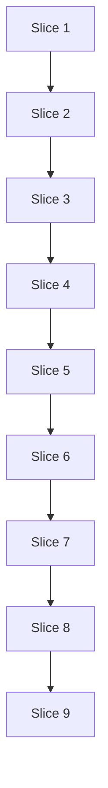

# Plan: Character Builder

**Created**: 2026-10-04
**Branch**: `feat/character-builder`
**Status**: approved
**Gherkin persistence**: features
**Spec**: `docs/specs/character-builder.md`

## Goal

Add a step-by-step V20 character builder that applies the sourcebook's creation rules
for the player: it opens with two creation settings (base generation 4th–13th, extra
freebie points), walks through concept, Attributes, Abilities, Advantages and finishing
touches, shows what is left to spend, refuses to overspend, and turns the finished
build into an ordinary character on the existing sheet. Built on the existing stack
(Astro static + vanilla TypeScript): a pure creation-rules model, a `localStorage`-backed
build store, and a new builder page.

**Decision-defaults stances** (all confirmed by the user at the `/ship` gate):

- **Scope** — only what the spec lists. The sheet, the "New V20 character" flow and the
  `V20Character` shape are not changed. `characterStore.ts` keeps its API and behavior;
  its storage helpers move to a shared module it re-exports (a pure refactor under its
  existing tests). `rating-control.ts` gains two optional attributes that default to
  today's behavior. Default stance.
- **Replace vs. merge** — merge: the builder is added alongside. Builds live under
  their own storage key prefix; existing character records are never rewritten.
  `roster.ts` and `index.astro` are edited in place. Default stance.
- **Integration** — PR with auto-merge gated on green checks. Default stance.
- **Format fidelity / migrate-vs-stub / re-capture** — not touched. The sourcebook
  PDFs stay untracked; only names and numbers are encoded, no prose.

**Not in this plan**: Merits and Flaws; Paths of Enlightenment; bloodlines and
thin-blooded generations; the "four Disciplines in lieu of Backgrounds" option; write-in
Abilities; experience points; sheet pages 2–4; re-opening a finished character in the
builder; filling the sheet's Weakness field; other game lines; any change to
`V20Character`, `sheet.ts` or the sheet page; migration of build records (builds are
transient — a future shape change makes old builds unreadable, deletable from the roster).

## Acceptance Criteria

Full wording is in the spec; ids match.

- [ ] AC-1 Roster has "Build a character" beside "New V20 character"; it creates a build with default settings and opens the builder; blank creation unchanged
- [ ] AC-2 Every builder change autosaves and survives reload
- [ ] AC-3 Roster lists in-progress builds separately, with name/placeholder, clan, continue link, confirmed delete
- [ ] AC-4 Unknown build id → "build not found"; unreadable build is reported, not auto-deleted; refused write → "changes not saved"
- [ ] AC-5 Settings step: base generation 4th–13th (default 13th), extra freebies 0–999 (default 0); other input rejected
- [ ] AC-6 Freebie budget = 15 + extra
- [ ] AC-7 Effective generation = base − Generation dots, never past 4th
- [ ] AC-8 Generation table drives maximum trait rating, blood pool maximum, blood per turn
- [ ] AC-9 Settings changeable any time; an invalidating change is refused, naming what to lower
- [ ] AC-10 Concept free-text fields; Nature/Demeanor free text with Archetype suggestions
- [ ] AC-11 Clan chosen from the thirteen clans plus Caitiff
- [ ] AC-12 Attribute groups ranked for 7/5/3 with one free dot each; re-ranking reports overspent groups
- [ ] AC-13 Attribute allotment and maximum enforced
- [ ] AC-14 Nosferatu Appearance fixed at 0
- [ ] AC-15 Ability groups ranked for 13/9/5; none above 3 with creation dots
- [ ] AC-16 Three Discipline dots, clan Disciplines only (Caitiff any); clan change removes invalid dots and says so
- [ ] AC-17 Five Background dots over the sourcebook list
- [ ] AC-18 Virtues: one free dot each plus seven creation dots
- [ ] AC-19 At most six Disciplines and six Backgrounds
- [ ] AC-20 Humanity = Conscience + Self-Control, Willpower = Courage, from creation-dot Virtues only
- [ ] AC-21 Freebie costs 5/2/7/1/2/2/1; freebie Abilities may exceed 3; freebie Disciplines may be any or a write-in
- [ ] AC-22 Unaffordable or over-maximum purchases refused; removing refunds; freebies cannot remove creation or free dots
- [ ] AC-23 Blood pool entered by the player, 0 to the generation maximum
- [ ] AC-24 Remaining dots and freebie points visible and announced on change
- [ ] AC-25 Steps can be visited in any order
- [ ] AC-26 Finishing blocked until clan chosen and all creation dots placed; unspent freebies need only confirmation
- [ ] AC-27 Finishing writes the character, opens the sheet, removes the build; a failed save keeps the build
- [ ] AC-28 The finished character is freely editable on the sheet
- [ ] AC-29 Keyboard, accessible names, non-colour messages, no WCAG 2.1 AA violations, 375 px
- [ ] AC-30 Unit and e2e coverage; build, type check, lint and both suites pass

## Module layout

| Path | Role |
| --- | --- |
| `src/domain/v20/creation/rules.ts` | Rules data only: generation table, allotment descriptors, freebie costs, clans and their Disciplines, per-clan trait overrides, Discipline and Background catalogues, Archetype names. Imports trait keys and labels from `traits.ts`; declares nothing `traits.ts` already has |
| `src/domain/v20/creation/build.ts` | Types only: `V20Build`, `blankBuild()`, `BuildTraitRef` |
| `src/domain/v20/creation/ratings.ts` | Pure reads: `rating`, `creationRating`, `freebieRating`, floors |
| `src/domain/v20/creation/allotments.ts` | Pure reads over the descriptors: ranks, dots placed, remaining / overspent |
| `src/domain/v20/creation/freebies.ts` | Pure reads: freebie cost of a build, `freebiesRemaining` |
| `src/domain/v20/creation/limits.ts` | `effectiveGeneration`, `limits`, `maximumFor`, `violations(build)` |
| `src/domain/v20/creation/result.ts` | `UpdateResult`, `applied`, `refuse`, and `commit(before, candidate, notices)` — the one place a candidate is checked against `violations` and refused |
| `src/domain/v20/creation/updates.ts` | Every update: settings, concept, clan, `setRank`, `setRating`, Discipline list, blood pool |
| `src/domain/v20/creation/progress.ts` | `report(build)` composed from small per-area selectors, `outstanding(build)`, `unspentFreebies` |
| `src/domain/v20/creation/toCharacter.ts` | Build → `V20Character`. The only creation file that imports `character.ts` |
| `src/storage/storagePort.ts` | `StoragePort`, `browserStorage`, `generateId`, `hasShapeOf`, prefix scan — moved out of `characterStore.ts`, which re-exports them |
| `src/storage/buildStore.ts` | Build persistence under `wod-sheets:build:` |
| `src/storage/finishBuild.ts` | The two-store finish (save character, delete build) as a DOM-free function |
| `src/pages/build.astro`, `src/scripts/builder.ts` | Builder page and a thin bootstrap |
| `src/scripts/builder/` | `pageState.ts`, `steps.ts` (hash router, focus, titles), `messages.ts` (the three channels), `wiring.ts` (data-attribute-driven controls) |
| `src/components/builder/` | Astro components for each step's static markup |
| `src/components/controls/rating-control.ts` | Gains optional `min` (floor) and `locked` attributes |
| `src/styles/builder.css` | Builder layout |
| `features/character-builder/` | One `.feature` per slice, exported from this plan (tool-owned) |
| `features/steps/builder-*.steps.ts`, `features/steps/support/builder.ts` | Step definitions, builder page helpers, build seeding |

### Design rules that hold across every slice

**Model**

- **Import layers, no cycles.** `rules.ts` and `build.ts` import nothing from the other
  creation files. `ratings.ts`, `allotments.ts` and `freebies.ts` read only those two
  (and each other downward: allotments and freebies may read ratings). `limits.ts` reads
  those. `result.ts` reads `limits.ts`. `updates.ts` sits on top and is the only file
  that builds candidates and calls `commit`. `progress.ts` and `toCharacter.ts` read
  everything below `updates.ts`. A unit test asserts that `refuse` is called only from
  `result.ts` and `updates.ts`.

- **One result shape**, fixed in step 1.1:
  `UpdateResult = { status: 'applied'; build; notices: string[] } | { status: 'refused'; build; reason: string }`.
  `applied(build, ...notices)` and `refuse(build, reason)` are the only constructors, and
  `commit(before, candidate, notices)` is the only place a candidate is compared against
  `violations`. A refusal returns the identical build reference. The page saves only on
  `applied`.
- **Provenance is stored, totals are derived.** Each trait stores creation dots and
  freebie dots separately; free dots come from the rules. `rating = free + creation +
  freebie` is computed by one function and nothing else adds the parts.
- **One rating entry point**: `setRating(build, trait, targetTotal, source)` with
  `source: 'creation' | 'freebie'`. The control always shows the total; the step it is
  on decides the source. On a creation step the target adjusts creation dots and cannot
  go below `free + freebie`; on the finishing step it adjusts freebie dots and cannot go
  below `free + creation`. The model computes the delta.
- **Traits are addressed** by a separate `BuildTraitRef` type: the fixed-trait forms of
  the sheet's `TraitRef`, plus `discipline:<name>` and `background:<name>`. It is not
  assignable to the sheet's `TraitRef` / `NamedRowRef`, so sheet functions cannot be
  handed a build address.
- **The control's top dot is the trait's maximum.** A rating control is drawn up to
  `maximumFor(build, trait)`, so "above the maximum" cannot be requested from the page.
  Those refusals exist in the model for stored or stale data and are unit-tested only;
  e2e scenarios assert the highest rating a control offers.
- **Shapes.** Clan: a string, `''` until chosen. Backgrounds: a record keyed by the fourteen names. Disciplines: an
  insertion-ordered list of `{ name, writeIn, creation, freebie }`, names unique ignoring
  case and surrounding whitespace. "Holds a Discipline/Background" means its rating is
  above 0; the six-entry cap counts those.
- **Allotment descriptors** (introduced in 4.1, used by every later slice): kind (ranked
  / flat), traits, free dots, per-trait creation cap, freebie cost class, owning step.
  `remaining`, `outstanding`, the UI readouts and freebie costing all read them.
- **`violations(build)`** lists hard violations (a trait above its maximum, Generation
  dots past 4th, freebie spend above budget, blood pool above maximum, Humanity or
  Willpower above 10). Every update computes its candidate build and is refused if the
  candidate adds a hard violation, with a reason naming what to lower. Overspent groups
  after re-ranking are reported, not hard: they block finishing only.
- A well-shaped stored build that already breaks a rule (edited by hand) loads as it
  is; its violations appear as outstanding items.

**Storage**

- `buildStore.ts` validates fixed-shape fields against `blankBuild(id)` with the shared
  `hasShapeOf`, and checks by hand what a template cannot express: the clan (`''` or a
  known clan), settings in range, dot counters whole and ≥ 0, and the variable-length
  Discipline list (excluded from the template comparison, each entry checked). Fixed
  fields added by later slices are validated with no store edit; the store is touched
  in 1.2, 2.1 (clan) and 6.1 (Discipline list), each with a "play the updates, save,
  load" round-trip test.
- `buildStore.delete` returns `deleted | failed` (it catches a throwing storage), a
  deliberate difference from `characterStore.delete`.
- A finished character reuses its build's id, so finishing needs no new
  `characterStore` method. `finishBuild` never overwrites: it requires the build to be
  stored and no character to exist under that id, then calls
  `characterStore.save(toCharacter(build))` and `buildStore.delete(build.id)`. If a
  character already exists under the id (a build that lingered after an earlier finish),
  it saves nothing, retries the delete and reports `already-finished`.

**Page**

- **One page, six steps** — Settings, Concept, Attributes, Abilities, Advantages,
  Finishing touches — each a heading-led region, one shown at a time. A step navigation
  marks the current step with `aria-current="step"` and shows a text status per step
  ("2 dots left", "overspent", "clan needed"). Every step has Previous / Next buttons
  naming the neighbouring step. The current step is kept in the URL hash with
  `replaceState` (Back leaves the builder; an unknown hash shows Settings). On a step
  change focus moves to the step heading and the document title becomes
  "<Step> – <build name or Unnamed build>". The header has a link to the roster.
- **Three message channels**, built in slice 1 (`messages.ts`):
  1. *Save status* — the existing `#status-message` region. "Changes are not being
     saved…" stays until a save succeeds; nothing else writes to it.
  2. *Refusals and notices* — a polite `role="status"` slot inside each group or
     section, next to the controls, referenced by `aria-describedby` from the refused
     control. Cleared by the next applied change. An identical consecutive refusal is
     not re-announced. When a message names another step, the step name is a link.
  3. *Budgets* — each remaining readout sits in its group heading as its own
     `role="status"`, so only the value that changed is announced. Freebie points
     remaining sit in a sticky bar on every step after Settings.
- **Typed numbers** (extra freebie points, blood pool) are text inputs with
  `inputmode="numeric"`, committed on `change` (blur or Enter), never per keystroke. A
  rejected entry stays visible with `aria-invalid` and its message; the stored value is
  unchanged, and a reload shows the stored value.
- **Clan changes that would remove dots ask first, without a modal.**
  `clanChangeEffects(build, clan)` lists what would be removed. If the list is empty the
  clan applies at once with no notice. Otherwise nothing is applied: a panel beside the
  select names what would be removed and offers "Switch to Toreador" and "Keep Brujah".
  Moving the select to another clan just updates or removes the panel, so browsing the
  list with arrow keys never discards anything and never traps focus. After switching,
  the same list is shown as a notice; after keeping, the select shows the kept clan
  again. Focus stays on the clan select. Once a clan is chosen it cannot be cleared back
  to "Choose a clan".
- **Rating controls** expose their real floor (`min` → `aria-valuemin`) and a `locked`
  state. Controls in an unranked group are `aria-disabled` with visible text "Rank this
  group to place dots". The accessible value text states provenance when freebie dots
  are present ("4: 3 from creation, 1 from freebie points"); freebie dots are drawn with
  a distinct shape, not only a colour.
- **Stale pages.** The builder ports the sheet's `pageshow` and `storage` guards: a
  builder restored from the back/forward cache, or whose build was deleted or finished
  in another tab, reloads its state and never re-saves a removed build.
- `builder.ts` and `src/scripts/builder/*` never compare numbers against budgets or
  maximums; they render `report(build)` and forward control totals.

**Tests**

- Rule boundaries (every generation row, every cost, every cap, every refusal) are
  unit-tested. E2e scenarios cover what only a browser can show: wiring, persistence,
  messages, cross-step effects, and one representative accept and refusal per rule family.
- Every UI slice's scenarios end with the shared accessibility gate added in slice 1:
  no WCAG 2.1 AA violations (axe), unique non-empty accessible names, and no horizontal
  scroll at 375 px, on the step that slice built. The last slice covers error and dialog
  states, keyboard-only use and the full journey; it does not introduce the checks.
- **Seeding.** `features/steps/support/builder.ts` writes build records straight into
  storage. Ordinary states are produced with the domain functions; states the rules
  refuse to reach (overspent groups, traits above a maximum) are written as literal
  records. At least one scenario per feature creates its build through the real UI.
- All nine feature files exist from the start. Step 1.3 sets `missingSteps: 'skip-scenario'` in
  `playwright.config.ts` so scenarios of slices not yet built are skipped; step 9.3
  restores `'fail-on-gen'`, after which every scenario must have its steps.
- "E2e" in a TEST line means writing the step definitions for that slice's scenarios.
  Single-row "exactly" tables are read with `.raw().flat()`.

## Slices

### Slice 1: Start a build with creation settings

**Depends-on:** none
**Files:** `src/domain/v20/creation/rules.ts`, `src/domain/v20/creation/rules.test.ts`, `src/domain/v20/creation/build.ts`, `src/domain/v20/creation/result.ts`, `src/domain/v20/creation/result.test.ts`, `src/domain/v20/creation/updates.ts`, `src/domain/v20/creation/updates.test.ts`, `src/domain/v20/creation/limits.ts`, `src/domain/v20/creation/limits.test.ts`, `src/domain/v20/creation/progress.ts`, `src/domain/v20/creation/progress.test.ts`, `src/storage/storagePort.ts`, `src/storage/characterStore.ts`, `src/storage/buildStore.ts`, `src/storage/buildStore.test.ts`, `src/pages/build.astro`, `src/pages/index.astro`, `src/scripts/builder.ts`, `src/scripts/builder/pageState.ts`, `src/scripts/builder/steps.ts`, `src/scripts/builder/messages.ts`, `src/scripts/builder/wiring.ts`, `src/scripts/roster.ts`, `src/components/builder/Settings.astro`, `src/components/builder/StepNav.astro`, `src/styles/builder.css`, `features/steps/builder-settings.steps.ts`, `features/steps/builder-a11y.steps.ts`, `features/steps/support/builder.ts`, `features/steps/fixtures.ts`, `playwright.config.ts`
**Invariants:** `npm run test`, `npm run typecheck`, `npm run test:e2e`

**Behavior:**

```gherkin
Feature: Starting a build with creation settings

  Scenario: Building a character opens the builder with the standard settings
    Given a player with no saved characters
    When they start building a character
    Then the builder is shown on its settings step
    And the base generation is "13th"
    And the extra freebie points are 0
    And the freebie budget is 15
    And the roster lists no characters

  Scenario: The build action sits beside the blank-sheet action
    Given a player with no saved characters
    When they open the roster
    Then they see a way to create a V20 character
    And they see a way to build a character

  Scenario: Creating a blank character is unchanged
    Given a player with no saved characters
    When they create a V20 character
    Then the sheet for a new blank character is shown
    And the roster lists one character shown as "Unnamed character"

  Scenario: A Storyteller's house settings change the budgets
    Given a player who has started building a character
    When they set the base generation to "11th"
    And they set the extra freebie points to 75
    Then the freebie budget is 90
    And the maximum trait rating is 5
    And the blood pool maximum is 12
    And the blood points per turn are 1

  Scenario Outline: Generation fixes the trait and blood limits
    Given a player who has started building a character
    When they set the base generation to "<generation>"
    Then the maximum trait rating is <trait>
    And the blood pool maximum is <pool>
    And the blood points per turn are <turn>

    Examples:
      | generation | trait | pool | turn |
      | 9th        | 5     | 14   | 2    |
      | 7th        | 6     | 20   | 4    |
      | 4th        | 9     | 50   | 10   |

  Scenario: Only generations from 4th to 13th are offered
    Given a player who has started building a character
    When they look at the base generation choices
    Then the choices run from "4th" to "13th" and nothing else

  Scenario Outline: Extra freebie points outside 0 to 999 are rejected
    Given a player who has set the extra freebie points to 20
    When they enter "<entry>" as the extra freebie points
    Then they are told, beside the field, that extra freebie points must be a whole number from 0 to 999
    And the field is marked invalid and still shows "<entry>"
    And the freebie budget is still 35

    Examples:
      | entry |
      | -1    |
      | 1000  |
      | 2.5   |
      | lots  |

  Scenario: An emptied extra freebie points field is rejected
    Given a player who has set the extra freebie points to 20
    When they clear the extra freebie points and leave the field
    Then they are told, beside the field, that extra freebie points must be a whole number from 0 to 999
    And the freebie budget is still 35

  Scenario: A rejected entry is not saved
    Given a player who has set the extra freebie points to 20
    When they enter "1000" as the extra freebie points
    And they reload the builder
    Then the extra freebie points are 20

  Scenario: Typing a number is judged only when the entry is finished
    Given a player who has set the extra freebie points to 90
    When they type "2" then "0" in place of the extra freebie points without leaving the field
    Then no message is shown beside the field
    And leaving the field sets the freebie budget to 35

  Scenario: The largest allowed extra freebie points are accepted
    Given a player who has started building a character
    When they set the extra freebie points to 999
    Then the freebie budget is 1014

  Scenario: Correcting a rejected entry clears its message
    Given a player whose extra freebie points entry "1000" was rejected
    When they set the extra freebie points to 50
    Then no message is shown beside the field
    And the freebie budget is 65

  Scenario: Settings survive a reload
    Given a player who has set the base generation to "9th" and the extra freebie points to 30
    When they reload the builder
    Then the base generation is "9th"
    And the extra freebie points are 30

  Scenario Outline: A builder address that names no build is reported, not created
    Given a player with no saved characters
    When they open the builder address <address>
    Then they see a "build not found" message with a link to the roster
    And no build has been saved

    Examples:
      | address                           |
      | of a build that does not exist    |
      | with no build id                  |

  Scenario: A build that cannot be read is reported and left untouched
    Given a saved build whose data has been damaged
    When the player opens that build
    Then they are told the build could not be read and has not been changed
    And they are offered a link to the roster to delete it or build a new one
    And the damaged data is exactly as it was

  Scenario: A refused save is reported and the builder stays usable
    Given a player who has started building a character
    And the browser has started refusing to store data
    When they set the base generation to "10th"
    Then they are told changes are not being saved and not to close or reload the page
    And the base generation is "10th"
    And they can still set the extra freebie points to 5

  Scenario: The not-saved message stays until a save works
    Given a player whose last change could not be saved
    When their entry "1000" as the extra freebie points is rejected
    Then the not-saved message is still shown

  Scenario: The not-saved message clears when saving works again
    Given a player whose last change could not be saved
    And the browser accepts stored data again
    When they set the base generation to "9th"
    Then the not-saved message is gone
    And reloading the builder shows the base generation "9th"

  Scenario: A build deleted in another tab is not saved again
    Given a player with the builder open on a build
    And the same build has been deleted from the roster in another tab
    When they set the base generation to "10th"
    Then they see a "build not found" message with a link to the roster
    And the roster lists no builds in progress

  Scenario: Building is unavailable when the browser cannot store data
    Given a browser that does not allow stored data
    When the player opens the roster
    Then the build action cannot be used
    And they are told characters cannot be saved in this browser

  Scenario: The settings step is accessible and fits a phone
    Given a player who has started building a character
    When the settings step is checked
    Then no WCAG 2.1 AA violations are reported
    And every control has a unique, non-empty accessible name
    And at 375 pixels wide the page does not scroll horizontally
```

**Steps:**

#### Step 1.1: Generation table, build type and creation settings

**Complexity**: complex
**IMPLEMENT**: `rules.ts` with the generation table (4th–13th) and the standard freebie budget. `build.ts` with `V20Build` (id, `system: 'v20'`, `kind: 'build'`, `schemaVersion: 1`, settings) and `blankBuild(id)`. `limits.ts` with `limits(build)` (generation row) and a `violations(build)` that is empty for now. `result.ts` with the `UpdateResult` union, `applied`, `refuse` and `commit`. `updates.ts` with `setBaseGeneration` and `setExtraFreebies` (accepts the player's text; whole number 0–999 or refused). `progress.ts` with `report(build)` composed from a `settingsReport` selector (settings, freebie budget, limits)
**TEST**: Unit tests: every generation row; out-of-range generations; extra-freebie boundaries (−1, 0, 999, 1000, "2.5", "lots", empty, whitespace); a refusal returns the identical build reference; updates never mutate their input
**REFACTOR**: Make `applied`/`refuse`/`commit` the only way results are built; keep `rules.ts` free of functions; add the import-layer test
**Files**: `src/domain/v20/creation/rules.ts`, `src/domain/v20/creation/rules.test.ts`, `src/domain/v20/creation/build.ts`, `src/domain/v20/creation/result.ts`, `src/domain/v20/creation/result.test.ts`, `src/domain/v20/creation/updates.ts`, `src/domain/v20/creation/updates.test.ts`, `src/domain/v20/creation/limits.ts`, `src/domain/v20/creation/limits.test.ts`, `src/domain/v20/creation/progress.ts`, `src/domain/v20/creation/progress.test.ts`
**Commit**: `feat(domain): generation table and build creation settings`

#### Step 1.2: Shared storage helpers and the build store

**Complexity**: complex
**IMPLEMENT**: Move `StoragePort`, `browserStorage`, `generateId`, `hasShapeOf` and the prefix scan into `storagePort.ts`; `characterStore.ts` imports and re-exports them (no behavior change). `buildStore.ts`: `create`, `save`, `load(id)` (`found` / `not-found` / `unreadable`), `delete` (`deleted` / `failed`), `list` (readable or not, oldest first), under `wod-sheets:build:`; validation = shape of `blankBuild(id)` + matching id, `kind`, `schemaVersion`, settings in range
**TEST**: The existing `characterStore` tests pass untouched. Build store unit tests with the in-memory fake: round-trip, distinct ids, unknown id, unparseable / wrong-shape / out-of-range records load as unreadable and are not rewritten, refused writes return `failed`, and a storage holding both kinds lists each only through its own store
**REFACTOR**: Both stores depend on `storagePort.ts`, neither on the other
**Files**: `src/storage/storagePort.ts`, `src/storage/characterStore.ts`, `src/storage/buildStore.ts`, `src/storage/buildStore.test.ts`
**Commit**: `feat(storage): build store kept apart from characters`

#### Step 1.3: Builder shell, message channels and the settings step

**Complexity**: complex
**IMPLEMENT**: "Build a character" button on the roster (disabled, with the existing message, when storage is unavailable) that creates a build and opens `/build/?id=…`. `build.astro` shell: header with roster link, step navigation (only Settings populated), the three message channels, not-found ("Build not found. It may have been finished or deleted.") and unreadable states, autosave on every applied change, the `pageshow`/`storage` stale-page guards. Settings step: generation select and extra-freebies text input with one-line hints ("Leave at 13th unless your Storyteller says otherwise"), read-only freebie budget / maximum trait / blood pool maximum / blood per turn. Mobile layout decided here: stacked rows, wrapping step navigation, controls at least 24 px with spacing
**TEST**: E2e scenarios for this slice. Add builder page helpers, the build-seeding helper, and the reusable accessibility-gate steps (axe, unique names, 375 px)
**REFACTOR**: Keep `builder.ts` a bootstrap; page state, step routing, messages and control wiring each in their own file under `src/scripts/builder/`
**Files**: `src/pages/build.astro`, `src/pages/index.astro`, `src/scripts/builder.ts`, `src/scripts/builder/pageState.ts`, `src/scripts/builder/steps.ts`, `src/scripts/builder/messages.ts`, `src/scripts/builder/wiring.ts`, `src/scripts/roster.ts`, `src/components/builder/Settings.astro`, `src/components/builder/StepNav.astro`, `src/styles/builder.css`, `features/steps/builder-settings.steps.ts`, `features/steps/builder-a11y.steps.ts`, `features/steps/support/builder.ts`, `features/steps/fixtures.ts`, `playwright.config.ts`
**Commit**: `feat(builder): start a build and choose creation settings`

### Slice 2: Concept step and step navigation

**Depends-on:** 1
**Files:** `src/domain/v20/creation/rules.ts`, `src/domain/v20/creation/rules.test.ts`, `src/domain/v20/creation/build.ts`, `src/domain/v20/creation/updates.ts`, `src/domain/v20/creation/updates.test.ts`, `src/storage/buildStore.ts`, `src/storage/buildStore.test.ts`, `src/pages/build.astro`, `src/scripts/builder/steps.ts`, `src/scripts/builder/wiring.ts`, `src/components/builder/Concept.astro`, `src/components/builder/StepNav.astro`, `features/steps/builder-concept.steps.ts`, `features/steps/support/builder.ts`
**Invariants:** `npm run test`, `npm run typecheck`

**Behavior:**

```gherkin
Feature: Concept step and step navigation

  Scenario: Concept details are kept
    Given a player who has started building a character
    When they enter the concept details
      | field     | text            |
      | Name      | Lucita          |
      | Player    | Ana             |
      | Chronicle | Madrid by Night |
      | Concept   | Fallen noble    |
      | Sire      | Moncada         |
      | Nature    | Rebel           |
      | Demeanor  | Gallant         |
    And they reload the builder
    Then the concept step shows every detail they entered

  Scenario: A concept detail can be cleared
    Given a build named "Lucita"
    When they clear the Name
    And they reload the builder
    Then the Name is empty

  Scenario: The clan choices are the thirteen clans and Caitiff
    Given a player who has started building a character
    When they look at the clan choices
    Then apart from the "Choose a clan" placeholder the choices are exactly
      | Assamite | Brujah | Follower of Set | Gangrel | Giovanni | Lasombra | Malkavian | Nosferatu | Ravnos | Toreador | Tremere | Tzimisce | Ventrue | Caitiff |

  Scenario: A new build has no clan chosen
    Given a player who has started building a character
    When they open the concept step
    Then no clan is chosen

  Scenario: A chosen clan is kept and cannot be cleared
    Given a player who has started building a character
    When they choose the clan "Toreador"
    And they reload the builder
    Then the chosen clan is "Toreador"
    And the "Choose a clan" placeholder can no longer be chosen

  Scenario Outline: Archetypes are suggested but not required
    Given a player who has started building a character
    When they open the concept step
    Then "Architect" and "Visionary" are among the suggestions for <field>
    And entering "Avenger" as the <field> is accepted

    Examples:
      | field    |
      | Nature   |
      | Demeanor |

  Scenario Outline: Any step can be opened from any other
    Given a player on the "<from>" step of a new build
    When they open the "<to>" step from the step navigation
    Then the "<to>" step is shown and marked as the current step
    And keyboard focus is on the "<to>" heading

    Examples:
      | from              | to                |
      | Settings          | Finishing touches |
      | Finishing touches | Concept           |
      | Concept           | Advantages        |
      | Advantages        | Attributes        |
      | Attributes        | Abilities         |
      | Abilities         | Settings          |

  Scenario: Next and Previous walk the steps in order
    Given a player on the "Settings" step of a new build
    When they use Next
    Then the "Concept" step is shown
    And using Previous shows the "Settings" step

  Scenario: The step navigation says what a step still needs
    Given a player who has started building a character
    When they look at the step navigation
    Then the Concept step is marked "clan needed"

  Scenario: A reload returns to the step that was open
    Given a player on the "Concept" step of a new build
    When they reload the builder
    Then the "Concept" step is shown

  Scenario: An unknown step address shows the settings step
    Given a player who has started building a character
    When they open the builder with a step address that does not exist
    Then the "Settings" step is shown

  Scenario: The page title names the step and the build
    Given a build named "Lucita"
    When they open the "Concept" step
    Then the page title is "Concept – Lucita"

  Scenario: The concept step is accessible and fits a phone
    Given a build named "Lucita" of clan "Lasombra"
    When the concept step is checked
    Then no WCAG 2.1 AA violations are reported
    And every control has a unique, non-empty accessible name
    And at 375 pixels wide the page does not scroll horizontally
```

**Steps:**

#### Step 2.1: Concept data and clan catalogue

**Complexity**: standard
**IMPLEMENT**: Clan catalogue (thirteen clans with their three Disciplines, Caitiff with none) and Archetype names in `rules.ts`. Build gains concept text fields and a clan (`''` until chosen); `setConceptText`, `setClan` (refuses an unknown name and refuses clearing). Store gains the "`''` or a known clan" check and a round-trip test for a build with a clan
**TEST**: Unit tests: exactly fourteen clans; each non-Caitiff clan's three Disciplines match the spec table; text round-trips including empty; unknown clan and clearing refused; store rejects an unknown clan
**REFACTOR**: Derive `ClanName` and the concept field keys from the catalogue so names are declared once
**Files**: `src/domain/v20/creation/rules.ts`, `src/domain/v20/creation/rules.test.ts`, `src/domain/v20/creation/build.ts`, `src/domain/v20/creation/updates.ts`, `src/domain/v20/creation/updates.test.ts`, `src/storage/buildStore.ts`, `src/storage/buildStore.test.ts`
**Commit**: `feat(domain): build concept and clan catalogue`

#### Step 2.2: Concept step and full step navigation

**Complexity**: standard
**IMPLEMENT**: Concept step: labelled text inputs, Nature/Demeanor with a shared suggestion list, clan select with a "Choose a clan" placeholder that is disabled once a clan is chosen. Step navigation for all six steps (later steps are heading-only panels for now) with `aria-current`, per-step text status from `report(build)`, Previous/Next, hash routing with `replaceState`, focus to the step heading, document title
**TEST**: E2e scenarios for this slice
**REFACTOR**: Drive text inputs from one `data-` attribute convention, as `sheet.ts` does, so later steps add fields without new wiring
**Files**: `src/pages/build.astro`, `src/scripts/builder/steps.ts`, `src/scripts/builder/wiring.ts`, `src/components/builder/Concept.astro`, `src/components/builder/StepNav.astro`, `features/steps/builder-concept.steps.ts`, `features/steps/support/builder.ts`
**Commit**: `feat(builder): concept step and step navigation`

### Slice 3: Builds on the roster

**Depends-on:** 2
**Files:** `src/pages/index.astro`, `src/scripts/roster.ts`, `src/styles/global.css`, `features/steps/builder-roster.steps.ts`, `features/steps/support/pages.ts`, `features/steps/support/builder.ts`
**Invariants:** `npm run test`, `npm run typecheck`

**Behavior:**

```gherkin
Feature: Builds on the roster

  Scenario: A build started from the roster is listed as in progress
    Given a player with no saved characters
    When they start building a character
    And they open the roster
    Then the builds in progress list shows "Unnamed build"
    And they still see the message that there are no characters yet

  Scenario: A build in progress is listed apart from characters
    Given a saved character named "Lucita"
    And a build in progress named "Beckett" of clan "Gangrel"
    When the player opens the roster
    Then the characters list shows only "Lucita"
    And the builds in progress list shows "Beckett" with clan "Gangrel"

  Scenario: No builds, no builds list
    Given a player with no saved characters
    When they open the roster
    Then no builds in progress list is shown

  Scenario: A build can be continued from the roster
    Given a build in progress named "Beckett" with base generation "10th"
    When the player continues "Beckett" from the roster
    Then the builder is shown
    And the base generation is "10th"

  Scenario: Two unnamed builds can be told apart
    Given two builds in progress with no name
    When the player opens the roster
    Then the continue controls have different accessible names
    And the delete controls have different accessible names

  Scenario: A build name is shown as plain text
    Given a build in progress named "<b>Beckett</b>"
    When the player opens the roster
    Then the builds in progress list shows the text "<b>Beckett</b>"

  Scenario: Deleting a build asks first, and cancelling keeps it
    Given a build in progress named "Beckett"
    When the player asks to delete "Beckett" and cancels
    Then they were asked "Delete the build Beckett? This cannot be undone."
    And the builds in progress list shows "Beckett"

  Scenario: Confirming the delete removes only that build
    Given a saved character named "Lucita"
    And builds in progress named "Beckett" and "Anatole"
    When the player deletes "Beckett" and confirms
    Then the builds in progress list shows only "Anatole"
    And the characters list shows only "Lucita"

  Scenario: An unreadable build does not hide anything else
    Given a saved character named "Lucita"
    And a build in progress named "Beckett"
    And a saved build whose data has been damaged
    When the player opens the roster
    Then the characters list shows only "Lucita"
    And the builds in progress list shows "Beckett" and one unreadable build
    And the damaged data is exactly as it was

  Scenario: An unreadable build can be deleted by the player
    Given a saved build whose data has been damaged
    When the player deletes the unreadable build and confirms
    Then no builds in progress list is shown

  Scenario: Creating a blank character leaves builds alone
    Given a build in progress named "Beckett"
    When they create a V20 character
    Then the sheet for a new blank character is shown
    And the builds in progress list still shows "Beckett"

  Scenario: The roster with builds is accessible and fits a phone
    Given a saved character, a build in progress and an unreadable build
    When the roster is checked
    Then no WCAG 2.1 AA violations are reported
    And every control has a unique, non-empty accessible name
    And at 375 pixels wide the page does not scroll horizontally
```

**Steps:**

#### Step 3.1: Builds in progress on the roster

**Complexity**: standard
**IMPLEMENT**: A separately headed "Builds in progress" list under the characters, oldest first, hidden when empty. Each entry: name or "Unnamed build" (numbered "Unnamed build 2", … when several), clan when chosen, a link named "Continue <name>", a button named "Delete build <name>". Unreadable builds shown as "Unreadable build" (numbered likewise) with a delete button. The confirmation dialog's title and question become build-aware ("Delete build?"). Names are set with `textContent`. The characters' empty-state message does not depend on builds
**TEST**: E2e scenarios for this slice
**REFACTOR**: `confirmDelete` takes an `onConfirm` callback and the list-item code takes an entry description, so characters and builds share one flow instead of two copies
**Files**: `src/pages/index.astro`, `src/scripts/roster.ts`, `src/styles/global.css`, `features/steps/builder-roster.steps.ts`, `features/steps/support/pages.ts`, `features/steps/support/builder.ts`
**Commit**: `feat(roster): list, continue and delete builds in progress`

### Slice 4: Attributes step

**Depends-on:** 3
**Files:** `src/domain/v20/creation/rules.ts`, `src/domain/v20/creation/rules.test.ts`, `src/domain/v20/creation/build.ts`, `src/domain/v20/creation/updates.ts`, `src/domain/v20/creation/updates.test.ts`, `src/domain/v20/creation/allotments.ts`, `src/domain/v20/creation/allotments.test.ts`, `src/domain/v20/creation/limits.ts`, `src/domain/v20/creation/limits.test.ts`, `src/domain/v20/creation/ratings.ts`, `src/domain/v20/creation/ratings.test.ts`, `src/domain/v20/creation/progress.ts`, `src/domain/v20/creation/progress.test.ts`, `src/components/controls/rating-control.ts`, `src/components/controls/controls.css`, `src/pages/build.astro`, `src/scripts/builder/wiring.ts`, `src/scripts/builder/messages.ts`, `src/components/builder/Attributes.astro`, `src/components/builder/RankedGroup.astro`, `src/components/builder/Concept.astro`, `features/steps/builder-attributes.steps.ts`, `features/steps/support/builder.ts`
**Invariants:** `npm run test`, `npm run typecheck`, `npm run test:e2e`

**Behavior:**

```gherkin
Feature: Attributes step

  Scenario: Every Attribute starts with one free dot
    Given a player who has started building a character
    When they open the attributes step
    Then every Attribute is rated 1
    And no Attribute group has a rank yet
    And each group says to rank it before placing dots

  Scenario: Ranking the groups sets their allotments
    Given a player on the attributes step
    When they rank Physical primary, Social secondary and Mental tertiary
    Then Physical has 7 dots remaining
    And Social has 5 dots remaining
    And Mental has 3 dots remaining

  Scenario: Dots cannot be placed in an unranked group
    Given a player on the attributes step with no ranks chosen
    When they try to raise Strength to 2
    Then they are told, beside the Physical group, to rank the group first
    And Strength is rated 1

  Scenario: Placing dots uses up the allotment
    Given a player who has ranked Physical primary
    When they raise Strength to 4
    Then Physical has 4 dots remaining

  Scenario: A group cannot exceed its allotment
    Given a player who has ranked Mental tertiary
    And Perception is rated 3 and Intelligence is rated 2
    When they try to raise Wits to 2
    Then they are told, beside the Mental group, that Mental has no dots remaining and more can be bought with freebie points on Finishing touches
    And Wits is rated 1

  Scenario: An Attribute offers no dot above the maximum trait rating
    Given a 13th generation build with Physical ranked primary
    When they raise Strength to 5
    Then Strength is rated 5
    And Strength reports 5 as its highest rating

  Scenario: A more potent generation raises the Attribute maximum
    Given a 7th generation build with Physical ranked primary
    When they raise Strength to 6
    Then Strength is rated 6

  Scenario: A refusal clears after the next accepted change
    Given a player who was just told Mental has no dots remaining
    When they lower Perception by 1
    Then no message is shown beside the Mental group

  Scenario: Taking a rank another group holds swaps the two groups
    Given a player who has ranked Physical primary, Social secondary and Mental tertiary
    When they rank Mental primary
    Then Mental is primary and Physical is tertiary
    And they are told both changes: Mental is now primary and Physical is now tertiary

  Scenario: Ranking one group leaves unranked groups alone
    Given a player on the attributes step with no ranks chosen
    When they rank Social primary
    Then Social is primary
    And Physical and Mental have no rank

  Scenario: An unranked group taking a held rank leaves the other group unranked
    Given a player who has ranked Physical primary and raised Strength to 4
    When they rank Social primary
    Then Social is primary and Physical has no rank
    And they are told Social is now primary and Physical now has no rank, so its 3 dots are overspent until it is ranked
    And Strength is rated 4

  Scenario: Home on a rating goes to its real floor
    Given a player who has ranked Physical primary and raised Stamina to 3
    When using only the keyboard they focus Stamina and press Home
    Then Stamina is rated 1
    And Stamina reports 1 as its lowest rating

  Scenario: Re-ranking keeps dots that still fit
    Given a player who has ranked Physical primary and raised Strength to 4
    When they rank Physical secondary
    Then Strength is rated 4
    And Physical has 2 dots remaining

  Scenario: Re-ranking a group below what it holds reports it as overspent
    Given a player who has ranked Physical primary and placed all 7 Physical dots
    When they rank Physical tertiary
    Then Physical is reported in words as overspent by 4 dots, with the instruction to lower Physical traits by 4
    And the Physical ratings are unchanged
    And the step navigation marks the Attributes step "overspent"

  Scenario: Lowering an overspent group clears the report
    Given a build whose Physical group is overspent by 1 dot
    When they lower Strength by 1
    Then Physical has 0 dots remaining
    And Physical is no longer reported as overspent

  Scenario: The free dot cannot be removed
    Given a player who has ranked Physical primary
    When they try to lower Stamina to 0
    Then Stamina is rated 1
    And Stamina reports 1 as its lowest rating

  Scenario: A Nosferatu has no Appearance
    Given a build of clan "Nosferatu" with Social ranked primary
    When they open the attributes step
    Then Appearance is rated 0 and is announced as fixed for Nosferatu
    And Social has 7 dots remaining

  Scenario: Becoming a Nosferatu asks before removing Appearance dots
    Given a build of clan "Toreador" with Social ranked primary and Appearance rated 4
    When they choose the clan "Nosferatu"
    Then they are asked to confirm that Appearance will be set to 0 and 3 dots returned to Social
    And declining keeps the clan "Toreador" and Appearance rated 4

  Scenario: Confirming the change to Nosferatu returns the dots
    Given a build of clan "Toreador" with Social ranked primary and Appearance rated 4
    When they choose the clan "Nosferatu" and confirm
    Then they are told Appearance was set to 0 and 3 dots were returned to Social
    And Social has 7 dots remaining

  Scenario: Leaving Clan Nosferatu restores the free Appearance dot
    Given a build of clan "Nosferatu"
    When they choose the clan "Brujah"
    Then Appearance is rated 1
    And no confirmation was asked

  Scenario: Attribute choices survive a reload
    Given a player who has ranked Physical primary and raised Dexterity to 3
    When they reload the builder
    Then Physical is primary
    And Dexterity is rated 3

  Scenario: The attributes step is accessible and fits a phone
    Given a build with ranked Attribute groups, an overspent group and a refusal showing
    When the attributes step is checked
    Then no WCAG 2.1 AA violations are reported
    And every control has a unique, non-empty accessible name
    And at 375 pixels wide the page does not scroll horizontally
```

**Steps:**

#### Step 4.1: Allotment descriptors, ranked groups and the rating entry point

**Complexity**: complex
**IMPLEMENT**: Allotment descriptors in `rules.ts` (ranked and flat kinds; Attributes instantiated: 7/5/3, one free dot each, creation cap = maximum trait rating). `ratings.ts`: `rating`, `creationRating`, floors. `allotments.ts`: dots placed and `remaining(group)` (negative when overspent; an unranked group with dots is overspent by all of them). `limits.ts`: `maximumFor(build, trait)` and `violations` now reporting traits above their maximum. `updates.ts`: `setRank` (a rank in use swaps the two groups' ranks — the other group takes the first group's previous rank, or none — and returns notices naming both; the rank select offers no "no rank" option) and `setRating(build, trait, targetTotal, source)` with the `'creation'` source only for now — refusals for an unranked group, exhausted allotment (pointing to freebie points), above maximum, below the floor. `report(build)` gains an `attributeReport` selector: ranks, ratings, floors, maximums, remaining and overspent. A base-generation change that adds a violation is refused, naming the trait and the rating to lower it to
**TEST**: Unit tests for each refusal and notice, the swap and the unranked case, re-ranking that fits and that overspends, maximum at 13th/7th/4th, the generation-change refusal, and a "play every update, save, load" round-trip through the build store
**REFACTOR**: Nothing in `allotments.ts` names Attributes; everything comes from the descriptor
**Files**: `src/domain/v20/creation/rules.ts`, `src/domain/v20/creation/rules.test.ts`, `src/domain/v20/creation/build.ts`, `src/domain/v20/creation/updates.ts`, `src/domain/v20/creation/updates.test.ts`, `src/domain/v20/creation/allotments.ts`, `src/domain/v20/creation/allotments.test.ts`, `src/domain/v20/creation/limits.ts`, `src/domain/v20/creation/limits.test.ts`, `src/domain/v20/creation/ratings.ts`, `src/domain/v20/creation/ratings.test.ts`, `src/domain/v20/creation/progress.ts`, `src/domain/v20/creation/progress.test.ts`
**Commit**: `feat(domain): ranked attribute allotments`

#### Step 4.2: Nosferatu Appearance and clan-change effects

**Complexity**: standard
**IMPLEMENT**: Per-clan trait override in `rules.ts` (Nosferatu: Appearance fixed at 0, no dots of any source). `clanChangeEffects(build, clan)` lists what a change would remove; `setClan` applies it and returns the same list as notices; leaving Nosferatu restores the free dot
**TEST**: Unit tests: the lock for creation dots; effects and notices for Toreador → Nosferatu; no effects for Nosferatu → Brujah; the round trip
**REFACTOR**: The override is data; no clan-name comparison in `allotments.ts` or `freebies.ts`
**Files**: `src/domain/v20/creation/rules.ts`, `src/domain/v20/creation/rules.test.ts`, `src/domain/v20/creation/updates.ts`, `src/domain/v20/creation/updates.test.ts`
**Commit**: `feat(domain): Nosferatu have no Appearance`

#### Step 4.3: Rating control floor and lock

**Complexity**: standard
**IMPLEMENT**: `rating-control.ts` gains optional `min` and `locked`, both added to `observedAttributes`. `min` replaces the hard-coded `aria-valuemin="0"`, is passed to the existing `{min, max}` activation range and to the request clamp (Home goes to it; activating the dot at `min` does not go lower). `locked` makes the control not editable, `aria-disabled`, still focusable, value still announced. Absent attributes behave exactly as today
**TEST**: The sheet's existing e2e scenarios stay green (invariant); new behavior is exercised by this slice's "free dot", "Home on a rating" and "Nosferatu" scenarios
**REFACTOR**: Keep floor/lock logic in the base control so dot ratings and box trackers both get it
**Files**: `src/components/controls/rating-control.ts`, `src/components/controls/controls.css`
**Commit**: `feat(controls): rating floor and locked state`

#### Step 4.4: Attributes step UI and clan-change confirmation

**Complexity**: standard
**IMPLEMENT**: Attributes step: per group a rank select, a remaining readout in the group heading (or "Overspent by n — lower Physical traits by n" as text with an icon), a message slot, and a dot rating per Attribute with `min`, `locked` and `aria-disabled` taken from `report(build)`. Row ids are namespaced by step. The clan select on the Concept step now shows the inline "Switch / Keep" panel when `clanChangeEffects` is non-empty and the notices after switching
**TEST**: E2e scenarios for this slice
**REFACTOR**: `RankedGroup.astro` takes a descriptor so Abilities reuses it; the pending-clan panel is one small component
**Files**: `src/pages/build.astro`, `src/scripts/builder/wiring.ts`, `src/scripts/builder/messages.ts`, `src/components/builder/Attributes.astro`, `src/components/builder/RankedGroup.astro`, `src/components/builder/Concept.astro`, `features/steps/builder-attributes.steps.ts`, `features/steps/support/builder.ts`
**Commit**: `feat(builder): attributes step`

### Slice 5: Abilities step

**Depends-on:** 4
**Files:** `src/domain/v20/creation/rules.ts`, `src/domain/v20/creation/rules.test.ts`, `src/domain/v20/creation/allotments.test.ts`, `src/pages/build.astro`, `src/components/builder/Abilities.astro`, `features/steps/builder-abilities.steps.ts`, `features/steps/support/builder.ts`
**Invariants:** `npm run test`, `npm run typecheck`

**Behavior:**

```gherkin
Feature: Abilities step

  Scenario: Abilities start with no dots
    Given a player who has started building a character
    When they open the abilities step
    Then all thirty Abilities are rated 0

  Scenario: Ranking the groups sets their allotments
    Given a player on the abilities step
    When they rank Talents primary, Skills secondary and Knowledges tertiary
    Then Talents has 13 dots remaining
    And Skills has 9 dots remaining
    And Knowledges has 5 dots remaining

  Scenario: An Ability can be raised to 3 with creation dots
    Given a player who has ranked Talents primary
    When they raise Brawl to 3
    Then Brawl is rated 3
    And Talents has 10 dots remaining

  Scenario: No Ability goes above 3 at this stage, whatever the generation
    Given a 4th generation build with Talents ranked primary
    And Brawl is rated 3
    When they try to raise Brawl to 4
    Then they are told Abilities cannot go above 3 before freebie points, which are spent on Finishing touches
    And Brawl is rated 3

  Scenario: A group cannot exceed its allotment
    Given a player who has ranked Knowledges tertiary
    And Investigation is rated 3 and Medicine is rated 2
    When they try to raise Occult to 1
    Then they are told, beside the Knowledges group, that Knowledges has no dots remaining
    And Occult is rated 0

  Scenario: An Ability can be lowered back to 0
    Given a player who has ranked Skills secondary and raised Stealth to 2
    When they lower Stealth to 0
    Then Skills has 9 dots remaining

  Scenario: Ability choices survive a reload
    Given a player who has ranked Skills primary and raised Firearms to 2
    When they reload the builder
    Then Skills is primary
    And Firearms is rated 2

  Scenario: The abilities step is accessible and fits a phone
    Given a build with ranked Ability groups and dots placed
    When the abilities step is checked
    Then no WCAG 2.1 AA violations are reported
    And every control has a unique, non-empty accessible name
    And at 375 pixels wide the page does not scroll horizontally
    And with a group's last row scrolled into view, that group's remaining-dots readout is inside the viewport
```

**Steps:**

#### Step 5.1: Ability allotments

**Complexity**: standard
**IMPLEMENT**: An Abilities descriptor: 13/9/5, no free dots, creation cap 3 at every generation. No new mechanism code
**TEST**: Unit tests for the allotments, the cap at 13th and 4th, lowering to 0, each refusal, and the store round-trip
**REFACTOR**: Remove anything Attribute-specific that the second descriptor exposes in `allotments.ts`
**Files**: `src/domain/v20/creation/rules.ts`, `src/domain/v20/creation/rules.test.ts`, `src/domain/v20/creation/allotments.test.ts`
**Commit**: `feat(domain): ranked ability allotments`

#### Step 5.2: Abilities step UI

**Complexity**: standard
**IMPLEMENT**: Abilities step from `RankedGroup.astro` for Talents, Skills and Knowledges; the remaining readout is sticky within its group so it stays in view on long lists
**TEST**: E2e scenarios for this slice
**REFACTOR**: Attributes and Abilities share all wiring through the descriptor-driven `data-` attributes
**Files**: `src/pages/build.astro`, `src/components/builder/Abilities.astro`, `features/steps/builder-abilities.steps.ts`, `features/steps/support/builder.ts`
**Commit**: `feat(builder): abilities step`

### Slice 6: Advantages step

**Depends-on:** 5
**Files:** `src/domain/v20/creation/rules.ts`, `src/domain/v20/creation/rules.test.ts`, `src/domain/v20/creation/updates.ts`, `src/domain/v20/creation/updates.test.ts`, `src/domain/v20/creation/allotments.ts`, `src/domain/v20/creation/allotments.test.ts`, `src/domain/v20/creation/limits.ts`, `src/domain/v20/creation/limits.test.ts`, `src/domain/v20/creation/progress.ts`, `src/domain/v20/creation/progress.test.ts`, `src/storage/buildStore.ts`, `src/storage/buildStore.test.ts`, `src/pages/build.astro`, `src/scripts/builder/wiring.ts`, `src/components/builder/Advantages.astro`, `src/components/builder/NamedRow.astro`, `src/components/builder/Settings.astro`, `features/steps/builder-advantages.steps.ts`, `features/steps/support/builder.ts`
**Invariants:** `npm run test`, `npm run typecheck`

**Behavior:**

```gherkin
Feature: Advantages step

  Scenario: Disciplines wait for a clan
    Given a build with no clan chosen
    When they open the advantages step
    Then they are told to choose a clan on the Concept step before placing Discipline dots
    And no Discipline dots can be placed

  Scenario: A clan offers exactly its three Disciplines
    Given a build of clan "Brujah"
    When they open the advantages step
    Then the Disciplines offered are exactly "Celerity", "Potence" and "Presence"
    And there are 3 Discipline dots remaining

  Scenario: Discipline dots can go on one Discipline or several
    Given a build of clan "Brujah"
    When they raise Celerity to 2
    And they raise Potence to 1
    Then there are 0 Discipline dots remaining

  Scenario: A fourth Discipline dot is refused
    Given a build of clan "Brujah" with Celerity rated 3
    When they try to raise Potence to 1
    Then they are told there are no Discipline dots remaining and more can be bought with freebie points on Finishing touches
    And Potence is rated 0

  Scenario: A Caitiff may take any Discipline
    Given a build of clan "Caitiff"
    When they add the Discipline "Protean" and raise it to 2
    And they add a write-in Discipline "Flight" and raise it to 1
    Then there are 0 Discipline dots remaining

  Scenario Outline: A write-in Discipline needs a usable name
    Given a build of clan "Caitiff" with the Discipline "Protean"
    When they try to add a write-in Discipline "<name>"
    Then they are told <reason>
    And the Disciplines are still only "Protean"

    Examples:
      | name     | reason                        |
      |          | a Discipline needs a name     |
      | protean  | the build already has Protean |

  Scenario: Changing clan asks before removing Disciplines
    Given a build of clan "Brujah" with Celerity rated 2 and Potence rated 1
    When they choose the clan "Toreador"
    Then they are asked to confirm that the Potence dot will be removed because Toreador does not have it
    And declining keeps the clan "Brujah" with Potence rated 1

  Scenario: Confirming a clan change removes only what the new clan lacks
    Given a build of clan "Brujah" with Celerity rated 2 and Potence rated 1
    When they choose the clan "Toreador" and confirm
    Then they are told the Potence dot was removed because Toreador does not have it
    And Celerity is rated 2
    And there are 1 Discipline dots remaining

  Scenario: Browsing the clan list with the keyboard removes nothing
    Given a build of clan "Brujah" with Celerity rated 2 and Potence rated 1
    When using only the keyboard they move the clan choice past "Toreador" and "Tremere" and back to "Brujah"
    Then the clan is "Brujah" with Celerity rated 2 and Potence rated 1
    And keyboard focus never left the clan choice

  Scenario: A clan change names every Discipline it removes
    Given a build of clan "Caitiff" with Protean rated 2 and the write-in Discipline "Flight" rated 1
    When they choose the clan "Brujah" and confirm
    Then they are told the Protean and Flight dots were removed
    And there are 3 Discipline dots remaining

  Scenario: A clan change that removes nothing says nothing
    Given a build of clan "Brujah" with Celerity rated 2
    When they choose the clan "Toreador"
    Then no confirmation was asked
    And no clan-change notice is shown
    And Celerity is rated 2

  Scenario: Becoming a Caitiff keeps every Discipline
    Given a build of clan "Brujah" with Celerity rated 2 and Potence rated 1
    When they choose the clan "Caitiff"
    Then Celerity is rated 2
    And Potence is rated 1

  Scenario: Backgrounds come from the sourcebook list
    Given a player who has started building a character
    When they look at the Background choices
    Then the choices are exactly
      | Allies | Alternate Identity | Black Hand Membership | Contacts | Domain | Fame | Generation | Herd | Influence | Mentor | Resources | Retainers | Rituals | Status |

  Scenario: Five Background dots are available
    Given a player on the advantages step
    When they raise Resources to 3
    And they raise Herd to 2
    Then there are 0 Background dots remaining

  Scenario: A sixth Background dot is refused
    Given a build with Resources rated 3 and Herd rated 2
    When they try to raise Fame to 1
    Then they are told there are no Background dots remaining and more can be bought with freebie points on Finishing touches
    And Fame is rated 0

  Scenario: Generation dots improve the effective generation
    Given a build with base generation "11th"
    When they raise the Generation background to 2
    Then they are told, beside Generation, that the effective generation is now 9th with a blood pool maximum of 14
    And the settings step shows the effective generation "9th" beside the base generation "11th"
    And the blood points per turn are 2

  Scenario: Generation dots raise what other traits may reach
    Given a build with base generation "8th", Physical ranked primary and Strength rated 5
    When they raise the Generation background to 1
    And they raise Strength to 6
    Then Strength is rated 6

  Scenario: Generation dots cannot pass 4th generation
    Given a build with base generation "6th" and the Generation background rated 2
    When they try to raise the Generation background to 3
    Then they are told the effective generation cannot be better than 4th
    And the effective generation is "4th"

  Scenario: A 4th generation base accepts no Generation dots
    Given a build with base generation "4th"
    When they try to raise the Generation background to 1
    Then they are told the effective generation cannot be better than 4th
    And the Generation background is rated 0

  Scenario: Virtues start with one free dot each
    Given a player who has started building a character
    When they open the advantages step
    Then Conscience, Self-Control and Courage are each rated 1
    And there are 7 Virtue dots remaining

  Scenario: Seven Virtue dots are available
    Given a player on the advantages step
    When they raise Conscience to 4, Self-Control to 3 and Courage to 3
    Then there are 0 Virtue dots remaining

  Scenario: A Virtue offers five dots, whatever the generation
    Given a 4th generation build
    When they open the advantages step
    Then Courage reports 5 as its highest rating
    And Resources reports 9 as its highest rating

  Scenario: A Virtue keeps its free dot
    Given a player on the advantages step
    When they try to lower Conscience to 0
    Then Conscience is rated 1
    And Conscience reports 1 as its lowest rating

  Scenario: An eighth Virtue dot is refused
    Given a build with Conscience rated 4, Self-Control rated 3 and Courage rated 3
    When they try to raise Courage to 4
    Then they are told there are no Virtue dots remaining and more can be bought with freebie points on Finishing touches
    And Courage is rated 3

  Scenario: Removing Generation dots is refused while a trait depends on them
    Given a build with base generation "8th", the Generation background rated 1 and Strength rated 6
    When they try to lower the Generation background to 0
    Then they are told to lower Strength to 5 first, with a link to the Attributes step
    And the effective generation is "7th"

  Scenario: Choosing a less potent base generation is refused while a trait depends on it
    Given a build with base generation "7th" and Strength rated 6
    When they try to set the base generation to "8th"
    Then they are told to lower Strength to 5 first, with a link to the Attributes step
    And the base generation is "7th"

  Scenario: Choosing a more potent base generation is refused when Generation dots would pass 4th
    Given a build with base generation "6th" and the Generation background rated 2
    When they try to set the base generation to "5th"
    Then they are told to lower the Generation background to 1 first, with a link to the Advantages step
    And the base generation is "6th"

  Scenario: Settings can change when nothing is invalidated
    Given a 13th generation build with Strength rated 4 and Resources rated 3
    When they set the base generation to "10th"
    And they set the extra freebie points to 30
    Then Strength is rated 4
    And Resources is rated 3
    And the freebie budget is 45

  Scenario: Advantage choices survive a reload
    Given a build of clan "Ventrue" with Dominate rated 2, Resources rated 4 and Courage rated 3
    When they reload the builder
    Then Dominate is rated 2
    And Resources is rated 4
    And Courage is rated 3

  Scenario: The advantages step is accessible and fits a phone
    Given a build of clan "Caitiff" with a write-in Discipline, Backgrounds and Virtues placed
    When the advantages step is checked
    Then no WCAG 2.1 AA violations are reported
    And every control has a unique, non-empty accessible name
    And at 375 pixels wide the page does not scroll horizontally
```

**Steps:**

#### Step 6.1: Flat allotments and clan Disciplines

**Complexity**: complex
**IMPLEMENT**: Flat-allotment support in `allotments.ts` driven by the descriptor. Discipline catalogue (the seventeen Disciplines of the clan table) and a Disciplines descriptor: 3 creation dots; only the chosen clan's Disciplines; any catalogue or write-in name for Caitiff; none without a clan. Build gains the Discipline list (shape in the design rules); add / remove entry; names unique ignoring case and surrounding whitespace, blank refused. `clanChangeEffects` and `setClan` now include creation dots on Disciplines the new clan lacks (freebie dots are kept). Store validates Discipline list entries by hand and round-trips a build holding Disciplines
**TEST**: Unit tests per rule and refusal; clan change effects for one, several and no removals, to and from Caitiff, with write-ins; name normalisation; store round-trip and rejection of malformed entries
**REFACTOR**: Ranked and flat allotments share one remaining-dots calculation
**Files**: `src/domain/v20/creation/rules.ts`, `src/domain/v20/creation/rules.test.ts`, `src/domain/v20/creation/updates.ts`, `src/domain/v20/creation/updates.test.ts`, `src/domain/v20/creation/allotments.ts`, `src/domain/v20/creation/allotments.test.ts`, `src/storage/buildStore.ts`, `src/storage/buildStore.test.ts`
**Commit**: `feat(domain): clan discipline dots`

#### Step 6.2: Backgrounds and effective generation

**Complexity**: complex
**IMPLEMENT**: Background catalogue and descriptor (5 creation dots). `effectiveGeneration(build)` = base improved by Generation dots; `limits()` and `maximumFor` use it. Generation is capped at 5; other Backgrounds and Disciplines at the maximum trait rating. `violations` gains "Generation dots past 4th". Generation changes return a notice with the new effective generation and blood pool maximum. Refusal reasons carry the step to visit
**TEST**: Unit tests for every base × Generation-dot combination around 4th, the cap of 5, maximums following the effective generation in both directions, and each refusal reason naming trait, target rating and step
**REFACTOR**: Every maximum goes through `maximumFor`; every "would this invalidate the build" goes through `violations`
**Files**: `src/domain/v20/creation/rules.ts`, `src/domain/v20/creation/rules.test.ts`, `src/domain/v20/creation/limits.ts`, `src/domain/v20/creation/limits.test.ts`, `src/domain/v20/creation/updates.ts`, `src/domain/v20/creation/updates.test.ts`, `src/domain/v20/creation/progress.ts`, `src/domain/v20/creation/progress.test.ts`
**Commit**: `feat(domain): backgrounds and effective generation`

#### Step 6.3: Virtues

**Complexity**: standard
**IMPLEMENT**: A Virtues descriptor: one free dot each, 7 creation dots, maximum 5 at every generation
**TEST**: Unit tests for the allotment, the cap at 4th generation, and the free-dot floor
**REFACTOR**: No Virtue-specific code outside the descriptor
**Files**: `src/domain/v20/creation/rules.ts`, `src/domain/v20/creation/rules.test.ts`, `src/domain/v20/creation/allotments.test.ts`
**Commit**: `feat(domain): virtue dots`

#### Step 6.4: Advantages step UI

**Complexity**: standard
**IMPLEMENT**: Advantages step with three headed sections, each with its remaining readout and message slot: Disciplines (the clan's three as rows; for Caitiff an "Add a Discipline" control offering the catalogue and a write-in name, plus remove), Backgrounds (the fourteen as rows), Virtues. The Settings step shows the effective generation beside the base. Messages naming another step render it as a link
**TEST**: E2e scenarios for this slice
**REFACTOR**: One `NamedRow.astro` for Disciplines and Backgrounds
**Files**: `src/pages/build.astro`, `src/scripts/builder/wiring.ts`, `src/components/builder/Advantages.astro`, `src/components/builder/NamedRow.astro`, `src/components/builder/Settings.astro`, `features/steps/builder-advantages.steps.ts`, `features/steps/support/builder.ts`
**Commit**: `feat(builder): advantages step`

### Slice 7: Finishing touches — freebie points and blood pool

**Depends-on:** 6
**Files:** `src/domain/v20/creation/rules.ts`, `src/domain/v20/creation/rules.test.ts`, `src/domain/v20/creation/updates.ts`, `src/domain/v20/creation/updates.test.ts`, `src/domain/v20/creation/ratings.ts`, `src/domain/v20/creation/ratings.test.ts`, `src/domain/v20/creation/limits.ts`, `src/domain/v20/creation/limits.test.ts`, `src/domain/v20/creation/freebies.ts`, `src/domain/v20/creation/freebies.test.ts`, `src/domain/v20/creation/progress.ts`, `src/domain/v20/creation/progress.test.ts`, `src/pages/build.astro`, `src/scripts/builder/wiring.ts`, `src/components/builder/FinishingTouches.astro`, `src/components/builder/FreebieBar.astro`, `src/components/builder/RankedGroup.astro`, `src/components/builder/NamedRow.astro`, `src/components/builder/Attributes.astro`, `src/components/builder/Abilities.astro`, `src/components/builder/Advantages.astro`, `src/styles/builder.css`, `features/steps/builder-freebies.steps.ts`, `features/steps/support/builder.ts`
**Invariants:** `npm run test`, `npm run typecheck`

**Behavior:**

```gherkin
Feature: Finishing touches

  Scenario: Humanity and Willpower come from the Virtues
    Given a build with Conscience rated 4, Self-Control rated 3 and Courage rated 3
    When they open the finishing touches step
    Then Humanity is rated 7
    And Willpower is rated 3

  Scenario: Humanity follows a Virtue changed on the advantages step
    Given a build with Conscience rated 4, Self-Control rated 3 and Courage rated 3
    When they lower Conscience to 3 on the advantages step
    Then Humanity is rated 6

  # "A complete Brujah build" is one named fixture: every creation dot placed, with
  # Strength 3, Brawl 2, Celerity 1, Resources 1, Conscience 3, Self-Control 2,
  # Courage 2, no Generation dots, 13th generation.

  Scenario Outline: Each kind of trait has its freebie cost
    Given a complete Brujah build with a freebie budget of 15 and nothing spent
    When they buy one dot of <trait> with freebie points
    Then there are <left> freebie points remaining

    Examples:
      | trait                    | left |
      | the Attribute Strength   | 10   |
      | the Ability Brawl        | 13   |
      | the Discipline Celerity  | 8    |
      | the Background Resources | 14   |
      | the Virtue Courage       | 13   |
      | Humanity                 | 13   |
      | Willpower                | 14   |

  Scenario: Each section shows what a dot costs
    Given a complete Brujah build with a freebie budget of 15 and nothing spent
    When they open the finishing touches step
    Then the sections show the costs Attributes 5, Abilities 2, Disciplines 7, Backgrounds 1, Virtues 2, Humanity 2 and Willpower 1

  Scenario Outline: The freebie points remaining are shown on every step after settings
    Given a build with a freebie budget of 15 and one freebie dot of Strength
    When they open the "<step>" step
    Then the step shows 10 freebie points remaining

    Examples:
      | step              |
      | Concept           |
      | Attributes        |
      | Abilities         |
      | Advantages        |
      | Finishing touches |

  Scenario: A purchase that costs more than what is left is refused
    Given a Brujah build with 6 freebie points remaining
    When they try to buy one dot of the Discipline Celerity with freebie points
    Then they are told a Discipline dot costs 7 freebie points and only 6 remain
    And there are 6 freebie points remaining

  Scenario: Spending exactly what is left is allowed
    Given a Brujah build with 7 freebie points remaining
    When they buy one dot of the Discipline Celerity with freebie points
    Then there are 0 freebie points remaining

  Scenario: Removing a freebie dot refunds it
    Given a build with one freebie dot of Strength and 10 freebie points remaining
    When they remove the freebie dot of Strength
    Then there are 15 freebie points remaining

  Scenario: Freebie points cannot remove creation dots
    Given a build where Strength is rated 3 from creation dots and has no freebie dots
    When they try to lower Strength to 2 on the finishing touches step
    Then they are told creation dots are changed on the Attributes step, with a link to it
    And Strength is rated 3

  Scenario: Freebie points cannot remove a free dot
    Given a build where Stamina is rated 1 from its free dot
    When they try to lower Stamina to 0 on the finishing touches step
    Then Stamina is rated 1
    And Stamina reports 1 as its lowest rating

  Scenario: A trait with freebie dots says where its dots came from
    Given a build where Strength is rated 3 from creation dots plus one freebie dot
    When they look at Strength on the attributes step
    Then Strength is rated 4
    And Strength is announced as 3 from creation and 1 from freebie points

  Scenario: Freebie points can be spent in a group that has no rank
    Given a build with no Attribute ranks and a freebie budget of 15
    When they buy one dot of the Attribute Strength with freebie points
    Then Strength is rated 2
    And there are 10 freebie points remaining

  Scenario: Lowering creation dots keeps the freebie dots
    Given a build where Strength is rated 3 from creation dots plus one freebie dot, with 10 freebie points remaining
    When they lower Strength to 3 on the attributes step
    Then Strength is rated 3
    And there are 10 freebie points remaining
    And the Physical group has one more dot remaining than before

  Scenario: Freebie dots are removed on the finishing touches step, not the creation step
    Given a build where Strength is rated 1 from its free dot plus one freebie dot
    When they try to lower Strength to 1 on the attributes step
    Then they are told freebie dots are removed on Finishing touches, with a link to it
    And Strength is rated 2

  Scenario: Freebie points take an Ability above 3
    Given a build where Brawl is rated 3 from creation dots
    When they buy one dot of the Ability Brawl with freebie points
    Then Brawl is rated 4

  Scenario Outline: The generation sets the highest rating freebie points can reach
    Given a <generation> generation build with 100 freebie points remaining
    When they look at <trait> on the finishing touches step
    Then <trait> reports <highest> as its highest rating

    Examples:
      | generation | trait                    | highest |
      | 13th       | the Ability Brawl        | 5       |
      | 13th       | the Background Resources | 5       |
      | 7th        | the Background Resources | 6       |
      | 7th        | the Discipline Celerity  | 6       |

  Scenario: Freebie points take a trait up to a raised maximum
    Given a 7th generation build where Resources is rated 5 and 100 freebie points remain
    When they buy one dot of the Background Resources with freebie points
    Then Resources is rated 6

  Scenario: The Generation background stops at five dots even when other traits may go higher
    Given a build with base generation "11th", the Generation background rated 5 and 100 freebie points remaining
    When they look at the Backgrounds on the finishing touches step
    Then Generation reports 5 as its highest rating
    And Resources reports 7 as its highest rating
    And the effective generation is "6th"

  Scenario: Freebie Generation dots improve the effective generation
    Given a complete build with base generation "13th" and a freebie budget of 15
    When they buy one dot of the Background Generation with freebie points
    Then the effective generation is "12th"

  Scenario: Freebie Generation dots cannot pass 4th generation either
    Given a build with base generation "5th", the Generation background rated 1 and 100 freebie points remaining
    When they try to buy one dot of the Background Generation with freebie points
    Then they are told the effective generation cannot be better than 4th
    And the freebie points remaining are unchanged

  Scenario: A Nosferatu cannot buy Appearance
    Given a complete build of clan "Nosferatu" with a freebie budget of 15 and nothing spent
    When they open the finishing touches step
    Then Appearance is rated 0 and is announced as fixed for Nosferatu
    And there are 15 freebie points remaining

  Scenario: Becoming a Nosferatu refunds freebie dots of Appearance
    Given a build of clan "Toreador" with one freebie dot of Appearance and 10 freebie points remaining
    When they choose the clan "Nosferatu" and confirm
    Then they are told Appearance was set to 0 and 5 freebie points were refunded
    And there are 15 freebie points remaining

  Scenario: Freebie points buy a Discipline outside the clan
    Given a complete Brujah build with a freebie budget of 15 and nothing spent
    When they add the Discipline "Auspex" with freebie points
    Then Auspex is rated 1
    And there are 8 freebie points remaining

  Scenario: Freebie points buy a write-in Discipline
    Given a complete Brujah build with a freebie budget of 15 and nothing spent
    When they add a write-in Discipline "Melpominee" with freebie points
    Then Melpominee is rated 1
    And there are 8 freebie points remaining

  Scenario: Removing a freebie Discipline refunds it and frees its place
    Given a Brujah build with the freebie Discipline "Auspex" rated 1 and 8 freebie points remaining
    When they remove the freebie dot of Auspex
    Then there are 15 freebie points remaining
    And Auspex is no longer among the build's Disciplines

  Scenario: A clan change keeps Disciplines bought with freebie points
    Given a Brujah build with Potence rated 2: 1 from a creation dot and 1 from a freebie dot
    When they choose the clan "Toreador" and confirm
    Then Potence is rated 1, from the freebie dot

  Scenario: A write-in Discipline cannot repeat one the build has
    Given a Brujah build with Celerity rated 1 and 15 freebie points remaining
    When they try to add a write-in Discipline "celerity " with freebie points
    Then they are told the build already has Celerity
    And there are 15 freebie points remaining

  Scenario Outline: A character holds at most six of each advantage
    Given a build that holds five <kind> and has 100 freebie points remaining
    When they buy a sixth with freebie points
    Then the build holds six <kind>
    And trying to buy a seventh is refused because a character holds at most six <kind>
    And the freebie points remaining are unchanged by the refusal

    Examples:
      | kind        |
      | Disciplines |
      | Backgrounds |

  Scenario: A freebie Virtue dot does not change Humanity or Willpower
    Given a build with Conscience rated 4, Self-Control rated 3 and Courage rated 3
    When they buy one dot of the Virtue Courage with freebie points
    Then Courage is rated 4
    And Willpower is rated 3
    And Humanity is rated 7

  Scenario Outline: Humanity and Willpower stop at 10
    Given a build with <trait> rated 9 and 100 freebie points remaining
    When they buy one dot of <trait> with freebie points
    Then <trait> is rated 10
    And <trait> reports 10 as its highest rating

    Examples:
      | trait     |
      | Humanity  |
      | Willpower |

  Scenario: Raising a Virtue is refused when it would push Humanity above 10
    Given a build with Conscience rated 5, Self-Control rated 3 and two freebie dots of Humanity
    When they try to raise Self-Control to 4 on the advantages step
    Then they are told to remove a freebie dot of Humanity first, with a link to Finishing touches
    And Self-Control is rated 3
    And Humanity is rated 10

  Scenario: Extra freebie points cannot be cut below what is spent
    Given a build with 75 extra freebie points and 40 freebie points spent
    When they enter "20" as the extra freebie points
    Then they are told 40 freebie points are spent, so at least 5 points of purchases must be removed first, with a link to Finishing touches
    And the freebie budget is still 90

  Scenario: Extra freebie points can be cut to exactly what is spent
    Given a build with 75 extra freebie points and 40 freebie points spent
    When they set the extra freebie points to 25
    Then there are 0 freebie points remaining

  Scenario: The blood pool is entered by the player
    Given a 13th generation build
    When they enter 7 as the starting blood pool
    Then the starting blood pool is 7

  Scenario: The blood pool starts at 0
    Given a player who has started building a character
    When they open the finishing touches step
    Then the starting blood pool is 0

  Scenario Outline: The blood pool cannot leave the generation's range
    Given a build with base generation "<generation>"
    When they enter "<entry>" as the starting blood pool
    Then they are told, beside the field, that the blood pool must be a whole number from 0 to <max>
    And the starting blood pool is still 0

    Examples:
      | generation | entry | max |
      | 13th       | 11    | 10  |
      | 13th       | -1    | 10  |
      | 8th        | 16    | 15  |

  Scenario: A generation change that would put the blood pool out of range is refused
    Given a build with base generation "8th" and a starting blood pool of 15
    When they try to set the base generation to "13th"
    Then they are told to lower the starting blood pool to 10 first, with a link to Finishing touches
    And the base generation is "8th"

  Scenario: Freebie purchases survive a reload
    Given a build with one freebie dot of Strength and a starting blood pool of 4
    When they reload the builder
    Then there are 10 freebie points remaining
    And the starting blood pool is 4

  Scenario Outline: Earlier steps stay accessible with freebie dots and the freebie bar
    Given a build with freebie dots in every section, a freebie Discipline and a blood pool
    When the "<step>" step is checked
    Then no WCAG 2.1 AA violations are reported
    And every control has a unique, non-empty accessible name
    And at 375 pixels wide the page does not scroll horizontally
    And at 375 pixels wide no focused control is covered by the freebie bar or a group readout

    Examples:
      | step       |
      | Concept    |
      | Attributes |
      | Abilities  |
      | Advantages |

  Scenario: The finishing touches step is accessible and fits a phone
    Given a build with freebie dots in every section, a freebie Discipline and a blood pool
    When the finishing touches step is checked with every section open
    Then no WCAG 2.1 AA violations are reported
    And every control has a unique, non-empty accessible name
    And at 375 pixels wide the page does not scroll horizontally
    And the freebie points remaining bar does not cover the focused control
```

**Steps:**

#### Step 7.1: Starting Humanity and Willpower

**Complexity**: standard
**IMPLEMENT**: `humanity(build)` = Conscience + Self-Control and `willpower(build)` = Courage, from free + creation Virtue dots only (their own freebie dots are added in 7.2)
**TEST**: Unit tests across Humanity 2–10 and Willpower 1–5 from the Virtues alone
**REFACTOR**: A `creationRating` accessor so the derivation cannot read the total by mistake
**Files**: `src/domain/v20/creation/ratings.ts`, `src/domain/v20/creation/ratings.test.ts`, `src/domain/v20/creation/progress.ts`, `src/domain/v20/creation/progress.test.ts`
**Commit**: `feat(domain): starting Humanity and Willpower`

#### Step 7.2: Freebie point spending

**Complexity**: complex
**IMPLEMENT**: Freebie cost table in `rules.ts`. `setRating` gains the `'freebie'` source for every trait kind, Humanity and Willpower; adding a freebie Discipline (catalogue or write-in, no clan needed) and dropping an entry whose rating returns to 0; `freebiesRemaining`. Refusals: unaffordable (cost and remainder), above `maximumFor`, below `free + creation` (pointing to the creation step), a seventh held Discipline / Background, name blank or taken, Nosferatu Appearance. On creation steps the floor becomes `free + freebie` (pointing to Finishing touches). Freebie mode ignores ranking: freebie dots can be bought in an unranked group. `violations` gains "freebie spend above budget", which makes `setExtraFreebies` refuse a cut below what is spent, and "Humanity / Willpower above 10", so a Virtue raise that would push either past 10 is refused naming the freebie dots to remove. `clanChangeEffects` gains freebie dots of Appearance for Nosferatu (refunded). `report` gains provenance per trait and costs per section
**TEST**: Unit tests for every cost; each refusal with unchanged remainder, including every over-maximum refusal the page cannot request (trait maximum per generation, creation + freebie against the maximum, Generation above 5, Virtue above 5, Humanity and Willpower above 10 and the Virtue-raise refusal for both); exact-budget spend; refund; Ability above 3; freebies in an unranked group; six accepted and seven refused for both kinds (0-rated rows not counted); both floors; creation + freebie against the maximum; Nosferatu refund; extra-freebies arithmetic at and below the boundary; store round-trip
**REFACTOR**: One `rating(build, trait)`; no caller adds provenance parts itself
**Files**: `src/domain/v20/creation/rules.ts`, `src/domain/v20/creation/rules.test.ts`, `src/domain/v20/creation/updates.ts`, `src/domain/v20/creation/updates.test.ts`, `src/domain/v20/creation/limits.ts`, `src/domain/v20/creation/limits.test.ts`, `src/domain/v20/creation/freebies.ts`, `src/domain/v20/creation/freebies.test.ts`, `src/domain/v20/creation/progress.ts`, `src/domain/v20/creation/progress.test.ts`
**Commit**: `feat(domain): freebie point spending`

#### Step 7.3: Starting blood pool

**Complexity**: standard
**IMPLEMENT**: `setBloodPool` (accepts the player's text; whole number 0 to the effective generation's blood pool maximum); `violations` gains "blood pool above maximum"
**TEST**: Unit tests for the boundaries at 13th, 8th and 4th, non-integers, and the generation-change refusal naming the value to lower to
**REFACTOR**: Share the "whole number in range from text" parsing with `setExtraFreebies`
**Files**: `src/domain/v20/creation/updates.ts`, `src/domain/v20/creation/updates.test.ts`, `src/domain/v20/creation/limits.ts`, `src/domain/v20/creation/limits.test.ts`
**Commit**: `feat(domain): starting blood pool`

#### Step 7.4: Finishing touches step UI

**Complexity**: complex
**IMPLEMENT**: Finishing touches step: Humanity and Willpower ratings; blood pool text input (committed on change, as the settings fields); a freebie area of collapsible sections (`details`/`summary`) — Attributes, Abilities, Disciplines, Backgrounds, Virtues — each summary showing the cost per dot and how many freebie dots it holds, each with a message slot, rows floored at `free + creation`. "Add a Discipline" control (catalogue or write-in). A sticky freebie-points-remaining bar on every step after Settings (`role="status"`); the document's `scroll-padding` matches the bar's height (and a group's sticky readout height) so a focused control is never underneath either. The blood pool field carries a hint ("0 to n — set with your Storyteller"). Rows on all steps now carry the provenance text and the distinct freebie-dot shape
**TEST**: E2e scenarios for this slice
**REFACTOR**: The freebie sections reuse `RankedGroup.astro` / `NamedRow.astro` in a freebie mode, with ids namespaced by step, rather than a second set of row components
**Files**: `src/pages/build.astro`, `src/scripts/builder/wiring.ts`, `src/components/builder/FinishingTouches.astro`, `src/components/builder/FreebieBar.astro`, `src/components/builder/RankedGroup.astro`, `src/components/builder/NamedRow.astro`, `src/components/builder/Attributes.astro`, `src/components/builder/Abilities.astro`, `src/components/builder/Advantages.astro`, `src/styles/builder.css`, `features/steps/builder-freebies.steps.ts`, `features/steps/support/builder.ts`
**Commit**: `feat(builder): finishing touches step`

### Slice 8: Finish a build

**Depends-on:** 7
**Files:** `src/domain/v20/creation/progress.ts`, `src/domain/v20/creation/progress.test.ts`, `src/domain/v20/creation/toCharacter.ts`, `src/domain/v20/creation/toCharacter.test.ts`, `src/storage/finishBuild.ts`, `src/storage/finishBuild.test.ts`, `src/pages/build.astro`, `src/scripts/builder.ts`, `src/scripts/builder/wiring.ts`, `src/components/builder/Finish.astro`, `src/components/builder/FinishingTouches.astro`, `features/steps/builder-finish.steps.ts`, `features/steps/support/builder.ts`
**Invariants:** `npm run test`, `npm run typecheck`

**Behavior:**

```gherkin
Feature: Finishing a build

  Scenario: A new build lists everything outstanding
    Given a player who has started building a character
    When they open the finishing touches step
    Then the outstanding list shows exactly
      | item                                   | step       |
      | Choose a clan                          | Concept    |
      | Rank the Attribute groups              | Attributes |
      | Rank the Ability groups                | Abilities  |
      | Place 3 Discipline dots                | Advantages |
      | Place 5 Background dots                | Advantages |
      | Place 7 Virtue dots                    | Advantages |
    And the build cannot be finished

  Scenario Outline: One unplaced dot blocks finishing
    Given a complete build except for one <allotment> dot
    When they open the finishing touches step
    Then the outstanding list shows only "Place 1 <allotment> dot" for the <step> step
    And the build cannot be finished

    Examples:
      | allotment  | step       |
      | Mental     | Attributes |
      | Knowledges | Abilities  |
      | Discipline | Advantages |
      | Background | Advantages |
      | Virtue     | Advantages |

  Scenario: An overspent group blocks finishing
    Given a complete build whose Physical group is overspent by 2 dots
    When they open the finishing touches step
    Then the outstanding list shows only "Lower Physical traits by 2 dots" for the Attributes step
    And the build cannot be finished

  Scenario: A stored build that breaks a rule shows it as outstanding
    Given a stored 13th generation build whose Strength is rated 6
    When they open the finishing touches step
    Then the outstanding list shows an item naming Strength for the Attributes step
    And the build cannot be finished

  Scenario: An outstanding item leads to its step
    Given a complete build except for one Knowledges dot
    When they follow the outstanding item
    Then the "Abilities" step is shown

  Scenario: The outstanding list keeps itself up to date
    Given a complete build except for one Virtue dot
    When they place the last Virtue dot and return to the finishing touches step
    Then nothing is outstanding
    And the build can be finished

  Scenario: Every step offers a way to review and finish
    Given a player on the "Attributes" step of a new build
    When they use "Review and finish"
    Then the "Finishing touches" step is shown with keyboard focus on the outstanding list

  Scenario: Outstanding items come before the unspent-freebie question
    Given a build with one Virtue dot unplaced and 4 freebie points remaining
    When they open the finishing touches step
    Then the build cannot be finished
    And no confirmation is asked

  Scenario: A complete build with every freebie point spent finishes at once
    Given a complete build with 0 freebie points remaining
    When they finish the build
    Then the character sheet is shown

  Scenario Outline: Unspent freebie points ask for confirmation
    Given a complete build with <points> freebie points remaining
    When they try to finish the build
    Then they are asked whether to finish with <wording> unspent
    And the choices are "Finish with <wording> unspent" and "Keep editing", with "Keep editing" focused

    Examples:
      | points | wording          |
      | 4      | 4 freebie points |
      | 1      | 1 freebie point  |

  Scenario: Keeping editing returns to the builder
    Given a complete build with 4 freebie points remaining
    When they try to finish the build and choose "Keep editing"
    Then the builder is still shown with keyboard focus on the Finish button
    And there are 4 freebie points remaining
    And the roster lists no characters

  Scenario: Accepting the confirmation finishes the build
    Given a complete build with 4 freebie points remaining
    When they finish the build and accept the confirmation
    Then the character sheet is shown

  Scenario: The sheet shows what was built
    Given a complete build with base generation "11th" and these concept details
      | Name   | Player | Chronicle       | Nature | Demeanor | Concept      | Clan     | Sire    |
      | Lucita | Ana    | Madrid by Night | Rebel  | Gallant  | Fallen noble | Lasombra | Moncada |
    And the build has Strength rated 4 and Brawl rated 3
    And the build has the Disciplines Dominate rated 2 and Potence rated 1
    And the build has the Backgrounds Resources rated 3 and Generation rated 2
    And the build has Conscience rated 3, Self-Control rated 4 and Courage rated 3 from creation dots
    And the build has one freebie dot of Courage and one freebie dot of Willpower
    And the build has a starting blood pool of 6
    When they finish the build
    Then the sheet header shows every concept detail, and the generation "9th"
    And the sheet shows Strength 4 and Brawl 3
    And the sheet shows Conscience 3, Self-Control 4 and Courage 4
    And the sheet shows the path "Humanity" at 7
    And the sheet shows permanent Willpower 4 and temporary Willpower 4
    And the first two Discipline rows are "Dominate" at 2 and "Potence" at 1, and the other four are blank
    And the first two Background rows are "Generation" at 2 and "Resources" at 3, and the other four are blank
    And the sheet shows a blood pool of 6 and "2" blood per turn
    And the sheet's Weakness field is empty

  Scenario: A finished Nosferatu has no Appearance on the sheet
    Given a complete build of clan "Nosferatu"
    When they finish the build
    Then the sheet shows Appearance 0

  Scenario: A potent elder keeps ratings above 5 on the sheet
    Given a complete build with base generation "4th" and Strength rated 8
    When they finish the build
    Then the sheet shows Strength 8
    And the sheet shows the generation "4th" and "10" blood per turn

  Scenario: Finishing removes the build
    Given a complete build with 0 freebie points remaining
    When they finish the build
    Then opening the build's builder address shows "build not found"
    And the roster lists one character and no builds in progress

  Scenario: Going back after finishing does not bring the build back
    Given a player who has just finished a build
    When they go back in the browser
    Then they see a "build not found" message with a link to the roster
    And the roster lists one character and no builds in progress

  Scenario: Finishing twice creates one character
    Given a complete build with 0 freebie points remaining
    When they activate Finish twice in quick succession
    Then the roster lists one character

  Scenario: A failed save keeps the build
    Given a complete build with 0 freebie points remaining
    And the browser has started refusing to store data
    When they try to finish the build
    Then they are told the character could not be saved and the build has been kept
    And the builder is still shown
    And the build is still stored

  Scenario: A build that lingered after finishing cannot overwrite its character
    Given a finished character whose build was not removed
    And the player has since renamed the character "Lucita the Elder" on the sheet
    When they continue the lingering build and finish it
    Then they are told the build was already finished and has been removed
    And the roster lists one character named "Lucita the Elder" and no builds in progress

  Scenario: The review and finish panel is accessible and fits a phone
    Given a complete build with 4 freebie points remaining
    When the finishing touches step is checked
    Then no WCAG 2.1 AA violations are reported
    And every control has a unique, non-empty accessible name
    And at 375 pixels wide the page does not scroll horizontally

  Scenario: A finished character is edited freely on the sheet
    Given a character finished from a 13th generation build
    When they raise Strength to 9 on the sheet
    Then the sheet shows Strength 9
    And no message is shown
```

**Steps:**

#### Step 8.1: Outstanding items

**Complexity**: standard
**IMPLEMENT**: `outstanding(build)` → `{ step, message }[]` built from the allotment descriptors: no clan; unranked Attribute / Ability groups; dots still to place per group or flat allotment (singular and plural wording); overspent groups; any `violations`. Discipline dots are listed as "Place 3 Discipline dots" whether or not a clan is chosen. `unspentFreebies(build)`. `report` carries the list and the per-step status used by the step navigation
**TEST**: Unit tests for each item kind alone and combined, singular wording, and an empty list for a complete build
**REFACTOR**: The step-navigation status and the outstanding list come from the same function
**Files**: `src/domain/v20/creation/progress.ts`, `src/domain/v20/creation/progress.test.ts`
**Commit**: `feat(domain): what a build still needs`

#### Step 8.2: Build to character, and the finish transaction

**Complexity**: complex
**IMPLEMENT**: `toCharacter(build)` → `V20Character` with the build's id: header from the concept plus the effective generation as an ordinal; final ratings; held Disciplines then held Backgrounds written to the six rows in build order (Backgrounds in catalogue order), the rest blank; `humanity.pathName` "Humanity"; permanent = temporary Willpower; blood pool and blood per turn; everything else as `blankCharacter`. `finishBuild(buildStore, characterStore, build)` → `'finished' | 'save-failed' | 'finished-build-kept' | 'already-finished'`: if a character already exists under the build's id, save nothing, delete the build and return `'already-finished'`; otherwise save the character, then delete the build
**TEST**: Unit tests for every mapped field, Nosferatu Appearance 0, a 4th-generation build with ratings above 5, row order and blanks, 0-rated entries omitted, and that the result passes the character store's validation. Backgrounds come out in catalogue order (Generation before Resources). `finishBuild` with the in-memory fake: success; save refused (build kept, no character); delete failing after save (character kept); a character already under the id (character untouched, build removed)
**REFACTOR**: Build the character through `blankCharacter` and the character model's own update functions so the mapping cannot drift from the sheet's shape
**Files**: `src/domain/v20/creation/toCharacter.ts`, `src/domain/v20/creation/toCharacter.test.ts`, `src/storage/finishBuild.ts`, `src/storage/finishBuild.test.ts`
**Commit**: `feat(domain): turn a finished build into a character`

#### Step 8.3: Review and finish

**Complexity**: standard
**IMPLEMENT**: On the Finishing touches step a persistent "Review" panel: the outstanding list (each item a link to its step; "Nothing outstanding" when empty), refreshed on every change, and the Finish button, which while items remain is `aria-disabled` (still focusable) and described by the outstanding list. A "Review and finish" link on every other step that opens it and focuses the list. Unspent freebies: confirmation dialog with the count, "Finish with n freebie point(s) unspent" / "Keep editing" (focused; Escape keeps editing; focus returns to Finish). Finish is disabled once activated. On `'finished'` or `'finished-build-kept'` open the sheet; on `'already-finished'` say so and offer the roster; on `'save-failed'` keep the builder and show the message. The second activation of Finish lands on a disabled button, which keeps "finishing twice" deterministic
**TEST**: E2e scenarios for this slice
**REFACTOR**: Share the dialog wiring with the roster's delete dialog where it is the same shape
**Files**: `src/pages/build.astro`, `src/scripts/builder.ts`, `src/scripts/builder/wiring.ts`, `src/components/builder/Finish.astro`, `src/components/builder/FinishingTouches.astro`, `features/steps/builder-finish.steps.ts`, `features/steps/support/builder.ts`
**Commit**: `feat(builder): review and finish a build`

### Slice 9: Whole-builder verification

**Depends-on:** 8
**Files:** `src/pages/build.astro`, `src/scripts/builder/**`, `src/components/builder/**`, `src/components/controls/rating-control.ts`, `src/styles/builder.css`, `features/steps/builder-journey.steps.ts`, `features/steps/builder-a11y.steps.ts`, `features/steps/support/builder.ts`, `README.md`, `playwright.config.ts`
**Invariants:** `npm run test`, `npm run typecheck`, `npm run lint`, `npm run build`, `npm run test:e2e`

**Behavior:**

```gherkin
Feature: The builder as a whole

  Scenario: A character is built from start to finish
    Given a player with no saved characters
    When they start building a character
    And they set the base generation to "11th" and the extra freebie points to 5
    And they enter the name "Lucita" and choose the clan "Brujah"
    And they rank the Attribute groups and place all 15 Attribute dots
    And they rank the Ability groups and place all 27 Ability dots
    And they place 3 Discipline dots, 5 Background dots (none on Generation) and 7 Virtue dots
    And they spend all 20 freebie points (none on Generation)
    And they finish the build
    Then the character sheet is shown for "Lucita" of clan "Brujah" and generation "11th"
    And the roster lists one character and no builds in progress

  Scenario: A character is built with the steps taken out of order
    Given a player with no saved characters
    When they start building a character
    And they place 7 Virtue dots and 5 Background dots before anything else
    And they rank the Ability groups and place all 27 Ability dots
    And they rank the Attribute groups and place all 15 Attribute dots
    And they choose the clan "Ventrue" and place 3 Discipline dots
    And they finish the build and accept the confirmation
    Then the character sheet is shown
    And the roster lists one character and no builds in progress

  Scenario: A build survives leaving and coming back
    Given a player who has ranked the Attribute groups, chosen the clan "Gangrel" and bought one freebie dot
    When they go to the roster and continue the build
    Then the ranks, the clan and the freebie points remaining are as they left them

  Scenario Outline: The builder's message and dialog states are accessible
    Given a build showing <state>
    When the page is checked
    Then no WCAG 2.1 AA violations are reported
    And at 375 pixels wide the page does not scroll horizontally

    Examples:
      | state                                        |
      | a refusal beside a group                     |
      | a rejected number entry                      |
      | the not-saved message                        |
      | the clan-change confirmation                 |
      | a clan-change notice                         |
      | the outstanding list with items              |
      | the unspent-freebies confirmation            |
      | the build not found message                  |
      | the unreadable build message                 |
      | a locked Appearance for a Nosferatu          |
      | ratings of 9 dots at 4th generation          |

  Scenario Outline: Each step can be used with the keyboard alone
    Given a build in progress of clan "Caitiff"
    When using only the keyboard they <action>
    Then <outcome>
    And every control they stopped on showed a visible focus indicator

    Examples:
      | action                                               | outcome                                  |
      | set the base generation to "10th"                    | the base generation is "10th"            |
      | choose the clan "Brujah"                             | the chosen clan is "Brujah"              |
      | rank Physical primary and raise Strength to 3        | Strength is rated 3                      |
      | rank Talents primary and raise Brawl to 2            | Brawl is rated 2                         |
      | add the Discipline "Protean" and raise it to 1       | Protean is rated 1                       |
      | buy one dot of Willpower with freebie points         | there are 14 freebie points remaining    |
      | move from Settings to Advantages with the navigation | the "Advantages" step is shown           |

  Scenario: The finish confirmation works from the keyboard
    Given a complete build with 4 freebie points remaining
    When using only the keyboard they activate Finish and press Escape
    Then the builder is still shown with keyboard focus on the Finish button

  Scenario Outline: Remaining amounts are announced when they change
    Given <build>
    When they <change>
    Then "<announcement>" is announced once

    Examples:
      | build                                             | change                                       | announcement                    |
      | a player who has ranked Physical primary          | raise Strength to 3                          | Physical: 5 dots remaining      |
      | a build of clan "Brujah"                          | raise Celerity to 1                          | Disciplines: 2 dots remaining   |
      | a complete build with 15 freebie points remaining | buy one dot of Willpower with freebie points | 14 freebie points remaining     |

  Scenario: A rating reports its name and value
    Given a 13th generation build with Physical ranked primary and Strength rated 3
    When Strength is read by assistive technology on the attributes step
    Then it is announced as "Strength", value 3, lowest 1, highest 5

  Scenario: A refusal is announced as text beside what was refused
    Given a player who has ranked Mental tertiary and placed all 3 Mental dots
    When they try to raise Wits by 1
    Then the refusal text is announced once
    And the refusal text is shown inside the Mental group
    And Wits is described by that refusal text

  Scenario: Repeating a refused action does not repeat the announcement
    Given a player who was just told Mental has no dots remaining
    When they try to raise Wits by 1 again
    Then nothing new is announced
```

**Steps:**

#### Step 9.1: End-to-end journeys

**Complexity**: standard
**IMPLEMENT**: Nothing new is expected; fix whatever the journeys expose in step wiring or navigation
**TEST**: The three journey scenarios, driven entirely through the UI with no seeded build
**REFACTOR**: Fold repeated "place all n dots" actions into builder page helpers
**Files**: `features/steps/builder-journey.steps.ts`, `features/steps/support/builder.ts`, `src/scripts/builder/**`
**Commit**: `test(builder): end-to-end build journeys`

#### Step 9.2: Message, dialog, keyboard and announcement verification

**Complexity**: standard
**IMPLEMENT**: Named fixtures for each state in the outline. Fix what the checks find in the shared components (message slots, dialogs, rating control, sticky bar)
**TEST**: The state, keyboard, announcement and rating-value scenarios, using the existing axe and focus-stop helpers; announcements are observed by capturing live-region mutations, so "announced once" does not depend on timing
**REFACTOR**: Move any ARIA wiring repeated across step components into `RankedGroup.astro` / `NamedRow.astro`
**Files**: `src/pages/build.astro`, `src/scripts/builder/**`, `src/components/builder/**`, `src/components/controls/rating-control.ts`, `src/styles/builder.css`, `features/steps/builder-a11y.steps.ts`, `features/steps/support/builder.ts`
**Commit**: `test(builder): accessibility of messages, dialogs and keyboard use`

#### Step 9.3: Documentation

**Complexity**: trivial
**IMPLEMENT**: A short "Building a character" section in `README.md`: what the builder enforces, the two creation settings, what is out of scope
**TEST**: None (documentation only); the full suite stays green
**REFACTOR**: Remove any README statement the builder makes untrue (for example "no rules enforcement" without qualification)
**Files**: `README.md`, `playwright.config.ts`
**Commit**: `docs: describe the character builder`

## Parallelization

Slices 4–8 all edit the shared creation model and builder wiring, and each uses what
the previous one introduced, so they are sequential. Slice 3 (roster) needs only
slices 1–2 and slice 9 verifies everything; both are kept in line on the single feature
branch rather than run concurrently.



| Wave | Slices (parallel) |
|------|-------------------|
| 1 | 1 |
| 2 | 2 |
| 3 | 3 |
| 4 | 4 |
| 5 | 5 |
| 6 | 6 |
| 7 | 7 |
| 8 | 8 |
| 9 | 9 |

## Complexity Classification

| Rating | Criteria | Review depth |
|--------|----------|--------------|
| `trivial` | Single-file rename, config change, typo fix, documentation-only | Skip inline review; covered by final `/code-review` |
| `standard` | New function, test, module, or behavioral change within existing patterns | Spec-compliance + relevant quality agents |
| `complex` | Architectural change, security-sensitive, cross-cutting concern, new abstraction | Full agent suite including opus-tier agents |

## Pre-PR Quality Gate

- [ ] All tests pass (`npm run test`, `npm run test:e2e`)
- [ ] Type check passes (`npm run typecheck`)
- [ ] Linter passes (`npm run lint`)
- [ ] `npm run build` succeeds
- [ ] `/code-review` passes
- [ ] `README.md` updated

## Skipped (low value)

| Finding | Rationale (one line) |
|---|---|
| Tests asserting static rules tables render | No branching; unit tests on the rules data and the e2e flows already exercise every row |

## Risks & Open Questions

Decisions this plan makes beyond the spec's wording — **for confirmation at the plan gate**:

- **A clan change that would remove dots asks for confirmation first** (an inline
  "Switch / Keep" panel beside the select, not a modal), then removes them and says so.
  AC-16 says only "removes … and tells the player"; the confirmation is added because a
  clan select can change on every arrow key and would otherwise wipe dots while the
  player browses.
- **Becoming a Nosferatu** returns Appearance creation dots to the Social allotment and
  refunds freebie dots of Appearance, behind the same confirmation.
- **Clan-change removal covers creation dots only.** Disciplines keep dots bought with
  freebie points, because freebie Disciplines need not be clan Disciplines. Freebie
  Disciplines can also be bought before a clan is chosen.
- **Taking a rank another group holds swaps the two groups** (the spec says only "each
  rank used once").
- **Humanity and Willpower stay within 10 when Virtues change**: raising a Virtue that
  would push the derived rating plus its freebie dots above 10 is refused.
- **"Holds a Discipline/Background" means rated above 0**; the six-entry cap counts
  those, so the fourteen Background rows at 0 do not count.
- **"Every creation dot placed" (AC-26)** is read as: no allotment has dots remaining
  and none is overspent.
- **A cleared clan is not possible** once one is chosen; the player can only switch.
- **Creation-step controls show the total rating** and edit creation dots; freebie dots
  are removed only on Finishing touches (and vice versa).

Risks:

- **`rating-control.ts` and `characterStore.ts` are shipped modules that this plan
  edits.** Both edits are additive or structural (optional attributes; helpers moved and
  re-exported). Mitigation: the existing sheet and store tests are invariants on the
  slices that touch them.
- **Finish is two writes.** If deleting the build fails after the character is saved,
  the sheet still opens and the build lingers on the roster, where it can be deleted.
  The player is not told at that moment. Accepted: the other order could lose the character.
- **No build-record migration.** A later change to the build shape makes in-progress
  builds unreadable (deletable from the roster). Accepted for transient data.
- **No manual screen-reader pass is planned.** Automated checks cover names, roles,
  values, announcements and focus, but not whether the experience reads well in
  VoiceOver or NVDA. A short manual pass by the owner before release is recommended.
- **Not verified beyond 375 px**: 320 px reflow, 400% zoom and forced-colours mode are
  outside AC-29 and are not tested.
- **E2e suite size.** About 190 scenario runs counting outline rows. Rule tables stay in
  unit tests; seeding keeps each e2e scenario to a few actions.
- **Arrow-key browsing of the clan select** still commits each clan that removes
  nothing (harmless, autosaved); clans that would remove dots only show the panel.
- **WCAG 1.4.10 reflow at 320 px is knowingly untested**; the AA claim is bounded by
  AC-29's 375 px.

## Build Progress

### Slices (grouped by wave)

#### Wave 1
- [x] Slice 1: Start a build with creation settings
  - [x] Step 1.1: Generation table, build type and creation settings
  - [x] Step 1.2: Shared storage helpers and the build store
  - [x] Step 1.3: Builder shell, message channels and the settings step

#### Wave 2
- [x] Slice 2: Concept step and step navigation
  - [x] Step 2.1: Concept data and clan catalogue
  - [x] Step 2.2: Concept step and full step navigation

#### Wave 3
- [x] Slice 3: Builds on the roster
  - [x] Step 3.1: Builds in progress on the roster

#### Wave 4
- [x] Slice 4: Attributes step
  - [x] Step 4.1: Allotment descriptors, ranked groups and the rating entry point
  - [x] Step 4.2: Nosferatu Appearance and clan-change effects
  - [x] Step 4.3: Rating control floor and lock
  - [x] Step 4.4: Attributes step UI and clan-change confirmation

#### Wave 5
- [x] Slice 5: Abilities step
  - [x] Step 5.1: Ability allotments
  - [x] Step 5.2: Abilities step UI

#### Wave 6
- [ ] Slice 6: Advantages step
  - [ ] Step 6.1: Flat allotments and clan Disciplines
  - [ ] Step 6.2: Backgrounds and effective generation
  - [ ] Step 6.3: Virtues
  - [ ] Step 6.4: Advantages step UI

#### Wave 7
- [ ] Slice 7: Finishing touches — freebie points and blood pool
  - [ ] Step 7.1: Starting Humanity and Willpower
  - [ ] Step 7.2: Freebie point spending
  - [ ] Step 7.3: Starting blood pool
  - [ ] Step 7.4: Finishing touches step UI

#### Wave 8
- [ ] Slice 8: Finish a build
  - [ ] Step 8.1: Outstanding items
  - [ ] Step 8.2: Build to character, and the finish transaction
  - [ ] Step 8.3: Review and finish

#### Wave 9
- [ ] Slice 9: Whole-builder verification
  - [ ] Step 9.1: End-to-end journeys
  - [ ] Step 9.2: Message, dialog, keyboard and announcement verification
  - [ ] Step 9.3: Documentation

## Plan Review Summary

Plan tier: **complex** (9 slices, 9 waves, complex steps) — reviewers: Acceptance,
Design, UX, Strategic, Parallelization (all five).

**Round 1**

| Reviewer | Verdict | Outcome |
| --- | --- | --- |
| Parallelization | approve | Strictly sequential, no collisions. Under-declared files corrected |
| Strategic | needs-revision (0 blockers, 6 warnings) | Dropped the `characterStore.createFrom` edit; roster slice moved to slice 3; accessibility gate in every UI slice; rule tables kept in unit tests; literal-record seeding for states the rules refuse; creation/freebie dot rule defined |
| Design | needs-revision (2 blockers) | Model split by concern up front; `UpdateResult` became an applied/refused union with notices; store validation derived from the blank build; shared `storagePort.ts`; DOM-free `finishBuild`; three message channels; stale-page guards |
| UX | needs-revision (4 blockers) | Refusals beside the control; typed numbers commit on change; clan changes that remove dots ask first; accessibility gate per slice; step navigation, focus, titles, statuses; freebie sections; control floor and lock |
| Acceptance | needs-revision (6 blockers) | Full-journey scenarios; complete AC-27 sheet mapping; provenance scenarios; free-dot and Nosferatu freebie scenarios; generation and maximum scenarios; state-based accessibility checks |

**Round 2** (Acceptance, Design, UX re-run against the revision)

| Reviewer | Verdict | Outcome |
| --- | --- | --- |
| UX | needs-revision (0 blockers, 4 warnings) | All round-1 items resolved. Applied: clan confirmation is an inline panel, not a modal per keypress; ranking against a held rank defined; freebie bar gated on every step; a lingering build can no longer overwrite its character |
| Design | needs-revision (1 blocker) | All round-1 items resolved. Applied: explicit import layers (`result.ts` / `ratings.ts` / `updates.ts`) removing a cycle; clan stored as `''`, Discipline list validated by hand; control drawn to the trait maximum with over-maximum refusals unit-tested only; `finishBuild` existence guards and a `deleted \| failed` build delete; `report` composed from selectors |
| Acceptance | needs-revision (1 blocker) | Round-1 blockers resolved. Applied: Background row order on the sheet corrected to catalogue order; Generation cap scenario made discriminating; Humanity/Willpower refusal tests moved to 7.2; freebies in an unranked group; named "complete Brujah build" fixture; Home-key floor scenario; accessibility gate for slice 8; other-tab deletion scenario |

Two review rounds is the limit. **The round-2 fixes above were applied but have not
been re-reviewed**; they are escalated to the human gate rather than a third round.

Open warnings carried forward (not fixed, by choice): no manual screen-reader pass;
nothing verified below 375 px; a repeated refused action is not re-announced; a
finished character takes its build's roster position (ordered by when the build was
started); the freebie-mode edit in step 7.4 touches several step components at once.
