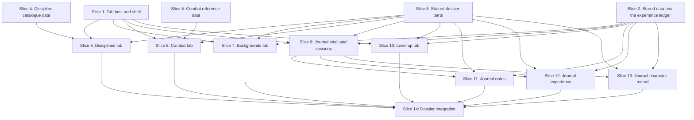

# Plan: Dossier Tabs

**Created**: 2026-10-08
**Branch**: `feat/dossier-foundation`, then `feat/dossier-reference-tabs`, then `feat/dossier-journal-levelup` (stacked; see Approach stance)
**Status**: in-progress
**Gherkin persistence**: features
**Spec**: `docs/specs/dossier-tabs.md`
**Design**: Figma `TAvjmr6RE0rHV8kz56Ffs0`, frames `5:3452` (Disciplines), `37:2042` (Backgrounds), `91:3380` and `97:196` (Combat), `102:1140` (Journal), `152:3419` (Level up)

## Goal

Add five tabs to the V20 sheet: Disciplines, Backgrounds, Combat, Journal and Level up. The work
lands as a foundation (tab host and shell contract, stored data and experience ledger, shared
parts, and two rulebook-data slices) and then the tab features built in parallel on disjoint
files, with Journal split into a shell and three sections. Existing sheet, roster and builder
behavior does not change; stored records written before this work keep loading.

## Approach stance (decision defaults)

| Axis | Stance |
| --- | --- |
| Scope | The five tabs, the tab host, the application-bar label on the sheet, and the small read-only display of the legacy `notes` and `experience` text. The Character sheet tab's contents, the roster and the builder are not restyled or refactored. The shared parts are used by the new tabs only; existing pages are not migrated onto them |
| Replace vs. merge | **Merge.** Stored records are read and written additively: every legacy field survives every save untouched. `sheet.ts` is refactored in place into a shell plus the Character sheet tab, not replaced by a parallel page. `setNamedRow` is changed to keep unknown row fields |
| Format fidelity | Icons new to these frames are kept as the SVG files from Figma. Rulebook data is typed into TypeScript from the V20 PDF; the PDF stays gitignored and is never committed |
| Migrate vs. edit in place | `src/pages/sheet.astro`, `src/scripts/sheet.ts`, `src/scripts/sheet/poolCard.ts` and `src/domain/v20/disciplines.ts` are changed where they are; no `-v2` copies |
| Integration | **Non-default.** Three stacked PRs, auto-merge off: the repository has no CI and the owner reviews and merges. PR A = Slices 1–5 (foundation, data, loader change; tried against real browser profiles before merging). PR B = Slices 6–8 (Disciplines, Backgrounds, Combat). PR C = Slices 9–14 (Journal, Level up, integration; Level up ships with Journal because it needs sessions and XP to be usable). Each PR body carries the output of the five gate commands and, for A and B, the rulebook-data review checklist. `.claude/CLAUDE.md` and `.claude/worktrees/` stay out of every commit |

Refinement of the spec's file layout: each tab's panel, script and stylesheet live together in
`src/tabs/<key>/` (the spec named `src/components/<tab>/` and `src/scripts/<tab>/` separately);
domain code stays in `src/domain/v20/<key>/`. The ownership rule is unchanged: one slice, one
disjoint set of files.

## Plan decisions beyond the spec

These were forced by plan review and are shown here so they can be corrected at this gate.

1. **Pending lifecycle (Level up).** Pending choices live for the page visit: they survive tab switches and mode changes, are re-priced against the character on every redraw (a stale choice is dropped with a message), and are lost on reload, Cancel, Clear or Confirm. The tab says "Pending selections are not saved."
2. **Undo.** Removing an entry (Backgrounds, Journal record) shows "Removed <name>. Undo" for ten seconds in a live region; "Confirm & apply" shows a persistent "Applied N advancements · M XP spent · Undo" that restores the ratings and removes exactly the records it wrote.
3. **No session.** Award XP, new notes and Level up show an inline "Start a session first" prompt with a title field and a "Start session" button (calling the same `startSession` as the Journal), instead of failing at submit time. Level up also states "No XP available" with a link to Journal → Experience when the ledger is empty.
4. **Level up offers only Disciplines the character holds (rating 1 or more).** A new Discipline has no cost in the spec's table, so it is covered by the "Beyond the standard costs" text, as in the Figma.
5. **Combat controls.** The Melee / Ranged sub-tabs and the All / Close / Ranged filter are one state: "All" shows both sections, "Close combat" and the Melee sub-tab show melee, "Ranged combat" and the Ranged sub-tab show ranged. Target and Range change the difficulty and damage as the V20 called-shot and range tables say (extracted in Slice 5, tested in Slice 8). The Figma's roll buttons are replaced by a result card and the line "Pools only — roll your own dice."
6. **Notes.** Categories are the Figma's fixed five (People & relationships, Clues, Places, Promises & boons, Unsorted). The body is a textarea with a toolbar and a live rendered preview beside it; checklist boxes are ticked in the preview. Mentions: `@` followed by capitalised words, or `@[any name]`; chips can also be added and removed by hand. The Figma's ⌘K shortcut hint is not rendered. Notes autosave debounced (400 ms) and flush on blur, on "Save note" and on leaving the tab. Sessions can be renamed and an earlier session made current again.
7. **Numeric limits.** Blood-bond rating 0–10, merit and flaw points 0 or more, XP award a non-zero whole number. Out-of-range values show an inline hint and are corrected on commit with a message, never silently.
8. **Legacy text.** The old `notes` and `experience` strings are shown read-only (Journal → Notes as "Earlier notes", Experience as "Earlier experience note") so no data looks lost. They are not imported or edited.
9. **Mode on reload.** Mode persists across tab switches within a visit; a reload returns to play mode, as today.
10. **Pool wording.** Pools are written with full labels everywhere ("Dexterity 3 + Brawl 1 − wound 1") by one shared helper.

## Acceptance Criteria

Copied from the spec in short form; ticked by the operator at PR review. The slice that proves
each is in brackets.

- [ ] F1. With only the Character sheet registered no tab bar appears and the page is unchanged [1]
- [ ] F2. Adding a tab's folder registers it, in the fixed order, with no shared-file edit [1, 14]
- [ ] F3. `tab=<key>` shows that tab; an unknown key shows the Character sheet; reload and Back/Forward keep or restore the tab; switching loses no uncommitted input [1, 14]
- [ ] F4. Tabs work with arrows, Home, End, Enter and Space; the active tab is marked in text (`aria-selected` plus a visible mark), not color alone; every tab passes axe WCAG 2.1 AA in play and edit mode [1, 6–13, 14]
- [ ] F5. A record saved before this work loads with every new field blank and keeps every legacy field after edits on every tab [2, 14]
- [ ] F6. Identity, mode toggle and save status are on every tab; the resources row on every tab except Level up and stays in step across tabs [1, 14]
- [ ] F7. Mode persists across tab switches and is announced once on entering edit mode [1, 14]
- [ ] D1. List shows rating and "N levels unlocked"; powers Known or Locked ("Requires <Discipline> N"), in level order [6]
- [ ] D2. An expanded power shows cost, duration, prerequisite, pool, difficulty, reference; no clean value reads "See rulebook (V20 p. N)" [4, 6]
- [ ] D3. A rolling Known power shows "Your pool: N dice" less the wound penalty, floored at 0; others show what they use [6]
- [ ] D4. Search narrows by name and summary with an empty state; Owned / All switches the list; seventeen under All [6]
- [ ] D5. "Build pool" selects the power's traits, opens the Character sheet and announces it; absent for non-rolling and Locked powers [1, 6]
- [ ] D6. A rating 0 or unknown Discipline shows name and rating, no powers (in Owned) [6]
- [ ] B1. Background cards show name, dots, summary, note, people; unnamed rows hidden in play, shown in edit [7]
- [ ] B2. Merits and Flaws with points and totals; Other traits; Havens with all fields [7]
- [ ] B3. Read-only in play with the hint; fully editable in edit mode, entries added, removed (with Undo) and more than six backgrounds [2, 7]
- [ ] B4. Empty states for empty sections [7]
- [ ] B5. Edits survive reload; index counts match after edits [7]
- [ ] C1. Manoeuvre and weapon tables (melee and ranged) list the rulebook entries with the character's computed pools [5, 8]
- [ ] C2. The Weapon roll panel shows attack pool, accuracy, difficulty; ± inputs, Target and Range change them and reset on leaving; nothing stored, nothing random [8]
- [ ] C3. Damage pool = weapon damage (Strength-based uses Strength) + extra successes, never below 0 [8]
- [ ] C4. Manoeuvres the character cannot use are marked with the reason; usable ones are not; "Weapon required" uses the selected weapon [8]
- [ ] C5. Search and the section control narrow both tables; empty state on no match [8]
- [ ] C6. Incapacitated reads 0 for every pool including damage and says why [8]
- [ ] J1. A note with title, category, tags and formatted body saves to the current session, lists, counts, survives reload [11]
- [ ] J2. Pin and unpin; search finds by title, body, tag and mention separately [11]
- [ ] J3. Formatting works, checklists tick and untick, raw HTML is shown as text and nothing executes [11]
- [ ] J4. "Start new session" makes the new one the only current one and updates the app-bar label [9]
- [ ] J5. Award XP adds or subtracts in the current session and updates totals; empty, zero or non-numeric is refused with the stated message; the result is announced [12]
- [ ] J6. Earned, Spent and Available equal the defined sums for any ledger; overspend reads negative [2, 12]
- [ ] J7. Notes and Award XP editable in play; Character record read-only in play, editable in edit, every part round-tripping [11, 12, 13]
- [ ] J8. An empty journal shows an empty state offering to start a session and add a note [9]
- [ ] L1. Each trait shows its V20 cost for the current ratings and clan; unaffordable rows state the shortfall; maximum disabled [10]
- [ ] L2. Selecting adds to the pending list and lowers the projected balance without changing character or ledger; later rows are judged against the remaining balance [10]
- [ ] L3. "Confirm & apply" sets ratings, appends one spending record each, updates totals, in one save; persists; works in play mode [10]
- [ ] L4. Clear, Cancel and Back each leave character and ledger unchanged [10]
- [ ] L5. A clan outside the thirteen (including blank) is Caitiff: every Discipline costs current × 6 [10]
- [ ] L6. With no current session the tab shows the start-a-session prompt and "Confirm & apply" is disabled; nothing is written without a session [10]
- [ ] L7. Cost and state are in text as well as color; pending changes and results are announced with the stated wording; Undo restores the prior state [10]

## Existing scenarios

The existing `features/` scenarios for the sheet, roster and builder must stay green after every
slice; Slice 1 is the one most likely to disturb them.

## Conventions for tab slices

Every tab slice follows these, so five parallel slices build one consistent experience. Slice 1
and Slice 3 provide the pieces; slices only consume them.

**Files and structure**
- A tab's folder `src/tabs/<key>/` holds `descriptor.ts` (the single discovered module: `{ key, label, order, showsResources, mount: () => import('./mount') }`, DOM-free, never statically importing `mount.ts`), `Panel.astro`, `mount.ts`, a stylesheet, and `draw*.ts` modules.
- `Panel.astro` ships static markup and `<template>` elements; `mount.ts` only wires the context and events and composes the `draw*.ts` modules (`draw(root, viewModel)`), following `components/roster/EntryTemplates.astro`. View models come from pure domain functions. A query is always scoped to the tab's own panel, never `#sheet`.
- A tab's stylesheet is its own file inside its folder (Journal sections each have one). No color or typeface outside the `global.css` tokens; text at least 12 px; every control at least 24 × 24 px.

**Shell contract (Slice 1)** — `mount(ctx)` returns `{ render(character, mode), enter?(), leave?(), changed?(before, after) }`. `ctx` offers `current()` (the latest character), `apply(update)`, `selectPool(selection)`, `openTab(key)`, `announce(text)`, `stamp` (`{ newId(), now() }`) and `root`. `render` is idempotent and never rewrites a focused input, textarea or select (use the `showText` pattern). `leave` is how a tab forgets page state (Combat modifiers).

**Messages (exact wording)**
- No session: heading "Start a session first", text "Notes, experience and level-ups are recorded in a session.", a title field and "Start session".
- Award refused: "Enter a whole number of XP, other than 0."
- Award accepted, announced: "3 XP awarded. Available 8." Negative: "2 XP taken back. Available 6."
- Removal notice: "Removed <name>. Undo".
- Level up announcements: "<Trait> <from> to <to> added to the review. <N> XP pending."; "<Trait> removed from the review. <N> XP pending."; "Applied <N> advancements. <M> XP spent. Available <A>."
- Out-of-range input: "Rating kept between 0 and 10." (limits per decision 7).

**Focus and announcements**: after a removal focus goes to the Undo button (Undo returns it to the restored entry); after Build pool focus goes to the Selected pool heading; after removing a pending line focus goes to the next line or the review heading; after Confirm focus goes to the result message; after a tab switch focus goes to the tab panel's heading and the page title becomes "<Tab> · <Character>".

**Shared step wording (defined once, in `features/steps/shared.steps.ts`, owned by Slice 1)**: "a saved character", "a character in play mode", "a character in edit mode", "a character with no session", "the <tab> tab is opened", "the read-only hint is shown", "nothing on the tab can be edited" (no input, textarea, select, contenteditable or Add/Remove control), "the start-a-session prompt is shown", "the <tab> tab is scanned for accessibility problems" / "no problems are reported" (play and edit mode, axe tags wcag2a, wcag2aa, wcag21a, wcag21aa, with the tab's richest state arranged by the scenario), and "the <tab> tab is opened at 320 pixels wide with crowded content" / "the page does not scroll sideways". Any other step text a slice writes must include its tab's name ("on the Combat tab"), so the shared step namespace never has two definitions of one phrase.

**Data review**: tests guard the shape of rulebook data only. Values are verified by a human checklist (entry, value, page) attached to the PR.

## Slices

### Slice 1: Tab host and shell

**Depends-on:** none
**Files:** `src/pages/sheet.astro`, `src/scripts/sheet.ts`, `src/scripts/sheet/pool.ts`, `src/scripts/sheet/poolCard.ts`, `src/scripts/sheet/observers/**`, `src/domain/v20/poolText.ts`, `src/domain/v20/poolText.test.ts`, `src/scripts/tabs/**`, `src/components/tabs/**`, `src/components/AppBar.astro`, `src/styles/tabs.css`, `features/dossier-tabs/slice-1-*.feature`, `features/steps/fixtures.ts`, `features/steps/shared.steps.ts`, `features/steps/tab-host.steps.ts`, `features/steps/support/tabs.ts`, `features/steps/support/accessibility.ts`

**Ownership of today's `sheet.ts`** (the Character sheet is the first consumer of the contract):

| Stays in the shell (outside any tab panel) | Moves to the Character sheet tab (`sheetTab`) |
| --- | --- |
| Loading, not-found and unreadable states; the `storage` and `pageshow` handlers; mode and the mode toggle and its announcer; `apply` and saving; Identity and its text inputs; the save status; the resources row (Blood Pool, Willpower, Health, Humanity) with its steppers, health track and wound announcement; the app-bar slot; observers; the pool state | Attribute, Ability, Virtue, Discipline and Selected-pool cards; trait selection (`.trait-select`); specialty and write-in inputs; the pool card and `announcePool`, re-spoken through the `changed(before, after)` hook when a wound changes |

**Behavior:**

```gherkin
Feature: The sheet's tab host

  Scenario: The sheet opens on the Character sheet
    Given a saved character
    When the Character sheet tab is opened
    Then the character's name, the mode toggle, the save status and the resources row are shown
    And the Attributes and Abilities cards are shown

  Scenario: An unknown tab name falls back to the Character sheet
    Given a saved character
    When its sheet is opened with the tab name "nonsense"
    Then the Character sheet is shown
    And no error is shown

  Scenario: The Character sheet still works as before
    Given a character in edit mode
    When the player raises Strength to 4 and returns to play mode
    Then the sheet shows Strength 4 and it is still 4 after a reload

  Scenario: A wound re-announces the selected pool
    Given a character in play mode with Strength and Brawl selected
    When the player marks a Hurt wound
    Then the Selected pool is announced with the wound subtracted

  Scenario: A missing character is still reported
    Given no character is saved with the address's id
    When the sheet is opened with the tab name "combat"
    Then "Character not found" is shown
```

Behaviors that need a second tab (bar order, Space, Back) are covered by unit and Astro-container
tests here and end to end in Slice 14.

**Steps:**

#### Step 1.1: The tab registry

**Complexity**: standard
**IMPLEMENT**: A pure function from descriptors (key, label, order, showsResources) to the visible tab list: the Character sheet first, then the rest by `order`; `showBar` only when two or more tabs exist
**TEST**: Unit tests: none registered → Character sheet only and `showBar` false; out-of-order input comes back ordered; a duplicate key and a duplicate order are both rejected
**REFACTOR**: One `TabDescriptor` type in `src/scripts/tabs/descriptor.ts`; nothing restates its fields
**Files**: `src/scripts/tabs/registry.ts`, `src/scripts/tabs/registry.test.ts`, `src/scripts/tabs/descriptor.ts`
**Commit**: `feat(tabs): tab registry with fixed order`

#### Step 1.2: Tab addresses

**Complexity**: standard
**IMPLEMENT**: Pure `tabFromUrl(url, keys)` (absent or unknown → Character sheet) and `hrefFor(url, key)` keeping `id`, setting or clearing `tab`, never carrying `#edit`; `titleFor(tab, character)` giving "<Tab> · <Character>"
**TEST**: Unit tests: absent, known, unknown and empty values; built address keeps `id`; the title for a blank name is "Unnamed character"
**REFACTOR**: Key type shared with Step 1.1
**Files**: `src/scripts/tabs/address.ts`, `src/scripts/tabs/address.test.ts`
**Commit**: `feat(tabs): read and build tab addresses`

#### Step 1.3: The shell split and the tab contract

**Complexity**: complex
**IMPLEMENT**: Refactor `sheet.ts` along the ownership table above. Define the contract in `src/scripts/tabs/context.ts` (see Conventions): `mount(ctx)` returns `{ render, enter?, leave?, changed? }`; the shell calls `render` on the active tab on every apply and mode change, `enter` and `leave` on switches, and `changed(before, after)` on every apply. Identity and the resources row move out of the panel wrapper (the shell hides the row when the active descriptor has `showsResources: false`). The Character sheet becomes the first tab (`sheetTab.ts`), its queries scoped to its own panel
**TEST**: All existing sheet scenarios stay green (pool, modes, resources, play layout); a contract test with a fake tab asserts render is called on the active tab only, once per apply and per mode change, `leave` is called before the next `enter`, and a focused input is not rewritten during render; the "wound re-announces the pool" scenario passes
**REFACTOR**: `sheet.ts` names no tab; every `querySelectorAll` takes a root
**Files**: `src/scripts/sheet.ts`, `src/scripts/tabs/context.ts`, `src/scripts/tabs/sheetTab.ts`, `src/scripts/tabs/shell.test.ts`, `src/pages/sheet.astro`, `features/steps/tab-host.steps.ts`
**Commit**: `refactor(sheet): shell with per-tab mount and context`

#### Step 1.4: Panels and descriptors from one glob

**Complexity**: complex
**IMPLEMENT**: Spike first: confirm `import.meta.glob('../tabs/*/descriptor.ts', { eager: true })` can drive both the server panel list (`Panel.astro` per folder, rendered in `sheet.astro`) and the client registry, and that `mount` loads lazily. Add a build-time check that every descriptor has a sibling `Panel.astro` and vice versa. Each panel is a `role="tabpanel"` wrapper labelled by its tab; only the active one is visible. If the spike fails, fall back to a `prebuild` script writing `src/tabs/index.ts` with the same shape, decided in this step
**TEST**: Build passes with zero extra tabs; unit test of the folder/descriptor consistency check; the "opens on the Character sheet" and "unknown tab name" scenarios pass
**REFACTOR**: `sheet.astro` names no tab; no per-panel conditionals
**Files**: `src/pages/sheet.astro`, `src/scripts/tabs/discover.ts`, `src/scripts/tabs/discover.test.ts`
**Commit**: `feat(tabs): discover tabs from one descriptor glob`

#### Step 1.5: The tab bar

**Complexity**: standard
**IMPLEMENT**: Rendered only when `showBar`: links whose `href`s are filled in at runtime from `hrefFor` (the id is not known at build time), `role="tablist"` / `role="tab"`, `aria-selected`, `aria-controls`, roving focus; arrows, Home and End move focus; Enter and Space activate (Space prevents the page scroll); ctrl/cmd/shift/middle clicks are left to the browser; a plain click switches with `pushState`, and `popstate` restores the tab; on a switch focus goes to the panel heading, scroll resets to the panel, and `document.title` updates; the bar scrolls sideways inside itself and keeps the active tab in view; the active tab has an underline and bold weight in addition to `aria-selected`
**TEST**: Unit tests for the key mapping (including Space and wrap) and for `popstate` handling with a fake history; Astro-container render test of `TabBar.astro` with two fixture tabs asserting roles, `aria-selected`, `aria-controls` and a text/shape marker, and that one tab renders no bar
**REFACTOR**: Key mapping and history handling stay pure and separate from the element
**Files**: `src/components/tabs/TabBar.astro`, `src/scripts/tabs/tabBar.ts`, `src/scripts/tabs/tabBar.test.ts`, `src/scripts/tabs/history.ts`, `src/scripts/tabs/history.test.ts`, `src/styles/tabs.css`, `src/pages/sheet.astro`
**Commit**: `feat(tabs): accessible tab bar with history`

#### Step 1.6: Observers, the application-bar slot and context services

**Complexity**: standard
**IMPLEMENT**: A named slot in `AppBar.astro` for the sheet (`data-app-bar-label`, empty elsewhere); the shell runs every module in `src/scripts/sheet/observers/*.ts` (each exports `afterRender(character, root)`) after each render on every tab; `ctx.announce(text)` writing to one polite live region; `ctx.stamp` supplying `newId` (via `generateId`) and `now` (`Date.now`)
**TEST**: Unit test that observers run after every render and on every tab; `announce` writes once per call; the roster and builder app bars render unchanged (existing scenarios)
**REFACTOR**: One live-region element shared with the mode announcement
**Files**: `src/components/AppBar.astro`, `src/scripts/sheet/observers/index.ts`, `src/scripts/tabs/context.ts`, `src/scripts/tabs/services.ts`, `src/scripts/tabs/services.test.ts`
**Commit**: `feat(sheet): observers, app-bar slot and announce service`

#### Step 1.7: One pool wording and `selectPool`

**Complexity**: standard
**IMPLEMENT**: Move `poolFormula` out of `poolCard.ts` into `src/domain/v20/poolText.ts` (full labels, "− wound N") and re-import it in `poolCard.ts`; `pool.select(selection)` sets both rows at once; `ctx.selectPool` uses it
**TEST**: Unit tests for the formula text (with and without wound, Melee 0, Incapacitated) and `pool.select`; the existing selected-pool scenarios pass unchanged
**REFACTOR**: Selected pool card draws from the moved helper only
**Files**: `src/domain/v20/poolText.ts`, `src/domain/v20/poolText.test.ts`, `src/scripts/sheet/poolCard.ts`, `src/scripts/sheet/pool.ts`, `src/scripts/tabs/context.ts`
**Commit**: `refactor(sheet): shared pool wording and selectPool`

#### Step 1.8: Test support for every slice

**Complexity**: standard
**IMPLEMENT**: `memoryFor(world, key, init)` typed accessor replacing an untyped bag in `fixtures.ts`; `support/tabs.ts` with `openSheetTab`, `activeTab`; `shared.steps.ts` defining every shared phrase from Conventions; `support/accessibility.ts` gains `scanTab(page, tab)` running axe over play and edit mode; a fixed-clock helper using Playwright's clock
**TEST**: The shared phrases are used by the Slice 1 scenarios; a self-test lists step definitions and fails on any duplicate text
**REFACTOR**: No edit to `pages.ts`
**Files**: `features/steps/fixtures.ts`, `features/steps/shared.steps.ts`, `features/steps/support/tabs.ts`, `features/steps/support/accessibility.ts`
**Commit**: `test(tabs): typed scenario memory and shared steps`

### Slice 2: Stored data and the experience ledger

**Depends-on:** none
**Files:** `src/domain/v20/character.ts`, `src/domain/v20/character.test.ts`, `src/domain/v20/namedRating.ts`, `src/domain/v20/dossier/types.ts`, `src/domain/v20/dossier/validate.ts`, `src/domain/v20/dossier/validate.test.ts`, `src/domain/v20/journal/types.ts`, `src/domain/v20/journal/validate.ts`, `src/domain/v20/journal/validate.test.ts`, `src/domain/v20/journal/stamp.ts`, `src/domain/v20/journal/sessions.ts`, `src/domain/v20/journal/sessions.test.ts`, `src/domain/v20/experience/ledger.ts`, `src/domain/v20/experience/ledger.test.ts`, `src/domain/v20/experience/costs.ts`, `src/domain/v20/experience/costs.test.ts`, `src/domain/v20/creation/progress.test.ts`, `src/storage/characterStore.ts`, `src/storage/characterStore.test.ts`, `features/dossier-tabs/slice-2-*.feature`, `features/steps/dossier-data.steps.ts`

**Behavior:**

```gherkin
Feature: Stored character data for the dossier tabs

  Scenario: A character saved before the dossier tabs opens unchanged
    Given a character saved before the dossier tabs existed, with text in its notes, experience and weakness fields
    When its sheet is opened and a trait is changed
    Then the sheet shows the character as before
    And the saved notes, experience and weakness text is exactly what it was

  Scenario Outline: A damaged dossier field is reported, not repaired
    Given a saved character whose <field> data is damaged
    And another undamaged saved character
    When the damaged character's sheet is opened
    Then "Character could not be read" is shown
    And the damaged record is not changed
    And the roster still lists the other character
    Examples:
      | field   |
      | journal |
      | merits  |
      | havens  |

  Scenario: A character with more than six backgrounds is readable everywhere
    Given a saved character with eight named backgrounds
    When the roster is opened and then the character's sheet
    Then the character is listed and its sheet opens
    And a build of that character in the builder reports progress without error
```

Session and ledger arithmetic (J4, J6) is verified by unit and property tests on the pure model.

**Steps:**

#### Step 2.1: Additive types, blank defaults and the field list

**Complexity**: complex
**IMPLEMENT**: Declare every new field from the spec's data table in `V20Character` with blank defaults in `blankCharacter`. `BackgroundRow extends NamedRating` with optional `summary`, `note` and `people` (the details live on the row, so reordering or removing a row cannot detach them). `NamedRating` moves to `namedRating.ts` (re-exported from `character.ts`) so dossier and journal types never import `character.ts`. One exported `DOSSIER_FIELDS` constant lists every new top-level field. `schemaVersion` stays 1
**TEST**: Unit tests: `blankCharacter` has every `DOSSIER_FIELDS` entry blank; a character round-trips through JSON unchanged; legacy fields untouched
**REFACTOR**: Each family of types in its own file; `character.ts` re-exports them so later slices never edit it
**Files**: `src/domain/v20/character.ts`, `src/domain/v20/character.test.ts`, `src/domain/v20/namedRating.ts`, `src/domain/v20/dossier/types.ts`, `src/domain/v20/journal/types.ts`
**Commit**: `feat(model): additive dossier fields on the character`

#### Step 2.2: Loading old records

**Complexity**: complex
**IMPLEMENT**: In `characterStore.ts`, `parseRecord` fills every `DOSSIER_FIELDS` entry that is missing (replacing the one-off `withSpecialties`), checks the legacy shape against a template built without the dossier keys and with `backgrounds` checked for "at least six rows, each a row", then validates each dossier field with its own validator next to its types. A damaged dossier field makes the record unreadable and it is never rewritten. `hasShapeOf` and `storagePort.ts` are left untouched
**TEST**: Unit tests: a pre-work record loads; eight backgrounds load; each damaged-field case (wrong type, a note without an id, a session flag that is not a boolean, a merit without points) is unreadable; the builder store's behavior is unchanged
**REFACTOR**: The back-fill list, the legacy template and the validator dispatch are all derived from `DOSSIER_FIELDS`; no second list
**Files**: `src/storage/characterStore.ts`, `src/storage/characterStore.test.ts`, `src/domain/v20/dossier/validate.ts`, `src/domain/v20/dossier/validate.test.ts`, `src/domain/v20/journal/validate.ts`, `src/domain/v20/journal/validate.test.ts`
**Commit**: `feat(store): read records saved before the dossier fields`

#### Step 2.3: Rows keep their details; consumers tolerate more than six

**Complexity**: standard
**IMPLEMENT**: `setNamedRow` spreads the current row so unknown fields survive a name or rating edit. Audit every consumer of `backgrounds` (`toCharacter.ts`, `progress.ts`, `library.ts`, the builder's Advantages and FinishingTouches, the sheet) and fix any that assume exactly six
**TEST**: Unit tests: a row's summary, note and people survive `setNamedRow` for name and rating; builder `progress` and `toCharacter` with eight rows; `library` listing of an eight-background character; each consumer found by the audit has a test or an explicit note in the commit body
**REFACTOR**: Replace any literal `6` in a consumer with the row count of the data
**Files**: `src/domain/v20/character.ts`, `src/domain/v20/character.test.ts`, `src/domain/v20/creation/progress.test.ts`
**Commit**: `fix(model): background rows keep details and may exceed six`

#### Step 2.4: Legacy and damaged-record scenarios

**Complexity**: standard
**IMPLEMENT**: Step definitions and seeded legacy and damaged records for the three scenarios
**TEST**: The three scenarios pass; every legacy free-text field is byte-identical after an edit
**REFACTOR**: Reuse `characterArranged` and `overwriteRecord`; no new seed helper
**Files**: `features/steps/dossier-data.steps.ts`
**Commit**: `test(store): legacy and damaged records open or are reported`

#### Step 2.5: Sessions

**Complexity**: standard
**IMPLEMENT**: A `Stamp` type (`{ newId(): string; now(): number }`) defined once in `journal/stamp.ts`; pure `startSession(journal, title, stamp)` (new session becomes the only current one), `currentSession`, `renameSession`, `makeCurrent`
**TEST**: Unit tests with a deterministic stamp: first session is current; a second makes the first not current; `makeCurrent` swaps; exactly one current after any sequence; blank or whitespace title becomes "Session N"; ids unique
**REFACTOR**: One `withCurrent` helper
**Files**: `src/domain/v20/journal/stamp.ts`, `src/domain/v20/journal/sessions.ts`, `src/domain/v20/journal/sessions.test.ts`
**Commit**: `feat(journal): sessions with one current`

#### Step 2.6: The experience ledger

**Complexity**: standard
**IMPLEMENT**: Pure `awardXp`, `recordSpending` (taking a `Stamp`), `removeSpendings(ids)` (for Undo) and `experienceTotals` giving earned, spent, available and this-session, where available = earned − spent
**TEST**: Unit tests: empty ledger all zero; sums; a negative award subtracts; this-session counts only the current session; available goes negative and stays reported as such; a record for a session that no longer exists still counts; a property test over random ledgers asserts earned − spent = available and that removing exactly the spendings added restores the totals
**REFACTOR**: Totals from one reducer
**Files**: `src/domain/v20/experience/ledger.ts`, `src/domain/v20/experience/ledger.test.ts`
**Commit**: `feat(experience): ledger totals`

#### Step 2.7: The V20 experience cost table

**Complexity**: trivial
**IMPLEMENT**: The cost table as data (new Ability 3; Ability ×2; Attribute ×4; in-clan Discipline ×5; out-of-clan ×7; Caitiff ×6; Virtue ×2; Humanity / Path ×2; permanent Willpower current rating) with the labels both the Journal reference and Level up show
**TEST**: Unit test for each label and multiplier
**REFACTOR**: None; data only
**Files**: `src/domain/v20/experience/costs.ts`, `src/domain/v20/experience/costs.test.ts`
**Commit**: `feat(experience): V20 cost table`

### Slice 3: Shared dossier parts

**Depends-on:** none
**Files:** `src/components/dossier/**`, `src/scripts/dossier/**`, `src/styles/dossier.css`, `src/styles/contrast.test.ts`, `src/domain/v20/search.ts`, `src/domain/v20/search.test.ts`, `src/domain/v20/labels.ts`, `src/domain/v20/labels.test.ts`

This slice has no scenarios of its own: its parts have no page. Pure parts are unit-tested; component
markup is checked by Astro-container render tests; behavior is proven by the scenarios of the
tabs that use them (disclosure in Slice 6, undo in Slice 7, the session prompt in Slices 10–12,
the segmented control in Slice 8). If Vitest cannot render Astro components in this repository
the first sub-task of Step 3.3 is to say so, and the render tests move to the consuming slices.

**Behavior:** none (see above).

**Steps:**

#### Step 3.1: Text matching

**Complexity**: standard
**IMPLEMENT**: `matchesQuery(query, ...fields)`: every whitespace-separated word occurs in some field, ignoring case, accents and surrounding space; empty query matches all; undefined fields allowed. Uses `folded` from `text.ts`
**TEST**: Unit tests: case ("ELOISE"), accent ("Éloïse" found by "eloise"), words spread across fields, empty, no match, undefined field
**REFACTOR**: Reuse `folded`; no new normaliser
**Files**: `src/domain/v20/search.ts`, `src/domain/v20/search.test.ts`
**Commit**: `feat(dossier): text matching for search`

#### Step 3.2: Count and points labels

**Complexity**: trivial
**IMPLEMENT**: In `labels.ts`: `countLabel(n, singular, plural)` ("1 entry", "3 entries"), `pointsLabel(n)` for a row ("1 pt", "2 pts") and `pointsTotalLabel(n)` for a section header ("1 point", "3 points")
**TEST**: Unit tests: 0, 1, 2 and large numbers for each
**REFACTOR**: None
**Files**: `src/domain/v20/labels.ts`, `src/domain/v20/labels.test.ts`
**Commit**: `feat(dossier): count and points labels`

#### Step 3.3: Heading, hint, chips and empty state

**Complexity**: standard
**IMPLEMENT**: Astro components `SectionHeading` (title + count), `ReadOnlyHint` (shown in play mode through `data-sheet-mode-only`; text "Read-only in play · edit character to change"), `TagChips`, `EmptyState` (message plus an optional next action); styles from existing tokens in `dossier.css`
**TEST**: Astro-container render tests: heading text and count, hint present in markup with the mode attribute, chips as a list, empty state with and without an action
**REFACTOR**: One `dossier-` class prefix
**Files**: `src/components/dossier/SectionHeading.astro`, `src/components/dossier/ReadOnlyHint.astro`, `src/components/dossier/TagChips.astro`, `src/components/dossier/EmptyState.astro`, `src/styles/dossier.css`, `src/components/dossier/dossier.test.ts`
**Commit**: `feat(dossier): heading, hint, chips and empty state`

#### Step 3.4: Reference table

**Complexity**: standard
**IMPLEMENT**: `ReferenceTable`: caption, headings with `scope`, rows from slots, and its own horizontal scroll container (focusable, labelled) so a narrow screen never scrolls the page
**TEST**: Container render test: caption, `scope`, scroll container attributes
**REFACTOR**: Spacing shared with the heading
**Files**: `src/components/dossier/ReferenceTable.astro`, `src/styles/dossier.css`, `src/components/dossier/dossier.test.ts`
**Commit**: `feat(dossier): reference table`

#### Step 3.5: Segmented control, selectable list and disclosure styles

**Complexity**: standard
**IMPLEMENT**: `SegmentedControl` (buttons with `aria-pressed` and a text marker on the pressed one; arrow keys move focus, Enter and Space press); `SelectableList` item pattern (`aria-current="true"` plus a visible text marker); styles for native `<details>`/`<summary>` as the shared disclosure (heading button semantics and Enter/Space for free; no custom element)
**TEST**: Unit test the pure key mapping; container render tests for `aria-pressed`, `aria-current` and the text markers
**REFACTOR**: Key mapping shared with the tab bar's pure function by import
**Files**: `src/components/dossier/SegmentedControl.astro`, `src/components/dossier/SelectableItem.astro`, `src/scripts/dossier/segmented.ts`, `src/scripts/dossier/segmented.test.ts`, `src/styles/dossier.css`
**Commit**: `feat(dossier): segmented control, selectable list, disclosure`

#### Step 3.6: Search field

**Complexity**: standard
**IMPLEMENT**: `SearchField`: labelled input with a clear button and a polite result-count region; pure `filterBy(items, query, fieldsOf)` built on `matchesQuery`
**TEST**: Unit test `filterBy`; container render test for the label, clear button and live region
**REFACTOR**: None
**Files**: `src/components/dossier/SearchField.astro`, `src/scripts/dossier/filterBy.ts`, `src/scripts/dossier/filterBy.test.ts`
**Commit**: `feat(dossier): search field`

#### Step 3.7: Undo notice and session prompt

**Complexity**: standard
**IMPLEMENT**: A pure `undoWindow` (holds one removed entry and its restore function for ten seconds; a second removal replaces the first) with an `UndoNotice` component ("Removed <name>. Undo"); a `SessionPrompt` component with the exact wording from Conventions that emits a `start-session` event carrying the title
**TEST**: Unit tests: the undo window expires with a fake clock, restores once, and is replaced by a later removal; container render tests of both components' text
**REFACTOR**: Shared live-region wiring through `ctx.announce`, not a second region
**Files**: `src/components/dossier/UndoNotice.astro`, `src/components/dossier/SessionPrompt.astro`, `src/scripts/dossier/undoWindow.ts`, `src/scripts/dossier/undoWindow.test.ts`
**Commit**: `feat(dossier): undo notice and session prompt`

#### Step 3.8: Contrast and size guard

**Complexity**: standard
**IMPLEMENT**: A unit test that reads the text and background color tokens used by `dossier.css` and the tab stylesheets' declared pairs and asserts 4.5:1 for text (3:1 for large text and control borders), a 12 px minimum text size and a 24 × 24 px minimum control size from the CSS
**TEST**: The test itself; it fails on a deliberately low-contrast pair in a fixture
**REFACTOR**: Token names read from `global.css`, not copied
**Files**: `src/styles/dossier.css`, `src/styles/contrast.test.ts`
**Commit**: `test(styles): contrast and size guard for dossier tokens`

### Slice 4: Discipline catalogue data

**Depends-on:** none
**Files:** `src/domain/v20/disciplines.ts`, `src/domain/v20/disciplines.test.ts`, `src/domain/v20/disciplineData/**`

Data only; no UI, so no scenarios. Extraction reads the V20 PDF at its absolute path in the main
checkout (`/Users/brunolemus/Projects/Personal/WorldOfDarknessCharacterSheets/docs/references/sourcebooks/Vampire the Masquerade - 20th Anniversary Edition.pdf`) with `pypdf`, because worktrees contain only tracked files. Check `docs/references/sheets/` too. A field the book does not state cleanly stays undefined.

**Behavior:** none (verified by unit tests on shape and by the human data review).

**Steps:**

#### Step 4.1: Split the catalogue from the reading logic

**Complexity**: standard
**IMPLEMENT**: Move the catalogue entries out of `disciplines.ts` into `src/domain/v20/disciplineData/` (one file per group, re-exported as `DISCIPLINE_CATALOGUE`); `disciplines.ts` keeps types, lookup and `disciplineReadings`
**TEST**: Existing `disciplines.test.ts` and the Character sheet's Discipline scenarios pass unchanged
**REFACTOR**: Pure move; no value changes
**Files**: `src/domain/v20/disciplines.ts`, `src/domain/v20/disciplineData/index.ts`, `src/domain/v20/disciplineData/*.ts`
**Commit**: `refactor(disciplines): catalogue data in its own files`

#### Step 4.2: Rule fields and Presence

**Complexity**: complex
**IMPLEMENT**: Extend `Power` with optional `cost`, `duration`, `prerequisite`, `difficulty`, `summary` and required `page`; extract Presence from V20 chapter four and type it in (Awe: cost None, duration One scene, prerequisite Presence 1, pool Charisma + Performance, difficulty 7, summary "Draw nearby people's attention and make them more receptive to you…" as the book states it)
**TEST**: Unit tests: Presence has five powers; Awe's fields as read from the book; every power has a page; unextractable fields are undefined, never empty strings
**REFACTOR**: Existing readings and their consumers unchanged
**Files**: `src/domain/v20/disciplines.ts`, `src/domain/v20/disciplines.test.ts`, `src/domain/v20/disciplineData/presence.ts`
**Commit**: `feat(disciplines): power rule fields, Presence data`

#### Step 4.3: Remaining Disciplines, batch one

**Complexity**: standard
**IMPLEMENT**: Extract and type the rule fields for the first third of the remaining catalogue (alphabetical), with pages
**TEST**: Per Discipline: power count equals the catalogue's, every defined field is non-empty, every power has a page
**REFACTOR**: Shared phrases ("One scene", "None") as constants
**Files**: `src/domain/v20/disciplineData/*.ts`, `src/domain/v20/disciplines.test.ts`
**Commit**: `feat(disciplines): rule fields, batch one`

#### Step 4.4: Remaining Disciplines, batch two

**Complexity**: standard
**IMPLEMENT**: As 4.3 for the second third
**TEST**: As 4.3
**REFACTOR**: As 4.3
**Files**: `src/domain/v20/disciplineData/*.ts`, `src/domain/v20/disciplines.test.ts`
**Commit**: `feat(disciplines): rule fields, batch two`

#### Step 4.5: Remaining Disciplines, batch three

**Complexity**: standard
**IMPLEMENT**: As 4.3 for the rest; Thaumaturgy and Necromancy (learned by path) keep their note and no powers; produce the human review checklist (Discipline, power, field, value, page) for the PR body
**TEST**: As 4.3, plus all seventeen Disciplines present
**REFACTOR**: As 4.3
**Files**: `src/domain/v20/disciplineData/*.ts`, `src/domain/v20/disciplines.test.ts`
**Commit**: `feat(disciplines): rule fields, batch three`

### Slice 5: Combat reference data

**Depends-on:** none
**Files:** `src/domain/v20/combat/data/**`

Data only, extracted as in Slice 4 (V20 chapter nine, pp. 274–281 and the weapons tables). Literal values for the pinned examples in Slice 8's scenarios are fixed into that feature file in Step 5.3 from the PDF.

**Behavior:** none (verified by unit tests on shape and by the human data review).

**Steps:**

#### Step 5.1: Manoeuvres

**Complexity**: standard
**IMPLEMENT**: The melee and ranged manoeuvres with attribute, ability, accuracy, difficulty, damage, requirement, tags ("Weapon required", "Prerequisite") and page
**TEST**: Every manoeuvre has all fields and a page; Strike, Kick and Claw as the book states them
**REFACTOR**: Requirement kinds as a small discriminated union
**Files**: `src/domain/v20/combat/data/manoeuvres.ts`, `src/domain/v20/combat/data/manoeuvres.test.ts`
**Commit**: `feat(combat): manoeuvre data`

#### Step 5.2: Melee weapons

**Complexity**: standard
**IMPLEMENT**: Knife, Sap, Club, Sword, Axe, Stake and the rest, with damage (parsed once into `{ strength?, flat? }`), type, concealment, note and page
**TEST**: Every weapon has damage, type, conceal and a page; Sap is Strength + 1 bashing, conceal P; Stake as the book states it
**REFACTOR**: One `Weapon` type with a `kind` discriminant
**Files**: `src/domain/v20/combat/data/weapons.ts`, `src/domain/v20/combat/data/weapons.test.ts`
**Commit**: `feat(combat): melee weapon data`

#### Step 5.3: Ranged weapons and the range and called-shot tables

**Complexity**: standard
**IMPLEMENT**: Ranged weapons (damage, range, rate, clip, conceal, page) and the range and called-shot modifier tables that drive Target and Range in Slice 8; pin one named ranged weapon's literal values into the Slice 8 feature file
**TEST**: Every ranged weapon has all fields and a page; table entries as the book states them; the feature file's pinned values equal the data
**REFACTOR**: Shared types with 5.2
**Files**: `src/domain/v20/combat/data/ranged.ts`, `src/domain/v20/combat/data/ranged.test.ts`, `src/domain/v20/combat/data/modifiers.ts`, `src/domain/v20/combat/data/modifiers.test.ts`
**Commit**: `feat(combat): ranged weapons and modifier tables`

### Slice 6: Disciplines tab

**Depends-on:** 1, 3, 4
**Files:** `src/tabs/disciplines/**`, `src/domain/v20/disciplineView.ts`, `src/domain/v20/disciplineView.test.ts`, `features/dossier-tabs/slice-6-*.feature`, `features/steps/disciplines.steps.ts`, `features/steps/support/disciplines.ts`

**Behavior:**

```gherkin
Feature: Disciplines tab

  Scenario: The tab lists the character's Disciplines with what they unlock
    Given a character with Presence 3, Auspex 2 and Celerity 1
    When the Disciplines tab is opened
    Then Presence shows "3 / 5" and "3 levels unlocked"
    And Auspex shows "2 levels unlocked" and Celerity "1 level unlocked"

  Scenario: Powers are Known up to the rating and Locked above it, in level order
    Given a character with Presence 3
    When Presence is selected on the Disciplines tab
    Then the powers are listed Awe, Dread Gaze, Entrancement, Summon, Majesty
    And Awe, Dread Gaze and Entrancement are Known
    And Summon is Locked with "Requires Presence 4"
    And Majesty is Locked with "Requires Presence 5"

  Scenario: An expanded power shows its rules and the character's pool
    Given a character with Charisma 3, Performance 3 and a Hurt wound
    When the Awe power is expanded on the Disciplines tab
    Then it shows activation cost "None", duration "One scene", prerequisite "Presence 1" and difficulty "7"
    And it shows its dice pool "Charisma + Performance" and its V20 page
    And it shows "Your pool: 5 dice" with "Charisma 3 + Performance 3 − wound 1"

  Scenario: A heavy wound floors the pool at zero
    Given a character with Charisma 1, Performance 0 and a Crippled wound
    When the Awe power is expanded on the Disciplines tab
    Then it shows "Your pool: 0 dice"

  Scenario: An incapacitated character has no pool
    Given a character who is Incapacitated with Presence 1
    When the Awe power is expanded on the Disciplines tab
    Then it shows "Your pool: 0 dice" and says the character is incapacitated

  Scenario: A Locked power shows its rules but no pool
    Given a character with Presence 3
    When the Summon power is expanded on the Disciplines tab
    Then it shows "Locked — requires Presence 4"
    And it has no pool and no "Build pool" button

  Scenario: A power that uses no roll says what it uses instead
    Given a character with Celerity 1
    When the Celerity power is expanded on the Disciplines tab
    Then what it uses instead of a roll is stated
    And it has no "Build pool" button

  Scenario: A power opens and closes from the keyboard
    Given a character with Presence 3
    When the player focuses the Awe heading on the Disciplines tab and presses Enter, then Space
    Then its panel is shown and its state is "expanded", then hidden and "collapsed"

  Scenario: Search matches a power's name or its summary
    Given a character with Presence 3 and Auspex 2
    When the player searches "dread" on the Disciplines tab
    Then Dread Gaze remains under Presence
    When the player searches "receptive"
    Then Awe remains and Dread Gaze does not
    When the player searches "zzzz"
    Then an empty-state message is shown

  Scenario: Owned and All disciplines switch the list
    Given a character with Presence 3, Auspex 2 and Celerity 1
    Then the "Owned" control reads "Owned · 3"
    When the player chooses "All disciplines"
    Then all seventeen catalogued Disciplines are listed
    And a Discipline the character lacks shows every power Locked
    When the player chooses "Owned" again
    Then the three Disciplines are listed

  Scenario: Build pool selects the power's traits on the Character sheet
    Given a character viewing the Awe power on the Disciplines tab
    When the player presses "Build pool"
    Then the Character sheet tab is shown
    And its Selected pool holds Charisma and Performance
    And "Pool set to Charisma + Performance" is announced

  Scenario: A Discipline rated 0 or unknown shows no powers
    Given a character with a Discipline named "Homebrewed" rated 2 and Dominate rated 0
    When the Disciplines tab is opened
    Then "Homebrewed" shows its name and rating and no powers
    And Dominate shows its name and rating and no powers

  Scenario: A character with no Disciplines sees an empty state
    Given a character with no named Disciplines
    When the Disciplines tab is opened
    Then a message says the character has none and offers "All disciplines"

  Scenario: The Disciplines tab has nothing to edit
    Given a character in edit mode
    When the Disciplines tab is opened
    Then nothing on the tab can be edited
    And the tab says to edit Discipline ratings on the Character sheet

  Scenario: The Disciplines tab is accessible and fits a phone
    Given a character with Presence 3
    When the Disciplines tab is scanned for accessibility problems
    Then no problems are reported
    When the Disciplines tab is opened at 320 pixels wide with crowded content
    Then the page does not scroll sideways
```

"See rulebook (V20 p. N)" for an undefined field is verified by unit tests in Step 6.1 (the catalogue's undefined fields change with Slice 4's data, so no browser scenario depends on one).

**Steps:**

#### Step 6.1: The Discipline view model

**Complexity**: standard
**IMPLEMENT**: Pure `disciplineView(character, mode)` returning the Owned and All lists: per Discipline its rating, "N level(s) unlocked", and powers in level order with Known or Locked and "Requires <Discipline> N"; rated 0 or unknown shows no powers in Owned (in All a catalogued Discipline appears like any unowned one); `fieldText(power, field)` giving the value or "See rulebook (V20 p. N)"
**TEST**: Unit tests: rating 0; rating above the catalogue's powers; Locked text; singular and plural; level order; undefined field text with its page
**REFACTOR**: Build on `disciplineReadings`; no second catalogue walk
**Files**: `src/domain/v20/disciplineView.ts`, `src/domain/v20/disciplineView.test.ts`
**Commit**: `feat(disciplines): discipline view model`

#### Step 6.2: The tab, list and empty state

**Complexity**: standard
**IMPLEMENT**: Descriptor (shows resources), panel, mount and draw modules: left list (selectable items), selected heading with "Your rating", power rows, empty state, read-only hint line "Edit Discipline ratings on the Character sheet" with a link that opens that tab
**TEST**: Scenarios "lists the Disciplines", "Known up to the rating", "no Disciplines", "nothing to edit", "rated 0 or unknown"
**REFACTOR**: Presentational pieces use Slice 3's parts
**Files**: `src/tabs/disciplines/descriptor.ts`, `src/tabs/disciplines/Panel.astro`, `src/tabs/disciplines/mount.ts`, `src/tabs/disciplines/drawList.ts`, `src/tabs/disciplines/disciplines.css`, `features/steps/disciplines.steps.ts`, `features/steps/support/disciplines.ts`
**Commit**: `feat(disciplines): Disciplines tab and list`

#### Step 6.3: Power panels

**Complexity**: standard
**IMPLEMENT**: Each power is a native `<details>`; the panel shows cost, duration, prerequisite, pool, difficulty / resistance, summary and book reference; a Known rolling power shows "Your pool: N dice" with the formula from `poolText`; a Locked power shows its rules and "Locked — requires …" with no pool or Build pool; non-rolling powers state what they use
**TEST**: Scenarios "expanded power", "heavy wound", "incapacitated", "Locked power", "uses no roll", "keyboard"
**REFACTOR**: Pool text from the shared helper only
**Files**: `src/tabs/disciplines/drawPower.ts`, `src/tabs/disciplines/mount.ts`, `features/steps/disciplines.steps.ts`
**Commit**: `feat(disciplines): expanded power with the character's pool`

#### Step 6.4: Search and Owned / All

**Complexity**: standard
**IMPLEMENT**: Search over Discipline and power names and summaries with a result count and empty state; Owned · N and All disciplines via the segmented control; the selected Discipline stays selected when it survives the filter, otherwise the first match is selected
**TEST**: Scenarios "Search matches", "Owned and All"
**REFACTOR**: Uses Slice 3's `filterBy`
**Files**: `src/tabs/disciplines/drawSearch.ts`, `src/tabs/disciplines/mount.ts`, `features/steps/disciplines.steps.ts`
**Commit**: `feat(disciplines): search and all-disciplines view`

#### Step 6.5: Build pool

**Complexity**: standard
**IMPLEMENT**: "Build pool" on a Known rolling power calls `ctx.selectPool` and `ctx.openTab('sheet')`, then focuses the Selected pool heading and announces "Pool set to <formula>"
**TEST**: Scenario "Build pool selects the power's traits"
**REFACTOR**: None
**Files**: `src/tabs/disciplines/mount.ts`, `features/steps/disciplines.steps.ts`
**Commit**: `feat(disciplines): build pool from a power`

#### Step 6.6: Accessibility and narrow screens

**Complexity**: trivial
**IMPLEMENT**: Fix whatever the shared scans report on this tab in its richest state (expanded power, All view, search with no match); tables or lists scroll inside their own containers
**TEST**: Scenario "accessible and fits a phone"
**REFACTOR**: None
**Files**: `src/tabs/disciplines/disciplines.css`, `features/steps/disciplines.steps.ts`
**Commit**: `test(disciplines): accessibility and 320px`

### Slice 7: Backgrounds tab

**Depends-on:** 1, 2, 3
**Files:** `src/tabs/backgrounds/**`, `src/domain/v20/backgrounds/**`, `features/dossier-tabs/slice-7-*.feature`, `features/steps/backgrounds.steps.ts`, `features/steps/support/backgrounds.ts`

**Behavior:**

```gherkin
Feature: Backgrounds tab

  Scenario: Backgrounds show their name, dots, summary, note and people
    Given a character with Allies 2 summarised "Camille Arnaud · museum curator" and two named allies
    When the Backgrounds tab is opened
    Then Allies shows 2 of 5 dots, its summary, its note and both people with their roles

  Scenario: Unnamed background rows are hidden in play
    Given a character with two named backgrounds and four blank rows
    When the Backgrounds tab is opened
    Then two background cards are shown

  Scenario: Edit mode shows every row and offers to add more
    Given a character in edit mode with two named backgrounds and four blank rows
    When the Backgrounds tab is opened
    Then six background rows are shown, four of them empty
    And an "Add background" control is shown

  Scenario: A row with details but no name is flagged in edit mode
    Given a character in edit mode with a background row holding a note but no name
    When the Backgrounds tab is opened
    Then that row says "Name needed to show in play mode"

  Scenario: Merits and Flaws show points and totals
    Given a character with merits of 1 and 2 points and a flaw of 1 point
    When the Backgrounds tab is opened
    Then the Merits heading reads "2 entries · 3 points" and the Flaws heading "1 entry · 1 point"
    And the merits show "1 pt" and "2 pts" and each entry shows its category

  Scenario: Havens, other traits and the notes card are shown
    Given a character with a Primary haven and a Secondary haven and an unrated trait "Languages" noted "French · native"
    When the Backgrounds tab is opened
    Then each haven shows its kind, name, description, location, access and security
    And "Languages" shows its kind and note without dots
    And the note "Character notes, not rule effects" is shown

  Scenario: Play mode is read-only
    Given a character in play mode with backgrounds
    When the Backgrounds tab is opened
    Then nothing on the tab can be edited
    And the read-only hint is shown

  Scenario: Edit mode adds a merit and the counts follow
    Given a character in edit mode with one merit of 1 point
    When the player adds the merit "Eidetic Memory" of 2 points on the Backgrounds tab
    Then the Merits heading reads "2 entries · 3 points"
    And the section index reads "Merits · 2"
    And it is the same after a reload

  Scenario: Removing an entry can be undone
    Given a character in edit mode with one flaw of 1 point
    When the player removes the flaw on the Backgrounds tab
    Then the Flaws section shows its empty state
    And "Removed" with the flaw's name and "Undo" is announced
    When the player presses Undo
    Then the flaw is back with its 1 point and focus is on it

  Scenario: A seventh background can be added
    Given a character in edit mode with six named backgrounds
    When the player adds the background "Domain" on the Backgrounds tab
    Then seven background rows are shown and it survives a reload

  Scenario: A negative point value is corrected with a message
    Given a character in edit mode on the Backgrounds tab with a merit
    When the player enters -3 points
    Then the points show 0 and "Points kept at 0 or more." is shown

  Scenario: Empty sections say they are empty
    Given a character with no backgrounds, havens, merits, flaws or other traits
    When the Backgrounds tab is opened
    Then each section shows an empty-state message

  Scenario: Section counts match the lists
    Given a character with five backgrounds, two havens, two merits, one flaw and three other traits
    When the Backgrounds tab is opened
    Then the section index reads "Expanded backgrounds · 5", "Havens · 2", "Merits · 2", "Flaws · 1" and "Other Traits · 3"

  Scenario: The Backgrounds tab is accessible and fits a phone
    Given a character in edit mode with eight backgrounds
    When the Backgrounds tab is scanned for accessibility problems
    Then no problems are reported
    When the Backgrounds tab is opened at 320 pixels wide with crowded content
    Then the page does not scroll sideways
```

**Steps:**

#### Step 7.1: Background view model

**Complexity**: standard
**IMPLEMENT**: Pure `backgroundCards(character, mode)`: named rows with rating, summary, note and people; unnamed rows excluded in play and included in edit as add slots; a flag for "details but no name"
**TEST**: Unit tests: named only in play; details-without-name flagged; people order preserved; dots clamp to 5 while the stored number stays as text
**REFACTOR**: Reuse `namedRows`
**Files**: `src/domain/v20/backgrounds/cards.ts`, `src/domain/v20/backgrounds/cards.test.ts`
**Commit**: `feat(backgrounds): background cards view model`

#### Step 7.2: The tab and background cards

**Complexity**: standard
**IMPLEMENT**: Descriptor, panel, mount, section heading with count, background cards with read-only dots and the read-only hint; empty state
**TEST**: Scenarios "show name, dots, summary, note and people", "Unnamed rows hidden", "Play mode is read-only", "Empty sections" (backgrounds part)
**REFACTOR**: Dots use the existing read-only rating presentation
**Files**: `src/tabs/backgrounds/descriptor.ts`, `src/tabs/backgrounds/Panel.astro`, `src/tabs/backgrounds/mount.ts`, `src/tabs/backgrounds/drawBackgrounds.ts`, `src/tabs/backgrounds/backgrounds.css`, `features/steps/backgrounds.steps.ts`, `features/steps/support/backgrounds.ts`
**Commit**: `feat(backgrounds): Backgrounds tab with background cards`

#### Step 7.3: Havens

**Complexity**: standard
**IMPLEMENT**: Havens: kind chip, name, description, location, access, security; empty state
**TEST**: Scenario "Havens, other traits and the notes card" (havens part); empty state
**REFACTOR**: Fields drawn from one label list
**Files**: `src/tabs/backgrounds/drawHavens.ts`, `src/tabs/backgrounds/mount.ts`, `features/steps/backgrounds.steps.ts`
**Commit**: `feat(backgrounds): havens`

#### Step 7.4: Merits and Flaws with totals

**Complexity**: standard
**IMPLEMENT**: Pure `pointTotal(entries)`; the two sections with category, row points ("1 pt") and header totals ("3 points") from Slice 3's labels
**TEST**: Unit tests for totals (empty, one, many, zero points); scenario "Merits and Flaws show points and totals"
**REFACTOR**: One entry component for both sections
**Files**: `src/domain/v20/backgrounds/points.ts`, `src/domain/v20/backgrounds/points.test.ts`, `src/tabs/backgrounds/drawMeritsFlaws.ts`, `src/tabs/backgrounds/mount.ts`, `features/steps/backgrounds.steps.ts`
**Commit**: `feat(backgrounds): merits and flaws with point totals`

#### Step 7.5: Other traits, notes card and section index

**Complexity**: standard
**IMPLEMENT**: Other traits (name, optional dots, kind, note), the "Character notes, not rule effects" card, and the section index with counts for all five sections
**TEST**: Scenarios "Havens, other traits and the notes card" (rest), "Section counts match the lists"
**REFACTOR**: Counts from Slice 3's `countLabel`
**Files**: `src/tabs/backgrounds/drawOther.ts`, `src/tabs/backgrounds/drawIndex.ts`, `src/tabs/backgrounds/mount.ts`, `features/steps/backgrounds.steps.ts`
**Commit**: `feat(backgrounds): other traits, notes card and section index`

#### Step 7.6: Editing, adding, removing and undo

**Complexity**: complex
**IMPLEMENT**: Pure setters (`setBackgroundDetail`, `addBackground`, `removeEntry`, `restoreEntry`, `addMerit`, `addFlaw`, `addHaven`, `addOtherTrait` and field updates; points floored at 0 with the stated message); in edit mode every field is an input with min/max hints, entries get Add and Remove controls, backgrounds grow past six, removal shows Slice 3's undo notice and moves focus per Conventions; all changes go through `apply`
**TEST**: Unit tests for each setter (add, edit, remove, restore, remove last, index out of range ignored, points floored); scenarios "Edit mode shows every row", "flagged", "adds a merit and the counts follow", "Removing can be undone", "seventh background", "negative point value"
**REFACTOR**: One generic list updater for the five list families
**Files**: `src/domain/v20/backgrounds/edit.ts`, `src/domain/v20/backgrounds/edit.test.ts`, `src/tabs/backgrounds/drawEdit.ts`, `src/tabs/backgrounds/mount.ts`, `features/steps/backgrounds.steps.ts`
**Commit**: `feat(backgrounds): edit, add, remove and undo`

#### Step 7.7: Accessibility and narrow screens

**Complexity**: trivial
**IMPLEMENT**: Fix whatever the shared scans report in edit mode with eight backgrounds
**TEST**: Scenario "accessible and fits a phone"
**REFACTOR**: None
**Files**: `src/tabs/backgrounds/backgrounds.css`, `features/steps/backgrounds.steps.ts`
**Commit**: `test(backgrounds): accessibility and 320px`

### Slice 8: Combat tab

**Depends-on:** 1, 3, 5
**Files:** `src/tabs/combat/**`, `src/domain/v20/combat/pools.ts`, `src/domain/v20/combat/pools.test.ts`, `src/domain/v20/combat/attack.ts`, `src/domain/v20/combat/attack.test.ts`, `src/domain/v20/combat/damage.ts`, `src/domain/v20/combat/damage.test.ts`, `src/domain/v20/combat/requirements.ts`, `src/domain/v20/combat/requirements.test.ts`, `features/dossier-tabs/slice-8-*.feature`, `features/steps/combat.steps.ts`, `features/steps/support/combat.ts`

**Behavior:**

```gherkin
Feature: Combat tab

  Scenario: Manoeuvres show the character's pool
    Given a character with Dexterity 3 and Brawl 1 and a Hurt wound
    When the Combat tab is opened
    Then Strike shows "3 dice" with "Dexterity 3 + Brawl 1 − wound 1"
    And its accuracy, difficulty and base damage are those of the rulebook

  Scenario: Melee weapons list the rulebook entries with the character's pool
    Given a character with Dexterity 3 and Melee 0
    When the Combat tab is opened on Melee
    Then the Sap shows damage "Str +1", type "Bashing", concealment "P" and "3 dice"
    And the Knife, Club, Sword, Axe and Stake are listed with their rulebook damage and concealment

  Scenario: Ranged manoeuvres and weapons list the rulebook entries
    Given a character with Dexterity 3 and Firearms 2
    When the Combat tab is opened on Ranged
    Then a ranged manoeuvre shows its pool, accuracy, difficulty and damage as printed in the rulebook
    And the light revolver shows its damage, range, rate, clip and concealment as printed in the rulebook

  Scenario: Selecting a weapon and manoeuvre builds the attack pool
    Given a character with Dexterity 3 and Melee 0
    When the player selects the Sap and "Weapon strike" on the Combat tab
    Then the attack pool reads "3 dice" with "Dexterity 3 + Melee 0"
    And accuracy and difficulty are shown

  Scenario: Modifiers, Target and Range change the pool and are forgotten on leaving
    Given the Weapon roll panel on the Combat tab showing an attack pool of 3 dice and difficulty 6
    When the player adds one die and raises the difficulty by one
    Then the pool reads 4 dice and the difficulty 7
    When the player chooses a called-shot Target
    Then the difficulty and the damage change as the rulebook's called-shot table says
    When the player leaves the Combat tab and returns after a reload
    Then the modifiers are back to zero and the stored record is unchanged

  Scenario: The damage pool adds the weapon and the extra successes
    Given a character with Strength 3
    When the player selects a weapon of Strength + 1 damage and enters 2 extra successes on the Combat tab
    Then the damage pool reads 6 dice

  Scenario: Flat damage and a negative entry
    Given the Weapon roll panel on the Combat tab with a weapon of flat damage 4
    When the player enters -2 extra successes
    Then the damage pool reads 2 dice and the entry is corrected with a message

  Scenario: A manoeuvre the character cannot use says why
    Given a character with no Discipline power that grants claws
    When the Combat tab is opened
    Then Claw is marked "Unavailable" and states what it requires
    And Weapon strike is marked "Weapon required"

  Scenario: A manoeuvre becomes usable when the requirement is met
    Given a character with Protean 2 and its claws power
    When the Combat tab is opened
    Then Claw is not marked unavailable
    When the player selects the Sap
    Then Weapon strike no longer says "Weapon required" and uses the Sap

  Scenario: Search and the section control narrow the tables
    Given the Combat tab
    When the player searches "stake"
    Then the Stake remains in the weapons table and the manoeuvres that mention it remain
    And everything else is hidden
    When the player searches "zzzz"
    Then "No manoeuvres or weapons match." is shown
    When the player chooses "Ranged combat"
    Then only the Ranged section is shown and the Ranged sub-tab is selected

  Scenario: An incapacitated character has no pools
    Given a character who is Incapacitated
    When the Combat tab is opened
    Then every attack and damage pool reads 0 and the panel says the character is incapacitated

  Scenario: One level below incapacitated still floors the pool
    Given a character with Dexterity 3, Brawl 1 and a Crippled wound
    When the Combat tab is opened
    Then Strike reads "0 dice" because the pool is floored at 0

  Scenario: Nothing is rolled
    Given the Weapon roll panel on the Combat tab
    Then it has no control whose name contains "Roll"
    And it says "Pools only — roll your own dice."
    And repeated redraws show no random result

  Scenario: The reminders and disclaimers are shown
    When the Combat tab is opened
    Then the reminders card lists range and cover, called shots, staking and grappling with page references
    And "Base pools shown without Celerity, blood boosts, armor or situational modifiers" is shown

  Scenario: The Combat tab is accessible and fits a phone
    Given a character with a weapon selected and modifiers entered
    When the Combat tab is scanned for accessibility problems
    Then no problems are reported
    When the Combat tab is opened at 320 pixels wide with crowded content
    Then the page does not scroll sideways
    And the reference tables scroll inside their own containers
```

**Steps:**

#### Step 8.1: Pools

**Complexity**: standard
**IMPLEMENT**: Pure `manoeuvrePool(character, manoeuvre, weapon?)` using `dicePool` and the wound penalty, floored at 0, 0 when Incapacitated, with the formula text from `poolText`
**TEST**: Unit tests: Strike with Dexterity 3, Brawl 1, Hurt = 3 dice; Melee 0 uses the attribute plus 0; Crippled floors at 0; Incapacitated 0 with its reason; every manoeuvre gets a pool
**REFACTOR**: No second formatter
**Files**: `src/domain/v20/combat/pools.ts`, `src/domain/v20/combat/pools.test.ts`
**Commit**: `feat(combat): manoeuvre pools`

#### Step 8.2: The tab and the melee manoeuvre table

**Complexity**: standard
**IMPLEMENT**: Descriptor, panel, mount, draw modules; Melee / Ranged sub-tabs as the segmented control; the melee manoeuvre table with the character's pool, accuracy, difficulty and base damage; live resources shown
**TEST**: Scenario "Manoeuvres show the character's pool"
**REFACTOR**: Rows from data, no per-row markup
**Files**: `src/tabs/combat/descriptor.ts`, `src/tabs/combat/Panel.astro`, `src/tabs/combat/mount.ts`, `src/tabs/combat/drawManoeuvres.ts`, `src/tabs/combat/combat.css`, `features/steps/combat.steps.ts`, `features/steps/support/combat.ts`
**Commit**: `feat(combat): Combat tab with the melee manoeuvre table`

#### Step 8.3: Melee weapons

**Complexity**: standard
**IMPLEMENT**: The melee weapons table (damage, type, concealment, the character's pool for each) with a "Use in roll" row action that fills the Weapon roll panel
**TEST**: Scenario "Melee weapons list the rulebook entries with the character's pool"
**REFACTOR**: None
**Files**: `src/tabs/combat/drawWeapons.ts`, `src/tabs/combat/mount.ts`, `features/steps/combat.steps.ts`
**Commit**: `feat(combat): melee weapons table`

#### Step 8.4: Ranged manoeuvres and weapons

**Complexity**: standard
**IMPLEMENT**: The Ranged sub-tab's manoeuvre and weapon tables (damage, range, rate, clip, conceal)
**TEST**: Scenario "Ranged manoeuvres and weapons list the rulebook entries" with the literal values Slice 5 pinned
**REFACTOR**: Same table drawer as 8.3
**Files**: `src/tabs/combat/drawRanged.ts`, `src/tabs/combat/mount.ts`, `features/steps/combat.steps.ts`
**Commit**: `feat(combat): ranged tables`

#### Step 8.5: Search and the section control

**Complexity**: standard
**IMPLEMENT**: One `section` state ("all", "melee", "ranged") shared by the sub-tabs and the All / Close combat / Ranged combat filter; search narrows both tables; empty state "No manoeuvres or weapons match."
**TEST**: Unit test of the section/filter state; scenario "Search and the section control narrow the tables"
**REFACTOR**: Uses Slice 3's `filterBy`
**Files**: `src/tabs/combat/section.ts`, `src/tabs/combat/section.test.ts`, `src/tabs/combat/mount.ts`, `features/steps/combat.steps.ts`
**Commit**: `feat(combat): search and section control`

#### Step 8.6: Attack pool, Target and Range

**Complexity**: standard
**IMPLEMENT**: Pure `attackPool` combining manoeuvre pool, weapon, ± dice modifier, ± difficulty modifier, Target (called-shot difficulty and damage) and Range (ranged base difficulty) from Slice 5's tables; the Weapon roll panel with pickers, result card and the line "Pools only — roll your own dice."; modifiers are page state cleared by `leave`; "Use in roll" scrolls to and focuses the result card on narrow screens
**TEST**: Unit tests for `attackPool` (modifiers, floor at 0, accuracy, every called-shot and range row); scenarios "Selecting a weapon and manoeuvre", "Modifiers, Target and Range", "Nothing is rolled"
**REFACTOR**: Picker options built from the data modules
**Files**: `src/domain/v20/combat/attack.ts`, `src/domain/v20/combat/attack.test.ts`, `src/tabs/combat/drawRoll.ts`, `src/tabs/combat/mount.ts`, `features/steps/combat.steps.ts`
**Commit**: `feat(combat): Weapon roll panel with attack pool`

#### Step 8.7: Damage pool

**Complexity**: standard
**IMPLEMENT**: Pure `damagePool(character, weapon, extraSuccesses, target)`: weapon damage (Strength-based uses the character's Strength) plus extra successes, never below 0, with its damage type and difficulty; a negative entry is corrected with a message
**TEST**: Unit tests: Strength + 1 with Strength 3 and 2 extra = 6; flat damage; negative extra clamps; target damage bonus; scenarios "damage pool", "Flat damage and a negative entry"
**REFACTOR**: None
**Files**: `src/domain/v20/combat/damage.ts`, `src/domain/v20/combat/damage.test.ts`, `src/tabs/combat/drawRoll.ts`, `features/steps/combat.steps.ts`
**Commit**: `feat(combat): damage pool`

#### Step 8.8: Unavailable manoeuvres and incapacitation

**Complexity**: standard
**IMPLEMENT**: Requirement checks (Claw needs a named Discipline power; "Weapon required"; "Prerequisite") with a stated reason and the positive case; Incapacitated zeroes attack and damage pools with the reason; state in text, not color
**TEST**: Unit tests for requirement readings (met, unmet, weapon selected); scenarios "cannot use says why", "becomes usable", "incapacitated", "one level below"
**REFACTOR**: Requirement kinds as the union from Slice 5
**Files**: `src/domain/v20/combat/requirements.ts`, `src/domain/v20/combat/requirements.test.ts`, `src/tabs/combat/mount.ts`, `features/steps/combat.steps.ts`
**Commit**: `feat(combat): unavailable manoeuvres and incapacitation`

#### Step 8.9: Reminders and disclaimers

**Complexity**: trivial
**IMPLEMENT**: The reminders card (range and cover, called shots, staking and grappling) and the two disclaimers ("Rulebook reference — not owned equipment"; "Base pools shown without Celerity, blood boosts, armor or situational modifiers") with page references, typed from the book
**TEST**: Scenario "The reminders and disclaimers are shown"
**REFACTOR**: None
**Files**: `src/tabs/combat/Reminders.astro`, `src/tabs/combat/Panel.astro`, `features/steps/combat.steps.ts`
**Commit**: `feat(combat): reminders and disclaimers`

#### Step 8.10: Accessibility and narrow screens

**Complexity**: trivial
**IMPLEMENT**: Fix whatever the shared scans report with a weapon selected and modifiers entered; the segmented control and filter states are scanned
**TEST**: Scenario "accessible and fits a phone"
**REFACTOR**: None
**Files**: `src/tabs/combat/combat.css`, `features/steps/combat.steps.ts`
**Commit**: `test(combat): accessibility and 320px`

### Slice 9: Journal shell and sessions

**Depends-on:** 1, 2, 3
**Files:** `src/tabs/journal/descriptor.ts`, `src/tabs/journal/Panel.astro`, `src/tabs/journal/mount.ts`, `src/tabs/journal/journal.css`, `src/tabs/journal/drawSessions.ts`, `src/tabs/journal/notes/Notes.astro`, `src/tabs/journal/notes/mount.ts`, `src/tabs/journal/experience/Experience.astro`, `src/tabs/journal/experience/mount.ts`, `src/tabs/journal/record/Record.astro`, `src/tabs/journal/record/mount.ts`, `src/scripts/sheet/observers/appBarLabel.ts`, `src/scripts/sheet/observers/appBarLabel.test.ts`, `features/dossier-tabs/slice-9-*.feature`, `features/steps/journal-shell.steps.ts`, `features/steps/support/journal.ts`

Contract for the later Journal slices: the shell mounts each section from `notes/`, `experience/` and `record/` with the same `mount(ctx, root)` signature as a tab, under an `h2` named "Notes", "Experience" and "Character record", in that order, below a sub-navigation of anchor links to them.

**Behavior:**

```gherkin
Feature: Journal shell and sessions

  Scenario: An empty journal prompts for a first session or note
    Given a character with no session
    When the Journal tab is opened
    Then an empty state above the sections offers "Start session" and "New note"

  Scenario: Starting a session makes it the current one
    Given a character with "Session 11" current
    When the player starts a new session titled "Session 12" on the Journal tab
    Then "Session 12" is marked "current" and "Session 11" is not
    And the page explains that Session 11 stops being current

  Scenario: A blank title gets a default
    Given a character with no session
    When the player starts a session with no title on the Journal tab
    Then the new session is named "Session 1"

  Scenario: A session can be renamed and an earlier one made current again
    Given a character with "Session 11" and "Session 12" current
    When the player renames "Session 12" to "The portrait" on the Journal tab
    And makes "Session 11" current
    Then "Session 11" is the only current session and the other is named "The portrait"

  Scenario: Sessions persist
    Given a started session
    When the sheet is reloaded
    Then the same session is current on the Journal tab

  Scenario Outline: The application bar names the chronicle and session
    Given a character in the chronicle "<chronicle>" with "<session>" current
    When the Journal tab is opened
    Then the application bar reads "<label>"
    Examples:
      | chronicle      | session    | label                       |
      | The Glass City | Session 12 | The Glass City / Session 12 |
      | The Glass City |            | The Glass City              |
      |                | Session 12 | Session 12                  |
      |                |            |                             |

  Scenario: The label follows a new session on every tab
    Given a character in the chronicle "The Glass City" with "Session 11" current
    When the player starts "Session 12" and opens the Character sheet tab
    Then the application bar reads "The Glass City / Session 12"

  Scenario: The Journal has its three sections under one sub-navigation
    Given a saved character
    When the Journal tab is opened
    Then "Notes", "Experience" and "Character record" are headings in that order
    And a sub-navigation links to each of them

  Scenario: The Journal shell is accessible
    Given a saved character
    When the Journal tab is scanned for accessibility problems
    Then no problems are reported
```

**Steps:**

#### Step 9.1: The Journal tab, empty state and sections

**Complexity**: standard
**IMPLEMENT**: Descriptor, panel, mount; the three section placeholders with the mount contract above; the sub-navigation; the empty state offering "Start session" and "New note" when there are no sessions and no notes
**TEST**: Scenarios "An empty journal prompts", "three sections under one sub-navigation"
**REFACTOR**: Sections mounted from one list
**Files**: `src/tabs/journal/descriptor.ts`, `src/tabs/journal/Panel.astro`, `src/tabs/journal/mount.ts`, `src/tabs/journal/journal.css`, `src/tabs/journal/notes/Notes.astro`, `src/tabs/journal/notes/mount.ts`, `src/tabs/journal/experience/Experience.astro`, `src/tabs/journal/experience/mount.ts`, `src/tabs/journal/record/Record.astro`, `src/tabs/journal/record/mount.ts`, `features/steps/journal-shell.steps.ts`, `features/steps/support/journal.ts`
**Commit**: `feat(journal): Journal tab shell with empty state`

#### Step 9.2: Sessions

**Complexity**: standard
**IMPLEMENT**: "Start new session" with a title field calling `startSession` through `apply`, the explanation of what stops being current, rename, and "Make current"; the current session is marked in text ("current") as well as style
**TEST**: Scenarios "Starting a session", "A blank title gets a default", "renamed and made current again", "Sessions persist"
**REFACTOR**: None
**Files**: `src/tabs/journal/drawSessions.ts`, `src/tabs/journal/mount.ts`, `features/steps/journal-shell.steps.ts`
**Commit**: `feat(journal): start, rename and switch sessions`

#### Step 9.3: The application-bar label

**Complexity**: standard
**IMPLEMENT**: A pure `appBarLabel(character)` and an observer file filling the shell's app-bar slot; the Journal slice supplies only this file (the slot and observer glob are Slice 1's)
**TEST**: Unit tests: both, chronicle only, session only, neither, trimmed; scenarios "The application bar names the chronicle and session", "The label follows a new session on every tab"
**REFACTOR**: None
**Files**: `src/scripts/sheet/observers/appBarLabel.ts`, `src/scripts/sheet/observers/appBarLabel.test.ts`, `features/steps/journal-shell.steps.ts`
**Commit**: `feat(sheet): chronicle and session in the application bar`

#### Step 9.4: Accessibility

**Complexity**: trivial
**IMPLEMENT**: Fix whatever the shared scan reports on the shell
**TEST**: Scenario "The Journal shell is accessible"
**REFACTOR**: None
**Files**: `src/tabs/journal/journal.css`, `features/steps/journal-shell.steps.ts`
**Commit**: `test(journal): shell accessibility`

### Slice 10: Level up tab

**Depends-on:** 1, 2, 3
**Files:** `src/tabs/levelup/**`, `src/domain/v20/levelup/**`, `features/dossier-tabs/slice-10-*.feature`, `features/steps/levelup.steps.ts`, `features/steps/support/levelup.ts`

**Behavior:**

```gherkin
Feature: Level up

  Scenario: Costs follow the V20 formulas
    Given a Toreador with Stealth 2, Melee 0, Strength 2, Presence 3, Conscience 3, Humanity 7 and Willpower 6, and 20 XP available
    When the Level up tab is opened
    Then Stealth 2 → 3 costs 4 XP and Melee 0 → 1 costs 3 XP
    And Strength 2 → 3 costs 8 XP
    And Presence 3 → 4 costs 15 XP as an in-clan Discipline
    And Conscience 3 → 4 costs 6 XP and Humanity 7 → 8 costs 14 XP
    And Willpower 6 → 7 costs 6 XP

  Scenario Outline: Disciplines cost by clan
    Given a character whose clan text is "<clan>" with Auspex 2 and 20 XP available
    When the Level up tab is opened
    Then Auspex 2 → 3 costs <cost> XP
    Examples:
      | clan      | cost |
      | Toreador  | 10   |
      | toreador  | 10   |
      | Brujah    | 14   |
      | Caitiff   | 12   |
      | Self-made | 12   |
      |           | 12   |

  Scenario: An exact budget is affordable and one XP short is not
    Given a Toreador with Strength 2 and 8 XP available
    Then Strength 2 → 3 is offered at 8 XP
    Given a Toreador with Strength 2 and 7 XP available
    Then Strength 2 → 3 shows "Unavailable · need 1 XP" and its "+" is disabled with that reason in text

  Scenario: A trait at its maximum cannot be raised
    Given a character with Courage 5
    When the Level up tab is opened
    Then Courage shows "Maximum" and its "+" is disabled

  Scenario: Only Disciplines the character holds are offered
    Given a Toreador with Presence 3 and Auspex 0
    When the Level up tab is opened
    Then Presence is offered and Auspex is not
    And Backgrounds are not offered
    And the guidance about new Disciplines and Storyteller confirmation is shown as text with no button

  Scenario: Selecting an advancement changes only the review
    Given a Toreador with Stealth 2 and 8 XP available in "Session 12"
    When the player selects Stealth 2 → 3 on the Level up tab
    Then the Upgrade review lists Stealth with 4 XP
    And "After confirmation" reads 4 XP
    And "Stealth 2 to 3 added to the review. 4 XP pending." is announced
    And the character's Stealth is still 2 and the ledger is unchanged

  Scenario: Later choices are judged against the remaining balance
    Given a Toreador with Stealth 2 and Strength 2 and 8 XP available in "Session 12"
    When the player selects Stealth 2 → 3 on the Level up tab
    Then Strength 2 → 3 shows "Unavailable · need 4 XP"
    And Stealth offers no further "+" while pending

  Scenario: Removing a pending choice frees its cost
    Given Stealth and Melee pending with 10 XP available
    When the player removes Melee from the review
    Then "After confirmation" rises by 3 XP
    And "Melee removed from the review. 4 XP pending." is announced
    And focus is on the next line or the review heading

  Scenario: Confirming applies everything at once
    Given "Session 12" is current with 10 XP available and Stealth 2 → 3 and Melee 0 → 1 pending
    When the player confirms on the Level up tab
    Then Stealth is 3 and Melee is 1
    And Session 12 holds two spending records "Stealth 2 → 3 · 4 XP" and "Melee 0 → 1 · 3 XP"
    And Total spent rises by 7 and Available reads 3
    And "Applied 2 advancements. 7 XP spent. Available 3." is announced and shown with "Undo"
    And all of it is still there after a reload and was saved in a single write

  Scenario: Confirming works in play mode
    Given a character in play mode with "Session 12" current, 10 XP available and Stealth 2 → 3 pending
    When the player confirms on the Level up tab
    Then Stealth is 3 and the sheet is still in play mode

  Scenario: Undo restores the ratings and removes exactly those records
    Given advancements just applied on the Level up tab
    When the player presses Undo
    Then the ratings are as before and the spending records are gone
    And the Available balance is as before

  Scenario Outline: Clear, Cancel and Back change nothing
    Given two advancements pending with "Session 12" current
    When the player chooses <action> on the Level up tab
    Then the character's ratings and the ledger are unchanged
    And <result>
    Examples:
      | action                    | result                              |
      | "Clear selections"        | the pending list is empty           |
      | "Cancel"                  | the pending list is empty           |
      | "Back to character sheet" | the Character sheet tab is shown    |

  Scenario: Pending choices survive a tab switch but not a reload
    Given a pending advancement on the Level up tab
    When the player opens the Combat tab and returns
    Then the advancement is still pending
    When the sheet is reloaded
    Then nothing is pending
    And the tab says "Pending selections are not saved."

  Scenario: A stale choice is dropped with a message
    Given Stealth 2 → 3 pending and then Stealth raised to 3 in edit mode
    When the Level up tab is opened again
    Then "Stealth changed from 2 to 3 · removed from the review" is shown
    And Stealth 3 → 4 is offered

  Scenario: With no session the tab asks for one
    Given a character with no session
    When the Level up tab is opened
    Then the start-a-session prompt is shown
    And "No XP available" links to Journal → Experience
    And "Confirm & apply" is disabled and says to select an advancement

  Scenario: Confirm is disabled with nothing pending
    Given "Session 12" is current with 10 XP available
    When the Level up tab is opened
    Then "Confirm & apply" is disabled and says to select an advancement

  Scenario: Search and the affordable filter narrow the choices
    Given a Toreador with 8 XP available
    When the player searches "stealth" on the Level up tab
    Then only matching traits remain
    When the player turns on "Show only affordable"
    Then rows marked "Unavailable" are hidden
    When the player searches "zzzz"
    Then an empty-state message is shown

  Scenario: The pending bar is always in view
    Given a pending advancement on the Level up tab at 320 pixels wide
    Then a "1 pending upgrade · −4 XP" bar links to the review

  Scenario: The Level up tab is accessible and fits a phone
    Given a Toreador with 10 XP available and one advancement pending
    When the Level up tab is scanned for accessibility problems
    Then no problems are reported
    When the Level up tab is opened at 320 pixels wide with crowded content
    Then the page does not scroll sideways
```

(The defensive case of awards that reference a missing session is a unit test in Step 10.3.)

**Steps:**

#### Step 10.1: Advancement costs

**Complexity**: complex
**IMPLEMENT**: Pure `advancementCost(character, trait)` for every category: new Ability 3; Ability, Attribute, Virtue, Humanity / Path as current × the table's multiplier; Disciplines the character holds (rating 1 or more) by clan membership using `CLANS` (in-clan 5, out-of-clan 7, Caitiff, blank or unrecognised clan 6, with case and spacing folded); permanent Willpower current rating; maximum rating returns "maximum"
**TEST**: Unit tests for every row of the spec's cost table, both edges of each range, each clan class, blank and unrecognised clan text, "toreador " with a trailing space, Courage 5, a Discipline at rating 0 (not offered)
**REFACTOR**: Rules read the table from `costs.ts`; no multiplier restated
**Files**: `src/domain/v20/levelup/costs.ts`, `src/domain/v20/levelup/costs.test.ts`
**Commit**: `feat(levelup): V20 advancement costs`

#### Step 10.2: Availability and shortfall

**Complexity**: standard
**IMPLEMENT**: Pure `availability(character, ledger, pending, trait)` returning affordable, or the shortfall in XP (judged against the balance after pending items), or maximum; one dot at a time per trait
**TEST**: Unit tests: exact budget affordable, one short, zero, negative available, a trait already pending, a second choice judged against the remaining balance
**REFACTOR**: None
**Files**: `src/domain/v20/levelup/availability.ts`, `src/domain/v20/levelup/availability.test.ts`
**Commit**: `feat(levelup): availability and shortfall`

#### Step 10.3: Pending, applying and undoing

**Complexity**: complex
**IMPLEMENT**: Pure `addPending`, `removePending`, `clearPending`, `pendingTotals`, `reprice(character, pending)` (drops stale entries and says which), `applyPending(character, pending, session, stamp)` returning the character with ratings set and one spending record each in the session, or a failure when no session exists, and `undoApply(character, result)` restoring the ratings and removing exactly the records written
**TEST**: Unit tests: add/remove/clear; totals; apply sets each rating and writes one record each with `from → to` and cost; no session fails and returns the input unchanged; awards referencing a missing session still count and block nothing else; `reprice` drops a choice whose from-rating changed; `undoApply` round-trips; order preserved
**REFACTOR**: `applyPending` composes `recordSpending` and `setTrait` / `setNamedRow`
**Files**: `src/domain/v20/levelup/pending.ts`, `src/domain/v20/levelup/pending.test.ts`, `src/domain/v20/levelup/apply.ts`, `src/domain/v20/levelup/apply.test.ts`
**Commit**: `feat(levelup): pending advancements, apply and undo`

#### Step 10.4: The tab, XP cards and notices

**Complexity**: standard
**IMPLEMENT**: Descriptor (no resources row), panel, mount; four XP cards; the start-a-session prompt and the "No XP available" notice with a link calling `openTab('journal')`; "Pending selections are not saved."
**TEST**: Scenarios "With no session the tab asks for one", the cards part of "Costs follow the V20 formulas"
**REFACTOR**: None
**Files**: `src/tabs/levelup/descriptor.ts`, `src/tabs/levelup/Panel.astro`, `src/tabs/levelup/mount.ts`, `src/tabs/levelup/drawSummary.ts`, `src/tabs/levelup/levelup.css`, `features/steps/levelup.steps.ts`, `features/steps/support/levelup.ts`
**Commit**: `feat(levelup): Level up tab with XP cards and notices`

#### Step 10.5: Advancement cards

**Complexity**: standard
**IMPLEMENT**: Attributes, Abilities, Disciplines (held only), Virtues and Humanity & Willpower as collapsible cards (native `<details>`, open by default) with dots, "N → N+1", cost, "+" and the unavailable text; a "Show only affordable" toggle; Backgrounds absent
**TEST**: Scenarios "Costs follow the V20 formulas", "Disciplines cost by clan", "An exact budget…", "A trait at its maximum", "Only Disciplines the character holds", "Search and the affordable filter" (affordable part)
**REFACTOR**: One `TraitRow` component for every category
**Files**: `src/tabs/levelup/drawTraits.ts`, `src/tabs/levelup/TraitRow.astro`, `src/tabs/levelup/mount.ts`, `features/steps/levelup.steps.ts`
**Commit**: `feat(levelup): advancement cards`

#### Step 10.6: Upgrade review, pending bar and announcements

**Complexity**: standard
**IMPLEMENT**: Selecting a "+" adds to the Upgrade review (trait, cost, `from → to`, running total, remove button), shows the subtotal, "After confirmation" and projected spent, the "N pending upgrades" chip and a sticky bar linking to the review, with the exact announcements from Conventions and the focus rule; pending is re-priced on every render; "Spending record preview" lists what would be recorded
**TEST**: Scenarios "Selecting an advancement changes only the review", "Later choices are judged…", "Removing a pending choice", "A stale choice is dropped", "Pending choices survive a tab switch", "The pending bar is always in view"
**REFACTOR**: Review lines drawn from `pendingTotals`
**Files**: `src/tabs/levelup/drawReview.ts`, `src/tabs/levelup/Review.astro`, `src/tabs/levelup/mount.ts`, `features/steps/levelup.steps.ts`
**Commit**: `feat(levelup): upgrade review and pending bar`

#### Step 10.7: Confirm, undo, clear, cancel and back

**Complexity**: complex
**IMPLEMENT**: "Confirm & apply" calls `applyPending` through one `apply` (one save), announces the result, shows the persistent "Applied … Undo" message and focuses it; Undo calls `undoApply`; disabled with a stated reason when there is no session or nothing pending; Clear, Cancel and "Back to character sheet" discard without writing; works in play mode
**TEST**: Scenarios "Confirming applies everything at once", "Confirming works in play mode", "Undo restores…", "Clear, Cancel and Back change nothing", "Confirm is disabled with nothing pending"
**REFACTOR**: None
**Files**: `src/tabs/levelup/drawReview.ts`, `src/tabs/levelup/mount.ts`, `features/steps/levelup.steps.ts`
**Commit**: `feat(levelup): confirm, undo and discard`

#### Step 10.8: Search, Storyteller guidance and cost reference

**Complexity**: standard
**IMPLEMENT**: Search over trait names via `filterBy` with an empty state; the "Beyond the standard costs" card as text only (no button); the experience cost reference card from `costs.ts`
**TEST**: Scenarios "Search and the affordable filter" (search part), "Only Disciplines the character holds" (guidance part)
**REFACTOR**: Cost reference reuses the table; no second list
**Files**: `src/tabs/levelup/drawBeyond.ts`, `src/tabs/levelup/mount.ts`, `src/tabs/levelup/Panel.astro`, `features/steps/levelup.steps.ts`
**Commit**: `feat(levelup): search, guidance and cost reference`

#### Step 10.9: Accessibility and narrow screens

**Complexity**: trivial
**IMPLEMENT**: Fix whatever the shared scans report with one pending choice; the review and bar behave at 320 px
**TEST**: Scenario "accessible and fits a phone"
**REFACTOR**: None
**Files**: `src/tabs/levelup/levelup.css`, `features/steps/levelup.steps.ts`
**Commit**: `test(levelup): accessibility and 320px`

### Slice 11: Journal notes

**Depends-on:** 2, 3, 9
**Files:** `src/tabs/journal/notes/**`, `src/domain/v20/journal/notes/**`, `features/dossier-tabs/slice-11-*.feature`, `features/steps/journal-notes.steps.ts`, `features/steps/support/journal-notes.ts`

**Behavior:**

```gherkin
Feature: Journal notes

  Scenario: A note is saved to the current session
    Given "Session 12" is current
    When the player presses "New note" on the Journal notes and writes a note titled "The portrait" in category "Clues" tagged "portrait"
    Then the note is listed under Session 12 and under Clues
    And the session and category counts include it
    And it is still there after a reload

  Scenario: The editor starts empty
    Given a character with notes
    When the Journal tab is opened
    Then the Journal notes editor says "Select a note or start a new one"

  Scenario: Writing a note with no session asks for one
    Given a character with no session
    When the player presses "New note" on the Journal notes
    Then the start-a-session prompt is shown

  Scenario: A new note while viewing an older session lands in the current one
    Given "Session 12" is current and the player is viewing "Session 10" on the Journal notes
    When the player creates a note
    Then the view switches to Session 12 and the new note is shown and focused

  Scenario: Autosave and Save note say so
    Given a note being edited with the clock fixed at 23:42
    When the player changes its title
    Then "All changes saved · 23:42" is announced
    When the player presses "Save note"
    Then the same status is shown

  Scenario: Pinning and unpinning
    Given two notes
    When the player pins one
    Then it appears under Pinned and the Pinned count reads 1
    When the player unpins it
    Then the Pinned count reads 0

  Scenario: Formatting is applied
    Given a note being edited
    When the player makes text bold and italic, adds a bulleted list, a numbered list, a link and a quote
    Then the preview shows strong and emphasised text, an unordered list, an ordered list, a link and a block quote

  Scenario: A checklist can be ticked and unticked
    Given a note with three checklist items
    When the player ticks the second in the preview
    Then it shows as done and stays done after a reload
    When the player unticks it
    Then it shows as not done

  Scenario: Typed markup is shown as text
    Given a note being edited
    When the player types "<script>alert(1)</script>" and "" in the body
    Then the preview shows that exact text
    And no dialog opens and no script or image element is added to the page

  Scenario: A javascript link is not made a link
    Given a note being edited
    When the player adds a link to "javascript:alert(1)"
    Then the preview shows the text and no link

  Scenario Outline: Search finds a note by one field
    Given a note titled "Alpha" with body "Beta text", tag "gamma" and mention "@Delta"
    When the player searches "<query>" on the Journal notes
    Then the note is listed
    Examples:
      | query |
      | alpha |
      | beta  |
      | gamma |
      | delta |

  Scenario: Search ignores case and accents
    Given a note titled "Éloïse"
    When the player searches "eloise" on the Journal notes
    Then the note is listed
    When the player searches "zzzz"
    Then "No notes match." is shown

  Scenario: Mentioned names become chips
    Given a note body containing "@Camille Arnaud met Lucien"
    Then the note lists "Camille Arnaud" among its mentioned names
    And a chip can be added and removed by hand

  Scenario: A note stays in its session
    Given a note in Session 12
    When the player starts Session 13 on the Journal tab
    Then the note is listed under Session 12 and not under Session 13

  Scenario: Notes are editable in play mode
    Given a character in play mode with a session
    When the player writes a note on the Journal notes
    Then it is saved and no trait on the character changes

  Scenario: Earlier notes are shown read-only
    Given a character saved before the Journal with text in its notes field
    When the Journal tab is opened
    Then "Earlier notes" shows that text and cannot be edited

  Scenario: Journal notes are accessible and fit a phone
    Given a character with a populated note being edited
    When the Journal tab is scanned for accessibility problems
    Then no problems are reported
    When the Journal tab is opened at 320 pixels wide with crowded content
    Then the page does not scroll sideways
    And choosing a note from the list moves focus to the editor
```

**Steps:**

#### Step 11.1: The Markdown subset renderer

**Complexity**: complex
**IMPLEMENT**: Pure `renderNote(body)` returning safe HTML for paragraphs, bold, italic, bulleted and numbered lists, checklist items, links (`http`, `https`, `mailto` only) and block quotes; everything else, including headings (the Figma's "Normal text" menu is not offered), is escaped text; links get `rel="noopener noreferrer"`; a rejected link target keeps its text
**TEST**: Unit tests: each construct; `<script>`, ``, `javascript:` and `data:` links, nested and unbalanced markers, empty body, very long lines; toggling a checklist item changes only that line, and toggling twice restores the body
**REFACTOR**: Escaping in one function used by every branch
**Files**: `src/domain/v20/journal/notes/markdown.ts`, `src/domain/v20/journal/notes/markdown.test.ts`
**Commit**: `feat(journal): safe Markdown subset for notes`

#### Step 11.2: The note model

**Complexity**: standard
**IMPLEMENT**: Pure `addNote(journal, input, stamp)` (fails without a current session; categories limited to the five), `editNote`, `togglePin`, tag add/remove, `mentionedNames(body)` using the grammar from decision 6 plus manual chips, `categoryCounts`, `sessionCounts`, `tagList`, `notesInScope`. Notes are never deleted
**TEST**: Unit tests with a deterministic stamp: no current session; unknown category rejected; duplicate tags; blank title default; mentions ("@Camille Arnaud met Lucien" gives Camille Arnaud; `@[Dr. Laurent]`; none; punctuation); counts; scope selection
**REFACTOR**: Counts from one grouping helper
**Files**: `src/domain/v20/journal/notes/notes.ts`, `src/domain/v20/journal/notes/notes.test.ts`, `src/domain/v20/journal/notes/scope.ts`, `src/domain/v20/journal/notes/scope.test.ts`
**Commit**: `feat(journal): note model`

#### Step 11.3: Sidebar and list

**Complexity**: standard
**IMPLEMENT**: Sidebar (All notes, Pinned, Sessions with counts and "current", Categories, Tags) as a selectable list and the note list for the selected scope with title, excerpt, category and time; a "New note" button; pin and unpin on each note
**TEST**: Scenarios "A note is saved to the current session", "Pinning and unpinning", "A note stays in its session"
**REFACTOR**: Scope selection through `notesInScope`
**Files**: `src/tabs/journal/notes/Sidebar.astro`, `src/tabs/journal/notes/NoteList.astro`, `src/tabs/journal/notes/Notes.astro`, `src/tabs/journal/notes/drawNotes.ts`, `src/tabs/journal/notes/notes.css`, `src/tabs/journal/notes/mount.ts`, `features/steps/journal-notes.steps.ts`, `features/steps/support/journal-notes.ts`
**Commit**: `feat(journal): note sidebar and list`

#### Step 11.4: The editor, Save note and autosave

**Complexity**: standard
**IMPLEMENT**: Editor with title, category, tags, body, "Save note" and the "All changes saved · time" status announced politely; empty editor state; creating a note switches the scope to the current session and focuses the new note; the no-session prompt; autosave debounced 400 ms and flushed on blur, on Save note and on `leave`; the editor never rewrites a focused field during render
**TEST**: Scenarios "The editor starts empty", "no session asks for one", "lands in the current one", "Autosave and Save note say so", "Notes are editable in play mode" (clock fixed with Playwright's clock)
**REFACTOR**: Status text built by one function
**Files**: `src/tabs/journal/notes/Editor.astro`, `src/tabs/journal/notes/drawEditor.ts`, `src/tabs/journal/notes/mount.ts`, `features/steps/journal-notes.steps.ts`
**Commit**: `feat(journal): note editor with autosave`

#### Step 11.5: The toolbar and the preview

**Complexity**: complex
**IMPLEMENT**: Toolbar buttons (bold, italic, bullet list, numbered list, checklist, link with a URL field, quote) inserting the Markdown subset into the body, each named and keyboard-operable with `aria-pressed` where it toggles; a live preview using `renderNote` beside the textarea (below it on narrow screens)
**TEST**: Unit tests on the pure text-range insertion functions; scenarios "Formatting is applied", "Typed markup is shown as text", "A javascript link is not made a link"
**REFACTOR**: Insertion logic as pure functions
**Files**: `src/tabs/journal/notes/Toolbar.astro`, `src/tabs/journal/notes/format.ts`, `src/tabs/journal/notes/format.test.ts`, `src/tabs/journal/notes/mount.ts`, `features/steps/journal-notes.steps.ts`
**Commit**: `feat(journal): formatting toolbar and preview`

#### Step 11.6: Ticking checklist items

**Complexity**: standard
**IMPLEMENT**: Checkboxes in the preview that toggle the matching line in the stored body, both ways
**TEST**: Scenario "A checklist can be ticked and unticked"
**REFACTOR**: None
**Files**: `src/tabs/journal/notes/mount.ts`, `features/steps/journal-notes.steps.ts`
**Commit**: `feat(journal): tick checklist items`

#### Step 11.7: Search and mentions

**Complexity**: standard
**IMPLEMENT**: Search over title, body, tags and mentioned names; mention chips under the editor, added and removed by hand; "No notes match." empty state
**TEST**: Scenarios "Search finds a note by one field", "Search ignores case and accents", "Mentioned names become chips"
**REFACTOR**: Uses Slice 3's `filterBy`
**Files**: `src/tabs/journal/notes/mount.ts`, `src/tabs/journal/notes/Editor.astro`, `features/steps/journal-notes.steps.ts`
**Commit**: `feat(journal): note search and mentioned names`

#### Step 11.8: Earlier notes

**Complexity**: trivial
**IMPLEMENT**: When the legacy `notes` text is non-empty, an "Earlier notes" item in the sidebar shows it read-only (escaped text)
**TEST**: Scenario "Earlier notes are shown read-only"
**REFACTOR**: None
**Files**: `src/tabs/journal/notes/Sidebar.astro`, `src/tabs/journal/notes/mount.ts`, `features/steps/journal-notes.steps.ts`
**Commit**: `feat(journal): show earlier notes read-only`

#### Step 11.9: Accessibility and narrow screens

**Complexity**: trivial
**IMPLEMENT**: Fix whatever the scans report; on narrow screens choosing a note scrolls to and focuses the editor
**TEST**: Scenario "Journal notes are accessible and fit a phone"
**REFACTOR**: None
**Files**: `src/tabs/journal/notes/notes.css`, `src/tabs/journal/notes/mount.ts`, `features/steps/journal-notes.steps.ts`
**Commit**: `test(journal): notes accessibility and 320px`

### Slice 12: Journal experience

**Depends-on:** 2, 3, 9
**Files:** `src/tabs/journal/experience/**`, `src/domain/v20/experience/awards/**`, `features/dossier-tabs/slice-12-*.feature`, `features/steps/journal-experience.steps.ts`, `features/steps/support/journal-experience.ts`

**Behavior:**

```gherkin
Feature: Journal experience

  Scenario: The four cards show the ledger
    Given awards of 3, 4 and 4 and spendings of 6 and 2, with the first 3 in the current session
    When the Journal tab is opened
    Then Total earned reads 11, Total spent 8, Available 3 and This session 3

  Scenario: Awarding experience updates the totals
    Given "Session 12" is current with 8 earned, 3 spent and 2 earned this session
    When the player awards 3 points with the note "The missing portrait" on the Journal experience
    Then Total earned reads 11, Available reads 8 and This session reads 5
    And the award is the first row of the award log
    And "3 XP awarded. Available 8." is announced

  Scenario: A negative award is a correction
    Given "Session 12" is current with 8 earned, 0 spent and 3 earned this session
    When the player awards -2 with the note "Correction" on the Journal experience
    Then Total earned reads 6, Available reads 6 and This session reads 1
    And "2 XP taken back. Available 6." is announced

  Scenario Outline: An invalid award is refused
    Given "Session 12" is current
    When the player submits "<amount>" as the award on the Journal experience
    Then "Enter a whole number of XP, other than 0." is shown beside the field
    And the ledger is unchanged
    Examples:
      | amount |
      |        |
      | 0      |
      | abc    |
      | 2.5    |

  Scenario: Awarding with no session asks for one
    Given a character with no session
    When the Journal tab is opened
    Then the start-a-session prompt is shown in the Experience section

  Scenario: Overspent experience is shown as negative
    Given awards totalling 5 and spendings totalling 7
    When the Journal tab is opened
    Then Available reads "−2" and says "Overspent"

  Scenario: Four awards need no Show all and five do
    Given four awards
    Then all four are shown and there is no "Show all" control
    Given five awards, the newest in the current session
    Then four are shown, the newest first, the current session's marked "current", with "Show all"
    When the player chooses "Show all"
    Then all five are shown and the count is announced

  Scenario: The spending record lists spendings
    Given a spending "Auspex 3" of 10 points in Session 10 and one "Presence 3" of 10 points in Session 8
    When the Journal tab is opened
    Then the spending record reads "2 entries · 20 XP" and lists each with its session and cost

  Scenario: The cost reference is shown
    When the Journal tab is opened
    Then the reference lists New Ability 3 XP, Existing ability current × 2, In-clan Discipline current × 5, Out-of-clan Discipline current × 7, Attribute current × 4, Humanity / Path current × 2, Virtue current × 2 and Willpower (perm.) current

  Scenario: Award XP works in play mode
    Given a character in play mode with a session
    When the player awards 2 points on the Journal experience
    Then it is recorded and the character's traits are unchanged

  Scenario: An earlier experience note is shown read-only
    Given a character saved before the Journal with text in its experience field
    When the Journal tab is opened
    Then "Earlier experience note" shows that text and cannot be edited

  Scenario: Journal experience is accessible and fits a phone
    Given a character with a long ledger
    When the Journal tab is scanned for accessibility problems
    Then no problems are reported
    When the Journal tab is opened at 320 pixels wide with crowded content
    Then the page does not scroll sideways
```

**Steps:**

#### Step 12.1: Summary cards

**Complexity**: standard
**IMPLEMENT**: Four cards (Total earned, Total spent, Available, This session) from `experienceTotals`; Available shown negative with "Overspent" in text when below zero; no ± buttons
**TEST**: Scenarios "The four cards show the ledger" (literal figures), "Overspent experience"
**REFACTOR**: None
**Files**: `src/tabs/journal/experience/Summary.astro`, `src/tabs/journal/experience/Experience.astro`, `src/tabs/journal/experience/drawSummary.ts`, `src/tabs/journal/experience/experience.css`, `src/tabs/journal/experience/mount.ts`, `features/steps/journal-experience.steps.ts`, `features/steps/support/journal-experience.ts`
**Commit**: `feat(journal): experience summary cards`

#### Step 12.2: Award XP

**Complexity**: standard
**IMPLEMENT**: A form with amount, note and the current session; pure `validateAward(text)` accepting whole numbers (negative allowed) and rejecting empty, zero, non-numeric and fractional input with the exact message, tied to the field with `aria-describedby`; no session shows the start-a-session prompt; submit uses `awardXp` through `apply` and announces the result with the exact wording
**TEST**: Unit tests for `validateAward`; scenarios "Awarding experience updates the totals", "A negative award", "An invalid award is refused", "Awarding with no session", "Award XP works in play mode"
**REFACTOR**: Messages in one object
**Files**: `src/domain/v20/experience/awards/validate.ts`, `src/domain/v20/experience/awards/validate.test.ts`, `src/tabs/journal/experience/AwardForm.astro`, `src/tabs/journal/experience/mount.ts`, `features/steps/journal-experience.steps.ts`
**Commit**: `feat(journal): award experience`

#### Step 12.3: Award log

**Complexity**: standard
**IMPLEMENT**: The log newest first (insertion order, stated in the model), the current session marked "current" in text, four shown, "Show all" only above four, toggling the rest and announcing the count
**TEST**: Scenario "Four awards need no Show all and five do"
**REFACTOR**: One `LogList` for awards and spendings
**Files**: `src/tabs/journal/experience/AwardLog.astro`, `src/tabs/journal/experience/LogList.astro`, `src/tabs/journal/experience/mount.ts`, `features/steps/journal-experience.steps.ts`
**Commit**: `feat(journal): award log`

#### Step 12.4: Spending record

**Complexity**: standard
**IMPLEMENT**: The spending list (label, session, kind, cost) with the same show-all behavior and "N entries · M XP"
**TEST**: Scenario "The spending record lists spendings"
**REFACTOR**: Reuse `LogList`
**Files**: `src/tabs/journal/experience/SpendingRecord.astro`, `src/tabs/journal/experience/mount.ts`, `features/steps/journal-experience.steps.ts`
**Commit**: `feat(journal): spending record`

#### Step 12.5: Cost reference and the earlier experience note

**Complexity**: trivial
**IMPLEMENT**: The quick-reference card from `costs.ts`; when the legacy `experience` text is non-empty, an "Earlier experience note" card shows it read-only (escaped text)
**TEST**: Scenarios "The cost reference is shown", "An earlier experience note is shown read-only"
**REFACTOR**: None
**Files**: `src/tabs/journal/experience/CostReference.astro`, `src/tabs/journal/experience/Experience.astro`, `features/steps/journal-experience.steps.ts`
**Commit**: `feat(journal): cost reference and earlier experience note`

#### Step 12.6: Accessibility and narrow screens

**Complexity**: trivial
**IMPLEMENT**: Fix whatever the scans report with a long ledger
**TEST**: Scenario "accessible and fits a phone"
**REFACTOR**: None
**Files**: `src/tabs/journal/experience/experience.css`, `features/steps/journal-experience.steps.ts`
**Commit**: `test(journal): experience accessibility and 320px`

### Slice 13: Journal character record

**Depends-on:** 2, 3, 9
**Files:** `src/tabs/journal/record/**`, `src/domain/v20/journal/record/**`, `features/dossier-tabs/slice-13-*.feature`, `features/steps/journal-record.steps.ts`, `features/steps/support/journal-record.ts`

**Behavior:**

```gherkin
Feature: Journal character record

  Scenario: The record shows its five parts
    Given a character with gear, equipment, two blood bonds, a derangement, three goals and a description
    When the Journal tab is opened in play mode
    Then Possessions, Blood bonds & Vinculi, Derangements, Goals and Description show their entries

  Scenario: The record is read-only in play mode
    Given a character in play mode
    When the Journal tab is opened
    Then nothing in the Character record can be edited
    And the read-only hint is shown in that section

  Scenario: Every part is editable in edit mode and survives a reload
    Given a character in edit mode
    When the player adds a gear item, an equipment item, a blood bond, a derangement and a goal on the Journal record
    And sets every description field
    And reloads the sheet
    Then every entry and every description field is shown

  Scenario: Removing an entry can be undone
    Given a character in edit mode with two goals
    When the player removes the first goal on the Journal record
    Then one goal remains and "Removed" with its text and "Undo" is announced
    When the player presses Undo
    Then both goals are back in their order and focus is on the restored one

  Scenario: A blood bond rating outside 0 to 10 is corrected with a message
    Given a character in edit mode
    When the player enters a bond rating of 11, then -1, on the Journal record
    Then the rating shows 10, then 0, and "Rating kept between 0 and 10." is shown

  Scenario: Empty parts say so
    Given a character with an empty record
    When the Journal tab is opened
    Then Possessions, Blood bonds, Derangements and Goals each show an empty-state message
    And Description shows each field as "Not recorded"

  Scenario: The Journal record is accessible and fits a phone
    Given a character in edit mode with a full record
    When the Journal tab is scanned for accessibility problems
    Then no problems are reported
    When the Journal tab is opened at 320 pixels wide with crowded content
    Then the page does not scroll sideways
```

**Steps:**

#### Step 13.1: The five parts, read-only

**Complexity**: standard
**IMPLEMENT**: Possessions (gear, equipment lists), Blood bonds & Vinculi table, Derangements, Goals (numbered, with kind) and Description list, read-only with the hint in play mode; empty states and "Not recorded"
**TEST**: Scenarios "The record shows its five parts", "read-only in play mode", "Empty parts say so"
**REFACTOR**: Description labels in one array
**Files**: `src/tabs/journal/record/Record.astro`, `src/tabs/journal/record/Possessions.astro`, `src/tabs/journal/record/BloodBonds.astro`, `src/tabs/journal/record/Derangements.astro`, `src/tabs/journal/record/Goals.astro`, `src/tabs/journal/record/Description.astro`, `src/tabs/journal/record/drawRecord.ts`, `src/tabs/journal/record/record.css`, `src/tabs/journal/record/mount.ts`, `features/steps/journal-record.steps.ts`, `features/steps/support/journal-record.ts`
**Commit**: `feat(journal): character record, read-only`

#### Step 13.2: Record setters

**Complexity**: standard
**IMPLEMENT**: Pure setters for each list and the description fields; `restoreEntry`; blood-bond rating limited to 0–10
**TEST**: Unit tests: add, edit, remove, restore at the original index, remove from empty, index out of range, both ends of the rating range, every description field
**REFACTOR**: One generic list updater (own copy; not imported from the Backgrounds slice)
**Files**: `src/domain/v20/journal/record/edit.ts`, `src/domain/v20/journal/record/edit.test.ts`
**Commit**: `feat(journal): record setters`

#### Step 13.3: Editing and undo

**Complexity**: standard
**IMPLEMENT**: In edit mode each part gains inputs plus Add and Remove controls using the setters through `apply`; bond rating shows min/max and corrects with the stated message; removal uses Slice 3's undo notice with the focus rule
**TEST**: Scenarios "Every part is editable in edit mode", "Removing an entry can be undone", "A blood bond rating outside 0 to 10"
**REFACTOR**: None
**Files**: `src/tabs/journal/record/drawEdit.ts`, `src/tabs/journal/record/mount.ts`, `features/steps/journal-record.steps.ts`
**Commit**: `feat(journal): edit the character record with undo`

#### Step 13.4: Accessibility and narrow screens

**Complexity**: trivial
**IMPLEMENT**: Fix whatever the scans report with a full record in edit mode
**TEST**: Scenario "accessible and fits a phone"
**REFACTOR**: None
**Files**: `src/tabs/journal/record/record.css`, `features/steps/journal-record.steps.ts`
**Commit**: `test(journal): record accessibility and 320px`

### Slice 14: Dossier integration

**Depends-on:** 6, 7, 8, 10, 11, 12, 13
**Files:** `features/dossier-tabs/slice-14-*.feature`, `features/steps/dossier-integration.steps.ts`, `features/steps/support/dossier.ts`, `src/scripts/tabs/descriptors.test.ts`

Production changes in this slice are limited to `src/scripts/tabs/**` and any defect it exposes is
logged in the PR; a defect in a tab's own folder reopens that tab's slice instead.

**Behavior:**

```gherkin
Feature: The dossier tabs together

  Scenario: Every built tab is in the bar in the fixed order
    Given a saved character
    When its sheet is opened
    Then the tab bar reads Character sheet, Disciplines, Backgrounds, Combat, Journal, Level up

  Scenario Outline: The shell is the same on every tab
    Given a saved character
    When the <tab> tab is opened
    Then the character's name, the mode toggle and the save status are shown
    And the resources row is <resources>
    Examples:
      | tab         | resources |
      | Disciplines | shown     |
      | Backgrounds | shown     |
      | Combat      | shown     |
      | Journal     | shown     |
      | Level up    | not shown |

  Scenario: A tab can be opened from its address and survives a reload
    When the sheet is opened on the Combat tab and reloaded
    Then the Combat tab is shown

  Scenario: Back and Forward move between tabs
    Given the player opened Combat from the Character sheet
    When they press the browser Back button
    Then the Character sheet is shown and the address names no tab
    When they press Forward
    Then the Combat tab is shown

  Scenario: Switching tabs keeps the mode and uncommitted input
    Given a character in edit mode with a name field containing text not yet committed
    When the player switches to Journal and back
    Then they are still in edit mode and the typed text is there
    And "Editing character" was announced once, on entering edit mode, and not on switching

  Scenario: A reload returns to play mode
    Given a character in edit mode
    When the sheet is reloaded
    Then the sheet is in play mode

  Scenario Outline: Resources stay in step across tabs
    Given a character with <resource> to spend
    When the player changes it on the Combat tab and opens the Character sheet tab
    Then the <resource> shows the new amount
    When the player changes it there and opens the Combat tab
    Then the Combat tab shows that amount
    Examples:
      | resource   |
      | Blood Pool |
      | Willpower  |
      | Health     |

  Scenario: Tabs are operable from the keyboard
    Given the tab bar has focus on Disciplines
    When the player presses the right arrow, then Space
    Then Backgrounds opens, is marked selected in text, and the page has not scrolled
    When the player presses End, then Enter
    Then the last tab opens
    When the player presses Home
    Then focus is on the Character sheet tab

  Scenario: A record saved before the dossier tabs works on every tab and loses nothing
    Given a character saved before the dossier tabs with every legacy text field filled
    When every tab is opened in turn, a Discipline is viewed, a background is added in edit mode, a note is written and an advancement is confirmed
    Then each tab shows its empty state or the character's data and no error
    And every legacy text field is exactly as it was saved

  Scenario: The sheet's tab set is exactly the five tabs
    Then the registered tab keys are disciplines, backgrounds, combat, journal and levelup
```

The last scenario's check is also a unit test over the real descriptors by glob (Step 14.1), and a PR check confirms each tab slice's diff stays inside its own files.

**Steps:**

#### Step 14.1: Bar, descriptors, addressing and history

**Complexity**: standard
**IMPLEMENT**: Step definitions and a unit test that loads the real descriptors by glob and asserts the keys, order and no duplicates; fix any host defect the real tabs expose, in `src/scripts/tabs/**` only
**TEST**: Scenarios "Every built tab is in the bar", "A tab can be opened from its address", "Back and Forward", "The sheet's tab set"
**REFACTOR**: Fold repeated tab-opening steps into `support/dossier.ts`
**Files**: `features/steps/dossier-integration.steps.ts`, `features/steps/support/dossier.ts`, `src/scripts/tabs/descriptors.test.ts`
**Commit**: `test(dossier): bar, addressing and history across the real tabs`

#### Step 14.2: Shell, mode and resources across tabs

**Complexity**: standard
**IMPLEMENT**: The shell outline over all five tabs; the resources sync outline for blood, willpower and health in both directions; mode persistence, announcement-once and reload-to-play scenarios
**TEST**: Those scenarios pass
**REFACTOR**: None
**Files**: `features/steps/dossier-integration.steps.ts`
**Commit**: `test(dossier): shell, mode and resources across tabs`

#### Step 14.3: Keyboard

**Complexity**: standard
**IMPLEMENT**: The tab bar's arrow, Space, Home, End and Enter behavior end to end
**TEST**: Scenario "Tabs are operable from the keyboard"
**REFACTOR**: None
**Files**: `features/steps/dossier-integration.steps.ts`
**Commit**: `test(dossier): tab bar keyboard`

#### Step 14.4: Old records on every tab

**Complexity**: standard
**IMPLEMENT**: The legacy-record scenario across all tabs, including an edit on each of the Character sheet, Backgrounds, Journal and Level up
**TEST**: Scenario "A record saved before the dossier tabs works on every tab and loses nothing"
**REFACTOR**: None
**Files**: `features/steps/dossier-integration.steps.ts`
**Commit**: `test(dossier): a record saved before the tabs on every tab`

## Parallelization

Waves are derived by `plan_waves.py`; the table below is its output.



| Wave | Slices (parallel) |
|------|-------------------|
| 1 | 1, 2, 3, 4, 5 |
| 2 | 6, 7, 8, 9, 10 |
| 3 | 11, 12, 13 |
| 4 | 14 |

## Complexity Classification

Each step carries a rating that controls review depth during `/build`:

| Rating | Criteria | Review depth |
|--------|----------|--------------|
| `trivial` | Config, data constants, single-file wiring, documentation-only | Skip inline review; covered by final `/code-review` |
| `standard` | New function, test, module, or behavioral change within existing patterns | Spec-compliance + relevant quality agents |
| `complex` | Architectural change, security-sensitive, cross-cutting concern, new abstraction | Full agent suite including opus-tier agents |

## Pre-PR Quality Gate

Per PR (A, B, C):

- [ ] All tests pass (`npm run test`)
- [ ] End-to-end scenarios pass (`npm run test:e2e`)
- [ ] Type check passes (`npm run typecheck`)
- [ ] Linter passes (`npm run lint`)
- [ ] Build passes (`npm run build`)
- [ ] `/code-review` passes
- [ ] PR A: tried against a browser profile holding real saved characters before merging; rulebook-data review checklist (Slices 4 and 5) completed page by page against the book
- [ ] PR B and C: Figma side-by-side at 1512px for each tab in the PR attached
- [ ] Documentation updated: `docs/specs/dossier-tabs.md` status, and the README if it lists tabs

## Skipped (low value)

| Finding | Rationale (one line) |
|---|---|
| A test per static reference table that every icon button has an accessible name | No branching logic and no observable outcome beyond the axe scans every tab slice and Slice 14 already run |
| Visual regression snapshots of each tab | Layout is judged by the Figma side-by-side at the PR gate; pixel snapshots would only assert that a mock matched itself |

## Risks & Open Questions

- **Loader and rollback.** Today a stored record must have exactly six backgrounds and the same array lengths as the blank. Step 2.2 replaces that check for the new fields only and leaves `hasShapeOf` untouched, but it is the one change that could strand real data, so PR A is tried against real profiles first. Reverting a PR after the owner has saved new data (eight backgrounds, notes, XP) leaves a build from before this work reporting that character unreadable: revert is safe only before new data is entered, and the owner should export `localStorage` first. A damaged dossier field makes the whole character unreadable by design (never rewritten); a per-section fallback was considered and not adopted because it would need partial-write rules the store does not have.
- **Astro glob rendering.** Step 1.4 starts with a spike on `import.meta.glob`; if Astro cannot render globbed components, the fallback is a `prebuild`-generated `src/tabs/index.ts` of the same shape, decided in Slice 1.
- **Astro container tests.** Slice 3's component tests assume Vitest can render Astro components here. If not, they move into the consuming slices' scenarios (stated in Slice 3).
- **Sourcebook extraction.** About 85 Discipline powers and the combat tables come from the V20 PDF through `pypdf`; tables in this PDF may extract out of order, and worktrees cannot see the gitignored PDF, so extraction reads it by absolute path in the main checkout. Tests guard shape only: a plausible but wrong value passes them, so the human review checklist in PR A is the real gate. Unextractable fields stay undefined and show "See rulebook (V20 p. N)".
- **Pinned combat values.** Slice 8's ranged scenario uses "as printed in the rulebook" until Step 5.3 pins literal values into the feature file; if the export has already run when that happens the feature file is edited by that step and re-checked.
- **Parallel edits to shared files.** Slices in a wave own disjoint folders; `features/steps/shared.steps.ts`, `fixtures.ts`, `pages.ts`-adjacent support and every shared step phrase are owned by Slice 1 only. Step text uniqueness is enforced by the self-test in Step 1.8. `bddgen` aborts on duplicate step text, so a violation breaks the whole suite at merge.
- **Level up writes permanent ratings in play mode.** Allowed because confirmation is an explicit commit; Undo, the persistent result message and the scenarios cover it.
- **Journal is one tab, four slices.** Slices 11–13 edit disjoint sub-folders created as placeholders by Slice 9, with the section mount contract stated there; if the placeholders change shape the later three must be re-read before building.
- **Branch and PR size.** Three stacked PRs: A (Slices 1–5), B (6–8), C (9–14). Slice 10 (Level up) is placed in PR C so it never ships without sessions and XP.
- **Per-wave worktrees.** `/build` dispatches same-wave slices to isolated worktrees; `.claude/worktrees/` stays out of every commit (project memory).
- **Plan decisions beyond the spec** (listed above) extend the approved spec in ten places; they are shown at this gate for confirmation and should be copied into the spec's Ambiguity Log once approved.

## Build Progress

This section is the machine-parseable recovery handle. `/build` updates checkboxes here via Edit tool so progress survives a `/clear` or session restart. `/continue` reads this section to determine the resume point.

### Slices (grouped by wave)

#### Wave 1
- [x] Slice 1: Tab host and shell
  - [x] Step 1.1: The tab registry
  - [x] Step 1.2: Tab addresses
  - [x] Step 1.3: The shell split and the tab contract
  - [x] Step 1.4: Panels and descriptors from one glob
  - [x] Step 1.5: The tab bar
  - [x] Step 1.6: Observers, the application-bar slot and context services
  - [x] Step 1.7: One pool wording and `selectPool`
  - [x] Step 1.8: Test support for every slice
- [x] Slice 2: Stored data and the experience ledger
  - [x] Step 2.1: Additive types, blank defaults and the field list
  - [x] Step 2.2: Loading old records
  - [x] Step 2.3: Rows keep their details; consumers tolerate more than six
  - [x] Step 2.4: Legacy and damaged-record scenarios
  - [x] Step 2.5: Sessions
  - [x] Step 2.6: The experience ledger
  - [x] Step 2.7: The V20 experience cost table
- [x] Slice 3: Shared dossier parts
  - [x] Step 3.1: Text matching
  - [x] Step 3.2: Count and points labels
  - [x] Step 3.3: Heading, hint, chips and empty state
  - [x] Step 3.4: Reference table
  - [x] Step 3.5: Segmented control, selectable list and disclosure styles
  - [x] Step 3.6: Search field
  - [x] Step 3.7: Undo notice and session prompt
  - [x] Step 3.8: Contrast and size guard
- [x] Slice 4: Discipline catalogue data
  - [x] Step 4.1: Split the catalogue from the reading logic
  - [x] Step 4.2: Rule fields and Presence
  - [x] Step 4.3: Remaining Disciplines, batch one
  - [x] Step 4.4: Remaining Disciplines, batch two
  - [x] Step 4.5: Remaining Disciplines, batch three
- [x] Slice 5: Combat reference data
  - [x] Step 5.1: Manoeuvres
  - [x] Step 5.2: Melee weapons
  - [x] Step 5.3: Ranged weapons and the range and called-shot tables

#### Wave 2
- [ ] Slice 6: Disciplines tab
  - [ ] Step 6.1: The Discipline view model
  - [ ] Step 6.2: The tab, list and empty state
  - [ ] Step 6.3: Power panels
  - [ ] Step 6.4: Search and Owned / All
  - [ ] Step 6.5: Build pool
  - [ ] Step 6.6: Accessibility and narrow screens
- [ ] Slice 7: Backgrounds tab
  - [ ] Step 7.1: Background view model
  - [ ] Step 7.2: The tab and background cards
  - [ ] Step 7.3: Havens
  - [ ] Step 7.4: Merits and Flaws with totals
  - [ ] Step 7.5: Other traits, notes card and section index
  - [ ] Step 7.6: Editing, adding, removing and undo
  - [ ] Step 7.7: Accessibility and narrow screens
- [ ] Slice 8: Combat tab
  - [ ] Step 8.1: Pools
  - [ ] Step 8.2: The tab and the melee manoeuvre table
  - [ ] Step 8.3: Melee weapons
  - [ ] Step 8.4: Ranged manoeuvres and weapons
  - [ ] Step 8.5: Search and the section control
  - [ ] Step 8.6: Attack pool, Target and Range
  - [ ] Step 8.7: Damage pool
  - [ ] Step 8.8: Unavailable manoeuvres and incapacitation
  - [ ] Step 8.9: Reminders and disclaimers
  - [ ] Step 8.10: Accessibility and narrow screens
- [ ] Slice 9: Journal shell and sessions
  - [ ] Step 9.1: The Journal tab, empty state and sections
  - [ ] Step 9.2: Sessions
  - [ ] Step 9.3: The application-bar label
  - [ ] Step 9.4: Accessibility
- [ ] Slice 10: Level up tab
  - [ ] Step 10.1: Advancement costs
  - [ ] Step 10.2: Availability and shortfall
  - [ ] Step 10.3: Pending, applying and undoing
  - [ ] Step 10.4: The tab, XP cards and notices
  - [ ] Step 10.5: Advancement cards
  - [ ] Step 10.6: Upgrade review, pending bar and announcements
  - [ ] Step 10.7: Confirm, undo, clear, cancel and back
  - [ ] Step 10.8: Search, Storyteller guidance and cost reference
  - [ ] Step 10.9: Accessibility and narrow screens

#### Wave 3
- [ ] Slice 11: Journal notes
  - [ ] Step 11.1: The Markdown subset renderer
  - [ ] Step 11.2: The note model
  - [ ] Step 11.3: Sidebar and list
  - [ ] Step 11.4: The editor, Save note and autosave
  - [ ] Step 11.5: The toolbar and the preview
  - [ ] Step 11.6: Ticking checklist items
  - [ ] Step 11.7: Search and mentions
  - [ ] Step 11.8: Earlier notes
  - [ ] Step 11.9: Accessibility and narrow screens
- [ ] Slice 12: Journal experience
  - [ ] Step 12.1: Summary cards
  - [ ] Step 12.2: Award XP
  - [ ] Step 12.3: Award log
  - [ ] Step 12.4: Spending record
  - [ ] Step 12.5: Cost reference and the earlier experience note
  - [ ] Step 12.6: Accessibility and narrow screens
- [ ] Slice 13: Journal character record
  - [ ] Step 13.1: The five parts, read-only
  - [ ] Step 13.2: Record setters
  - [ ] Step 13.3: Editing and undo
  - [ ] Step 13.4: Accessibility and narrow screens

#### Wave 4
- [ ] Slice 14: Dossier integration
  - [ ] Step 14.1: Bar, descriptors, addressing and history
  - [ ] Step 14.2: Shell, mode and resources across tabs
  - [ ] Step 14.3: Keyboard
  - [ ] Step 14.4: Old records on every tab

