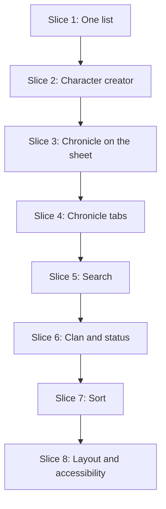

# Plan: Roster Redesign

**Created**: 2026-10-06
**Branch**: `feat/roster-redesign`
**Status**: implemented
**Gherkin persistence**: features
**Spec**: `docs/specs/roster-redesign.md`
**Design**: Figma `TAvjmr6RE0rHV8kz56Ffs0`, frame `31:813`

## Goal

Rebuild the roster as the character library of Figma frame `31:813`: page introduction,
chronicle tabs, search, clan filter, status filter, sort, one bordered list holding
characters, builds in progress and unreadable records, and a Character creator card.
Deleting is removed from the app. The sheet's edit mode gains a Chronicle field so every
character can be placed in a chronicle. Stored records do not change shape and neither
store changes.

All eight slices ship in one PR. Every step leaves the suite green and the roster usable
at every width; the page only matches the frame once Slice 8 is done.

## Approach stance (decision defaults)

| Axis | Stance |
| --- | --- |
| Scope | The roster page, one Chronicle field in the sheet's edit mode, and one sentence on the builder's "build could not be read" notice that tells the player to delete (it would point at a control that no longer exists). Nothing else in the sheet or builder. No timestamps, sect, session, settings icon or "Pick up where you left off" |
| Replace vs. merge | The roster's markup and script are replaced in place. Stored data is preserved byte for byte. `global.css` keeps every existing token; two are added |
| Format fidelity | The three new Figma icons are kept as SVG files, not redrawn or rasterised |
| Migrate vs. edit in place | `src/pages/index.astro` and `src/scripts/roster.ts` are rebuilt where they are; no parallel page |
| Integration | **Non-default.** Feature branch and PR with auto-merge off: the repository has no CI and the owner reviews and merges. The PR body carries the output of the five gate commands and the commit list. `.claude/CLAUDE.md` and `.claude/worktrees/` are left out of every commit |

## Acceptance Criteria

Copied from the spec in short form; ticked by the operator at PR review. The slice that
covers each one is in brackets; "existing" means a scenario outside this plan, named
under "Existing scenarios".

- [ ] 1. At 1512px the roster matches frame `31:813` apart from the listed omissions, the sort wording and the recorded deviations; side-by-side attached to the PR [8.3]
- [ ] 2. Exactly one `h1`, "Characters"; no colour or typeface value outside the `global.css` tokens [8]
- [ ] 3. The three new icons are SVG files from Figma; nothing is loaded from another origin [1.1, existing]
- [ ] 4. A full character shows monogram, name, Clan · Generation · Concept, Nature / Demeanor and chronicle [1]
- [ ] 5. Unnamed character, "Unassigned", and blank lines left out [1]
- [ ] 6. "Open sheet" opens play mode, "Edit character" opens edit mode; both are named for the character [1]
- [ ] 7. A build in progress is in the same list, marked "In progress", with "Continue" only [1, existing]
- [ ] 8. An unreadable record is listed with its explanation, no action, and hides nothing [1, existing]
- [ ] 9. A name containing markup is shown as text [1, existing]
- [ ] 10. The Player name appears nowhere [1]
- [ ] 11. No Delete control and no delete dialog [1]
- [ ] 12. No interaction on the roster removes a stored record [1, 7]
- [ ] 13. No chronicle anywhere: only the "All characters" tab [4]
- [ ] 14. One tab per chronicle, alphabetical, "Unassigned" last when it has entries [4]
- [ ] 15. Spellings that differ only by case or surrounding space are one chronicle, shown as the oldest entry spells it [4]
- [ ] 16. A tab lists only its chronicle; tab counts ignore the other filters [4, 5]
- [ ] 17. A selected chronicle that has emptied returns the selection to All characters [4]
- [ ] 18. Search narrows as typed over name, clan and concept, ignoring case and accents [5]
- [ ] 19. The clan filter lists "All clans" and each clan present, alphabetically [6]
- [ ] 20. "Ready to play" lists characters only; both status counts are for the selected tab [6]
- [ ] 21. Sort offers Newest first (default), Oldest first, Name A–Z, Clan A–Z [7]
- [ ] 22. Tab, clan, status and search combine with AND [5, 6]
- [ ] 23. Nothing matching shows "No characters match." and "Clear filters", which keeps the tab [5, 6]
- [ ] 24. The summary row's "Showing X of Y characters" and chronicle breakdown are correct [4, 5]
- [ ] 25. ⌘K / Ctrl+K focuses search; the hint shows the platform's combination [5]
- [ ] 26. Reloading resets every filter [7]
- [ ] 27. "Start character creator" opens a new build; "Start with a blank sheet" opens a new sheet in edit mode [2, existing]
- [ ] 28. A refused create shows the existing message and stays on the roster [2]
- [ ] 29. Storage unavailable: existing message, both create actions disabled [2, existing]
- [ ] 30. Nothing stored: empty message, no tabs or browsing controls, creator card shown [1, 7, existing]
- [ ] 31. A page restored from the back/forward cache lists what was created since [1]
- [ ] 32. The sheet's edit mode offers Chronicle; play mode is unchanged [3]
- [ ] 33. From 1200px the creator is beside the library; narrower it is above, compact [8]
- [ ] 34. At 320px no horizontal scroll; every entry's name, summary and actions visible [8]
- [ ] 35. Every control keyboard operable, visibly focused and named; selected tab and status exposed [4, 6, 8]
- [ ] 36. A filter change announces the resulting count without moving focus [5, 6]
- [ ] 37. The automated accessibility check passes with characters, a build, an unreadable record and a chronicle [8]
- [ ] 38. Stored records are byte-identical unless the player edits them [1, 3, 7]
- [ ] 39. Existing scenarios pass, with the retirements and rewordings listed under "Existing scenarios" [every step]
- [ ] 40. `npm run test`, `test:e2e`, `lint`, `typecheck` and `build` pass [8.3]

## Design reference

Values read from Figma (`get_design_context` on `31:813`, 2026-10-06).

| Frame value | Used as |
| --- | --- |
| Page `#0b0c0f`, surface `#17161a`, edge `#2a1f24`, divider `#343438` | `--color-page`, `--color-surface`, `--color-line`, `--color-divider` |
| Text `#e7e1d5`, strong `#f6f0e6`, muted `#a5a39f` | `--color-text`, `--color-text-strong`, `--color-muted` |
| Primary button `#b6474c`; overline and "In progress" `#e58c8d` | `--color-accent`, `--color-accent-text` |
| Selected tab underline `#c4a78f`; selected status `#302024`; unselected status `#202125` | `--color-focus`, `--color-selected`, `--color-control` |
| Title 40px Cormorant semibold | new token `--text-display: 2.5rem` |
| Entry name 28px Cormorant semibold; creator title 29px Cormorant | `--text-figure` (the 1px difference is dropped) |
| Body 13px, small 12px, caption 11px | `--text-body`, `--text-small`, `--text-caption` |
| Heading row and overline 10px | new token `--text-overline: 0.625rem` |
| Gutters 32px, workspace gap 24px, list-to-tools gap 16px, creator 320px | `--page-gutter`, `--space-4`, `--space-3`, `--side-column` |
| Entry: identity row 86px, monogram 48×52, metadata row indented 80px | lengths written in `roster.css` from the spacing tokens |

Icons (SVG, fetched from Figma on 2026-10-06 into the session scratchpad `icons/`; the
asset URLs expire in seven days, so Step 1.1 commits all three): `search.svg` (16),
`chevron-down.svg` (12), `arrow-right.svg` (12). `diamond.svg` and `pencil.svg` exist.

**Recorded deviations from the frame.**

- Card radius stays `--radius-card` (10px, frame 8px) and control borders stay
  `--color-border-control` (the frame uses the decorative edge), as on the sheet.
- The tinted background of the frame's first entry marks "last opened", which is out of
  scope, so every entry sits on the page colour.
- Every control keeps a target of at least 24px, which pads the frame's 13px text links;
  below 48rem an entry's actions are at least 32px tall.
- The creator's stage descriptions are 11px (`--text-caption`), not the frame's 10px:
  they are sentences. 10px is kept for the two uppercase labels only, which are written
  in sentence case and upper-cased by CSS.
- The sort control is a native select drawn as a box with its "Sort by" label beside it, and
  its first option is "Newest first"; the frame shows plain text and "Recently updated".
- The frame's third summary item (sect), the "Updated …" times, the "Last opened" mark, the
  settings icon, the "Saved just now" badge, the creator's hint line and the "Pick up where
  you left off" card are not drawn: the data or the feature is out of scope.
- The selected status label is semibold as well as tinted, so selection does not rest on
  two near-identical fills.

## Module layout

| Module | Role |
| --- | --- |
| `src/domain/v20/text.ts` (+ test) | `folded(text)` (trimmed, lower-cased, accents removed) is the rule for search and sorting; `caseFolded(text)` (trimmed, lower-cased, accents kept) is the rule for chronicles, clans and repeated names, per the spec. `monogram` in `identity.ts` reuses the accent stripping |
| `src/domain/v20/library.ts` (+ test) | The pure library model; imports nothing from `src/storage/`. See below |
| `src/domain/v20/identity.ts` | Gains `buildSummary(clan, concept)` beside `identitySummary`, sharing its joiner |
| `src/scripts/roster.ts` | Entry point. `load()` reads both stores once into entries; `render()` draws `view(entries, filter)`; the two create handlers |
| `src/scripts/roster/entries.ts` | Draws one entry by cloning a `<template>` and filling named slots with text |
| `src/scripts/roster/tabs.ts` | The tab strip: its DOM, and a pure `nextTab(key, index, count)` with a unit test |
| `src/scripts/roster/controls.ts` | Search, clan, status, sort and the shortcut. One-way contract: `roster.ts` calls `sync(view, filter)`; a control calls `onChange(patch)` |
| `src/scripts/roster/announce.ts` | The live region: waits, clears, then writes |
| `src/components/roster/EntryTemplates.astro` | Three `<template>`s (character, build, unreadable), so icons resolve through Astro. No `id` inside a template |
| `src/components/roster/LibraryTools.astro` | Search, clan filter, status filter, sort control |
| `src/components/roster/CharacterCreator.astro` | The creator card |
| `src/styles/roster.css` (+ `roster.css.test.ts`) | Everything roster-specific; `.roster > li` leaves the shared card rule in `global.css` (`dialog` stays, the builder uses it). The test fails on a raw colour or font family |
| `features/steps/library.steps.ts`, `library-filters.steps.ts`, `library-layout.steps.ts` | Steps for the new scenarios. `support/pages.ts` keeps `rosterEntries` and `buildEntries` as the one place that knows the list's markup; `support/seed.ts` seeds characters and builds with explicit, strictly ascending ids |

**`library.ts`.**

- `LibraryEntry` is a discriminated union. `character` and `build` carry `id`, `name`
  (as displayed), `monogram`, `summary`, `temperament`, `chronicle`, `clan`, `concept`
  `chronicleLabel` (the chronicle as typed, or "Unassigned" when blank) and the folded `chronicleKey` and `clanKey`. `unreadable-character` and
  `unreadable-build` carry only `kind` and `id`, so no filter can match text they do not
  have.
- `entriesOf(records)` takes what the two stores returned, as plain structures, and
  returns entries oldest first. A record that cannot be turned into an entry becomes
  unreadable instead of failing the rest. Repeated display names of the same kind are
  numbered in creation order ("Unnamed character", "Unnamed character 2"), skipping a
  number another entry already uses, as builds are today; this replaces `numbered()` in the script.
- `view(entries, filter)` is the only query the script calls. It returns `tabs`
  (key, label, count), the resolved `tab`, `clans`, `statusCounts`, `shown` (filtered,
  then sorted), `countsLine`, `breakdown` and `state` (`entries`, `empty`, `no-match`).
  It grows slice by slice; from Step 1.2 it exists and passes entries through.
- `LibraryFilter`, `INITIAL_FILTER`, `ORDERS` and `clearedFilter(filter)`.

### Design rules that hold across every slice

1. **Load once, render often.** `load()` runs at start-up and nowhere else. `render()`
   is a pure redraw from `(entries, filter)` and runs on every filter change. A page
   restored from the back/forward cache reloads itself, as the sheet already does, so
   there is no second path that re-reads storage and no stale filter to reconcile.
2. **The model decides, the script draws.** No comparison, match, count, numbering or
   ordering is written in `src/scripts/`; the script calls `entriesOf` and `view`.
3. **Text only.** Stored text reaches the page through `textContent` or an attribute
   setter. `innerHTML` is not used.
4. **Roster modules do not touch the page when imported.** `entries.ts`, `tabs.ts`, `controls.ts` and `announce.ts` are given their elements by `roster.ts`, so their pure parts can be unit-tested without a browser.
5. **Focus is never lost to a redraw.** Tabs and controls are built once in `load()` and
   keep their nodes; `render()` replaces only the entries. The one control a redraw
   removes is "Clear filters": activating it moves focus to the search field.
6. **Controls show the state the script holds.** `sync` writes the filter into the
   controls on every render, and the search field and both selects carry
   `autocomplete="off"`, so a browser that restores form values cannot show a filter
   that is not applied.
7. **The list keeps its name.** It stays a list named "Characters" whose items are the
   entries, so existing helpers keep finding it. A build's item carries the text
   "In progress"; `buildEntries` filters on that. Each entry's name is a level 3 heading.
8. **Tabs are a tablist over one panel.** `role="tablist"` with roving focus, arrow keys
   that wrap, Home and End, and selection following focus. Every tab has an id and
   `aria-controls` the one `role="tabpanel"`, which wraps the list card (entries, empty
   state, no-match state, summary row) and is `aria-labelledby` the selected tab. In a
   tab's label the "·" is hidden from assistive technology and the count follows a
   visually hidden comma; the status labels are written the same way. When the tabs
   are hidden (empty library, storage withheld) the panel carries neither the role nor
   the label. A chronicle whose name equals a special tab's label is shown
   in quotation marks.
9. **Status is a pair of radios.** A `fieldset` named "Status" holding two native radio
   inputs drawn as segments: one tab stop, arrow keys, and one is always selected.
10. **One live region, present from load.** A visually hidden `role="status"` element
   with `aria-atomic="true"` is in the page markup; it is never `hidden`. `announce.ts`
   writes to it 400ms after the last filter change made by the player, clearing it
   first so a repeated text is spoken again. It says the counts line; in the no-match
   state it says "No characters match." first; after a sort change it says
   "Sorted by <order>.". The first render writes nothing. The visible summary row is
   not a live region.
11. **`hidden` is content logic.** Blank lines, the empty state, the no-match state and
    the browsing controls of an empty library are hidden with the `hidden` attribute.
12. **Reading order is the DOM order.** After the tabs come the creator card and then the
    library, at every width; the wide layout places the card in the second grid column.
    CSS `order` is not used. The creator card and the library are labelled sections
    with level 2 headings ("A new story begins." and a visually hidden "Library").
13. **Phone first.** Each step's CSS is written for 320px and widened with the two
    breakpoints the sheet uses (48rem, 75rem), so the existing "fits a phone" scenario
    passes at every step.
14. **No stored field is touched.** Nothing in `src/storage/` changes; the roster never
    calls `save` or `delete`.

### Scenarios that were not yet built (historical)

Step 8.3 removed this mechanism: no scenario is tagged and the `tags` option is gone. It is
kept as a record of how the slices were gated. `playwright.config.ts` failed the run when a scenario has a step nobody has defined, and
the approved scenarios are exported for all eight slices at once. Step 1.1 therefore
tags every exported scenario `@pending` and adds `tags: 'not @pending'` to
`defineBddConfig`. Each step removes the tag from exactly the scenarios it binds, and
Step 8.3 checks that no tag is left and removes the option. From Step 1.1 on, the files
in `features/roster-redesign/` are edited by hand and are not re-exported.

Where an existing step already says the same thing in other words, the exported scenario
is edited to the existing wording at binding time rather than gaining a second
definition.

## Existing scenarios

`features/v20-character-sheet/`, `features/character-builder/` and
`features/sheet-play-view-redesign/` are edited by hand and must not be re-exported from
their plans. A scenario is retired only in the step that lands its replacement.

**Retired in Step 1.3 (8 scenarios and one example row)**

| Old scenario | Replaced by |
| --- | --- |
| Delete a character › Confirmed deletion | Nothing on the roster deletes |
| Delete a character › Cancelled deletion | Nothing on the roster deletes |
| Delete a character › The confirmation names the character | Nothing on the roster deletes |
| Delete a character › Deleting the last character | Nothing on the roster deletes; the existing "Empty roster invites creation" already covers the empty state |
| Builds on the roster › Deleting a build asks first, and cancelling keeps it | Nothing on the roster deletes |
| Builds on the roster › Confirming the delete removes only that build | Nothing on the roster deletes |
| Builds on the roster › An unreadable build can be deleted by the player | Nothing on the roster deletes |
| Storage resilience › The player can remove an unreadable record | Nothing on the roster deletes; the existing "An unreadable record is kept" stays |
| Layout verification › accessibility outline, example row `delete confirmation` | Row removed with its step case |

`features/v20-character-sheet/slice-5-delete-a-character.feature`,
`features/steps/roster-delete.steps.ts` and the delete helpers in `support/pages.ts` are
deleted in Step 1.3.

**Retired in Step 1.4**

| Old scenario | Replaced by |
| --- | --- |
| Builds on the roster › No builds, no builds list | A build in progress is listed with characters (there is no separate list to be absent) |

**Reworded**

| Scenario | Change | Step |
| --- | --- | --- |
| Start a build › (unreadable build notice) | `a link to the roster to delete it or build a new one` becomes `a link to the roster to build a new one` | 1.3 |
| Start a build › A build deleted in another tab is not saved again | "deleted from the roster in another tab" becomes "removed in another tab"; the step already removes it from storage directly | 1.3 |
| Builds on the roster › Two unnamed builds can be told apart | The "delete controls" line is dropped | 1.3 |
| Character roster › Roster shows identifying details | Then becomes `the entry shows "Lucita" and "Lasombra"` and `the entry does not show "Ana"` | 1.4 |
| Builds on the roster › A build started from the roster is listed as in progress | Thens become `the roster lists "Unnamed build" as in progress`; the "no characters yet" line is dropped, since a build is an entry | 1.4 |
| Builds on the roster › A build in progress is listed apart from characters | Renamed "…is listed with characters"; Thens become `the roster lists "Lucita"` and `the roster lists "Beckett" as in progress with clan "Gangrel"` | 1.4 |
| Builds on the roster › A build name is shown as plain text | Then becomes `the roster lists the text "<b>Beckett</b>"` | 1.4 |
| Builds on the roster › An unreadable build does not hide anything else | Thens name the one list: `the roster lists "Lucita"`, `"Beckett" as in progress` and one unreadable build | 1.4 |
| Builds on the roster › Creating a blank character leaves builds alone | Then becomes `the roster still lists "Beckett" as in progress` | 1.4 |
| Play and edit modes › Entering edit mode makes the identity editable | "Name, Clan, Generation, Concept, Nature and Demeanor can be edited" gains Chronicle; "no field for Player, Chronicle or Sire" becomes "no field for Player or Sire" | 3.1 |
| Play and edit modes › Values in hidden fields survive saving in either mode | Chronicle leaves the list of hidden fields in the title and the Given | 3.1 |

**Adapted (step definitions only, wording unchanged)**: every scenario that opens a
character from the roster (the name is text, so helpers follow "Open sheet"), continues a
build, or counts characters and builds (Step 1.4, including the roster state of the
layout verification outline and its count of controls on a phone); every scenario that
creates a character or a build from the roster ("New V20 character" becomes "Start with a
blank sheet", "Build a character" becomes "Start character creator"; Step 2.1); the
storage-unavailable scenarios, whose create actions stay focusable (Step 2.2); steps that
address entries by position once the default order is newest first (Step 7.2).

**Left as they are, deliberately.** The sheet's and builder's not-found notices still say
a record "may have been deleted". That remains true of another browser tab or cleared
site data, and neither sentence tells the player to do anything.

## Slices

### Slice 1: One list of everything stored

**Depends-on:** none

**Behavior:**

```gherkin
Feature: The character library lists everything stored

  Scenario: A character is listed with its identity
    Given a saved character "Éloïse Voss" of clan "Toreador", generation "10", concept "Antiquarian", nature "Visionary", demeanor "Bon Vivant" and chronicle "The Glass City"
    When the player opens the roster
    Then the entry for "Éloïse Voss" shows the monogram "EV"
    And it shows "Toreador · 10th generation · Antiquarian"
    And it shows "Visionary / Bon Vivant" under "Nature / Demeanor"
    And it shows the chronicle "The Glass City"
    And it is not marked "In progress"

  Scenario: A character with nothing filled in
    Given a saved character with nothing filled in
    When the player opens the roster
    Then the entry is named "Unnamed character"
    And its monogram is empty
    And it shows the chronicle "Unassigned"
    And it shows no summary line and no "Nature / Demeanor" label

  Scenario: Only the details that are filled in are shown
    Given a saved character named "Lucita" with nature "Visionary" and a chronicle of three spaces
    When the player opens the roster
    Then the entry for "Lucita" shows "Visionary" under "Nature / Demeanor"
    And it shows no "/"
    And it shows no summary line
    And it shows the chronicle "Unassigned"

  Scenario: Open sheet shows the character ready to play
    Given saved characters "Lucita" and "Fatima"
    When the player opens the roster
    And they follow "Open sheet" for "Fatima"
    Then the sheet for "Fatima" is shown in play mode

  Scenario: Edit character opens the sheet for editing
    Given saved characters "Lucita" and "Fatima"
    When the player opens the roster
    And they follow "Edit character" for "Fatima"
    Then the sheet for "Fatima" is shown in edit mode

  Scenario: Each entry's actions are named for its character
    Given saved characters "Lucita" and "Fatima"
    When the player opens the roster
    Then the open and edit actions of the two entries have four different accessible names
    And each name includes its character's name

  Scenario: Two unnamed characters can be told apart
    Given two saved characters with nothing filled in, one created after the other
    When the player opens the roster
    Then the older entry is named "Unnamed character" and the newer "Unnamed character 2"
    And their open and edit actions have four different accessible names

  Scenario: A build in progress is listed with characters
    Given a saved character named "Lucita"
    And a build in progress named "Beckett" of clan "Gangrel", concept "Wanderer", nature "Loner", demeanor "Scholar" and chronicle "The Glass City"
    When the player opens the roster
    Then the roster lists "Lucita"
    And the roster lists "Beckett" as in progress with clan "Gangrel"
    And the entry for "Beckett" shows the monogram "B", "Gangrel · Wanderer", "Loner / Scholar" and the chronicle "The Glass City"
    And the entry for "Beckett" offers "Continue" and neither "Open sheet" nor "Edit character"

  Scenario: A build on its own is not an empty library
    Given a build in progress named "Beckett"
    When the player opens the roster
    Then the roster lists "Beckett" as in progress
    And the message that there are no characters yet is not shown

  Scenario: An unreadable character is listed without actions
    Given a saved character named "Lucita"
    And a saved character whose data has been damaged
    When the player opens the roster
    Then the roster lists "Lucita"
    And the roster lists one unreadable character with an explanation that includes its record's id
    And the unreadable entry offers no action
    And the damaged data is exactly as it was

  Scenario: An unreadable record on its own is not an empty library
    Given a saved character whose data has been damaged
    When the player opens the roster
    Then the roster lists one unreadable character
    And the message that there are no characters yet is not shown

  Scenario: Stored text is shown as text
    Given a saved character named "<b>Lucita</b>" of clan "<i>Lasombra</i>" with chronicle "<u>Milan</u>"
    When the player opens the roster
    Then the entry shows the text "<b>Lucita</b>", "<i>Lasombra</i>" and "<u>Milan</u>"
    And the entry contains no bold, italic or underlined element

  Scenario: The player's name is not shown
    Given a saved character named "Lucita" of clan "Lasombra" played by "Ana"
    When the player opens the roster
    Then "Ana" appears nowhere on the page

  Scenario: Nothing on the roster deletes
    Given a saved character, a build in progress, an unreadable character and an unreadable build
    When the player opens the roster
    Then no control on the page has "delete" or "remove" in its accessible name
    And the page contains no dialog

  Scenario: Opening a sheet and coming back leaves what is stored untouched
    Given a saved character, a build in progress, an unreadable character and an unreadable build
    When the player opens the roster
    And they open the character's sheet and come back
    Then every stored record is exactly as it was

  Scenario: The list counts what it shows
    Given a saved character, a build in progress and an unreadable build
    When the player opens the roster
    Then the summary row reads "Showing 3 of 3 characters"

  Scenario: A restored page shows what was created since
    Given the player has the roster open with one saved character
    And a second character is saved from another page
    When the roster is restored from the browser's back and forward cache
    Then the roster lists 2 entries
```

**Steps:**

#### Step 1.1: Scenarios, gate and icons

**Complexity**: trivial
**IMPLEMENT**: Commit the spec, this plan and the exported `features/roster-redesign/` files with every scenario tagged `@pending`; add `tags: 'not @pending'` to `defineBddConfig`; copy the three Figma icons into `src/assets/icons/`.
**TEST**: `npm run test:e2e` generates no scenario from `features/roster-redesign/` and the existing suite is green.
**REFACTOR**: None needed beyond confirming the config comment explains the tag.
**Files**: `docs/specs/roster-redesign.md`, `plans/roster-redesign.md`, `features/roster-redesign/*.feature`, `playwright.config.ts`, `src/assets/icons/search.svg`, `src/assets/icons/chevron-down.svg`, `src/assets/icons/arrow-right.svg`
**Commit**: `docs: roster redesign spec, plan and scenarios`

#### Step 1.2: Library entries in the model

**Complexity**: standard
**IMPLEMENT**: `text.ts` with `folded`; `library.ts` with the `LibraryEntry` union, `entriesOf`, `LibraryFilter`, `INITIAL_FILTER` and a `view` that passes every entry through oldest first with `state` and a `countsLine` built from the pair (shown, stored); `buildSummary` in `identity.ts`.
**TEST**: Unit tests: a full character; a blank one (name falls back, monogram empty); a character with only a nature; a chronicle of spaces; a build (summary without generation); an unreadable record of each kind carrying only its id; a record that throws while being read becomes unreadable and the rest survive; repeated names numbered per kind in creation order, including two characters sharing a real name, and a number skipped when another entry already carries that numbered name; `countsLine` for zero, one and several entries and for fewer shown than stored; `state` empty versus entries.
**REFACTOR**: `identity.ts`'s joiner is the single place that drops blank parts, and `monogram` takes its accent stripping from `text.ts`.
**Files**: `src/domain/v20/text.ts`, `src/domain/v20/text.test.ts`, `src/domain/v20/library.ts`, `src/domain/v20/library.test.ts`, `src/domain/v20/identity.ts`, `src/domain/v20/identity.test.ts`
**Commit**: `feat(domain): library entries for characters, builds and unreadable records`

#### Step 1.3: Delete leaves the roster

**Complexity**: standard
**IMPLEMENT**: On the roster as it stands, remove every Delete button, the delete dialog and both delete handlers, for characters, builds and unreadable records. The builder's unreadable-build notice drops "delete it or".
**TEST**: Bind "Nothing on the roster deletes". Retire the eight scenarios and the example row, and reword the three, as listed. Full suite green.
**REFACTOR**: Delete `roster-delete.steps.ts`, the delete helpers and every style and step left without a user.
**Files**: `src/pages/index.astro`, `src/pages/build.astro`, `src/scripts/roster.ts`, `src/styles/global.css`, `features/roster-redesign/*.feature`, `features/steps/library.steps.ts`, `features/steps/roster-delete.steps.ts`, `features/steps/builder-roster.steps.ts`, `features/steps/builder-settings.steps.ts`, `features/steps/storage-resilience.steps.ts`, `features/steps/layout-a11y.steps.ts`, `features/steps/support/pages.ts`, `features/v20-character-sheet/slice-5-delete-a-character.feature`, `features/v20-character-sheet/slice-6-storage-resilience.feature`, `features/v20-character-sheet/slice-7-sheet-layout-responsiveness-and-accessibility-verification.feature`, `features/character-builder/slice-1-start-a-build-with-creation-settings.feature`, `features/character-builder/slice-3-builds-on-the-roster.feature`
**Commit**: `feat(roster)!: remove deleting characters and builds`

#### Step 1.4: One list in the frame's structure

**Complexity**: complex
**IMPLEMENT**: Rebuild `index.astro`: the introduction, then one list card holding the heading row, the "Characters" list and the summary row, with the empty state in its place when nothing is stored. `EntryTemplates.astro` and `entries.ts` draw the three kinds; `roster.ts` becomes `load()` and `render()` over `entriesOf` and `view`, and reloads on a restored page. The Player detail and the "Builds in progress" section are removed; the two create buttons stay as they are until Slice 2. `roster.css` written phone first; `.roster > li` leaves the shared card rule; `--text-display` and `--text-overline` added.
**TEST**: Bind the remaining Slice 1 scenarios; the restored-page step dispatches a `pageshow` event marked as persisted, since the test browser does not keep a back/forward cache. Retire and reword the scenarios listed for this step; helpers open a character through "Open sheet" and find builds by their "In progress" mark. The Files list is not exhaustive: every use of `rosterEntries` and `buildEntries` under `features/steps/` is checked. `roster.css.test.ts` fails on a raw colour or font family. Full suite green.
**REFACTOR**: A typed `slot(root, name)` helper that throws on a missing slot; templates looked up exhaustively by entry kind.
**Files**: `src/pages/index.astro`, `src/scripts/roster.ts`, `src/scripts/roster/entries.ts`, `src/components/roster/EntryTemplates.astro`, `src/styles/roster.css`, `src/styles/roster.css.test.ts`, `src/styles/global.css`, `features/roster-redesign/*.feature`, `features/steps/library.steps.ts`, `features/steps/roster.steps.ts`, `features/steps/builder-roster.steps.ts`, `features/steps/builder-settings.steps.ts`, `features/steps/builder-finish.steps.ts`, `features/steps/builder-whole.steps.ts`, `features/steps/play-modes.steps.ts`, `features/steps/live-resources.steps.ts`, `features/steps/layout-a11y.steps.ts`, `features/steps/storage-resilience.steps.ts`, `features/steps/sheet-header.steps.ts`, `features/steps/support/pages.ts`, `features/steps/support/seed.ts`, `features/steps/support/builder.ts`, `features/v20-character-sheet/slice-1-create-and-list-characters.feature`, `features/character-builder/slice-3-builds-on-the-roster.feature`
**Commit**: `feat(roster): characters and builds in one library list`

### Slice 2: Character creator

**Depends-on:** 1

**Behavior:**

```gherkin
Feature: Character creator

  Scenario: The creator card explains what building involves
    Given a player with no saved characters
    When they open the roster
    Then the Character creator card is headed "A new story begins."
    And it names the stages "Concept & clan", "Traits & disciplines" and "Finishing touches"
    And it offers "Start character creator" and "Start with a blank sheet"

  Scenario: Starting the character creator opens a new build
    Given a player with no saved characters
    When they choose "Start character creator"
    Then the builder is shown
    And the roster lists "Unnamed build" as in progress

  Scenario Outline: A refused create keeps the player on the roster
    Given a browser that refuses to store anything new
    When they choose "<action>"
    Then they see "<message>"
    And they are still on the roster
    And the roster lists no entries

    Examples:
      | action                   | message                                                                 |
      | Start character creator  | The new build could not be saved. This browser refused to store it.     |
      | Start with a blank sheet | The new character could not be saved. This browser refused to store it. |

  Scenario: A second refusal is announced again
    Given a browser that refuses to store anything new
    When they choose "Start with a blank sheet" twice
    Then the refusal has been announced twice

  Scenario: Without storage the library says so and offers nothing to do
    Given a browser that withholds storage from the page
    When they open the roster
    Then they see the storage unavailable message
    And the message that there are no characters yet is not shown
    And both create actions are disabled, can still be focused and are described by the message
    And choosing either create action leaves them on the roster
    And no tabs, search field, clan filter, status filter or sort control are shown

  Scenario: An empty library offers no browsing controls
    Given a player with no saved characters or builds
    When they open the roster
    Then they see "No characters yet. Create one to get started."
    And no tabs, search field, clan filter, status filter, sort control, heading row or summary row are shown
    And the Character creator card is shown
```

The last scenario stays `@pending` until Step 7.2, when the last of the controls it names
exists; it lives in this feature because this one seeds nothing before each scenario.

**Steps:**

#### Step 2.1: The creator card starts builds and blank sheets

**Complexity**: standard
**IMPLEMENT**: `CharacterCreator.astro`: a labelled section with the overline, the level 2 title, description, three stages and the primary "Start character creator" and secondary "Start with a blank sheet" buttons (pencil icon). It comes before the library in the page and sits in the second column from 75rem; below that its stages are hidden. The buttons take over today's handlers; the old action row is removed.
**TEST**: Bind the first two scenarios. Every helper that created a character or a build through the old button names uses the new ones; the existing scenarios for creating a blank character and for edit mode on a new character pass unchanged. Full suite green.
**REFACTOR**: The two create handlers share one function that takes the store call, the failure message and the address.
**Files**: `src/components/roster/CharacterCreator.astro`, `src/pages/index.astro`, `src/scripts/roster.ts`, `src/styles/roster.css`, `features/roster-redesign/*.feature`, `features/steps/library.steps.ts`, `features/steps/roster.steps.ts`, `features/steps/builder-settings.steps.ts`, `features/steps/support/pages.ts`, `features/steps/support/builder.ts`
**Commit**: `feat(roster): character creator card`

#### Step 2.2: When storage refuses or is withheld

**Complexity**: standard
**IMPLEMENT**: A refusal clears the status message and writes it on the next frame, so a repeat is announced; this is done in `roster.ts` around the shared `showStatus`, which is left as it is for the sheet and builder. With storage withheld the list card is hidden, and the two create buttons carry `aria-disabled="true"` and `aria-describedby` the message instead of `disabled`, and ignore activation.
**TEST**: Bind the three remaining scenarios except the empty-library one; the existing storage-unavailable scenarios pass with their steps unchanged or adapted as listed. Full suite green.
**REFACTOR**: The script picks what the list card shows in one place: unavailable when storage is withheld, otherwise the model's `view.state`. The model never learns about storage.
**Files**: `src/pages/index.astro`, `src/scripts/roster.ts`, `src/styles/roster.css`, `features/roster-redesign/*.feature`, `features/steps/library.steps.ts`, `features/steps/storage-resilience.steps.ts`, `features/steps/builder-settings.steps.ts`, `features/steps/support/storage.ts`
**Commit**: `feat(roster): refused and unavailable storage on the library`

### Slice 3: Chronicle on the sheet

**Depends-on:** 2

Sequencing only: this slice needs nothing from Slice 2, and stays in the chain so the
whole build runs in one working tree.

**Behavior:**

```gherkin
Feature: Chronicle on the sheet

  Scenario: A chronicle is written while editing
    Given a saved character named "Lucita"
    When the player edits "Lucita" and enters the chronicle "The Glass City"
    And they reload the sheet and edit it again
    Then the Chronicle field holds "The Glass City"

  Scenario: A stored chronicle is offered for editing
    Given a saved character named "Lucita" with chronicle "The Glass City"
    When the player edits "Lucita"
    Then the Chronicle field holds "The Glass City"

  Scenario: A chronicle can be cleared
    Given a saved character named "Lucita" with chronicle "The Glass City"
    When the player edits "Lucita" and clears the chronicle
    And they reload the sheet and edit it again
    Then the Chronicle field is empty

  Scenario: Play mode does not show the chronicle
    Given a saved character named "Lucita" with chronicle "The Glass City"
    When the player opens "Lucita" in play mode
    Then no Chronicle field is offered
    And "The Glass City" appears nowhere on the sheet

  Scenario: Looking at the edit fields changes nothing
    Given a saved character named "Lucita" with chronicle "The Glass City"
    When the player edits "Lucita" and leaves edit mode without typing
    Then every stored record is exactly as it was
```

**Steps:**

#### Step 3.1: Chronicle joins the edit-mode identity fields

**Complexity**: standard
**IMPLEMENT**: Add `chronicle` to `Identity.astro`'s editable fields, after Concept. It binds through the existing `data-text` path, so no script changes.
**TEST**: Bind the five scenarios in `sheet-header.steps.ts`. Reword the two play-view scenarios as listed and update the step text they share. Full suite green.
**REFACTOR**: Correct the comment that lists the header fields the sheet withholds.
**Files**: `src/components/sheet/Identity.astro`, `features/roster-redesign/*.feature`, `features/steps/sheet-header.steps.ts`, `features/steps/play-modes.steps.ts`, `features/sheet-play-view-redesign/slice-2-play-and-edit-modes-with-character-identity.feature`
**Commit**: `feat(sheet): chronicle is editable in edit mode`

### Slice 4: Chronicle tabs

**Depends-on:** 3

**Behavior:**

```gherkin
Feature: Chronicle tabs

  Scenario: Without chronicles there is one tab
    Given saved characters "Lucita" and "Fatima" with no chronicle
    When the player opens the roster
    Then the only tab is "All characters · 2"
    And the summary row shows no chronicle breakdown

  Scenario: Each chronicle has a tab
    Given saved characters in these chronicles
      | name    | chronicle      |
      | Lucita  | The Glass City |
      | Fatima  | The Glass City |
      | Anatole | Ashes of Milan |
      | Beckett |                |
    When the player opens the roster
    Then the tabs are "All characters · 4", "Ashes of Milan · 1", "The Glass City · 2", "Unassigned · 1"
    And "All characters · 4" is the selected tab
    And the list region is named by the selected tab

  Scenario: Unassigned is left out when every entry has a chronicle
    Given saved characters "Lucita" and "Fatima" in the chronicle "The Glass City"
    When the player opens the roster
    Then the tabs are "All characters · 2", "The Glass City · 2"

  Scenario Outline: One chronicle however it is spelled, shown as its oldest entry spells it
    Given saved characters, oldest first, in the chronicles <spellings>
    When the player opens the roster
    Then the tabs are "All characters · <count>", "<tab>"

    Examples:
      | spellings                                               | count | tab                |
      | "The Glass City", " the glass city ", "THE GLASS CITY"  | 3     | The Glass City · 3 |
      | " the glass city ", "The Glass City"                    | 2     | the glass city · 2 |

  Scenario: A tab lists only its chronicle
    Given saved characters "Lucita" in "The Glass City" and "Anatole" in "Ashes of Milan"
    When the player opens the roster
    And they select the tab "Ashes of Milan · 1"
    Then the roster lists only "Anatole"
    And "Ashes of Milan · 1" is the selected tab
    And the list region is named by the selected tab
    And the summary row reads "Showing 1 of 2 characters"

  Scenario: Builds and unreadable records are counted
    Given a saved character "Lucita" in the chronicle "The Glass City"
    And a build in progress named "Beckett" in the chronicle "The Glass City"
    And a saved character whose data has been damaged
    When the player opens the roster
    Then the tabs are "All characters · 3", "The Glass City · 2", "Unassigned · 1"

  Scenario: Unassigned lists what has no chronicle
    Given a saved character "Lucita" in the chronicle "The Glass City"
    And a saved character "Beckett" with no chronicle
    And a saved character whose data has been damaged
    When the player opens the roster
    And they select the tab "Unassigned · 2"
    Then the roster lists "Beckett" and one unreadable character and nothing else

  Scenario: A chronicle tab leaves unreadable records out
    Given a saved character "Lucita" in the chronicle "The Glass City"
    And a saved character whose data has been damaged
    When the player opens the roster
    And they select the tab "The Glass City · 1"
    Then the roster lists only "Lucita"

  Scenario: A chronicle given on the sheet moves the character to its tab
    Given a saved character named "Lucita" with chronicle "The Glass City"
    And a saved character named "Fatima" with no chronicle
    When the player edits "Fatima" and enters the chronicle "The Glass City"
    And they open the roster
    Then the tabs are "All characters · 2", "The Glass City · 2"

  Scenario: A restored page starts again from all characters
    Given saved characters "Lucita" in "The Glass City" and "Anatole" in "Ashes of Milan"
    And the player has selected the tab "Ashes of Milan · 1" on the roster
    And the chronicle of "Lucita" is cleared from another page
    When the roster is restored from the browser's back and forward cache
    Then the tabs are "All characters · 2", "Ashes of Milan · 1", "Unassigned · 1"
    And "All characters · 2" is the selected tab
    And the roster lists 2 entries

  Scenario Outline: Tabs are worked with the arrow, Home and End keys
    Given saved characters "Lucita" in "The Glass City" and "Anatole" in "Ashes of Milan"
    And the player has opened the roster and focused the tab "<from>"
    When they press "<key>"
    Then "<to>" is the selected tab and has focus
    And the roster lists <listed>

    Examples:
      | from               | key        | to                 | listed         |
      | All characters · 2 | ArrowRight | Ashes of Milan · 1 | only "Anatole" |
      | All characters · 2 | ArrowLeft  | The Glass City · 1 | only "Lucita"  |
      | All characters · 2 | End        | The Glass City · 1 | only "Lucita"  |
      | The Glass City · 1 | ArrowRight | All characters · 2 | 2 entries      |
      | The Glass City · 1 | Home       | All characters · 2 | 2 entries      |

  Scenario: The tab strip is one stop in the tab order
    Given saved characters "Lucita" in "The Glass City" and "Anatole" in "Ashes of Milan"
    And the player has opened the roster and focused the tab "All characters · 2"
    When they press "Tab"
    Then focus has left the tab strip

  Scenario Outline: The summary row describes the chronicles
    Given saved characters whose chronicles are <chronicles>
    When the player opens the roster
    Then the summary row also reads "<breakdown>"

    Examples:
      | chronicles                                                    | breakdown                          |
      | "The Glass City", "The Glass City", none                      | 2 in The Glass City · 1 unassigned |
      | "The Glass City", "Ashes of Milan", "Ashes of Milan", none    | 3 in 2 chronicles · 1 unassigned   |
      | "The Glass City", "The Glass City"                            | 2 in The Glass City                |

  Scenario: The chronicle breakdown does not follow the selected tab
    Given saved characters whose chronicles are "The Glass City", "The Glass City", none
    When the player opens the roster
    And they select the tab "Unassigned · 1"
    Then "Unassigned · 1" is the selected tab
    And the roster lists only "Unnamed character 3"
    And the summary row also reads "2 in The Glass City · 1 unassigned"
```

**Steps:**

#### Step 4.1: Chronicles in the model

**Complexity**: standard
**IMPLEMENT**: `view` returns `tabs` (All, each chronicle alphabetically by its folded name, Unassigned when it has entries and a chronicle exists), honours `filter.tab`, falls back to All when the tab is gone, and returns `breakdown` in its three forms.
**TEST**: Unit tests for each rule above; an empty library; builds and unreadable entries; the oldest spelling when the oldest is not the tidiest; a chronicle literally named "Unassigned" or "All characters" (its own chronicle, labelled in quotation marks); a tab key that no longer exists; `countsLine` when a tab shows fewer entries than are stored; the breakdown with zero, one and several chronicles and with no unassigned entries.
**REFACTOR**: Chronicle and clan grouping share one "group by folded key, keep the oldest spelling" function.
**Files**: `src/domain/v20/library.ts`, `src/domain/v20/library.test.ts`
**Commit**: `feat(domain): chronicle tabs for the library`

#### Step 4.2: The tab strip

**Complexity**: complex
**IMPLEMENT**: `tabs.ts` builds the strip once in `load()` per design rule 8, with the pure `nextTab`; selecting a tab patches the filter and renders. The list card becomes the tab panel. The summary row gains the breakdown. The strip is hidden in an empty library and scrolls within itself when it is wider than the screen.
**TEST**: Unit-test `nextTab` (wrap both ways, Home, End, a single tab). Bind the Slice 4 scenarios; tab steps match a tab by the text it shows, since its accessible name reads the count after a comma, and focus a tab without clicking it; one step asserts every tab's `aria-controls` is the panel's id. Full suite green.
**REFACTOR**: `tabs.ts` knows nothing about chronicles: it draws whatever `view.tabs` holds.
**Files**: `src/pages/index.astro`, `src/scripts/roster.ts`, `src/scripts/roster/tabs.ts`, `src/scripts/roster/tabs.test.ts`, `src/styles/roster.css`, `features/roster-redesign/*.feature`, `features/steps/library-filters.steps.ts`, `features/steps/support/seed.ts`, `features/steps/support/pages.ts`
**Commit**: `feat(roster): chronicle tabs`

### Slice 5: Search and the result count

**Depends-on:** 4

**Behavior:**

```gherkin
Feature: Search

  Background:
    Given these characters and builds, created in this order
      | kind      | name           | clan     | concept     | player | chronicle      |
      | character | Éloïse Voss    | Toreador | Antiquarian | Ana    | The Glass City |
      | character | Gabriel Ash    | Ventrue  | Fixer       | Bruno  | The Glass City |
      | character | Mara Delacroix | Brujah   | Agitator    | Ana    |                |
      | build     | Silas Reed     | Brujah   | Broker      |        | The Glass City |

  Scenario Outline: Search finds by name, clan or concept, ignoring case and accents
    When the player opens the roster
    And they search for "<text>"
    Then the roster lists only "<found>"

    Examples:
      | text    | found          |
      | eloise  | Éloïse Voss    |
      | VENTRUE | Gabriel Ash    |
      | agitat  | Mara Delacroix |

  Scenario: The list narrows while typing and returns when cleared
    When the player opens the roster
    And they type "g", then "a", in the search field
    Then the roster lists only "Gabriel Ash"
    When they clear the search field
    Then the roster lists 4 entries

  Scenario Outline: Search does not look at the player or the chronicle
    When the player opens the roster
    And they search for "<text>"
    Then the roster shows "No characters match."

    Examples:
      | text  |
      | Ana   |
      | Glass |

  Scenario: A search of only spaces matches everything
    When the player opens the roster
    And they search for "   "
    Then the roster lists 4 entries

  Scenario: Search works within the selected tab
    When the player opens the roster
    And they select the tab "The Glass City · 3"
    And they search for "x"
    Then the roster lists only "Gabriel Ash"
    And the summary row reads "Showing 1 of 4 characters"

  Scenario: Tab counts do not change while searching
    When the player opens the roster
    And they search for "eloise"
    Then the tabs are "All characters · 4", "The Glass City · 3", "Unassigned · 1"

  Scenario: An unreadable record is left out while searching
    Given a saved character whose data has been damaged
    When the player opens the roster
    And they search for "e"
    Then the roster lists no unreadable character
    When they clear the search field
    Then the roster lists one unreadable character

  Scenario Outline: The summary row counts what is shown
    When the player opens the roster
    And they search for "<text>"
    Then the summary row reads "<summary>"

    Examples:
      | text   | summary                   |
      | eloise | Showing 1 of 4 characters |
      | e      | Showing 4 of 4 characters |
      | zzz    | Showing 0 of 4 characters |

  Scenario: Clearing a search that matched nothing
    When the player opens the roster
    And they select the tab "The Glass City · 3"
    And they search for "zzz"
    Then the roster shows "No characters match." and offers "Clear filters"
    When they choose "Clear filters"
    Then the roster lists 3 entries
    And "The Glass City · 3" is the selected tab
    And the search field is empty and has focus

  Scenario: Nothing is announced until the player filters
    When the player opens the roster
    Then nothing has been announced

  Scenario Outline: A change is announced once the player pauses, without moving focus
    When the player opens the roster
    And they <change>
    Then "<announcement>" is announced once
    And focus is still on <control>

    Examples:
      | change                                | announcement                                    | control          |
      | type "eloise" in the search field     | Showing 1 of 4 characters                       | the search field |
      | type "zzz" in the search field        | No characters match. Showing 0 of 4 characters  | the search field |
      | select the tab "The Glass City · 3"   | Showing 3 of 4 characters                       | that tab         |

  Scenario: Clearing the filters is announced
    When the player opens the roster
    And they search for "zzz", pause, and then choose "Clear filters"
    Then "Showing 4 of 4 characters" is the last announcement

  Scenario: The same count is announced again
    When the player opens the roster
    And they search for "eloise", pause, and then search for "gabriel"
    Then "Showing 1 of 4 characters" has been announced twice

  Scenario Outline: The keyboard shortcut focuses search
    Given the browser reports the platform "<platform>"
    When the player opens the roster
    And they press "<keys>"
    Then focus <outcome> the search field
    And the hint beside the search field reads "<hint>"

    Examples:
      | platform | keys      | outcome   | hint   |
      | MacIntel | Meta+K    | is in     | ⌘ K    |
      | MacIntel | Control+K | is not in | ⌘ K    |
      | Win32    | Control+K | is in     | Ctrl K |
      | Win32    | Meta+K    | is not in | Ctrl K |

  Scenario: The search field is named for what it does
    When the player opens the roster
    Then the search field's accessible name is "Search characters"
    And its placeholder reads "Search by name, clan, or concept…"
```

**Steps:**

#### Step 5.1: Search in the model

**Complexity**: standard
**IMPLEMENT**: `view` honours `filter.search` against the folded name, clan and concept, combined with the tab, so `countsLine` follows the search too; `state` gains `no-match`; `clearedFilter` empties the search and keeps the tab.
**TEST**: Unit tests: match in each of the three fields and in none; case and accent folding both ways; a search of only spaces; search combined with a tab; an unreadable entry under an empty and a non-empty search; tab counts unchanged by search; `state` for entries, empty and no-match; `clearedFilter`.
**REFACTOR**: `view` filters through one named predicate per filter, so the next slice adds two more.
**Files**: `src/domain/v20/library.ts`, `src/domain/v20/library.test.ts`
**Commit**: `feat(domain): library search`

#### Step 5.2: The search field and the no-match state

**Complexity**: standard
**IMPLEMENT**: `LibraryTools.astro` with the search field (labelled "Search characters", the frame's placeholder, outside any form, `autocomplete="off"`); `controls.ts` patches the filter on every input event; the no-match state with "Clear filters", which moves focus to the search field. Hidden in an empty library.
**TEST**: Bind the scenarios up to "Clearing a search that matched nothing" and "The search field is named for what it does"; the typing step presses keys one at a time. Full suite green.
**REFACTOR**: The list card's state is chosen in one place from `view.state`.
**Files**: `src/components/roster/LibraryTools.astro`, `src/pages/index.astro`, `src/scripts/roster.ts`, `src/scripts/roster/controls.ts`, `src/styles/roster.css`, `features/roster-redesign/*.feature`, `features/steps/library-filters.steps.ts`, `features/steps/support/seed.ts`
**Commit**: `feat(roster): search the library`

#### Step 5.3: The announcement and the shortcut

**Complexity**: standard
**IMPLEMENT**: `announce.ts` and the live region per design rule 10, called from the filter-change path only. The shortcut: ⌘K on an Apple platform, Ctrl+K elsewhere, read from `navigator.userAgentData?.platform ?? navigator.platform`; ignored during text composition and left to the browser when focus is already in the search field; `aria-keyshortcuts` on the field. The hint is written by the script, hidden from assistive technology, hidden until written and hidden on a coarse pointer.
**TEST**: Bind the announcement and shortcut scenarios. The platform Given stubs both `navigator.userAgentData.platform` and `navigator.platform` before the page loads, so the host machine cannot decide the outcome. Announcement steps count writes to the live region by observing it and wait by polling, never by a fixed sleep. Full suite green.
**REFACTOR**: Platform detection is one function returning the key and the hint together.
**Files**: `src/pages/index.astro`, `src/scripts/roster.ts`, `src/scripts/roster/announce.ts`, `src/scripts/roster/controls.ts`, `src/components/roster/LibraryTools.astro`, `src/styles/roster.css`, `features/roster-redesign/*.feature`, `features/steps/library-filters.steps.ts`, `features/steps/support/announcements.ts`
**Commit**: `feat(roster): announce results and focus search from the keyboard`

### Slice 6: Clan and status filters

**Depends-on:** 5

**Behavior:**

```gherkin
Feature: Clan and status filters

  Background:
    Given these characters and builds, created in this order
      | kind      | name           | clan     | concept     | chronicle      |
      | character | Éloïse Voss    | Toreador | Antiquarian | The Glass City |
      | character | Gabriel Ash    | Ventrue  | Fixer       | The Glass City |
      | character | Mara Delacroix | Brujah   | Agitator    |                |
      | build     | Silas Reed     | Brujah   | Broker      | The Glass City |

  Scenario: The clan filter offers the clans present
    When the player opens the roster
    Then the clan filter offers "All clans", "Brujah", "Toreador", "Ventrue" in that order
    And "All clans" is chosen

  Scenario: Choosing a clan lists only that clan
    When the player opens the roster
    And they choose the clan "Brujah"
    Then the roster lists "Mara Delacroix" and "Silas Reed" and nothing else

  Scenario: Ready to play leaves builds out
    When the player opens the roster
    Then the status filter reads "All · 4" and "Ready to play · 3"
    And "All" is the selected status
    When they choose "Ready to play"
    Then the roster lists 3 entries and "Silas Reed" is not among them
    And "Ready to play" is the selected status

  Scenario: Status counts follow the selected tab
    When the player opens the roster
    And they select the tab "The Glass City · 3"
    Then the status filter reads "All · 3" and "Ready to play · 2"

  Scenario: Status and tab counts ignore the other filters
    When the player opens the roster
    And they search for "eloise"
    And they choose the clan "Toreador"
    And they choose "Ready to play"
    Then the status filter reads "All · 4" and "Ready to play · 3"
    And the tabs are "All characters · 4", "The Glass City · 3", "Unassigned · 1"

  Scenario Outline: Filters combine
    When the player opens the roster
    And they select the tab "<tab>"
    And they choose the clan "<clan>"
    And they choose "<status>"
    And they search for "<search>"
    Then the roster lists <listed>

    Examples:
      | tab                | clan      | status        | search | listed                |
      | The Glass City · 3 | Brujah    | All           |        | only "Silas Reed"     |
      | The Glass City · 3 | Brujah    | Ready to play |        | nothing               |
      | All characters · 4 | Brujah    | Ready to play |        | only "Mara Delacroix" |
      | The Glass City · 3 | All clans | Ready to play | gab    | only "Gabriel Ash"    |

  Scenario: Clear filters resets search, clan and status and keeps the tab
    When the player opens the roster
    And they select the tab "The Glass City · 3"
    And they choose the clan "Brujah"
    And they choose "Ready to play"
    And they search for "zzz"
    And they choose "Clear filters"
    Then the roster lists 3 entries
    And "The Glass City · 3" is the selected tab
    And the search field is empty, "All clans" is chosen and "All" is the selected status
    And the search field has focus

  Scenario Outline: An unreadable record shows only on the unfiltered list
    Given a saved character whose data has been damaged
    When the player opens the roster
    And they <narrow>
    Then the roster lists <unreadable>

    Examples:
      | narrow                              | unreadable                |
      | change nothing                      | one unreadable character  |
      | choose the clan "Toreador"          | no unreadable character   |
      | choose "Ready to play"              | no unreadable character   |

  Scenario Outline: A clan or status change is announced without moving focus
    When the player opens the roster
    And they <change>
    Then "<announcement>" is announced once
    And focus is still on <control>

    Examples:
      | change                    | announcement               | control          |
      | choose the clan "Brujah"  | Showing 2 of 4 characters  | the clan filter  |
      | choose "Ready to play"    | Showing 3 of 4 characters  | "Ready to play"  |

  Scenario: The status filter is worked from the keyboard
    When the player opens the roster
    And they focus the selected status and press the right arrow key
    Then "Ready to play" is the selected status and has focus
    When they press "Tab"
    Then focus has left the status filter
```

**Steps:**

#### Step 6.1: Clan and status in the model

**Complexity**: standard
**IMPLEMENT**: `view` returns `clans` (each distinct clan among readable entries in the oldest entry's spelling, alphabetical) and `statusCounts` for the selected tab; honours `filter.clan` and `filter.status`, all four filters with AND; falls back to all clans when the chosen clan is gone; `clearedFilter` also resets clan and status.
**TEST**: Unit tests: each filter alone and every pair; clans merged by spelling, sorted, and spelled as the oldest; entries with no clan appear only under all clans; an unreadable entry under each filter; status counts per tab and unaffected by clan and search; a clan key that no longer exists; `clearedFilter` keeping tab and sort.
**REFACTOR**: The four predicates are a list, applied in one pass.
**Files**: `src/domain/v20/library.ts`, `src/domain/v20/library.test.ts`
**Commit**: `feat(domain): clan and status filters for the library`

#### Step 6.2: The clan and status controls

**Complexity**: standard
**IMPLEMENT**: A labelled clan `select` whose options are built in `load()` and the status radios per design rule 9, with their counts written by `sync`; both hidden in an empty library.
**TEST**: Bind the Slice 6 scenarios. Full suite green.
**REFACTOR**: `sync` is the only function that writes any control's value.
**Files**: `src/components/roster/LibraryTools.astro`, `src/scripts/roster.ts`, `src/scripts/roster/controls.ts`, `src/styles/roster.css`, `features/roster-redesign/*.feature`, `features/steps/library-filters.steps.ts`
**Commit**: `feat(roster): clan and status filters`

### Slice 7: Sort, and the library as a whole

**Depends-on:** 6

**Behavior:**

```gherkin
Feature: Sort order

  Background:
    Given these characters and builds, created in this order
      | kind      | name    | clan     | chronicle |
      | character | Lucita  | Lasombra | Milan     |
      | build     | Beckett | Gangrel  |           |
      | character | anatole |          |           |
      | character | Élodie  | brujah   |           |
      | character | Zed     | Brujah   |           |

  Scenario: The newest entry is first to begin with
    When the player opens the roster
    Then "Newest first" is the chosen sort order
    And the roster lists "Zed", "Élodie", "anatole", "Beckett", "Lucita" in that order

  Scenario Outline: The player chooses the order
    When the player opens the roster
    And they sort by "<order>"
    Then the roster lists <names> in that order

    Examples:
      | order        | names                                            |
      | Oldest first | "Lucita", "Beckett", "anatole", "Élodie", "Zed"  |
      | Name A–Z     | "anatole", "Beckett", "Élodie", "Lucita", "Zed"  |
      | Clan A–Z     | "Élodie", "Zed", "Beckett", "Lucita", "anatole"  |

  Scenario Outline: Whatever was just started is first
    When the player chooses "<action>" and returns to the roster
    Then the first entry is "<name>"

    Examples:
      | action                   | name              |
      | Start with a blank sheet | Unnamed character |
      | Start character creator  | Unnamed build     |

  Scenario Outline: Where an unreadable record is listed
    Given a character saved after the others whose data has been damaged
    When the player opens the roster
    And they sort by "<order>"
    Then the unreadable character is <position>

    Examples:
      | order        | position |
      | Newest first | first    |
      | Oldest first | last     |
      | Name A–Z     | last     |
      | Clan A–Z     | last     |

  Scenario: Sorting keeps the filters
    When the player opens the roster
    And they search for "an"
    And they sort by "Name A–Z"
    Then the search field holds "an"
    And the roster lists "anatole", "Beckett" in that order

  Scenario: Clearing filters keeps the sort order
    When the player opens the roster
    And they sort by "Name A–Z"
    And they search for "zzz"
    And they choose "Clear filters"
    Then "Name A–Z" is the chosen sort order

  Scenario: A sort change is announced
    When the player opens the roster
    And they sort by "Name A–Z"
    Then "Sorted by Name A–Z." is announced once
    And focus is still on the sort control

  Scenario: Reloading resets every filter
    When the player opens the roster
    And they select the tab "Milan · 1"
    And they choose the clan "Lasombra"
    And they choose "Ready to play"
    And they search for "luc"
    And they sort by "Name A–Z"
    And they reload the page
    Then "All characters · 5" is the selected tab
    And the search field is empty, "All clans" is chosen and "All" is the selected status
    And "Newest first" is the chosen sort order
    And the roster lists 5 entries

  Scenario: Using every control leaves what is stored untouched
    Given a saved character whose data has been damaged
    When the player opens the roster
    And they select each tab, search, choose a clan, choose each status, choose each sort order and clear the filters
    Then every stored record is exactly as it was
```

**Steps:**

#### Step 7.1: Orders in the model

**Complexity**: standard
**IMPLEMENT**: `ORDERS` and sorting inside `view`, by the spec's rules. Entries with the same creation time order by id. `INITIAL_FILTER.order` stays Oldest first for this step, so nothing on the page moves yet.
**TEST**: Unit tests: each order over characters and builds interleaved by id; case and accent folding in names and clans; blank clan last; clan ties broken by name; unreadable entries last by name and clan, after a name that sorts later than "Unreadable", and at their id position by creation; sorting after filtering; the input array left unmodified.
**REFACTOR**: One comparator per order in a lookup keyed by the order, which is also what the control's options are generated from.
**Files**: `src/domain/v20/library.ts`, `src/domain/v20/library.test.ts`
**Commit**: `feat(domain): sort orders for the library`

#### Step 7.2: The sort control

**Complexity**: standard
**IMPLEMENT**: A labelled "Sort by" `select` in the list controls, options generated from `ORDERS`, hidden in an empty library; `INITIAL_FILTER.order` becomes Newest first; a sort change is announced per design rule 10.
**TEST**: A unit test pins the default order. Bind the Slice 7 scenarios and "An empty library offers no browsing controls" from the Slice 2 feature. Steps that address entries by position, including "opens each character from the roster", are checked against the new default order. Full suite green.
**REFACTOR**: Remove anything in `roster.ts` that still assumes oldest-first.
**Files**: `src/components/roster/LibraryTools.astro`, `src/scripts/roster.ts`, `src/scripts/roster/controls.ts`, `src/styles/roster.css`, `src/domain/v20/library.ts`, `src/domain/v20/library.test.ts`, `features/roster-redesign/*.feature`, `features/steps/library-filters.steps.ts`, `features/steps/roster.steps.ts`, `features/steps/live-resources.steps.ts`, `features/steps/support/seed.ts`
**Commit**: `feat(roster): sort control`

### Slice 8: Layout, accessibility and visual verification

**Depends-on:** 7

"A full library" is the characters "Lucita" and "Fatima" in "The Glass City", "Anatole"
in "Ashes of Milan", the build in progress "Beckett", an unreadable character and an
unreadable build.

**Behavior:**

```gherkin
Feature: Library layout and accessibility

  Scenario Outline: The creator sits beside the library on wide screens
    Given a full library
    When the roster is shown <width> pixels wide
    Then the Character creator card is to the right of the list
    And its creation stages and both create actions are visible
    And the page does not scroll horizontally

    Examples:
      | width |
      | 1200  |
      | 1512  |

  Scenario: The page holds the frame's width
    Given a full library
    When the roster is shown 1920 pixels wide
    Then the page content is no wider than 1512 pixels

  Scenario Outline: The creator moves above the library on narrower screens
    Given a full library
    When the roster is shown <width> pixels wide
    Then the Character creator card is above the list
    And its creation stages are not shown
    And both create actions are visible

    Examples:
      | width |
      | 1199  |
      | 768   |
      | 320   |

  Scenario: The library is usable on a small phone
    Given a full library
    When the roster is shown 320 pixels wide
    Then the page does not scroll horizontally
    And every entry's name and actions lie within the screen's width and are not cut off
    And every character's and build's summary line lies within the screen's width

  Scenario: Long names do not break a narrow screen
    Given a saved character whose name and chronicle are each 60 letters with no space
    When the roster is shown 320 pixels wide
    Then the page does not scroll horizontally
    And the entry's whole name and whole chronicle can be read, wrapped onto more lines if need be
    And the chronicle's tab has its full name as its accessible name

  Scenario: Many chronicles scroll within the tab strip
    Given a full library and characters in eight more chronicles
    When the roster is shown 320 pixels wide
    Then the page does not scroll horizontally
    And pressing End on the tabs brings the last tab fully into view

  Scenario Outline: Focus moves through the page in reading order
    Given a full library
    When the roster is shown <width> pixels wide
    And the player tabs from the top of the page to the bottom
    Then after the application title, focus visits the selected tab, both create actions, search, the clan filter, the status filter, the sort control and each entry's actions, in that order
    And every focused control shows an outline at least 2 pixels thick

    Examples:
      | width |
      | 1512  |
      | 320   |

  Scenario: The library is worked without a pointer
    Given a full library
    When the player, using only the keyboard, moves to the tab "The Glass City · 2"
    Then the roster lists only "Lucita" and "Fatima"
    When they type "zzz" in the search field and activate "Clear filters" with the Enter key
    Then the roster shows "No characters match." and then lists "Lucita" and "Fatima" again
    When they choose "Ready to play" and the sort order "Name A–Z" with the arrow keys
    Then "Ready to play" is the selected status and the first entry is "Fatima"
    When they activate "Open sheet" for "Fatima" with the Enter key
    Then the sheet for "Fatima" is shown in play mode

  Scenario Outline: The library has no accessibility violations
    Given the library is in the "<state>" state
    When the roster is checked
    Then no WCAG 2.1 AA violations are reported

    Examples:
      | state               |
      | full                |
      | no match            |
      | empty               |
      | storage unavailable |
      | create refused      |

  Scenario: Every control has its own name
    Given a full library and two more characters with nothing filled in
    When the player opens the roster
    Then every control has a unique, non-empty accessible name
    And the two unnamed characters' actions name "Unnamed character" and "Unnamed character 2"

  Scenario Outline: Controls are large enough to press
    Given a full library
    When the roster is shown <width> pixels wide
    Then every tab, field, select, status option, entry action and create action is at least 24 pixels wide and 24 pixels tall

    Examples:
      | width |
      | 320   |
      | 768   |
      | 1512  |

  Scenario: The page is outlined by its headings
    Given a full library
    When the player opens the roster
    Then the only level 1 heading is "Characters"
    And the level 2 headings are "A new story begins." and "Library"
    And every entry's name is a level 3 heading

  Scenario: Selection does not rest on colour alone
    Given a full library
    When the roster is shown with forced colours
    Then the selected tab is underlined and no other tab is
    And the selected status is outlined and the other is not
```

**Steps:**

#### Step 8.1: Layout across widths

**Complexity**: standard
**IMPLEMENT**: Close whatever the layout scenarios find in `roster.css`: the frame width held, the two-column placement, entry wrapping under 48rem, long unbroken text, tab labels capped with an ellipsis and their full accessible name, the tab strip's edge fade and scrolling a focused tab into view.
**TEST**: Bind the layout scenarios in `library-layout.steps.ts`. Full suite green.
**REFACTOR**: Breakpoints are the two the sheet already uses; no third value appears.
**Files**: `src/styles/roster.css`, `src/pages/index.astro`, `src/scripts/roster/tabs.ts`, `features/roster-redesign/*.feature`, `features/steps/library-layout.steps.ts`
**Commit**: `feat(roster): library layout across widths`

#### Step 8.2: Accessibility pass

**Complexity**: standard
**IMPLEMENT**: Close whatever these scenarios find, limited to: focus outlines, accessible names, target sizes, contrast of muted and accent text at 10 and 11px on the page and surface colours, the forced-colours marks for the selected tab and status, and heading levels.
**TEST**: Bind the reading-order, keyboard, axe, unique-name, target-size, heading and forced-colours scenarios (a status option is measured on its drawn segment, not the native input; the contrast check includes the search placeholder); the existing "roster with builds is accessible and fits a phone" scenario still passes. Full suite green.
**REFACTOR**: Remove selectors and tokens left unused by the pass.
**Files**: `src/styles/roster.css`, `src/styles/global.css`, `src/pages/index.astro`, `src/components/roster/*.astro`, `src/scripts/roster/controls.ts`, `src/scripts/roster/tabs.ts`, `features/roster-redesign/*.feature`, `features/steps/library-layout.steps.ts`, `features/steps/layout-a11y.steps.ts`
**Commit**: `test(roster): accessibility and keyboard coverage for the library`

#### Step 8.3: Visual comparison against the Figma frame

**Complexity**: standard
**IMPLEMENT**: Seed the frame's five characters, screenshot the roster at 1512px beside the frame's render, and correct spacing, type and colour differences that are not recorded deviations. Remove the `tags` option from `playwright.config.ts`. Mark the plan implemented.
**TEST**: No `@pending` is left under `features/`. `npm run test`, `test:e2e`, `lint`, `typecheck` and `build` all pass, and their output is kept for the PR body. `git diff origin/main --stat` lists nothing under `.claude/`.
**REFACTOR**: Collapse duplicated declarations in `roster.css`; move a rule to `global.css` only if the sheet uses the same one.
**Files**: `src/styles/roster.css`, `src/styles/global.css`, `src/components/roster/*.astro`, `playwright.config.ts`, `plans/roster-redesign.md`
**Commit**: `fix(roster): align the library with the Figma frame`

## Parallelization

Derived by `scripts/plan_waves.py`. Every slice but Slice 3 edits `roster.ts` and
`index.astro`, so the slices form one chain; Slice 3 is kept in it by choice.



| Wave | Slices (parallel) |
|------|-------------------|
| 1 | 1 |
| 2 | 2 |
| 3 | 3 |
| 4 | 4 |
| 5 | 5 |
| 6 | 6 |
| 7 | 7 |
| 8 | 8 |

## Complexity Classification

| Rating | Criteria | Review depth |
|--------|----------|--------------|
| `trivial` | Single-file rename, config change, typo fix, documentation-only | Skip inline review; covered by final `/code-review` |
| `standard` | New function, test, module, or behavioral change within existing patterns | Spec-compliance + relevant quality agents |
| `complex` | Architectural change, security-sensitive, cross-cutting concern, new abstraction | Full agent suite including opus-tier agents |

## Pre-PR Quality Gate

- [ ] `npm run test` passes
- [ ] `npm run test:e2e` passes with no `@pending` scenario and no `tags` filter
- [ ] `npm run typecheck` passes
- [ ] `npm run lint` passes
- [ ] `npm run build` passes
- [ ] `/code-review` passes
- [ ] Side-by-side screenshot at 1512px attached to the PR
- [ ] The PR body carries the gate output and the commit list
- [ ] `.claude/CLAUDE.md` and `.claude/worktrees/` are not in the diff

## Skipped (low value)

| Finding | Rationale (one line) |
|---|---|
| Tests asserting exact pixel values per token | No branching logic; covered by the side-by-side comparison in Step 8.3 |
| Unit tests for `entries.ts` template cloning | No branching beyond the kind lookup, which the compiler checks; every kind is exercised by the Slice 1 scenarios |
| An end-to-end scenario for a chronicle named "Unassigned" | Covered by the Step 4.1 unit test; the page only prints the label it is given |

## Risks & Open Questions

- **Nothing can be deleted after this ships.** Confirmed by the owner. An unreadable
  record stays for good; it is listed only when no search, clan or "Ready to play"
  filter is on and under All characters or Unassigned, and it counts as one of the
  "characters" in the tab counts and the summary row. The stores keep `delete`, and the
  removal is one commit (Step 1.3), so restoring the control is a revert plus restyling.
- **Coming back from a sheet resets the filters.** Filters are neither stored nor in the
  address (spec), so opening a character and returning starts again at All characters,
  Newest first, with an empty search. A restored page reloads for the same reason.
- **Another tab's changes are not picked up** until the roster is reloaded; the roster
  reads storage once per load.
- **The builder notice reword is outside the spec's letter**, which excluded builder
  changes. It is one sentence that would otherwise tell the player to use a control that
  no longer exists; the owner approved it with this plan on 2026-10-06.
- **Numbering repeated names is new for characters.** Two characters with the same name
  are shown as "Lucita" and "Lucita 2", as two builds already are, so their actions can
  be told apart. Recorded in the spec's ambiguity log.
- **Step 1.4 is large** (about twenty files, most of them step definitions that follow
  the new markup). Splitting it would leave a step where characters and builds are in
  two differently built lists, which the retired interim was.
- **Ctrl+K is a browser shortcut in some browsers** (Firefox focuses its own search).
  The page takes it only when focus is on the roster and not already in the search field.
- **`--text-overline` is 10px.** It is used for two short uppercase labels; Step 8.2
  checks their contrast.

## Build Progress

### Slices (grouped by wave)

#### Wave 1
- [x] Slice 1: One list of everything stored
  - [x] Step 1.1: Scenarios, gate and icons
  - [x] Step 1.2: Library entries in the model
  - [x] Step 1.3: Delete leaves the roster
  - [x] Step 1.4: One list in the frame's structure

#### Wave 2
- [x] Slice 2: Character creator
  - [x] Step 2.1: The creator card starts builds and blank sheets
  - [x] Step 2.2: When storage refuses or is withheld

#### Wave 3
- [x] Slice 3: Chronicle on the sheet
  - [x] Step 3.1: Chronicle joins the edit-mode identity fields

#### Wave 4
- [x] Slice 4: Chronicle tabs
  - [x] Step 4.1: Chronicles in the model
  - [x] Step 4.2: The tab strip

#### Wave 5
- [x] Slice 5: Search and the result count
  - [x] Step 5.1: Search in the model
  - [x] Step 5.2: The search field and the no-match state
  - [x] Step 5.3: The announcement and the shortcut

#### Wave 6
- [x] Slice 6: Clan and status filters
  - [x] Step 6.1: Clan and status in the model
  - [x] Step 6.2: The clan and status controls

#### Wave 7
- [x] Slice 7: Sort, and the library as a whole
  - [x] Step 7.1: Orders in the model
  - [x] Step 7.2: The sort control

#### Wave 8
- [x] Slice 8: Layout, accessibility and visual verification
  - [x] Step 8.1: Layout across widths
  - [x] Step 8.2: Accessibility pass
  - [x] Step 8.3: Visual comparison against the Figma frame

Step 8.1 planned an ellipsis on long tab labels and an edge fade on the tab strip. No scenario
needed either (the strip scrolls and every tab keeps its full accessible name), so neither was
built; they are listed in `docs/tech-debt/roster-redesign.md`.

Work the code review found and the branch did not take on is recorded in
`docs/tech-debt/roster-redesign.md`.

## Plan Review Summary

Plan tier: `complex` (eight slices, two `complex` steps, a non-default integration
stance). Reviewers: Acceptance, Design, UX, Strategic, Parallelization. Two rounds, the
maximum.

| Reviewer | Round 1 | Round 2 |
| --- | --- | --- |
| Acceptance | needs-revision (13 blockers) | needs-revision (1 blocker) |
| Design | needs-revision (3 blockers) | approve |
| UX | needs-revision (4 blockers) | approve |
| Strategic | needs-revision (no blockers, 7 warnings) | not re-run |
| Parallelization | needs-revision (2 blockers) | needs-revision (1 blocker) |

**Not independently re-verified.** The two blockers left after round 2 were fixed in the
plan after the last review, and no reviewer has seen those fixes:

- Acceptance: "An empty library offers no browsing controls" sat under a Background that
  seeded five entries. It now lives in the Slice 2 feature, which seeds nothing, and is
  still bound in Step 7.2.
- Parallelization: a Slice 4 scenario read a shown-of-stored count that the model only
  produced in Slice 5. The count line is shown-of-stored from Step 1.2.

**What the reviews changed.** Scenario-level `@pending` gating in place of file
exclusion; delete removal as one revertable step; characters and builds moved to the new
list together; name numbering and the unreadable fallback moved into the model; load once
and render often, with a restored page reloading; eight slices instead of seven; two
missed delete scenarios added to the retirements; one scenario with a wrong expected
result and several that could not fail were rewritten; focus after "Clear filters", the
storage-unavailable state, a real tab panel, status as radios, and announcements for
every control.

**Warnings left for the build**

- Step 1.4 is large; its Files list is a guide, not a boundary (Strategic, Design).
- `library.ts` may pass 400 lines by Step 7.1; split it into entries and view modules
  behind the same exports if it does (Design).
- Tab labels capped with an ellipsis leave sighted keyboard and touch users unable to
  read a long chronicle name; use a generous cap, or let the selected tab show it whole
  (UX).
- The selected status relies on a semibold label over a near-identical fill; Step 8.2
  should add a mark if the contrast check argues for one (UX).
- The wide layout's focus order (tabs, creator, library) differs from the eye's path
  (library, then creator). It is deliberate and tested (UX, Design).
- AC 3's "taken from Figma" is verified by review only (Acceptance).
- Slice 3's place in the chain is sequencing, not need (Strategic, Parallelization).

**Observations for the owner**

- Minimum viable subset, had this been split: Slices 1 and 2. Tabs, filters, sort and the
  sheet's Chronicle field could each have been a later PR (Strategic).
- An unreadable record is permanent, is hidden by any search, clan or "Ready to play"
  filter, and is counted as a "character" (Strategic, UX).
