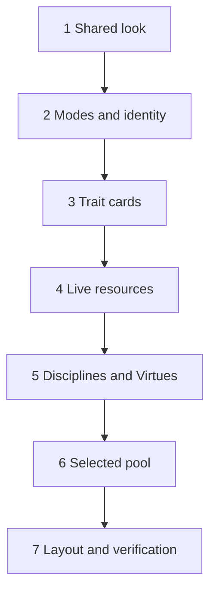

# Plan: Sheet Play View Redesign

**Created**: 2026-10-05
**Branch**: `feat/sheet-play-view-redesign`
**Status**: in-progress
**Gherkin persistence**: features
**Spec**: `docs/specs/sheet-play-view-redesign.md`
**Design**: Figma `TAvjmr6RE0rHV8kz56Ffs0`, frame `5:2725`

## Goal

Rebuild the V20 sheet as the at-the-table play view of Figma frame `5:2725`: application
bar, character identity, a live-resources row (Blood Pool, Willpower, Health, Humanity),
Attributes and Abilities cards, and a side column (Selected pool, Disciplines, Virtues).
The sheet gains a default read-only **play mode** and an in-place **edit mode**, and a
**Selected pool** dice calculator. The roster and builder take the same visual language
through shared tokens and an application bar, with no layout or behavior change. Stored
characters are untouched: no schema change, no migration.

All seven slices ship in one PR. The slice boundaries are build and review checkpoints:
each leaves the suite green and the sheet usable, but the sheet only matches the frame
once Slice 7 is done.

## Approach stance (decision defaults)

| Axis | Stance |
| --- | --- |
| Scope | Only what the spec lists. Frame `5:3452`, power lists, extra tabs, session label and settings icon are not built |
| Replace vs. merge | `global.css` token **values** are replaced with the Figma values and every existing token **name** is kept (mapping table below). Stored data is preserved: every save round-trips fields the sheet no longer shows |
| Format fidelity | Figma icons are kept as SVG files; nothing is rasterised |
| Migrate vs. edit in place | The existing sheet components are rebuilt in place under `src/components/sheet/`; no parallel "v2" page |
| Integration | Feature branch, PR, auto-merge on green checks |

## Acceptance Criteria

Copied from the spec; ticked by the operator at PR review.

- [ ] 1. At 1512px the sheet shows application bar, identity, live resources and workspace in the frame's order, with Selected pool, Disciplines and Virtues in a right-hand column
- [ ] 2. Colors, typefaces, type sizes, radii and spacing match the frame; side-by-side screenshot at 1512px shows no structural difference beyond the listed omissions and the deviations recorded under Risks
- [ ] 3. No tab bar, session label, settings icon, power list or expand chevron is rendered
- [ ] 4. Roster and builder share the application bar, colors, typefaces, card and button styles; every existing roster and builder scenario still passes, with step changes limited to those listed under "Existing scenarios"
- [ ] 5. No page makes a request to another origin
- [ ] 6. At 320px no page scrolls horizontally and every sheet card is reachable
- [ ] 7. A sheet opened from the roster is in play mode with the read-only hint
- [ ] 8. "Edit character" makes the edit-column fields editable in place and can be left again
- [ ] 9. Reloading in edit mode returns to play mode with edits saved
- [ ] 10. A character created with "New V20 character" opens in edit mode
- [ ] 11. Every change autosaves; the application bar shows saved / not-saved status
- [ ] 12. Blood Pool shows current / maximum derived from Generation, a tracker and blood per turn
- [ ] 13. Blood Pool − / + step by one, bounded by 0 and the maximum; a stored excess is shown as stored
- [ ] 14. Willpower shows temporary / permanent; − / + step temporary, bounded by 0 and permanent
- [ ] 15. Health cycles damage types with distinct marks, a legend, and a wound heading
- [ ] 16. Humanity shows rating as number and ten dots, and the path name when set
- [ ] 17. One attribute and one ability can be selected in play mode; selection is visible and programmatic
- [ ] 18. The Selected pool card shows formula and total, or prompts for what is missing
- [ ] 19. The total tracks the health track, never drops below 0, and is 0 when Incapacitated
- [ ] 20. Selection is not stored; entering edit mode clears it
- [ ] 21. Disciplines lists named Disciplines in play mode; six write-in rows in edit mode
- [ ] 22. Virtues shows the three virtues with ratings
- [ ] 23. A named custom ability appears in play mode; the write-in row is always in edit mode
- [ ] 24. Hidden fields' stored values survive open → edit → save
- [ ] 25. Not-found, unreadable and storage-unavailable states still appear, in the new look
- [ ] 26. Unit tests cover blood maximum, wound penalty, dice pool and the willpower step
- [ ] 27. No WCAG 2.1 AA violation on sheet (play and edit), roster and builder
- [ ] 28. `npm run test`, `test:e2e`, `typecheck`, `lint` and `build` pass

## Design reference

Values read from Figma (`get_design_context` on `5:2726`, `5:2766`, `13:22`, `13:521`).

### Token mapping

Every token name that `global.css`, `builder.css`, `sheet.css` or `controls.css` reads
today is kept. Sizes are written in rem.

| Token | Old value | New value | Notes |
| --- | --- | --- | --- |
| `--color-page` | `#14110f` | `#0b0c0f` | Page, application bar |
| `--color-surface` | `#1f1a17` | `#17161a` | Cards, badges, secondary buttons |
| `--color-line` | `#8c7862` | `#2a1f24` | **Decorative** borders only (cards, bar) |
| `--color-border-control` | — | `#77787c` | New. Borders of inputs, buttons, steppers, health boxes, empty dots. The frame uses `#343438` for some of these, which is about 1.4:1 on a card and fails WCAG 1.4.11; `#77787c` is the frame's own empty-dot outline |
| `--color-text` | `#ece3d4` | `#e7e1d5` | Body, filled dots |
| `--color-text-strong` | — | `#f6f0e6` | New. Names, headings |
| `--color-muted` | `#b9ab97` | `#a5a39f` | Labels, secondary text |
| `--color-accent` | `#e2675a` | `#b6474c` | Fills and edges only (blood, selected edge, primary button) |
| `--color-accent-text` | — | `#e58c8d` | New. Accent used as **text**: links, wound text, selected rating |
| `--color-danger` | `#ff8a7a` | `#e58c8d` | Error text |
| `--color-focus` | `#f4c95d` | `#c4a78f` | Focus ring |
| `--color-row` | — | `#191a1d` | New. Trait rows |
| `--color-control` | — | `#202125` | New. Stepper buttons, empty health boxes |
| `--color-selected` | — | `#302024` | New. Selected row, damaged box fill |
| `--color-divider` | — | `#343438` | New. Dividers, empty blood segments (non-interactive) |
| `--space-1` … `--space-5` | unchanged | unchanged | The frame's 4 / 8 / 16 / 24 steps already match; 12 and 32 are added as `--space-card` and `--space-gutter` |
| `--font-body` | system stack | `'Inter', ` + old stack | |
| `--font-display` | serif stack | `'Cormorant Garamond', ` + old stack | |
| `--text-small`, `--text-body`, `--text-h1/2/3` | 14 / 16 / 30 / 21 / 17 | 12 / 13 / 32 / 26 / 22 | Plus `--text-caption` 11, `--text-figure` 28 |
| `--mark-size`, `--control-size` | 18 / 44 | unchanged globally | The builder keeps its sizes; the sheet overrides both inside `.sheet` (8px dots, 29px steppers) |

Global `a` and the accent-colored headings move from `--color-accent` to
`--color-accent-text`; inputs and buttons move from `--color-line` to
`--color-border-control`. The builder's accessibility scan runs inside Step 1.1.

Typefaces: **Cormorant Garamond** 400 / 600 and **Inter** 400 / 600, self-hosted through
`@fontsource/cormorant-garamond` and `@fontsource/inter` (woff2 bundled by the build).
Radii: card 10, button / monogram 6, badge 4, row / health box 3, blood segment 2.
Layout: gutter 32 (16 below 768px), card gap 16, card padding 12 (side cards 16), row
height 33, dot 8 with 5 gap, stepper 29 square, application bar 56, identity 76, side
column 320, resource cards 300 / 320 / flexible / 174.

**Caption floor.** The frame sets health labels, penalties, the legend and card captions
at 9–10px. Text that carries information is set no smaller than 11px (`--text-caption`).

Icons (SVG, fetched from Figma on 2026-10-05 into the session scratchpad; the URLs expire
in 7 days): diamond, pencil, droplet, dices, bashing, lethal, aggravated. All seven are
copied into `src/assets/icons/` in Step 1.1.

## Module layout

| Path | Role |
| --- | --- |
| `src/domain/v20/generations.ts` | New home of `GENERATION_TABLE` and `GenerationRow`, moved from `creation/rules.ts`, which re-exports them. Keeps the base domain from importing the creation subpackage |
| `src/domain/v20/identity.ts` (+ test) | New. Wording only: `ordinal`, `generationNumber`, `generationLabel`, `monogram`, `identitySummary`, `namedRows`, `diceLabel` |
| `src/domain/v20/resources.ts` (+ test) | New. Rules only: `bloodPoolMaximum`, `woundState`, `dicePool`. Reads `generations.ts` and parses Generation through `identity.generationNumber`, so the text is parsed in one place |
| `src/domain/v20/character.ts` | Gains `stepBlood(character, delta, maximum)` and `stepTemporaryWillpower(character, delta)` beside `setTrait` and `cycleHealthBox`. The blood bound is passed in by `sheet.ts`, so `character.ts` does not import `resources.ts` |
| `src/domain/v20/creation/limits.ts` | Its `ordinal` becomes a re-export of the one in `identity.ts` |
| `src/components/controls/rating-control.ts` | Gains a `readonly` presentation: `role="img"`, labelled "Strength 2 of 5", not focusable, emits nothing |
| `src/components/AppBar.astro` | New. Identity link and a fixed `#save-status` element |
| `src/components/sheet/Identity.astro` | New, replaces `SheetHeader.astro` |
| `src/components/sheet/SheetTraitRow.astro` | New, replaces `RatingRow.astro`: one row container per trait |
| `src/components/sheet/BloodPool.astro`, `Willpower.astro`, `Stepper.astro`, `Health.astro`, `Humanity.astro` | Live resources; replace `Trackers.astro`, `Morality.astro` |
| `src/components/sheet/SelectedPool.astro`, `Disciplines.astro`, `Virtues.astro` | Side column; replace `Advantages.astro` |
| `src/scripts/sheet.ts` | Orchestrator: owns the character, `apply(update)`, and calls each card's draw function |
| `src/scripts/sheet/mode.ts` | Sets `data-sheet-mode`, manages focus, announces, exposes `onChange` |
| `src/scripts/sheet/identityCard.ts`, `traitCards.ts`, `resourceCards.ts`, `sideCards.ts`, `poolCard.ts` | One `draw(root, character, mode, …)` per card group; no state, no saving. `sheet.ts` redraws on every `mode.onChange` |
| `src/scripts/sheet/pool.ts` | Selection state only (attribute, ability, `clear`) |
| `features/steps/support/sheet.ts` | New e2e helpers: seed-and-open, enter / leave edit mode, read a rating in either mode, mark damage to a given type |

### Design rules that hold across every slice

1. **One writer.** `apply(update)` in `sheet.ts` stays the only path that changes the
   character, redraws and saves. Card modules are pure draw functions plus event wiring.
2. **Mode is one attribute, shown by CSS.** The sheet root carries
   `data-sheet-mode="play|edit"` (not `data-mode`, which the builder's ratings already
   use). `sheet.css` hides `[data-sheet-mode-only="edit"]` in play mode and the reverse
   with `display: none !important` (matching the existing `[hidden]` rule, so a later row
   layout rule cannot override it), which removes the element from the accessibility tree
   and tab order. The `hidden` attribute is left to content logic (an unnamed custom ability, the
   empty-Disciplines line, a blank path name), so the two never fight over one attribute.
   Only `mode.ts` writes `data-sheet-mode`.
3. **One dot renderer.** Dots are always drawn by `RatingControl`. An attribute, ability
   or virtue has a single `dot-rating`: today's slider in edit mode, and in play mode
   `sheet.ts` sets `readonly` on it so it presents as an image with a text alternative,
   not as a disabled slider. From Slice 4 there is no exemption: Willpower and Humanity
   each have an edit-only `data-trait` rating and a separate, always read-only play
   display (Willpower's shows temporary filled out of permanent, which no stored rating
   is), and blood and temporary willpower change only through steppers. Until Slice 4
   the old temporary Willpower and Blood Pool trackers stay as they are. Sheet dot geometry comes from CSS variables scoped under `.sheet`
   in `sheet.css`; `controls.css` rules the builder depends on are not edited.
4. **Rating scale in play mode.** The frame draws five dots; stored ratings run 0–10.
   A read-only attribute or ability draws five dots when its rating is 5 or less and ten
   when it is higher, right-aligned in a fixed-width slot with the number beside it, and
   its text alternative names the scale it drew ("6 of 10"). Edit mode keeps the ten-mark
   control. Virtues stay 5, Humanity 10.
5. **A row is one container.** `SheetTraitRow` renders one element per trait carrying
   `data-trait-key`: a play-only `<button aria-pressed>` holding the trait name
   (stretched over the row for pointer use, described by a visually hidden "4 of 5" so
   the name is not repeated), an edit-only text label, and the one `dot-rating`. Virtue rows omit the button.
6. **Bounds do not steal focus.** A stepper button at its bound gets
   `aria-disabled="true"` and ignores activation; it is never given the `disabled`
   attribute and its node is never replaced, so keyboard focus stays where it was.
7. **Live regions exist from load and speak only on a user action.** Empty regions are in
   the page markup. A stepper press, a health change, a pool selection and a mode change
   write to them; redraws caused by typing (Generation changing the blood maximum) do not.
8. **Derived, never stored.** Blood maximum, wound state, dice pool, monogram and
   generation label are computed on every draw.
9. **Play displays never carry `data-trait`, `data-text` or `data-row-*`.** Those hooks
   mark edit controls that `sheet.ts` binds; read-only text uses `data-show`.
10. **No stored field is dropped.** Nothing in `src/storage/` or `V20Character` changes.

## Existing scenarios

`features/v20-character-sheet/` and `features/character-builder/` were written by earlier
plans' exports. From this plan on they are edited by hand and are the source of truth;
they must not be re-exported from the old plans.

Wording is kept wherever the behavior still exists; step definitions adapt (a helper
enters edit mode before a rating is set, and reads a rating in either mode). A scenario
is deleted only in the slice that lands its replacement.

**Deleted (13)**

| Old scenario | Why | Replaced by | Slice |
| --- | --- | --- | --- |
| Sheet header › Header fields are available | Player, Chronicle, Sire hidden | Entering edit mode makes the identity editable | 2 |
| Trackers › Free-text fields | Notes, Weakness, Experience hidden | Values in hidden fields survive saving in either mode (Slice 2), Fields the play view no longer shows are not offered | 3 |
| Trackers › Creation reminder | Not in the frame | Fields the play view no longer shows are not offered | 3 |
| Layout › Sections follow the printed sheet | Layout replaced | Attributes and Abilities are laid out as cards (3), The wide layout follows the design (7) | 3 |
| Trackers › Spending and regaining temporary Willpower | Stepper replaces boxes | Spending and regaining willpower | 4 |
| Trackers › Temporary Willpower is independent of permanent | Now capped at permanent | Temporary willpower is bounded | 4 |
| Trackers › Blood Pool | Stepper with derived maximum | The blood pool maximum follows the generation; Spending and gaining blood in play mode | 4 |
| Trackers › Blood Per Turn | Edited in edit mode | Blood per turn can be edited | 4 |
| Trackers › Trackers are saved | New controls | Resources and health are saved | 4 |
| Traits › Humanity or Path | Bearing hidden | Humanity is changed only while editing | 4 |
| Traits › Disciplines and backgrounds | Backgrounds hidden | Disciplines are written in while editing | 5 |
| Layout › The whole sheet can be completed from the keyboard | Two modes | A session can be played from the keyboard; A character can be edited from the keyboard | 7 |
| Layout › Every control has a name | Two modes | Every control has a unique name | 7 |

**Adapted (wording changes)**

| Scenario | Change | Slice |
| --- | --- | --- |
| Trackers › Health levels are labelled | Expected text becomes "Bruised 0, Hurt −1, Injured −1, Wounded −2, Mauled −2, Crippled −5, Incapacitated —" | 4 |
| Layout › Usable on a phone | "every control is visible" becomes "every control offered in play mode is visible" | 3 |
| Builder slice 8 › The sheet shows what was built | "the sheet header shows every concept detail" becomes "the sheet identity shows Name, Clan, Concept, Nature and Demeanor, and the generation '9th'" plus "the saved character holds Player, Chronicle and Sire as entered" (2); "the first two Background rows are…" becomes "the saved character has the Backgrounds 'Generation' at 2 and 'Resources' at 3" (5); "the sheet's Weakness field is empty" becomes "the saved character has no Weakness" (3); "the first two Discipline rows are… and the other four are blank" becomes "the Disciplines card lists 'Dominate 2' and 'Potence 1' and no other row" (5) | 2, 3, 5 |

**Adapted (step definitions only, wording unchanged)**: every other scenario that sets
or reads a sheet value, including builder slice 8 "A finished Nosferatu…", "A potent
elder…", "A build that lingered…", "A finished character is edited freely on the sheet"
and builder slice 9 "A character is built from start to finish". A finished build's
sheet opens in play mode; only the roster's "New V20 character" opens in edit mode.
Two shared helpers also change: the step that followed the sheet's "Back to characters"
link follows the application title instead (Slice 1), and the roster helper that creates
a character accepts the `#edit` marker in the sheet address (Slice 2).

## Slices

### Slice 1: Shared look and application bar

**Depends-on:** none

**Behavior:**

```gherkin
Feature: Shared look and application bar

  Scenario Outline: Every page carries the application bar
    Given a player viewing the <page>
    Then the application bar shows the title "Vampire: The Masquerade" and the ruleset "V20"

    Examples:
      | page    |
      | roster  |
      | builder |
      | sheet   |

  Scenario Outline: The application title leads to the roster
    Given a player viewing the <page>
    When they activate the application title
    Then they are on the roster

    Examples:
      | page    |
      | builder |
      | sheet   |

  Scenario Outline: The design typefaces are loaded from the app itself
    When a player opens the <page>
    Then the Cormorant Garamond and Inter typefaces have finished loading
    And the page title heading is drawn in Cormorant Garamond
    And every request the page made went to the app's own address

    Examples:
      | page    |
      | roster  |
      | builder |
      | sheet   |

  Scenario Outline: The application bar fits a narrow screen
    Given a player viewing the <page> on a 320 pixel wide screen
    Then the page does not scroll sideways
    And the application title is visible

    Examples:
      | page    |
      | roster  |
      | builder |

  Scenario: A page that cannot use storage still shows the application bar
    Given the browser does not allow the app to store data
    When a player opens the roster
    Then the application bar is shown above the storage message
```

**Steps:**

#### Step 1.1: Replace the design tokens and self-host the typefaces

**Complexity**: standard
**IMPLEMENT**: Add the two Fontsource packages and import weights 400 and 600 in `Layout.astro`. Apply the Token mapping table to `global.css`; repoint links and accent headings to `--color-accent-text` and input / button borders to `--color-border-control`; add `.card` and `.button` classes. Copy the seven Figma icons into `src/assets/icons/`.
**TEST**: Scenario "The design typefaces are loaded from the app itself". The whole existing e2e suite, including the existing roster, sheet and builder accessibility scans, stays green with no step changes.
**REFACTOR**: Replace any hard-coded color in `builder.css` and `controls.css` that a token now covers; remove nothing a stylesheet still reads.
**Files**: `package.json`, `package-lock.json`, `src/layouts/Layout.astro`, `src/styles/global.css`, `src/styles/builder.css`, `src/assets/icons/*.svg`, `features/steps/shared-look.steps.ts`
**Commit**: `feat(ui): adopt Figma tokens and self-hosted typefaces`

#### Step 1.2: Application bar on every page

**Complexity**: standard
**IMPLEMENT**: `AppBar.astro` (diamond icon, title linking to `/`, V20 badge, an empty `#save-status` element) rendered by `Layout.astro` in a `<header>`. The sheet's "Back to characters" link is removed in favor of the title link.
**TEST**: Scenarios "Every page carries the application bar", "The application title leads to the roster", "The application bar fits a narrow screen", "A page that cannot use storage still shows the application bar". Existing accessibility scans stay green. A step that used the removed back link is repointed to the title link.
**REFACTOR**: Bar styles sit with the tokens; the bar is a `banner` landmark and no page gains a second one.
**Files**: `src/components/AppBar.astro`, `src/layouts/Layout.astro`, `src/styles/global.css`, `src/pages/sheet.astro`, `features/steps/shared-look.steps.ts`, `features/steps/support/pages.ts`
**Commit**: `feat(ui): application bar across roster, builder and sheet`

### Slice 2: Play and edit modes with character identity

**Depends-on:** 1

**Behavior:**

```gherkin
Feature: Play and edit modes

  Scenario: A saved character opens in play mode
    Given a saved character named "Éloïse Voss" with clan "Toreador", generation "10th", concept "Antiquarian", nature "Visionary" and demeanor "Bon Vivant"
    When the player opens that character from the roster
    Then the identity shows the name "Éloïse Voss" and the monogram "EV"
    And the identity summary reads "Toreador · 10th generation · Antiquarian"
    And the identity shows nature and demeanor as "Visionary / Bon Vivant"
    And no identity text field is offered

  Scenario: Ratings cannot be changed in play mode
    Given a saved character whose Strength is rated 2 and whose Brawl is rated 1
    And the player has that character's sheet open in play mode
    When the player clicks the fourth Strength dot and the fourth Brawl dot
    And the player presses the Tab key until focus has gone round the whole page once
    Then keyboard focus never landed on the Strength or Brawl rating
    And Strength reads "Strength 2 of 5" and Brawl reads "Brawl 1 of 5" to assistive technology
    And after reloading the sheet Strength is rated 2 and Brawl is rated 1

  Scenario: Entering edit mode makes the identity editable
    Given the player has a saved character's sheet open in play mode
    When they activate "Edit character"
    Then Name, Clan, Generation, Concept, Nature and Demeanor can be edited
    And there is no field for Player, Chronicle or Sire
    And the sheet is marked "Editing"
    And the edit button now reads "Done editing"
    And keyboard focus is on the Name field

  Scenario: Entering edit mode makes ratings editable
    Given a saved character whose Strength is rated 2
    And the player has that character's sheet open in play mode
    When they activate "Edit character"
    And they set Strength to 4
    Then Strength is rated 4

  Scenario: Leaving edit mode shows the edited values
    Given the player is editing a saved character
    When they enter "Lucita" as Name and set Strength to 4
    And they activate "Done editing"
    Then the identity shows the name "Lucita"
    And Strength is rated 4
    And no identity text field is offered
    And keyboard focus is on the "Edit character" button

  Scenario Outline: Done editing stays within reach
    Given the player is editing a saved character on a <width> by <height> pixel screen
    When they scroll to the bottom of the sheet
    Then the "Done editing" button is still visible
    And the last card on the sheet is fully visible

    Examples:
      | width | height |
      | 1512  | 900    |
      | 320   | 568    |

  Scenario: Edit mode does not survive a reload
    Given the player is editing a saved character
    When they set Dexterity to 3
    And they reload the sheet
    Then the sheet is in play mode
    And Dexterity is rated 3

  Scenario: A new character opens ready to edit
    When the player creates a new V20 character from the roster
    Then that character's sheet is in edit mode

  Scenario: A new character's sheet returns to play mode on reload
    Given the player created a new V20 character
    When they reload the sheet
    Then the sheet is in play mode

  Scenario: A new character reopened from the roster is in play mode
    Given the player created a new V20 character and returned to the roster
    When they open that character from the roster
    Then the sheet is in play mode

  Scenario: The mode change is announced
    Given the player has a saved character's sheet open in play mode
    When they activate "Edit character"
    Then assistive technology is told "Editing character"
    When they activate "Done editing"
    Then assistive technology is told "Play mode"

  Scenario: A character with no identity entered
    Given a saved character with no name, clan, generation, concept, nature or demeanor
    When the player opens that character from the roster
    Then the identity shows the name "Unnamed character" and no monogram letters
    And the identity shows no summary and no nature or demeanor

  Scenario Outline: The generation is worded for reading
    Given a saved character with clan "Brujah" and generation "<generation>"
    When the player opens that character from the roster
    Then the identity summary reads "<summary>"

    Examples:
      | generation | summary                  |
      | 10         | Brujah · 10th generation |
      | 3rd        | Brujah · 3rd generation  |
      | banana     | Brujah · banana          |
      |            | Brujah                   |

  Scenario: A long name does not break a narrow screen
    Given a saved character named "Maximilian Alexander von Hohenzollern-Sigmaringen the Younger"
    When the player opens that character on a 320 pixel wide screen
    Then the page does not scroll sideways
    And the whole name can be read

  Scenario: Values in hidden fields survive saving in either mode
    Given a saved character with "Ana" as Player, "Madrid by Night" as Chronicle, "Moncada" as Sire, three lines of Notes with leading spaces, a Weakness, an Experience value, a Bearing, a Bearing modifier and a Background "Resources" rated 2
    When the player opens that character and marks bashing damage on Bruised
    And they enter edit mode, enter "Lucita" as Name and reload the sheet
    Then the saved character still holds every one of those values exactly

  Scenario: No save status before anything changes
    Given the player has a saved character's sheet open in play mode
    Then the application bar shows no save status

  Scenario: A play-mode change is reported as saved
    Given the player has a saved character's sheet open in play mode
    When they mark bashing damage on Bruised
    Then the application bar shows "Saved"

  Scenario: An edit-mode change is reported as saved
    Given the player is editing a saved character
    When they set Stamina to 3
    Then the application bar shows "Saved"

  Scenario: A refused save is reported and then recovers
    Given the player is editing a saved character
    And the browser begins refusing to store changes
    When they set Stamina to 3
    Then the application bar shows "Changes not saved"
    And assistive technology is alerted that the browser refused to store the latest changes
    When the browser accepts changes again
    And they set Stamina to 4
    Then the application bar shows "Saved"

  Scenario: Nothing from the out-of-scope design is shown
    Given the player has a saved character's sheet open in play mode
    Then there is no tab bar, session label or settings control

  Scenario: A sheet address with no character still explains itself in the new look
    When the player opens the sheet address with no character id
    Then they see a "character not found" message with a link to the roster
    And the application bar is shown
```

**Steps:**

#### Step 2.1: Identity wording in the domain

**Complexity**: standard
**IMPLEMENT**: `src/domain/v20/identity.ts`: `ordinal(n)` with correct suffixes, `generationNumber(text)` (first whole number, or `undefined`), `generationLabel(text)`, `monogram(name)` (first letters of the first and last words, diacritics removed, upper-cased; empty for a blank name), `identitySummary(character)`. `creation/limits.ts` re-exports `ordinal` from here.
**TEST**: Unit tests: ordinals 1–4, 11–13, 21–23; text with no number; blank; single-word, three-word and accented names; all-blank identity. Existing builder unit tests stay green.
**REFACTOR**: No DOM or storage import in `identity.ts`.
**Files**: `src/domain/v20/identity.ts`, `src/domain/v20/identity.test.ts`, `src/domain/v20/creation/limits.ts`
**Commit**: `feat(domain): identity wording for the play view`

#### Step 2.2: Read-only presentation for ratings

**Complexity**: standard
**IMPLEMENT**: `RatingControl` observes a `readonly` attribute: `role="img"`, `aria-label` "<name> <value> of <max>" from a `name` attribute, no `tabindex`, no slider attributes, ignores pointer and keys. Removing the attribute restores the slider exactly as today.
**TEST**: Covered through Step 2.3's scenario "Ratings cannot be changed in play mode"; the builder's rating scenarios (which never set `readonly`) stay green.
**REFACTOR**: `locked` and `readonly` share no branches by accident: one function decides the role and attributes.
**Files**: `src/components/controls/rating-control.ts`
**Commit**: `feat(controls): read-only presentation for ratings`

#### Step 2.3: Mode state, identity section and Edit character

**Complexity**: complex
**IMPLEMENT**: `Identity.astro` (monogram, name, summary, nature / demeanor, an "Editing" badge, the edit button with pencil icon, and edit-only inputs for the six shown header fields; Player / Chronicle / Sire inputs are removed). `mode.ts` writes `data-sheet-mode`, relabels the button, moves focus (first field on entry, the button on exit), announces after the focus move, and exposes `onChange`. `sheet.ts` sets `readonly` on every rating in play mode (except, until Slice 4 replaces them, the old temporary Willpower and Blood Pool trackers), sets a read-only attribute or ability rating's `max` to 5 or 10 per design rule 4 (restoring 10 in edit mode), and marks every other text input's label edit-only. While editing, a compact strip holding only the "Editing" badge and the "Done editing" button is sticky under the application bar; the identity inputs scroll with the page. The roster's "New V20 character" opens the sheet with `#edit`, which the sheet consumes and removes with `history.replaceState`. `SheetHeader.astro` is deleted.
**TEST**: Every Slice 2 scenario except the four save-status ones; "Entering edit mode makes ratings editable" also asserts that the Strength rating changes from an image to a slider and that focus is on the Name field, not on a control that just changed role. "Header fields are available" is deleted. Builder slice 8 "The sheet shows what was built" header lines are reworded as listed, and `builder-finish.steps.ts` / `builder-whole.steps.ts` read identity from the play display. `features/steps/support/sheet.ts` is added and existing sheet steps that set a value after a reload enter edit mode first.
**REFACTOR**: Only `mode.ts` writes `data-sheet-mode`; `sheet.ts` learns the mode through `mode.onChange`.
**Files**: `src/components/sheet/Identity.astro`, `src/components/sheet/SheetHeader.astro`, `src/scripts/sheet/mode.ts`, `src/scripts/sheet/identityCard.ts`, `src/scripts/sheet.ts`, `src/scripts/roster.ts`, `src/pages/sheet.astro`, `src/styles/sheet.css`, `features/steps/play-modes.steps.ts`, `features/steps/support/sheet.ts`, `features/steps/support/seed.ts`, `features/steps/support/ratings.ts`, `features/steps/sheet-header.steps.ts`, `features/steps/sheet-traits.steps.ts`, `features/steps/sheet-trackers.steps.ts`, `features/steps/layout-a11y.steps.ts`, `features/steps/builder-finish.steps.ts`, `features/steps/builder-whole.steps.ts`, `features/v20-character-sheet/slice-2-sheet-header-with-autosave.feature`, `features/character-builder/slice-8-finish-a-build.feature`
**Commit**: `feat(sheet): play and edit modes with character identity`

#### Step 2.4: Save status in the application bar

**Complexity**: standard
**IMPLEMENT**: `status.ts` gains `showSaved()` / `showNotSaved()` writing the words "Saved" / "Changes not saved" into `#save-status`. The element is not a live region (a save follows every change); a refused save keeps using the existing status message, which is announced as an alert. Empty until the first change.
**TEST**: Scenarios "No save status before anything changes", "A play-mode change is reported as saved", "An edit-mode change is reported as saved", "A refused save is reported and then recovers".
**REFACTOR**: Message text lives in one place in `status.ts`.
**Files**: `src/scripts/status.ts`, `src/scripts/sheet.ts`, `src/components/AppBar.astro`, `src/styles/global.css`, `features/steps/play-modes.steps.ts`
**Commit**: `feat(sheet): save status in the application bar`

### Slice 3: Attribute and ability cards

**Depends-on:** 2

**Behavior:**

```gherkin
Feature: Attribute and ability cards

  Scenario: Attributes and Abilities are laid out as cards
    Given a player viewing a saved character's sheet on a 1512 pixel wide screen
    Then Attributes shows the cards Physical, Social and Mental side by side
    And Abilities shows the cards Talents, Skills and Knowledges side by side
    And the Abilities heading carries the hint "Read-only in play · edit character to change"

  Scenario Outline: Ratings are shown as dots and a number
    Given a saved character whose Strength is rated <rating>
    When the player opens that character from the roster
    Then Strength shows <filled> filled dots out of <dots> and the number <rating>
    And Strength reads "Strength <rating> of <dots>" to assistive technology

    Examples:
      | rating | filled | dots |
      | 0      | 0      | 5    |
      | 5      | 5      | 5    |
      | 6      | 6      | 10   |

  Scenario: A rating above five does not push its row out of line
    Given a saved character whose Strength is rated 8 and whose Dexterity is rated 2
    When the player opens that character on a 320 pixel wide screen
    Then the Strength and Dexterity numbers line up
    And the page does not scroll sideways

  Scenario: A named custom ability is listed in play mode
    Given a saved character with the custom Talent "Hobby Talent" rated 2, a custom Skill named with only spaces and no custom Knowledge
    When the player opens that character from the roster
    Then the Talents list ends with "Hobby Talent" rated 2
    And the Skills and Knowledges lists show only their ten fixed abilities

  Scenario: Custom abilities can always be written in while editing
    Given the player is editing a saved character
    Then each of Talents, Skills and Knowledges offers a write-in ability with a name and a rating

  Scenario: Fields the play view no longer shows are not offered
    Given the player is editing a saved character
    Then there is no field for Notes, Weakness or Experience
    And no creation reminder is shown
```

**Steps:**

#### Step 3.1: Trait cards

**Complexity**: complex
**IMPLEMENT**: `SheetTraitRow.astro` per design rule 5 (the select button is rendered but inert until Slice 6: no `aria-pressed`, not focusable). Attributes and Abilities become three cards each under small-caps section headings, with the read-only hint on Abilities in play mode. `traitCards.ts` writes the number beside each rating and keeps the dot slot a fixed width (the 5-or-10 scale itself arrived in Step 2.3). A custom ability's play row is `hidden` unless its trimmed name is non-empty (`namedRows` in `identity.ts`); its write-in row is edit-only. Notes, Weakness, Experience and the creation reminder leave the page.
**TEST**: Every Slice 3 scenario. Existing "Dot-rated traits" scenarios pass through mode-aware steps. "Free-text fields", "Creation reminder" and "Sections follow the printed sheet" are deleted; "Usable on a phone" and builder slice 8's Weakness line are reworded as listed. A side-by-side look at the identity and trait cards against the frame is taken now and obvious drift is fixed here rather than in Slice 7.
**REFACTOR**: Delete `Notes.astro`, `WeaknessExperience.astro` and `CREATION_REMINDER`; `RatingRow.astro` stays until Slice 5 because `Morality.astro` and `Advantages.astro` still import it.
**Files**: `src/components/sheet/SheetTraitRow.astro`, `src/components/sheet/TraitGroup.astro`, `src/components/sheet/Attributes.astro`, `src/components/sheet/Abilities.astro`, `src/components/sheet/Notes.astro`, `src/components/sheet/WeaknessExperience.astro`, `src/domain/v20/traits.ts`, `src/domain/v20/identity.ts`, `src/domain/v20/identity.test.ts`, `src/scripts/sheet/traitCards.ts`, `src/scripts/sheet.ts`, `src/pages/sheet.astro`, `src/styles/sheet.css`, `features/steps/trait-cards.steps.ts`, `features/steps/sheet-traits.steps.ts`, `features/steps/sheet-trackers.steps.ts`, `features/steps/layout-a11y.steps.ts`, `features/steps/builder-finish.steps.ts`, `features/v20-character-sheet/slice-4-trackers-health-and-notes.feature`, `features/v20-character-sheet/slice-7-sheet-layout-responsiveness-and-accessibility-verification.feature`, `features/character-builder/slice-8-finish-a-build.feature`
**Commit**: `feat(sheet): attribute and ability cards, read-only in play`

### Slice 4: Live resources

**Depends-on:** 3

**Behavior:**

```gherkin
Feature: Live resources

  Scenario Outline: The blood pool maximum follows the generation
    Given a saved character with generation "<generation>" and 3 blood
    When the player opens that character from the roster
    Then the Blood Pool reads "3 / <maximum>"

    Examples:
      | generation | maximum |
      | 13th       | 10      |
      | 10th       | 13      |
      | 8          | 15      |
      | 4          | 50      |

  Scenario: An unreadable generation falls back and says so
    Given a saved character with generation "banana" and 3 blood
    When the player opens that character from the roster
    Then the Blood Pool reads "3 / 50"
    And the Blood Pool card says "Generation not recognised · maximum assumed 50"

  Scenario: The blood tracker draws one segment per point for small pools
    Given a saved character with generation "10th" and 8 blood
    When the player opens that character from the roster
    Then the blood tracker shows 13 segments with 8 filled

  Scenario: The blood tracker becomes a single bar for large pools
    Given a saved character with generation "4" and 25 blood
    When the player opens that character on a 320 pixel wide screen
    Then the blood tracker is one bar filled to half its length
    And the page does not scroll sideways

  Scenario: Spending and gaining blood in play mode
    Given a saved character with generation "10th" and 8 blood
    And the player has that character's sheet open in play mode
    When they spend one blood
    Then the Blood Pool reads "7 / 13"
    When they gain one blood
    Then the Blood Pool reads "8 / 13"

  Scenario: Blood cannot go below zero and focus stays put
    Given a saved character with generation "10th" and 1 blood
    And the player has that character's sheet open in play mode
    When they move keyboard focus to "Spend one blood" and press Enter twice
    Then the Blood Pool reads "0 / 13"
    And "Spend one blood" is reported as unavailable
    And keyboard focus is still on "Spend one blood"

  Scenario: Blood cannot go above the maximum
    Given a saved character with generation "10th" and 13 blood
    When the player opens that character from the roster
    Then "Gain one blood" is reported as unavailable
    When they activate "Gain one blood"
    Then the Blood Pool reads "13 / 13"

  Scenario: Stored blood above the maximum is shown as stored
    Given a saved character with generation "10th" and 20 blood
    When the player opens that character from the roster
    Then the Blood Pool reads "20 / 13" and is marked "over maximum"
    And the blood tracker is completely filled
    And "Gain one blood" is reported as unavailable
    When they spend one blood
    Then the Blood Pool reads "19 / 13"

  Scenario: Changing the generation changes the maximum without an announcement
    Given the player is editing a saved character with generation "13" and 5 blood
    When they enter "8" as Generation
    Then the Blood Pool reads "5 / 15"
    And assistive technology was told nothing about the Blood Pool

  Scenario: Blood per turn is shown only when recorded
    Given a saved character whose blood per turn is "1"
    And another saved character with no blood per turn recorded
    When the player opens each character from the roster
    Then the first Blood Pool card shows "1 blood / turn"
    And the second shows no per-turn text

  Scenario: Blood per turn can be edited
    Given the player is editing a saved character
    When they enter "3" as Blood per turn and reload the sheet
    Then the Blood Pool card shows "3 blood / turn"

  Scenario: Blood per turn cannot be changed in play mode
    Given the player has a saved character's sheet open in play mode
    Then no Blood per turn field is offered

  Scenario: Spending and regaining willpower
    Given a saved character with permanent Willpower 6 and temporary Willpower 4
    And the player has that character's sheet open in play mode
    Then Willpower reads "4 / 6" with 4 of 6 dots filled
    When they spend one willpower
    Then Willpower reads "3 / 6"
    When they regain one willpower
    Then Willpower reads "4 / 6"

  Scenario Outline: Temporary willpower is bounded
    Given a saved character with permanent Willpower <permanent> and temporary Willpower <temporary>
    When the player opens that character from the roster
    Then "Spend one willpower" is <spend>
    And "Regain one willpower" is <regain>

    Examples:
      | permanent | temporary | spend       | regain      |
      | 6         | 6         | available   | unavailable |
      | 6         | 0         | unavailable | available   |
      | 0         | 0         | unavailable | unavailable |

  Scenario: Stored temporary willpower above permanent is shown as stored
    Given a saved character with permanent Willpower 3 and temporary Willpower 8
    When the player opens that character from the roster
    Then Willpower reads "8 / 3" and is marked "over maximum"
    And "Regain one willpower" is reported as unavailable
    When they spend one willpower
    Then Willpower reads "7 / 3"

  Scenario: Permanent willpower is changed only while editing
    Given a saved character with permanent Willpower 6 and temporary Willpower 4
    And the player has that character's sheet open in play mode
    Then permanent Willpower cannot be changed
    When they activate "Edit character" and set permanent Willpower to 3
    Then Willpower reads "4 / 3"

  Scenario Outline: The health card names the current wound level
    Given a saved character with lethal damage on <levels>
    When the player opens that character from the roster
    Then the Health heading shows "<wound>"

    Examples:
      | levels                    | wound              |
      | Bruised                   |                    |
      | Hurt                      | Hurt · −1 die      |
      | Hurt and Crippled         | Crippled · −5 dice |
      | Bruised and Incapacitated | Incapacitated      |

  Scenario: The wound level follows the health track and is announced
    Given the player has a saved, unwounded character's sheet open in play mode
    When they mark bashing damage on Wounded
    Then the Health heading shows "Wounded · −2 dice"
    And assistive technology is told "Wounded, minus 2 dice"
    When they mark Wounded until it is empty
    Then the Health heading shows no wound

  Scenario: The health legend names each mark
    Given the player has a saved character's sheet open in play mode
    Then the health legend lists "Bashing", "Lethal" and "Aggravated" in that order
    And each legend entry shows its own mark image, and no two entries share one

  Scenario: Resources and health are saved
    Given a saved character with generation "10th", 8 blood, permanent Willpower 6 and temporary Willpower 4
    And the player has that character's sheet open in play mode
    When they spend one blood, spend one willpower, mark bashing damage on Bruised, lethal on Hurt and aggravated on Injured
    And they reload the sheet
    Then the Blood Pool reads "7 / 13" and Willpower reads "3 / 6"
    And Bruised shows bashing, Hurt shows lethal and Injured shows aggravated damage

  Scenario: Resources stay live while editing
    Given the player is editing a saved character with generation "10th" and 8 blood
    When they spend one blood and mark bashing damage on Bruised
    Then the Blood Pool reads "7 / 13" and Bruised shows bashing damage

  Scenario: Humanity is shown as a number, dots and a path
    Given a saved character with Humanity 7 on the path "Path of Humanity"
    And another saved character with Humanity 5 and no path name
    When the player opens each character from the roster
    Then the first Humanity card shows the number 7, 7 of 10 dots filled and "Path of Humanity"
    And the second shows the number 5 and no path name

  Scenario: Humanity is changed only while editing
    Given a saved character with Humanity 7
    And the player has that character's sheet open in play mode
    Then the Humanity rating cannot be changed and no path name field is offered
    When they activate "Edit character", set Humanity to 6 and enter "Path of Night" as the path name
    Then no field for Bearing or Bearing modifier is offered
    When they reload the sheet
    Then the Humanity card shows the number 6 and "Path of Night"

  Scenario: A resource change is announced once
    Given a saved character with generation "10th" and 8 blood
    And the player has that character's sheet open in play mode
    When they spend one blood using the keyboard
    Then assistive technology is told "Blood Pool 7 of 13"
```

**Steps:**

#### Step 4.1: Resource rules in the domain

**Complexity**: standard
**IMPLEMENT**: Move `GENERATION_TABLE` to `generations.ts` (re-exported from `creation/rules.ts`). `resources.ts`: `bloodPoolMaximum(character)` returning `{ maximum, assumed }` (from `GENERATION_TABLE` for 4–13, 10 for 14–15, otherwise `BLOOD_POOL_RANGE.max` with `assumed: true`) and `woundState(character)` (`{ level, penalty }`, `'incapacitated'` or `undefined`, from the most severe marked level; Bruised alone is no wound). `character.ts`: `stepBlood(character, delta, maximum)` and `stepTemporaryWillpower(character, delta)` over one bounded-step helper (never below 0, never raised above the bound, a stored excess can only fall). Numeric penalties are added to `HEALTH_LEVELS` beside the display strings.
**TEST**: Unit tests: every generation 3–16, unreadable and blank text; steps at 0, at the bound, above it, permanent 0; wound state for an empty track, each single level, Bruised only, non-contiguous damage, Incapacitated with others. (Criterion 26.)
**REFACTOR**: No V20 table is restated; `resources.ts` has no DOM import; `character.ts` and `resources.ts` do not import each other in a cycle.
**Files**: `src/domain/v20/generations.ts`, `src/domain/v20/creation/rules.ts`, `src/domain/v20/resources.ts`, `src/domain/v20/resources.test.ts`, `src/domain/v20/character.ts`, `src/domain/v20/character.test.ts`, `src/domain/v20/traits.ts`
**Commit**: `feat(domain): blood maximum, bounded steps and wound state`

#### Step 4.2: Blood Pool and Willpower cards

**Complexity**: standard
**IMPLEMENT**: `Stepper.astro` (− / total / + per design rule 6, buttons named "Spend one blood", "Gain one blood", "Spend one willpower", "Regain one willpower"), `BloodPool.astro` (droplet heading, per-turn text, tracker hidden from assistive technology: segments up to a maximum of 20, one proportional bar above it; "over maximum" and "maximum assumed" captions) and `Willpower.astro` (dots: permanent count, temporary filled; the "1 point → 1 automatic success" caption). The Willpower dots are a read-only play display; blood per turn and permanent Willpower have edit-only controls. One empty polite live region per card, written only by the stepper handlers. `Trackers.astro`, `box-tracker.ts` and its sheet import are deleted (the builder does not use them).
**TEST**: All Blood Pool and Willpower scenarios. The four old tracker scenarios for willpower, blood and blood per turn are deleted; builder slice 8 steps read willpower, blood and blood per turn from the cards.
**REFACTOR**: `resourceCards.ts` updates text and attributes in place and never replaces a button node.
**Files**: `src/components/sheet/Stepper.astro`, `src/components/sheet/BloodPool.astro`, `src/components/sheet/Willpower.astro`, `src/components/sheet/Trackers.astro`, `src/components/sheet/Morality.astro`, `src/components/controls/box-tracker.ts`, `src/components/controls/controls.css`, `src/scripts/sheet/resourceCards.ts`, `src/scripts/sheet.ts`, `src/pages/sheet.astro`, `src/styles/sheet.css`, `features/steps/live-resources.steps.ts`, `features/steps/sheet-trackers.steps.ts`, `features/steps/builder-finish.steps.ts`, `features/steps/support/seed.ts`, `features/steps/support/sheet.ts`, `features/v20-character-sheet/slice-4-trackers-health-and-notes.feature`
**Commit**: `feat(sheet): blood pool and willpower steppers`

#### Step 4.3: Health and Humanity cards and the resources row

**Complexity**: standard
**IMPLEMENT**: `Health.astro` to the frame: seven boxes with label and penalty, bashing slash / lethal cross / aggravated star drawn in sheet CSS, a legend using the three Figma icons with "Select a box to cycle", the wound heading from `woundState`, and a polite live region for wound changes. `Humanity.astro`: number, ten read-only dots, path name (`hidden` when blank); edit-only rating and path-name input; Bearing fields removed. The four cards form the live-resources row. `Morality.astro` is deleted.
**TEST**: Health and Humanity scenarios, "Resources and health are saved", "Resources stay live while editing". "Health levels are labelled" is reworded as listed; "Trackers are saved" and "Humanity or Path" are deleted; builder slice 8's Humanity step reads the card.
**REFACTOR**: Health mark shapes are defined once and shared by box and legend; the existing health-box accessible names ("Hurt, lethal") are unchanged.
**Files**: `src/components/sheet/Health.astro`, `src/components/sheet/Humanity.astro`, `src/components/sheet/Morality.astro`, `src/components/controls/health-track.ts`, `src/scripts/sheet/resourceCards.ts`, `src/scripts/sheet.ts`, `src/pages/sheet.astro`, `src/styles/sheet.css`, `features/steps/live-resources.steps.ts`, `features/steps/sheet-trackers.steps.ts`, `features/steps/sheet-traits.steps.ts`, `features/steps/builder-finish.steps.ts`, `features/v20-character-sheet/slice-3-dot-rated-traits.feature`, `features/v20-character-sheet/slice-4-trackers-health-and-notes.feature`
**Commit**: `feat(sheet): health and humanity cards`

### Slice 5: Disciplines and Virtues cards

**Depends-on:** 4

**Behavior:**

```gherkin
Feature: Disciplines and Virtues cards

  Scenario: Named Disciplines are listed in play mode
    Given a saved character with the Disciplines "Presence" rated 3, "Auspex" rated 2 and "Obfuscate" rated 0, and a fourth Discipline named with only spaces
    When the player opens that character from the roster
    Then the Disciplines card lists "Presence 3", "Auspex 2" and "Obfuscate 0" in that order
    And no other Discipline row is shown
    And the Disciplines card shows no power list and no expand control

  Scenario: A character with no Disciplines
    Given a saved character with no Discipline named
    When the player opens that character from the roster
    Then the Disciplines card says "No Disciplines recorded · edit character to add"

  Scenario: Disciplines are written in while editing
    Given the player is editing a saved character with no Discipline named
    Then the Disciplines card offers six rows, each with a name and a rating
    When they name the first Discipline "Dominate" with 3 dots
    And they reload the sheet
    Then the Disciplines card lists "Dominate 3"

  Scenario: Clearing a Discipline's name removes it from the play view
    Given the player is editing a saved character with the Discipline "Presence" rated 3
    When they clear that Discipline's name
    And they activate "Done editing"
    Then the Disciplines card says "No Disciplines recorded · edit character to add"

  Scenario: Disciplines cannot be changed in play mode
    Given a saved character with the Discipline "Presence" rated 3
    And the player has that character's sheet open in play mode
    Then no Discipline name field or rating control is offered

  Scenario: Virtues are shown with their ratings
    Given a saved character with Conscience/Conviction 3, Self-Control/Instinct 3 and Courage 4
    When the player opens that character from the roster
    Then the Virtues card shows Conscience/Conviction 3, Self-Control/Instinct 3 and Courage 4, each out of 5 dots

  Scenario: Virtues are changed only while editing
    Given a saved character with Courage 4
    And the player has that character's sheet open in play mode
    Then the Courage rating cannot be changed
    When they activate "Edit character" and set Courage to 2
    And they activate "Done editing"
    Then the Virtues card shows Courage 2

  Scenario: Backgrounds are no longer offered
    Given the player is editing a saved character
    Then there is no field for any Background
```

**Steps:**

#### Step 5.1: Disciplines card

**Complexity**: standard
**IMPLEMENT**: `Disciplines.astro`: a play-only list drawn by `sideCards.ts` from `namedRows` as "Name rating" in the display typeface with dividers, the empty-state line, and the six edit-only write-in rows (`NamedRatingRow`). The Backgrounds rows leave the page.
**TEST**: The five Disciplines scenarios and "Backgrounds are no longer offered". "Disciplines and backgrounds" is deleted; builder slice 8's Discipline step reads the card and its Background line is reworded to check the saved character.
**REFACTOR**: One `namedRows` helper serves Disciplines and custom abilities.
**Files**: `src/components/sheet/Disciplines.astro`, `src/components/sheet/Advantages.astro`, `src/components/sheet/NamedRatingRow.astro`, `src/scripts/sheet/sideCards.ts`, `src/scripts/sheet.ts`, `src/pages/sheet.astro`, `src/styles/sheet.css`, `features/steps/side-cards.steps.ts`, `features/steps/sheet-traits.steps.ts`, `features/steps/builder-finish.steps.ts`, `features/steps/support/seed.ts`, `features/v20-character-sheet/slice-3-dot-rated-traits.feature`, `features/character-builder/slice-8-finish-a-build.feature`
**Commit**: `feat(sheet): disciplines quick-reference card`

#### Step 5.2: Virtues card and the workspace grid

**Complexity**: standard
**IMPLEMENT**: `Virtues.astro` from `SheetTraitRow` without the select button or number. The workspace becomes a two-column grid at wide widths: traits left, a 320px column right holding Disciplines and Virtues. `Advantages.astro` and `RatingRow.astro` are deleted after confirming nothing imports them.
**TEST**: The two Virtues scenarios; existing virtue scenarios in "Dot-rated traits" still pass; `npm run build` proves no dangling import.
**REFACTOR**: Remove sheet CSS that only the deleted sections used.
**Files**: `src/components/sheet/Virtues.astro`, `src/components/sheet/Advantages.astro`, `src/components/sheet/RatingRow.astro`, `src/scripts/sheet/sideCards.ts`, `src/pages/sheet.astro`, `src/styles/sheet.css`, `features/steps/side-cards.steps.ts`
**Commit**: `feat(sheet): virtues card and quick-reference column`

### Slice 6: Selected pool

**Depends-on:** 5

**Behavior:**

```gherkin
Feature: Selected pool

  Background:
    Given a saved character with Intelligence 4, Strength 1, Investigation 3, Brawl 0, Law 1 and the custom Knowledge "Art History" rated 2
    And the player has that character's sheet open in play mode

  Scenario: Nothing selected
    Then the Selected pool card says "Select an attribute and an ability"
    And it shows no dice total
    And the Attributes heading carries the hint "Select one attribute and one ability for a dice pool"

  Scenario: Only an attribute selected
    When they select Intelligence
    Then Intelligence is marked as selected
    And the Selected pool card shows "Intelligence 4" and says "Select an ability"
    And it shows no dice total

  Scenario: Only an ability selected
    When they select Investigation
    Then the Selected pool card shows "Investigation 3" and says "Select an attribute"

  Scenario: An attribute and an ability make a pool
    When they select Intelligence and Investigation
    Then the Selected pool card shows "Intelligence 4 + Investigation 3"
    And the dice total is "7 dice"

  Scenario: Wounds reduce the pool
    When they mark lethal damage on Hurt
    And they select Intelligence and Investigation
    Then the Selected pool card shows "Intelligence 4 + Investigation 3 − wound 1"
    And the dice total is "6 dice"

  Scenario: A bruise alone does not reduce the pool
    When they mark bashing damage on Bruised
    And they select Intelligence and Investigation
    Then the Selected pool card shows "Intelligence 4 + Investigation 3"
    And the dice total is "7 dice"

  Scenario: The pool follows the health track at once
    When they select Intelligence and Investigation
    And they mark bashing damage on Wounded
    Then the dice total is "5 dice"
    When they mark Wounded until it is empty
    Then the dice total is "7 dice"

  Scenario: Selecting another attribute replaces the first
    When they select Intelligence and Investigation
    And they select Strength
    Then Strength is marked as selected and Intelligence is not
    And the Selected pool card shows "Strength 1 + Investigation 3"

  Scenario: Selecting another ability replaces the first
    When they select Intelligence and Investigation
    And they select Law
    Then Law is marked as selected and Investigation is not
    And the dice total is "5 dice"

  Scenario: Selecting a selected trait deselects it
    When they select Intelligence and Investigation
    And they select Intelligence again
    Then Intelligence is not marked as selected
    And the Selected pool card shows "Investigation 3" and says "Select an attribute"

  Scenario: A pool of one die
    When they select Strength and Brawl
    Then the dice total is "1 die"

  Scenario: The pool never goes below zero
    When they mark lethal damage on Crippled
    And they select Strength and Brawl
    Then the Selected pool card shows "Strength 1 + Brawl 0 − wound 5"
    And the dice total is "0 dice"

  Scenario: An incapacitated character has no pool
    When they mark lethal damage on Incapacitated
    And they select Intelligence
    Then the Selected pool card says "Incapacitated · cannot act"
    When they select Investigation
    Then the dice total is "0 dice"
    And the Selected pool card says "Incapacitated · cannot act"

  Scenario: A named custom ability can be selected
    When they select Intelligence and "Art History"
    Then the Selected pool card shows "Intelligence 4 + Art History 2"
    And the dice total is "6 dice"

  Scenario: Virtues and Disciplines cannot be selected
    Then no Virtue row and no Discipline row offers selection

  Scenario: Selecting from the keyboard
    When they move keyboard focus to Intelligence and press Enter
    And they move keyboard focus to Investigation and press Space
    Then Intelligence and Investigation are reported as pressed to assistive technology
    And the Intelligence button is described as "4 of 5"
    And assistive technology is told "Dice pool: Intelligence 4 + Investigation 3, 7 dice"

  Scenario: The selection is shown without color alone
    When they select Intelligence
    Then the Intelligence row carries a selection edge that contrasts at least 3 to 1 with an unselected row

  Scenario: The pool stays in view on a narrow screen
    Given the sheet is shown on a 320 pixel wide screen
    When they select Intelligence and scroll to Investigation and select it
    Then the Selected pool card is visible without scrolling
    And the dice total is "7 dice"
    When they move keyboard focus through every ability
    Then no focused row is covered by the Selected pool card or the application bar

  Scenario: The selection is not saved
    When they select Intelligence and Investigation
    And they reload the sheet
    Then no trait is marked as selected
    And the Selected pool card says "Select an attribute and an ability"

  Scenario: Editing clears the selection
    When they select Intelligence and Investigation
    And they activate "Edit character"
    Then no trait offers selection and the Selected pool card is not shown
    When they activate "Done editing"
    Then no trait is marked as selected
    And the Selected pool card says "Select an attribute and an ability"
```

**Steps:**

#### Step 6.1: Dice pool in the domain

**Complexity**: standard
**IMPLEMENT**: `dicePool(character, selection)` in `resources.ts`: the selection names an optional attribute and an optional ability (fixed key or custom group). Returns the named terms with ratings, the wound term when there is a penalty, the total (floored at 0; 0 when Incapacitated) only when both are selected, and an `incapacitated` flag. `diceLabel(total)` in `identity.ts` gives "1 die" / "n dice".
**TEST**: Unit tests: none / one / both selected, each wound level, Bruised only, floor at 0, Incapacitated with one and with both selected, custom ability, a custom ability whose name was cleared (treated as not selected), singular and plural. (Criterion 26.)
**REFACTOR**: Reuses `woundState`; no penalty arithmetic elsewhere.
**Files**: `src/domain/v20/resources.ts`, `src/domain/v20/resources.test.ts`, `src/domain/v20/identity.ts`, `src/domain/v20/identity.test.ts`
**Commit**: `feat(domain): dice pool from attribute, ability and wounds`

#### Step 6.2: Selectable rows and the Selected pool card

**Complexity**: complex
**IMPLEMENT**: `SelectedPool.astro` (heading, dices icon, formula, prompt, total, an empty polite live region), play-only, placed first in the workspace markup so that it sits at the top of the right column on wide screens and above the traits, sticky, on narrow ones, with a capped height and `scroll-padding-top` on the page equal to the sticky stack so a focused row is never underneath it. Row buttons become live: focusable, `aria-pressed`, `aria-describedby` a visually hidden "4 of 5"; selected style is row fill, a 2px accent edge, a strong name and an accent rating. `pool.ts` holds the selection; `sheet.ts` wires `mode.onChange(() => pool.clear())` and passes the selection to `poolCard.ts` on every draw. Attributes and Abilities keep their labelled groups so the buttons are announced in context. The Attributes heading gains its hint.
**TEST**: All Selected pool scenarios.
**REFACTOR**: `pool.ts` has no DOM access; `poolCard.ts` has no state.
**Files**: `src/components/sheet/SelectedPool.astro`, `src/components/sheet/SheetTraitRow.astro`, `src/components/sheet/Attributes.astro`, `src/scripts/sheet/pool.ts`, `src/scripts/sheet/poolCard.ts`, `src/scripts/sheet/traitCards.ts`, `src/scripts/sheet.ts`, `src/pages/sheet.astro`, `src/styles/sheet.css`, `features/steps/selected-pool.steps.ts`, `features/steps/support/sheet.ts`, `features/steps/support/seed.ts`
**Commit**: `feat(sheet): selected pool dice calculator`

### Slice 7: Layout, accessibility and visual verification

**Depends-on:** 6

**Behavior:**

```gherkin
Feature: Play view layout and accessibility

  Scenario: The wide layout follows the design
    Given a player viewing a saved character's sheet on a 1512 pixel wide screen
    Then the application bar, character identity, live resources and workspace appear in that order from the top
    And Blood Pool, Willpower, Health and Humanity sit side by side in one row
    And Selected pool, Disciplines and Virtues are stacked in a column to the right of the traits
    And the application bar is 56 pixels high, the identity 76 pixels high, the right column 320 pixels wide and a trait row 33 pixels high

  Scenario: The narrow layout stacks in reading order
    Given a player viewing a saved character's sheet on a 320 pixel wide screen
    Then the page is no wider than the screen
    And every card's box lies within the screen width
    And the cards come in the order Blood Pool, Willpower, Health, Humanity, Selected pool, Attributes, Abilities, Disciplines, Virtues
    And the health levels are listed one per line

  Scenario Outline: The sheet fits in both modes at common widths
    Given a player viewing a saved character's sheet in <mode> mode on a <width> pixel wide screen
    Then the page is no wider than the screen
    And no text on the sheet is wider than the element that holds it

    Examples:
      | mode | width |
      | play | 320   |
      | edit | 320   |
      | play | 768   |
      | edit | 768   |

  Scenario: Controls are large enough to touch on a narrow screen
    Given a player viewing a saved character's sheet on a 320 pixel wide screen
    Then every stepper button, health box and selectable row is at least 44 pixels high

  Scenario Outline: No automated accessibility violations in the play view
    Given a player viewing the <page>
    When the page is checked against WCAG 2.1 AA
    Then no violations are reported

    Examples:
      | page                                    |
      | sheet in play mode with a pool selected |
      | sheet in edit mode                      |
      | sheet of a wounded character over its blood maximum |

  Scenario: A session can be played from the keyboard
    Given a saved character with generation "10th", 8 blood, Intelligence 4 and Investigation 3
    And the player has that character's sheet open in play mode
    When they use only the keyboard to spend one blood, mark bashing damage on Bruised and select Intelligence and Investigation
    Then the Blood Pool reads "7 / 13", Bruised shows bashing damage and the dice total is "7 dice"
    And keyboard focus was visible at every stop

  Scenario: A character can be edited from the keyboard
    Given the player has a saved character's sheet open in play mode
    When they use only the keyboard to enter edit mode, enter a Name, set Strength to 3 and leave edit mode
    Then the identity shows that name and Strength is rated 3
    And keyboard focus was visible at every stop

  Scenario Outline: Every control has a unique name
    Given a player viewing a saved character's sheet in <mode> mode
    Then every button, text field, rating and health box that is offered has an accessible name unique within the sheet

    Examples:
      | mode |
      | play |
      | edit |

  Scenario: Edit-only controls are out of reach in play mode
    Given the player has a saved character's sheet open in play mode
    When they press the Tab key until focus has gone round the whole page once
    Then keyboard focus never landed on a text field or an editable rating
```

**Steps:**

#### Step 7.1: Responsive layout

**Complexity**: standard
**IMPLEMENT**: Finalise the wide grid to the frame's measurements and add the collapses: 16px gutter below 768px, side column under the traits with the Selected pool card first and sticky, three-card rows to one column, resource cards wrapping, identity stacking, health levels as a vertical list, 44px minimum height for steppers, health boxes and rows at narrow widths. The sheet's wide layout is scoped to a sheet class so the roster's and builder's `main` width is untouched.
**TEST**: Scenarios "The wide layout follows the design", "The narrow layout stacks in reading order", "The sheet fits in both modes at common widths", "Controls are large enough to touch on a narrow screen"; existing "Usable on a phone" still passes. The 768px and 320px rows also stand in for 200% and 400% zoom of a 1512px window.
**REFACTOR**: Each breakpoint is written once.
**Files**: `src/styles/sheet.css`, `src/styles/global.css`, `src/pages/sheet.astro`, `features/steps/play-layout.steps.ts`, `features/steps/layout-a11y.steps.ts`
**Commit**: `feat(sheet): responsive play view layout`

#### Step 7.2: Accessibility and keyboard verification

**Complexity**: standard
**IMPLEMENT**: Fix whatever the scans and keyboard runs surface: focus ring visibility on the dark surfaces, names of steppers and row buttons, landmark and heading order.
**TEST**: "Focus was visible" means the focused element had a non-zero outline or box-shadow at each stop. Scenarios "No automated accessibility violations in the play view", "A session can be played from the keyboard", "A character can be edited from the keyboard", "Every control has a unique name", "Edit-only controls are out of reach in play mode". The two superseded old scenarios are deleted.
**REFACTOR**: Remove step definitions and support helpers no scenario uses.
**Files**: `src/styles/sheet.css`, `src/styles/global.css`, `src/components/sheet/*.astro`, `features/steps/play-layout.steps.ts`, `features/steps/layout-a11y.steps.ts`, `features/v20-character-sheet/slice-7-sheet-layout-responsiveness-and-accessibility-verification.feature`
**Commit**: `test(sheet): accessibility and keyboard coverage for the play view`

#### Step 7.3: Visual comparison against the Figma frame

**Complexity**: standard
**IMPLEMENT**: Seed the frame's sample character (Éloïse Voss, with the frame's ratings, resources, damage, Disciplines and the Intelligence + Investigation selection), capture the sheet at 1512×1086, compare it side by side with a fresh `get_screenshot` of `5:2725`, and correct every difference in color, type, spacing, radius or alignment that is not a listed omission or a deviation recorded under Risks. Add the superseded note to `docs/specs/v20-character-sheet.md`.
**TEST**: The comparison is the evidence for criteria 1–3: both images and the list of remaining, intended differences go into the PR description. `npm run test`, `test:e2e`, `typecheck`, `lint` and `build` green.
**REFACTOR**: Replace any one-off pixel value introduced while matching with its token.
**Files**: `src/styles/sheet.css`, `src/styles/global.css`, `src/components/sheet/*.astro`, `docs/specs/v20-character-sheet.md`
**Commit**: `fix(sheet): align play view with the Figma frame`

## Parallelization

A single serial chain, derived by `scripts/plan_waves.py`: every slice edits
`src/pages/sheet.astro`, `src/scripts/sheet.ts` and `src/styles/sheet.css`.



| Wave | Slices (parallel) |
|------|-------------------|
| 1 | 1 |
| 2 | 2 |
| 3 | 3 |
| 4 | 4 |
| 5 | 5 |
| 6 | 6 |
| 7 | 7 |

## Complexity Classification

| Rating | Criteria | Review depth |
|--------|----------|--------------|
| `trivial` | Single-file rename, config change, typo fix, documentation-only | Skip inline review; covered by final `/code-review` |
| `standard` | New function, test, module, or behavioral change within existing patterns | Spec-compliance + relevant quality agents |
| `complex` | Architectural change, security-sensitive, cross-cutting concern, new abstraction | Full agent suite including opus-tier agents |

## Pre-PR Quality Gate

- [ ] `npm run test` passes
- [ ] `npm run test:e2e` passes
- [ ] `npm run typecheck` passes
- [ ] `npm run lint` passes
- [ ] `npm run build` passes
- [ ] `/code-review` passes
- [ ] Figma side-by-side screenshots attached to the PR
- [ ] `docs/specs/v20-character-sheet.md` notes that its Presentation section is superseded

## Skipped (low value)

| Finding | Rationale (one line) |
|---|---|
| Automated pixel-diff against the Figma export | Font rasterisation differs between Figma and Chromium, so a threshold loose enough to pass asserts nothing; four measured dimensions plus the manual side-by-side cover it |
| Tests asserting each token's exact value | No branching logic; a wrong token is visible in the comparison |
| Unit tests for Astro component markup | Every component is exercised through its slice's scenarios |
| End-to-end rows for every generation and every ordinal | The tables are covered row by row in unit tests; e2e keeps representative rows |

## Risks & Open Questions

**Decisions this plan made that the spec did not, for the human gate:**

- **Five dots vs. a 0–10 stored scale** (design rule 4). The frame draws five dots; the app stores 0–10. Play mode draws five, or ten when a rating exceeds five, always with the number. The alternative is always five dots plus the number, which is closer to the frame but shows a rating of 8 as five filled dots.
- **Control borders are lighter than the frame** (`#77787c` instead of `#343438`) on inputs, steppers and health boxes, to meet WCAG 1.4.11.
- **Caption floor of 11px** instead of the frame's 9–10px for health labels, penalties, legend and card captions.
- **Selected pool card placement on narrow screens**: above the traits and sticky, so the result of a tap is visible. On wide screens it is where the frame puts it.
- **The Selected pool card is hidden in edit mode**, since nothing can be selected there.
- **A finished build's sheet opens in play mode.** Only "New V20 character" opens in edit mode.
- **Large blood pools draw one bar**, not one segment per point, above a maximum of 20; an unreadable Generation says "maximum assumed 50".
- **Virtue labels stay "Conscience/Conviction" and "Self-Control/Instinct"**; the frame says "Conscience" and "Self-Control".
- **Wording**: Generation shows as "10th generation" when a number is readable and verbatim otherwise; blood per turn shows as "<text> blood / turn"; the health hint reads "Select a box to cycle" instead of "Click to cycle"; the Attributes heading gains a selection hint that the frame does not have.
- **Creation reminder removed.** It is not in the frame and is static text, not stored data.
- **Resource and wound announcements** to assistive technology go beyond the spec's two (mode change, pool result).

**Spec amendment needed.** Criterion 4 said every roster and builder scenario passes "without a change to its steps". Six builder scenarios assert on sheet content and cannot survive a sheet rebuild untouched; this plan rewords criterion 4 to allow the changes listed under "Existing scenarios". Criterion 12's "one segment per point of maximum" is likewise narrowed to pools of 20 or fewer. The spec is updated to match both on approval.

**Other risks:**

- **Thirteen existing scenarios are deleted and three reworded**, each in the slice that lands its replacement (table above). The old feature directories become hand-maintained.
- **Reloads drop edit mode.** The existing cross-tab and back-forward-cache reloads return an editing player to play mode. Edits are already saved, so nothing is lost.
- **Stored ratings outside 0–10** are not reachable through the app and are left to the store's existing validation; no new handling is added.
- **Intermediate states.** Between Slice 2 and Slice 5 old sections sit below the new cards in card styling. Each slice is green and usable, but the PR should be judged as a whole.
- **Typeface licensing.** Inter and Cormorant Garamond are SIL Open Font License; self-hosting through Fontsource is permitted.

## Build Progress

### Slices (grouped by wave)

#### Wave 1
- [x] Slice 1: Shared look and application bar
  - [x] Step 1.1: Replace the design tokens and self-host the typefaces
  - [x] Step 1.2: Application bar on every page

#### Wave 2
- [x] Slice 2: Play and edit modes with character identity
  - [x] Step 2.1: Identity wording in the domain
  - [x] Step 2.2: Read-only presentation for ratings
  - [x] Step 2.3: Mode state, identity section and Edit character
  - [x] Step 2.4: Save status in the application bar

#### Wave 3
- [x] Slice 3: Attribute and ability cards
  - [x] Step 3.1: Trait cards

#### Wave 4
- [x] Slice 4: Live resources
  - [x] Step 4.1: Resource rules in the domain
  - [x] Step 4.2: Blood Pool and Willpower cards
  - [x] Step 4.3: Health and Humanity cards and the resources row

#### Wave 5
- [x] Slice 5: Disciplines and Virtues cards
  - [x] Step 5.1: Disciplines card
  - [x] Step 5.2: Virtues card and the workspace grid

#### Wave 6
- [x] Slice 6: Selected pool
  - [x] Step 6.1: Dice pool in the domain
  - [x] Step 6.2: Selectable rows and the Selected pool card

#### Wave 7
- [x] Slice 7: Layout, accessibility and visual verification
  - [x] Step 7.1: Responsive layout
  - [x] Step 7.2: Accessibility and keyboard verification
  - [x] Step 7.3: Visual comparison against the Figma frame

## Plan Review Summary

Plan tier: **complex** (7 slices, 3 `complex` steps) — reviewers: Acceptance, Design, UX, Strategic, Parallelization.

| Reviewer | Round 1 | Final |
| --- | --- | --- |
| Acceptance | needs-revision, 3 blockers | approve (third pass) |
| Design & Architecture | needs-revision, 1 blocker | approve (second pass) |
| UX | needs-revision, 1 blocker | approve (second pass) |
| Strategic | needs-revision, no blockers (5 warnings) | not re-run; warnings addressed below |
| Parallelization | needs-revision, no blockers (2 warnings) | not re-run; warnings addressed below |

**Blockers raised and resolved**

- Builder scenarios asserting on old sheet content were unaccounted for → "Existing scenarios" section; criterion 4 reworded.
- Save-status coverage was partial → four scenarios in Slice 2.
- No scenario for a new character's sheet returning to play mode on reload → added.
- `disabled` steppers dropped keyboard focus → design rule 6 and a focus scenario.
- Mode and content logic both wrote `hidden` → mode is CSS-only from one root attribute (design rule 2).
- A Slice 2 scenario depended on the dot scale from Slice 3 → the scale moved into Step 2.3.

**Warnings addressed**

- Slice 2 was oversized → split into Slices 2 (modes, identity, save status) and 3 (trait cards).
- Deletions landed before their replacements → each deletion now sits in the slice that adds its replacement; count corrected to 13.
- Heavy e2e matrices → generation, ordinal and wound tables trimmed to representative rows; full tables stay in unit tests.
- Verification arrived late → a visual checkpoint in Step 3.1, four measured dimensions in Slice 7, existing accessibility scans run in every slice.
- A second dot renderer and edits to shared `controls.css` → `readonly` presentation on `RatingControl`; sheet geometry scoped in `sheet.css`.
- Token replacement could break the builder → explicit mapping table, `--color-border-control`, `--color-accent-text`.
- `play.ts` duplicated the generation table and mixed concerns → `generations.ts`, `identity.ts`, `resources.ts`; step functions take their bound as a parameter to avoid an import cycle.
- Accessibility: caption floor, control-border contrast, live-region discipline, 50-point tracker, pool visibility and sticky bars on narrow screens, touch target sizes.
- Step ordering: `RatingRow.astro` and `Morality.astro` deletions moved to the steps where their last importer goes.

**Not adopted**

- Standardising "Gain" / "Regain" across blood and willpower: both are the game's own terms.
- A possible double announcement when a row is pressed (`aria-pressed` plus the pool region) is left to the screen-reader pass in Step 7.2.
- Strategic reviewer's minimum-viable subset (Slices 1, 2, part of 4, and 6): the owner asked for the full frame.
