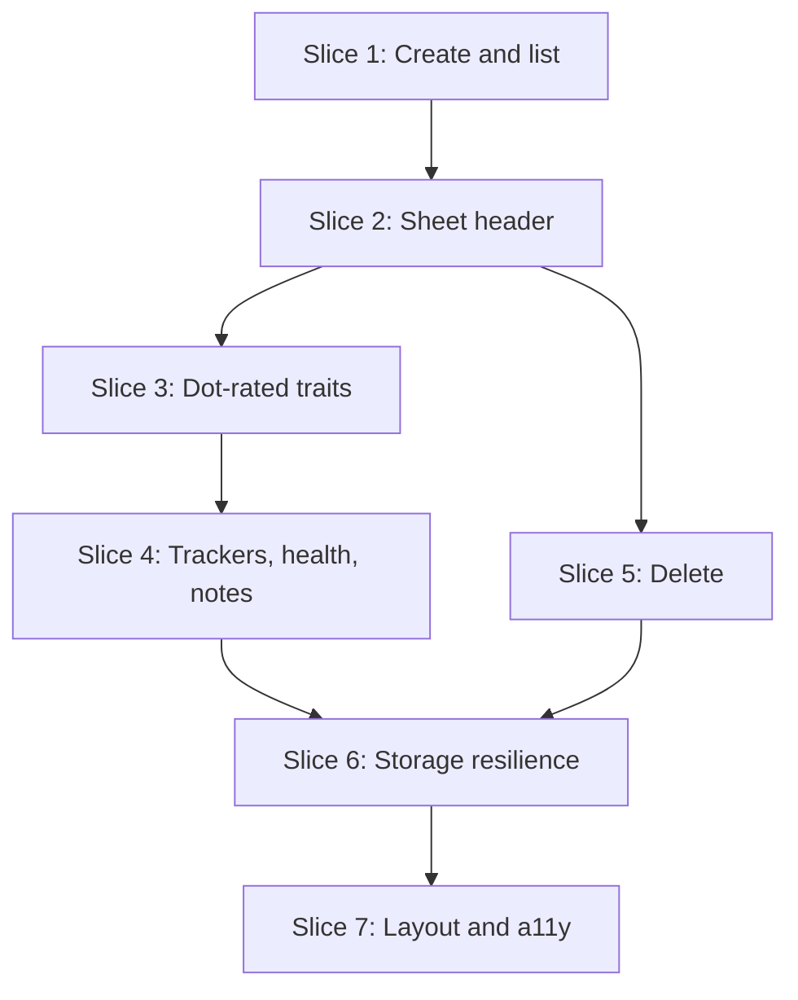

# Plan: V20 Character Sheet

**Created**: 2026-10-04
**Branch**: `feat/v20-character-sheet`
**Status**: approved
**Gherkin persistence**: features
**Spec**: `docs/specs/v20-character-sheet.md`

## Goal

Give Vampire: The Masquerade 20th Anniversary Edition players a roster of characters
and an interactive version of page 1 of the official sheet, saved automatically in the
browser. The sheet records whatever the printed sheet can hold and enforces no game
rules. Built on the existing Astro static site with vanilla TypeScript: a pure
character model, a `localStorage`-backed store, and custom-element controls.

**Decision-defaults stances** (all confirmed by the user at the `/ship` gate):

- **Scope** — page 1 only, no rules enforcement, nothing beyond the spec. Default stance.
- **Replace vs. merge** — the Astro starter welcome page (`Welcome.astro`, its two SVG
  assets, the `index.astro` body) is *replaced* by the roster. It is template
  boilerplate with no user content; `Layout.astro` is edited in place, not replaced.
  `package.json` is *merged* (scripts and dev dependencies added, nothing removed).
- **Integration** — PR with auto-merge once the user adds a GitHub remote. Default stance.
- **Format fidelity / migrate-vs-stub / re-capture** — not touched.

## Acceptance Criteria

Full wording is in the spec; ids match.

- [ ] AC-1 Roster lists saved characters (name or placeholder, clan, player); empty state offers creation
- [ ] AC-2 Creating adds a distinct blank V20 character and opens its sheet
- [ ] AC-3 Delete asks for confirmation; confirm removes, cancel changes nothing
- [ ] AC-4 Unknown character id shows "character not found" with a roster link; creates nothing
- [ ] AC-5 Nine free-text header fields
- [ ] AC-6 Nine attributes in three groups, range 0–10, default 1
- [ ] AC-7 Thirty named abilities plus one custom row per group, range 0–10, default 0
- [ ] AC-8 Six discipline rows and six background rows, name + rating 0–10
- [ ] AC-9 Three virtues labelled as printed (Conscience/Conviction, Self-Control/Instinct, Courage), range 0–5, default 1
- [ ] AC-10 Humanity/Path: path name, rating 0–10, free-text bearing and bearing modifier
- [ ] AC-11 Willpower permanent 0–10 and temporary 0–10, independent
- [ ] AC-12 Blood Pool 0–50 and Blood Per Turn
- [ ] AC-13 Seven labelled health boxes
- [ ] AC-14 Weakness, Experience, multi-line notes
- [ ] AC-15 Static creation reminder line
- [ ] AC-16 Activating position *n* sets *n*; activating the current value lowers it by one; never out of range
- [ ] AC-17 Health boxes cycle empty → bashing → lethal → aggravated → empty, independently
- [ ] AC-18 No input is rejected for breaking V20 rules
- [ ] AC-19 Keyboard-operable, uniquely named, value-announcing controls; no automated WCAG 2.1 AA violations
- [ ] AC-20 Usable at 375 px with no horizontal page scroll
- [ ] AC-21 Every change autosaves and survives reload
- [ ] AC-22 An unreadable record is reported, never auto-deleted, and does not hide other characters
- [ ] AC-23 A refused write shows "changes not saved" and the sheet stays usable; storage unavailable at load is reported on the roster
- [ ] AC-24 Unit + e2e suites, build, type check, and lint all pass

## Module layout

| Path | Role |
| --- | --- |
| `src/domain/v20/traits.ts` | Trait catalogue: attribute/ability/virtue names, groups, ranges, defaults |
| `src/domain/v20/character.ts` | `V20Character` type, `blankCharacter()`, pure update functions |
| `src/storage/characterStore.ts` | Roster persistence over an injected `Storage`-shaped port; result types for read/write failures |
| `src/components/controls/` | `dot-rating.ts`, `box-tracker.ts`, `health-track.ts` custom elements |
| `src/components/sheet/` | Astro components for the static sheet markup |
| `src/scripts/roster.ts`, `src/scripts/sheet.ts` | Page wiring: control event → model update → store save |
| `src/pages/index.astro`, `src/pages/sheet.astro` | Roster and sheet pages |
| `src/styles/` | Global and sheet CSS |
| `features/v20-character-sheet/` | One `.feature` file per slice, exported from this plan by `plan_gherkin_export.py` (tool-owned: edit the Gherkin here and re-export) |
| `features/steps/` | Step definitions binding the scenarios to the browser via `playwright-bdd`; `fixtures.ts` exports `Given`/`When`/`Then` |

Rules that hold across every slice: the model imports nothing outside `src/domain/`;
only `characterStore.ts` reads or writes storage and it receives the storage object as
an argument (unit tests pass an in-memory fake); controls carry no character state and
emit a `change` event with the new value; unit tests are colocated `*.test.ts`.

**BDD.** The feature files are the end-to-end suite: `npm run test:e2e` runs `bddgen`
then Playwright against a built preview on port 4322. Wherever a step's TEST line says
"e2e", it means writing the step definitions that make the named scenarios run; no
hand-written `*.spec.ts` files. Scenarios whose steps are not yet defined are skipped
(`missingSteps: 'skip-scenario'`) until step 7.3 switches that to `fail-on-gen`.

## Slices

### Slice 1: Create and list characters

**Depends-on:** none
**Files:** `package.json`, `package-lock.json`, `vitest.config.ts`, `playwright.config.ts`, `src/domain/v20/traits.ts`, `src/domain/v20/character.ts`, `src/domain/v20/character.test.ts`, `src/storage/characterStore.ts`, `src/storage/characterStore.test.ts`, `src/pages/index.astro`, `src/pages/sheet.astro`, `src/scripts/roster.ts`, `src/layouts/Layout.astro`, `src/components/Welcome.astro`, `src/assets/astro.svg`, `src/assets/background.svg`, `features/steps/roster.steps.ts`

**Behavior:**

```gherkin
Feature: Character roster

  Scenario: Empty roster invites creation
    Given a player with no saved characters
    When they open the roster
    Then they see a message that there are no characters yet
    And they see a way to create a V20 character

  Scenario: Creating a character opens its sheet
    Given a player with no saved characters
    When they create a V20 character
    Then the sheet for a new blank character is shown
    And the roster lists one character shown as "Unnamed character"

  Scenario: Several characters are independent
    Given a player who has created two characters
    When they open the roster
    Then two separate characters are listed
    And opening each one shows a different sheet address

  Scenario: Roster shows identifying details
    Given a saved character named "Lucita" of clan "Lasombra" played by "Ana"
    When the player opens the roster
    Then the entry shows "Lucita", "Lasombra" and "Ana"

  Scenario: Roster survives a reload
    Given a player who has created a character
    When they reload the roster
    Then the character is still listed
```

**Steps:**

#### Step 1.1: Test and quality tooling

**Complexity**: standard
**IMPLEMENT**: Add Vitest (via Astro's `getViteConfig`), `@astrojs/check` + `typescript`, and `test`, `typecheck`, `lint` scripts. The Playwright + `playwright-bdd` config, `features/steps/fixtures.ts` and the `test:e2e` script already exist (set up before the build started)
**TEST**: One smoke unit test runs green; `npm run test:e2e` generates from `features/` and exits 0 with scenarios skipped for missing steps
**REFACTOR**: Remove any starter config left unused; keep scripts minimal and consistently named
**Files**: `package.json`, `package-lock.json`, `vitest.config.ts`
**Commit**: `chore: add vitest and astro check`

#### Step 1.2: Blank V20 character

**Complexity**: standard
**IMPLEMENT**: Trait catalogue and `blankCharacter(id)` returning a page-1 character with `system: "v20"`, `schemaVersion: 1`, attributes and virtues at 1, everything else 0 or empty, six blank discipline and background rows, one blank custom ability per group, seven empty health boxes
**TEST**: Unit tests assert the defaults per AC-6 to AC-13 and that two blank characters share no nested references
**REFACTOR**: Derive the character's trait keys from the catalogue so names are declared once
**Files**: `src/domain/v20/traits.ts`, `src/domain/v20/character.ts`, `src/domain/v20/character.test.ts`
**Commit**: `feat(domain): blank V20 character and trait catalogue`

#### Step 1.3: Store creates, saves, loads and lists characters

**Complexity**: complex
**IMPLEMENT**: `characterStore` over an injected storage port: `create`, `save`, `load(id)`, `list`; one record per character under a namespaced key; unique generated ids
**TEST**: Unit tests with an in-memory storage fake: round-trip, list ordering is stable, two creates give distinct ids, unknown id loads as "not found"
**REFACTOR**: Isolate key naming and (de)serialisation into small private functions; return explicit result types rather than `null`/throw
**Files**: `src/storage/characterStore.ts`, `src/storage/characterStore.test.ts`
**Commit**: `feat(storage): character store over injected storage`

#### Step 1.4: Roster page

**Complexity**: standard
**IMPLEMENT**: Replace the starter welcome page with a roster: empty state, "New V20 character" action that creates a character and navigates to its sheet address, entries showing name (or "Unnamed character"), clan, player, each linking to its sheet; add a minimal `sheet.astro` placeholder page so the navigation resolves; set the site title in `Layout.astro`; delete the starter welcome component and assets
**TEST**: E2e scenarios for this slice
**REFACTOR**: Keep `roster.ts` to wiring only; move any formatting logic (placeholder name) into a pure, unit-tested function
**Files**: `src/pages/index.astro`, `src/pages/sheet.astro`, `src/scripts/roster.ts`, `src/layouts/Layout.astro`, `src/components/Welcome.astro`, `src/assets/astro.svg`, `src/assets/background.svg`, `features/steps/roster.steps.ts`
**Commit**: `feat(roster): list and create V20 characters`

### Slice 2: Sheet header with autosave

**Depends-on:** 1
**Files:** `src/domain/v20/character.ts`, `src/domain/v20/character.test.ts`, `src/pages/sheet.astro`, `src/scripts/sheet.ts`, `src/components/sheet/SheetHeader.astro`, `features/steps/sheet-header.steps.ts`

**Behavior:**

```gherkin
Feature: Sheet header

  Scenario: Header fields are available
    Given a player viewing a new character's sheet
    Then they can enter Name, Player, Chronicle, Nature, Demeanor, Concept, Clan, Generation and Sire

  Scenario: Header entries are saved without a save action
    Given a player viewing a new character's sheet
    When they enter "Lucita" as Name and "Lasombra" as Clan
    And they reload the sheet
    Then Name shows "Lucita" and Clan shows "Lasombra"

  Scenario: Any text is accepted
    Given a player viewing a character's sheet
    When they enter "banana" as Generation and "Not A Real Clan" as Clan
    Then both entries are kept exactly as typed and nothing is flagged

  Scenario: Edits stay with their character
    Given two saved characters
    When the player names the first one "Lucita"
    Then the second character's Name is still empty

  Scenario: Unknown character
    Given no saved character has the id in the sheet address
    When the player opens that address
    Then they see a "character not found" message with a link to the roster
    And the roster still lists no additional character

  Scenario: Sheet address without an id
    When the player opens the sheet address with no character id
    Then they see a "character not found" message with a link to the roster
```

**Steps:**

#### Step 2.1: Set header text in the model

**Complexity**: standard
**IMPLEMENT**: `setHeaderField(character, field, text)` returning a new character
**TEST**: Unit tests: sets each of the nine fields, leaves the input unchanged, accepts arbitrary text
**REFACTOR**: Type the field name as a union derived from the catalogue
**Files**: `src/domain/v20/character.ts`, `src/domain/v20/character.test.ts`
**Commit**: `feat(domain): header fields`

#### Step 2.2: Sheet page loads a character and autosaves the header

**Complexity**: standard
**IMPLEMENT**: Sheet page reads the id from the address, loads the character, renders the nine labelled inputs, and on each input change applies the model update and saves; link back to the roster
**TEST**: E2e: fields available, save-and-reload, any text accepted, edits stay with their character
**REFACTOR**: Establish the single `apply(update) → render → save` path in `sheet.ts` that later slices reuse
**Files**: `src/pages/sheet.astro`, `src/scripts/sheet.ts`, `src/components/sheet/SheetHeader.astro`, `features/steps/sheet-header.steps.ts`
**Commit**: `feat(sheet): header fields with autosave`

#### Step 2.3: Character not found

**Complexity**: standard
**IMPLEMENT**: Missing or unknown id shows a "character not found" message with a roster link and writes nothing to storage
**TEST**: E2e: unknown id and missing id scenarios, asserting the roster is unchanged
**REFACTOR**: Model the page state as loaded / not-found rather than nested conditionals
**Files**: `src/pages/sheet.astro`, `src/scripts/sheet.ts`, `features/steps/sheet-header.steps.ts`
**Commit**: `feat(sheet): character-not-found state`

### Slice 3: Dot-rated traits

**Depends-on:** 2
**Files:** `src/domain/v20/character.ts`, `src/domain/v20/character.test.ts`, `src/components/controls/dot-rating.ts`, `src/components/sheet/Attributes.astro`, `src/components/sheet/Abilities.astro`, `src/components/sheet/Advantages.astro`, `src/components/sheet/Morality.astro`, `src/pages/sheet.astro`, `src/scripts/sheet.ts`, `features/steps/sheet-traits.steps.ts`

**Behavior:**

```gherkin
Feature: Dot-rated traits

  Scenario: A new character's default ratings
    Given a player viewing a new character's sheet
    Then each of the nine attributes shows 1 dot
    And each of the three virtues shows 1 dot
    And every ability shows 0 dots

  Scenario: Setting a rating
    Given Strength shows 1 dot
    When the player activates the 4th Strength dot
    Then Strength shows 4 dots

  Scenario: Lowering a rating by activating the current dot
    Given Strength shows 4 dots
    When the player activates the 4th Strength dot
    Then Strength shows 3 dots

  Scenario: A rating can reach zero
    Given Appearance shows 1 dot
    When the player activates the 1st Appearance dot
    Then Appearance shows 0 dots

  Scenario Outline: Ratings stop at the top of their range
    Given a player viewing a character's sheet
    When they activate the last <trait> dot
    Then <trait> shows <max> dots
    And there is no dot beyond position <max>

    Examples:
      | trait     | max |
      | Strength  | 10  |
      | Brawl     | 10  |
      | Courage   | 5   |
      | Humanity  | 10  |
      | Willpower | 10  |

  Scenario: Ratings above normal creation limits are accepted
    Given a new character whose Generation is "13"
    When the player sets every attribute to 10
    Then every attribute shows 10 dots and nothing is flagged

  Scenario: Custom ability
    Given a player viewing a character's sheet
    When they name the blank Talent "Hobby Talent" and give it 2 dots
    And they reload the sheet
    Then the Talents list shows "Hobby Talent" with 2 dots

  Scenario: Disciplines and backgrounds
    Given a player viewing a character's sheet
    When they name the first discipline "Dominate" with 3 dots
    And they name the first background "Resources" with 2 dots
    And they reload the sheet
    Then "Dominate" shows 3 dots and "Resources" shows 2 dots
    And five discipline rows and five background rows remain blank

  Scenario: Humanity or Path
    Given a player viewing a character's sheet
    When they enter "Path of Night" as the path name, 6 dots, "Guilt" as bearing and "+1" as its modifier
    And they reload the sheet
    Then all four entries are shown as entered

  Scenario: Ratings are saved
    Given the player sets Dexterity to 3 and Brawl to 2 and Courage to 4
    When they reload the sheet
    Then Dexterity shows 3 dots, Brawl 2 dots and Courage 4 dots

  Scenario: Operating a rating from the keyboard
    Given keyboard focus is on the Strength rating showing 1 dot
    When the player presses the increase key twice
    Then Strength shows 3 dots
    And the rating reports its name and the value 3 to assistive technology
```

**Steps:**

#### Step 3.1: Rating updates in the model

**Complexity**: standard
**IMPLEMENT**: `activateRating(current, position, range)` (set to *n*; activating the current value gives *n − 1*; clamped to range) and `setTrait(character, traitRef, value)` covering attributes, abilities, virtues, humanity, permanent willpower
**TEST**: Unit tests at every boundary: 0, 1, max, max+1, negative, activate-current at 1 → 0, activate-current at max; virtues capped at 5
**REFACTOR**: One range lookup from the catalogue; no per-trait branching
**Files**: `src/domain/v20/character.ts`, `src/domain/v20/character.test.ts`
**Commit**: `feat(domain): dot rating updates`

#### Step 3.2: Dot-rating control

**Complexity**: complex
**IMPLEMENT**: `<dot-rating>` custom element: renders `max` dots, reflects `value`, emits `change` with the activated position; slider semantics (accessible name, current/min/max value, arrow keys ±1, Home/End) and a visible focus indicator
**TEST**: E2e on the Strength rating: set, lower by activating current, reach zero, keyboard operation
**REFACTOR**: Keep the element free of character knowledge; share dot-rendering helpers for reuse by the box tracker
**Files**: `src/components/controls/dot-rating.ts`, `src/components/sheet/Attributes.astro`, `src/pages/sheet.astro`, `src/scripts/sheet.ts`, `features/steps/sheet-traits.steps.ts`
**Commit**: `feat(sheet): dot-rating control and attributes`

#### Step 3.3: Abilities with custom rows

**Complexity**: standard
**IMPLEMENT**: Three ability groups rendered from the catalogue plus one custom row per group with an editable name; `setCustomAbilityName` in the model
**TEST**: Unit test for the name update; e2e: defaults, custom ability, saved ratings
**REFACTOR**: One Astro component renders any trait group from catalogue data
**Files**: `src/domain/v20/character.ts`, `src/domain/v20/character.test.ts`, `src/components/sheet/Abilities.astro`, `src/pages/sheet.astro`, `src/scripts/sheet.ts`, `features/steps/sheet-traits.steps.ts`
**Commit**: `feat(sheet): abilities`

#### Step 3.4: Disciplines, backgrounds and virtues

**Complexity**: standard
**IMPLEMENT**: Six named-row ratings each for disciplines and backgrounds (`setNamedRow` in the model) and the three virtues at range 0–5
**TEST**: Unit test for named rows; e2e: disciplines and backgrounds scenario, Courage range row of the outline
**REFACTOR**: Reuse the custom-ability row markup for named rows
**Files**: `src/domain/v20/character.ts`, `src/domain/v20/character.test.ts`, `src/components/sheet/Advantages.astro`, `src/pages/sheet.astro`, `src/scripts/sheet.ts`, `features/steps/sheet-traits.steps.ts`
**Commit**: `feat(sheet): disciplines, backgrounds and virtues`

#### Step 3.5: Humanity/Path and permanent Willpower

**Complexity**: standard
**IMPLEMENT**: Path name, 0–10 rating, bearing and bearing-modifier text; permanent Willpower 0–10
**TEST**: Unit tests for the text updates; e2e: Humanity or Path scenario, remaining outline rows, above-creation-limits scenario
**REFACTOR**: Fold the new text fields into the generic text-field update from slice 2
**Files**: `src/domain/v20/character.ts`, `src/domain/v20/character.test.ts`, `src/components/sheet/Morality.astro`, `src/pages/sheet.astro`, `src/scripts/sheet.ts`, `features/steps/sheet-traits.steps.ts`
**Commit**: `feat(sheet): humanity/path and willpower rating`

### Slice 4: Trackers, health and notes

**Depends-on:** 3
**Files:** `src/domain/v20/character.ts`, `src/domain/v20/character.test.ts`, `src/components/controls/box-tracker.ts`, `src/components/controls/health-track.ts`, `src/components/sheet/Trackers.astro`, `src/components/sheet/Health.astro`, `src/components/sheet/Notes.astro`, `src/pages/sheet.astro`, `src/scripts/sheet.ts`, `features/steps/sheet-trackers.steps.ts`

**Behavior:**

```gherkin
Feature: Trackers, health and notes

  Scenario: Spending and regaining temporary Willpower
    Given temporary Willpower shows 0 boxes marked
    When the player activates the 5th temporary Willpower box
    Then 5 boxes are marked
    When the player activates the 5th box again
    Then 4 boxes are marked

  Scenario: Temporary Willpower is independent of permanent Willpower
    Given permanent Willpower shows 3 dots
    When the player activates the 10th temporary Willpower box
    Then 10 temporary boxes are marked and permanent Willpower still shows 3 dots

  Scenario: Blood Pool
    Given the Blood Pool shows 0 boxes marked
    When the player activates the 50th Blood Pool box
    Then 50 boxes are marked and there is no 51st box
    When the player activates the 1st Blood Pool box twice
    Then 0 boxes are marked

  Scenario: Blood Per Turn
    When the player enters "3" as Blood Per Turn and reloads the sheet
    Then Blood Per Turn shows "3"

  Scenario: Health levels are labelled
    Given a player viewing a character's sheet
    Then the health track shows Bruised, Hurt -1, Injured -1, Wounded -2, Mauled -2, Crippled -5 and Incapacitated in that order

  Scenario: A health box cycles through damage types
    Given the Bruised box is empty
    When the player activates it
    Then it shows bashing damage
    When the player activates it again
    Then it shows lethal damage
    When the player activates it again
    Then it shows aggravated damage
    When the player activates it again
    Then it is empty

  Scenario: Health boxes are independent
    Given every health box is empty
    When the player activates the Wounded box twice
    Then Wounded shows lethal damage and every other box is empty

  Scenario: Damage type is announced, not only drawn
    Given the Hurt box shows lethal damage
    Then assistive technology reports "Hurt, lethal"

  Scenario: Free-text fields
    When the player enters a Weakness, an Experience value and three lines of notes
    And they reload the sheet
    Then all three show exactly what was entered, including the line breaks

  Scenario: Trackers are saved
    Given the player marks 4 temporary Willpower, 12 Blood Pool and aggravated damage on Hurt
    When they reload the sheet
    Then the same marks are shown

  Scenario: Creation reminder
    Given a player viewing a character's sheet
    Then they see the reminder "Attributes: 7/5/3 • Abilities: 13/9/5 • Disciplines: 3 • Backgrounds: 5 • Virtues: 7 • Freebie Points: 15 (7/5/2/1)"
    And no entry on the sheet is restricted by it
```

**Steps:**

#### Step 4.1: Box tracker for temporary Willpower and Blood Pool

**Complexity**: standard
**IMPLEMENT**: `<box-tracker>` control (same activation rule and keyboard semantics as dot-rating, square boxes, wraps in rows of ten); temporary Willpower 0–10 and Blood Pool 0–50 in the model; Blood Per Turn text
**TEST**: Unit tests for the two ranges; e2e: Willpower, independence, Blood Pool and Blood Per Turn scenarios
**REFACTOR**: Extract the shared rating behavior of `dot-rating` and `box-tracker` into one base so they differ only in presentation
**Files**: `src/domain/v20/character.ts`, `src/domain/v20/character.test.ts`, `src/components/controls/box-tracker.ts`, `src/components/sheet/Trackers.astro`, `src/pages/sheet.astro`, `src/scripts/sheet.ts`, `features/steps/sheet-trackers.steps.ts`
**Commit**: `feat(sheet): willpower and blood pool trackers`

#### Step 4.2: Health track with damage types

**Complexity**: standard
**IMPLEMENT**: `cycleHealthBox(character, level)` (empty → bashing → lethal → aggravated → empty) and a `<health-track>` control: seven labelled toggle buttons showing `/`, `X`, `*`, each exposing its level name and damage type as text to assistive technology
**TEST**: Unit tests for the full cycle and independence of boxes; e2e: labelled, cycle, independent, announced scenarios
**REFACTOR**: Health levels and their penalties come from the catalogue, not literals in the control
**Files**: `src/domain/v20/traits.ts`, `src/domain/v20/character.ts`, `src/domain/v20/character.test.ts`, `src/components/controls/health-track.ts`, `src/components/sheet/Health.astro`, `src/pages/sheet.astro`, `src/scripts/sheet.ts`, `features/steps/sheet-trackers.steps.ts`
**Commit**: `feat(sheet): health track with damage types`

#### Step 4.3: Weakness, Experience, notes and reminder line

**Complexity**: standard
**IMPLEMENT**: Weakness and Experience text fields, a multi-line notes area, and the static creation reminder line
**TEST**: E2e: free-text, trackers-are-saved and creation-reminder scenarios; a model round-trip unit test asserting every page-1 field survives serialise → parse
**REFACTOR**: Remove any remaining per-field wiring in `sheet.ts` in favour of data-attribute-driven binding
**Files**: `src/domain/v20/character.ts`, `src/domain/v20/character.test.ts`, `src/components/sheet/Notes.astro`, `src/pages/sheet.astro`, `src/scripts/sheet.ts`, `features/steps/sheet-trackers.steps.ts`
**Commit**: `feat(sheet): weakness, experience, notes and reminder`

### Slice 5: Delete a character

**Depends-on:** 2
**Files:** `src/storage/characterStore.ts`, `src/storage/characterStore.test.ts`, `src/pages/index.astro`, `src/scripts/roster.ts`, `features/steps/roster-delete.steps.ts`

**Behavior:**

```gherkin
Feature: Delete a character

  Scenario: Confirmed deletion
    Given saved characters "Lucita" and "Fatima"
    When the player deletes "Lucita" and confirms
    Then the roster lists only "Fatima"
    And opening Lucita's former sheet address shows "character not found"

  Scenario: Cancelled deletion
    Given saved characters "Lucita" and "Fatima"
    When the player starts deleting "Lucita" and cancels
    Then the roster still lists both characters with their details unchanged

  Scenario: The confirmation names the character
    Given a saved character "Lucita"
    When the player starts deleting it
    Then the confirmation asks about "Lucita" by name

  Scenario: Deleting the last character
    Given "Lucita" is the only saved character
    When the player deletes it and confirms
    Then the roster shows the empty state
```

**Steps:**

#### Step 5.1: Store deletes a character

**Complexity**: standard
**IMPLEMENT**: `characterStore.delete(id)` removing exactly one record
**TEST**: Unit tests: deletes the target, leaves others byte-identical, deleting an unknown id is a no-op
**REFACTOR**: Reuse the key helper; no new key-building code
**Files**: `src/storage/characterStore.ts`, `src/storage/characterStore.test.ts`
**Commit**: `feat(storage): delete character`

#### Step 5.2: Delete from the roster with confirmation

**Complexity**: standard
**IMPLEMENT**: Per-entry delete action opening a native `<dialog>` that names the character, with Cancel as the default-focused action; confirm deletes and re-renders, cancel closes; focus returns to a sensible place afterwards
**TEST**: E2e scenarios for this slice
**REFACTOR**: Roster rendering becomes one function of the stored list, called after create and delete alike
**Files**: `src/pages/index.astro`, `src/scripts/roster.ts`, `features/steps/roster-delete.steps.ts`
**Commit**: `feat(roster): delete character with confirmation`

### Slice 6: Storage resilience

**Depends-on:** 4, 5
**Files:** `src/storage/characterStore.ts`, `src/storage/characterStore.test.ts`, `src/pages/index.astro`, `src/scripts/roster.ts`, `src/pages/sheet.astro`, `src/scripts/sheet.ts`, `features/steps/storage-resilience.steps.ts`

**Behavior:**

```gherkin
Feature: Storage resilience

  Scenario: One unreadable record does not hide the others
    Given saved characters "Lucita" and "Fatima"
    And Fatima's saved data has become unreadable
    When the player opens the roster
    Then "Lucita" is listed and can be opened
    And one entry is reported as an unreadable character

  Scenario: An unreadable record is kept
    Given a saved character whose data has become unreadable
    When the player opens the roster and then reloads it
    Then the unreadable entry is still reported
    And its saved data is unchanged

  Scenario: Saved data of an unexpected shape
    Given a saved record that is readable but is not a V20 character
    When the player opens the roster
    Then that entry is reported as an unreadable character
    And creating a new character still works

  Scenario: Opening an unreadable character directly
    Given a saved character whose data has become unreadable
    When the player opens its sheet address
    Then they see that the character could not be read, with a link to the roster
    And its saved data is unchanged

  Scenario: The player can remove an unreadable record
    Given the roster reports an unreadable character
    When the player deletes that entry and confirms
    Then it is no longer reported

  Scenario: The browser refuses to save
    Given a player viewing a character's sheet
    And the browser will not accept further saved data
    When they change the character's Name
    Then a "changes not saved" message is shown
    And they can keep editing the sheet

  Scenario: Saving recovers
    Given the "changes not saved" message is shown
    When the browser accepts saved data again and the player makes another change
    Then the message is no longer shown
    And after a reload the latest values are shown

  Scenario: Storage is unavailable when the roster opens
    Given the browser provides no storage to the page
    When the player opens the roster
    Then they see that characters cannot be saved in this browser
```

**Steps:**

#### Step 6.1: Validate stored records

**Complexity**: complex
**IMPLEMENT**: `list` and `load` parse and validate each record independently (`system`, `schemaVersion`, required shape); failures come back as an "unreadable" result carrying the record id; nothing is rewritten or removed on read
**TEST**: Unit tests: malformed JSON, wrong shape, unknown `schemaVersion`, wrong `system`, valid neighbours unaffected, stored bytes unchanged after `list`
**REFACTOR**: A single `parseRecord` function is the only path from stored text to a character
**Files**: `src/storage/characterStore.ts`, `src/storage/characterStore.test.ts`
**Commit**: `feat(storage): validate stored characters`

#### Step 6.2: Report unreadable characters

**Complexity**: standard
**IMPLEMENT**: Roster shows unreadable entries distinctly with a delete action; the sheet shows a "could not be read" state with a roster link
**TEST**: E2e: the first five scenarios of this slice
**REFACTOR**: Sheet page state becomes loaded / not-found / unreadable in one place
**Files**: `src/pages/index.astro`, `src/scripts/roster.ts`, `src/pages/sheet.astro`, `src/scripts/sheet.ts`, `features/steps/storage-resilience.steps.ts`
**Commit**: `feat: report unreadable characters`

#### Step 6.3: Surface failed and unavailable saves

**Complexity**: standard
**IMPLEMENT**: `save` and `create` return a failure result when the storage port throws; the sheet shows a persistent, announced "changes not saved" status that clears on the next successful save; the roster reports storage being unavailable
**TEST**: Unit tests with a throwing storage fake; e2e: refuses-to-save, recovers, unavailable scenarios
**REFACTOR**: One status region component shared by roster and sheet
**Files**: `src/storage/characterStore.ts`, `src/storage/characterStore.test.ts`, `src/pages/index.astro`, `src/scripts/roster.ts`, `src/pages/sheet.astro`, `src/scripts/sheet.ts`, `features/steps/storage-resilience.steps.ts`
**Commit**: `feat: surface failed saves`

### Slice 7: Sheet layout, responsiveness and accessibility verification

**Depends-on:** 6
**Files:** `package.json`, `package-lock.json`, `src/styles/global.css`, `src/styles/sheet.css`, `src/layouts/Layout.astro`, `src/pages/index.astro`, `src/pages/sheet.astro`, `src/components/sheet/*.astro`, `src/components/controls/*.ts`, `README.md`, `playwright.config.ts`, `features/steps/layout-a11y.steps.ts`

**Behavior:**

```gherkin
Feature: Layout and accessibility

  Scenario: Sections follow the printed sheet
    Given a player viewing a character's sheet on a wide screen
    Then the sections appear in the order header, Attributes, Abilities, Advantages, then notes with Humanity, Willpower, Blood Pool, Health, Weakness and Experience
    And Attributes, Abilities and Advantages are each laid out in three columns

  Scenario Outline: Usable on a phone
    Given a player viewing the <page> on a 375 pixel wide screen
    Then the page does not scroll sideways
    And every control is visible and can be activated

    Examples:
      | page   |
      | roster |
      | sheet  |

  Scenario Outline: No automated accessibility violations
    Given a player viewing the <page>
    When the page is checked against WCAG 2.1 AA
    Then no violations are reported

    Examples:
      | page                      |
      | empty roster              |
      | roster with characters    |
      | sheet                     |
      | character not found       |
      | delete confirmation       |

  Scenario: The whole sheet can be completed from the keyboard
    Given a player viewing a new character's sheet
    When they use only the keyboard to enter a Name, set Strength to 3, mark 2 Blood Pool and mark bashing damage on Bruised
    Then those values are shown
    And keyboard focus was visible at every stop

  Scenario: Every control has a name
    Given a player viewing a character's sheet
    Then every text field, rating, tracker and health box has an accessible name unique within the sheet
```

**Steps:**

#### Step 7.1: Sheet and roster styling

**Complexity**: standard
**IMPLEMENT**: Original gothic-leaning CSS following the printed section order: three-column trait groups on wide screens collapsing to one column, readable contrast in the chosen palette, visible focus styles; no copied artwork or fonts that require licensing
**TEST**: E2e: section-order and phone scenarios (no horizontal overflow at 375 px, controls actionable)
**REFACTOR**: Colours, spacing and type scale as CSS custom properties; remove leftover starter styles
**Files**: `src/styles/global.css`, `src/styles/sheet.css`, `src/layouts/Layout.astro`, `src/pages/index.astro`, `src/pages/sheet.astro`, `src/components/sheet/*.astro`, `features/steps/layout-a11y.steps.ts`
**Commit**: `feat(ui): sheet and roster styling`

#### Step 7.2: Accessibility verification

**Complexity**: standard
**IMPLEMENT**: Add `@axe-core/playwright` and fix whatever it and the keyboard walkthrough surface (names, roles, contrast, target size, focus order)
**TEST**: E2e: axe outline over the five page states, keyboard-only completion, unique accessible names
**REFACTOR**: Consolidate labelling so each control's accessible name comes from one source (the catalogue label)
**Files**: `package.json`, `package-lock.json`, `src/components/sheet/*.astro`, `src/components/controls/*.ts`, `src/styles/sheet.css`, `features/steps/layout-a11y.steps.ts`
**Commit**: `test(a11y): axe and keyboard coverage`

#### Step 7.3: Project README

**Complexity**: trivial
**IMPLEMENT**: Replace the Astro starter README with what the app is, how to run it, the test commands, and the scope note (page 1, browser-only storage)
**TEST**: Set `missingSteps` to `fail-on-gen` in `playwright.config.ts` so an unbound scenario fails the run; full gate green with zero skipped scenarios: unit, e2e, `astro build`, type check, lint
**REFACTOR**: Remove references to deleted starter files
**Files**: `README.md`, `playwright.config.ts`
**Commit**: `docs: project README`

## Parallelization



| Wave | Slices (parallel) |
|------|-------------------|
| 1 | 1 |
| 2 | 2 |
| 3 | 3, 5 |
| 4 | 4 |
| 5 | 6 |
| 6 | 7 |

## Complexity Classification

| Rating | Criteria | Review depth |
|--------|----------|--------------|
| `trivial` | Single-file rename, config change, typo fix, documentation-only | Skip inline review; covered by final `/code-review` |
| `standard` | New function, test, module, or behavioral change within existing patterns | Spec-compliance + relevant quality agents |
| `complex` | Architectural change, security-sensitive, cross-cutting concern, new abstraction | Full agent suite including opus-tier agents |

Complex steps: 1.3 (storage boundary), 3.2 (the shared control abstraction), 6.1 (record validation).

## Pre-PR Quality Gate

- [ ] `npm test` (Vitest) passes
- [ ] `npm run test:e2e` (Playwright) passes
- [ ] `npm run typecheck` (`astro check`) passes
- [ ] `npm run lint` (oxlint) passes
- [ ] `npm run build` succeeds
- [ ] `/code-review` passes
- [ ] README updated (step 7.3)

## Skipped (low value)

| Finding | Rationale (one line) |
|---|---|
| Tests asserting each static label renders | No branching; the e2e flows already locate every control by its label |

## Risks & Open Questions

- **Reference PDFs.** `docs/references/sourcebooks/` is gitignored; the 4-page sheet PDF under `docs/references/sheets/` is already committed. Build commits still name their paths explicitly rather than using `git add -A`.
- **No CI.** The `origin` remote exists but there is no workflow. Auto-merge "gated on green checks" has nothing to gate on, so a PR would merge immediately. Either add a CI workflow as a follow-up before enabling auto-merge, or open the PR with `--no-auto-merge`. Owner: user.
- **Astro 7 + Vitest.** `getViteConfig` compatibility with the installed Astro major is assumed; if it fails, the model and store are plain TypeScript and can run under a standalone Vitest config.
- **Slices 3 and 5 share a wave.** Their files are disjoint (sheet/model vs. roster/store); both read the sheet-address convention set in slice 1 and neither changes it.
- **Storage quota.** A character is a few kilobytes; quota exhaustion is only reachable artificially but AC-23 still covers refused writes (private-mode browsers).

## Build Progress

### Slices (grouped by wave)

#### Wave 1
- [x] Slice 1: Create and list characters
  - [x] Step 1.1: Test and quality tooling
  - [x] Step 1.2: Blank V20 character
  - [x] Step 1.3: Store creates, saves, loads and lists characters
  - [x] Step 1.4: Roster page

#### Wave 2
- [ ] Slice 2: Sheet header with autosave
  - [x] Step 2.1: Set header text in the model
  - [ ] Step 2.2: Sheet page loads a character and autosaves the header
  - [ ] Step 2.3: Character not found

#### Wave 3
- [ ] Slice 3: Dot-rated traits
  - [ ] Step 3.1: Rating updates in the model
  - [ ] Step 3.2: Dot-rating control
  - [ ] Step 3.3: Abilities with custom rows
  - [ ] Step 3.4: Disciplines, backgrounds and virtues
  - [ ] Step 3.5: Humanity/Path and permanent Willpower
- [ ] Slice 5: Delete a character
  - [ ] Step 5.1: Store deletes a character
  - [ ] Step 5.2: Delete from the roster with confirmation

#### Wave 4
- [ ] Slice 4: Trackers, health and notes
  - [ ] Step 4.1: Box tracker for temporary Willpower and Blood Pool
  - [ ] Step 4.2: Health track with damage types
  - [ ] Step 4.3: Weakness, Experience, notes and reminder line

#### Wave 5
- [ ] Slice 6: Storage resilience
  - [ ] Step 6.1: Validate stored records
  - [ ] Step 6.2: Report unreadable characters
  - [ ] Step 6.3: Surface failed and unavailable saves

#### Wave 6
- [ ] Slice 7: Sheet layout, responsiveness and accessibility verification
  - [ ] Step 7.1: Sheet and roster styling
  - [ ] Step 7.2: Accessibility verification
  - [ ] Step 7.3: Project README
